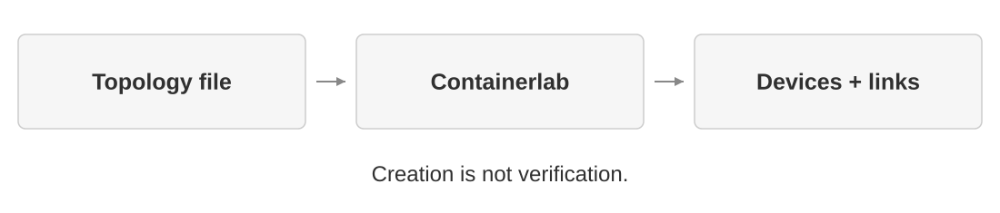
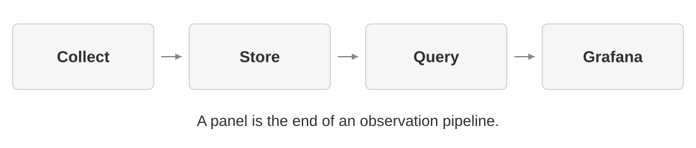
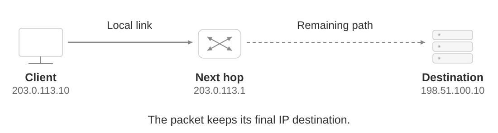
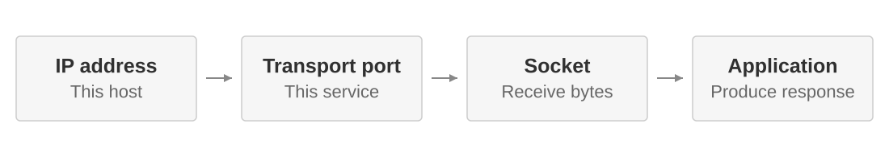
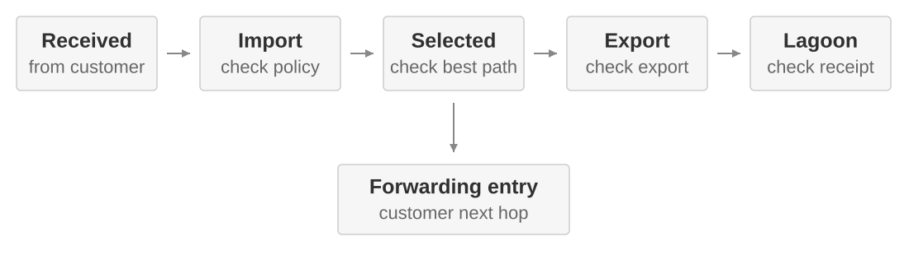
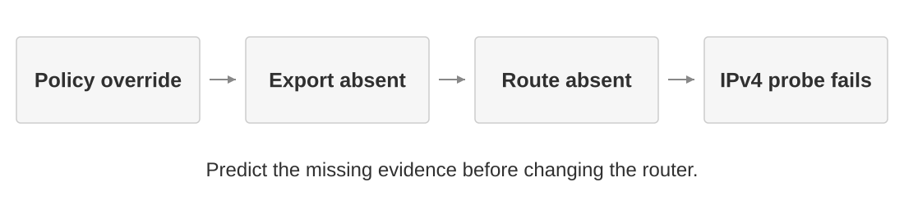
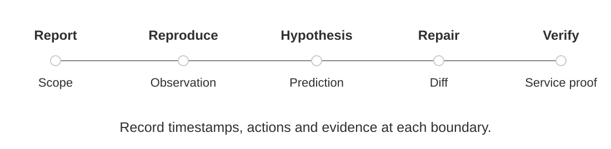

---

marp: true
theme: default
paginate: true
size: 16:9
lang: en
title: Network Management and Monitoring (AI5049)
description: Course slides for AI5049, winter semester 2026/27, Hochschule Fulda
style: |
  /* Restored course palette: Fulda green for headings, neutral diagrams. */
  :root { --hfd:#72bf44; --ink:#303030; }
  section {
    background:#fff; color:var(--ink); font-family:Arial,'Liberation Sans',sans-serif;
    font-size:27px; line-height:1.3; padding:66px 78px 125px;
    display:flex; flex-direction:column; justify-content:center;
    border:0; background-image:none;
  }
  section > * { flex-shrink:0; }
  section::before { display:none; }
  section h1, section h2, section h3, section h4 { color:#72bf44 !important; font-weight:700; }
  section h1 *, section h2 *, section h3 *, section h4 * { color:inherit !important; }
  h1 { font-size:42px; line-height:1.15; margin:0 0 25px; letter-spacing:-.5px; text-wrap:balance; }
  h2 { font-size:31px; line-height:1.2; margin:8px 0 22px; }
  p,li,td,th { text-wrap:pretty; }
  section > p,section > ul,section > ol { margin:10px 0; }
  li { margin:6px 0; }
  li p { margin:0; }
  strong { font-weight:700; }
  blockquote { border-left:4px solid #ccc; color:var(--ink); padding:8px 20px; margin:16px 0; }
  blockquote p { margin:3px 0; }
  table { width:100%; display:table; font-size:24px; line-height:1.25; margin:12px 0; border-collapse:collapse; }
  th { background:#eee; font-weight:700; }
  td,th { border:1px solid #ddd; padding:8px 12px; }
  tr,tr:nth-child(2n) { background:#fff; }
  code { font-size:.88em; background:#f2f2f2; border-radius:3px; padding:2px 4px; }
  pre { font-size:21px; line-height:1.28; background:#f5f5f5; padding:15px 18px; margin:13px 0; border:0; border-radius:3px; }
  pre code { font-size:1em; padding:0; background:none; }
  pre code span { color:var(--ink) !important; }
  a { color:var(--ink); text-decoration:underline; text-decoration-color:var(--hfd); text-underline-offset:.14em; text-decoration-thickness:1.5px; }
  section img { display:block; object-fit:contain; max-width:100%; max-height:340px; margin:0 auto; }
  section > p:has(img) { margin:12px 0 20px; }
  .badge { display:none; }
  .progress { position:absolute; left:78px; right:78px; bottom:53px; border-top:1px solid #e8e8e8; padding-top:10px; font-size:14px; letter-spacing:.25px; line-height:1.5; display:flex; gap:12px; color:#777; }
  .progress .active { color:#303030; font-weight:700; border-bottom:2px solid var(--hfd); }
  .progress .arrow { color:#bbb; }
  section.day .progress, section.chapter .progress, section.title .progress { display:none; }
  .sources { position:absolute; left:78px; right:78px; bottom:93px; font-size:14px; line-height:1.25; max-height:36px; }
  .sources a { color:#666; text-decoration:none; }
  footer { position:absolute; bottom:22px; left:78px; right:112px; font-size:14px; line-height:1.1; color:#777; }
  /* Primary references share the existing footer without adding a source strip. */
  section footer:has(.footer-refs) { display:flex; align-items:baseline; justify-content:space-between; gap:24px; }
  .footer-context { white-space:nowrap; }
  .footer-refs { display:inline-flex; gap:16px; white-space:nowrap; }
  section footer .footer-refs a { color:#777; text-decoration:underline; text-decoration-color:var(--hfd); text-underline-offset:.18em; text-decoration-thickness:1px; }
  section::after { bottom:20px; right:38px; font-size:17px; color:#777; }
  section.day,section.chapter,section.title,section.joke { justify-content:center; }
  section.day h1,section.title h1 { font-size:50px; line-height:1.12; }
  section.title h1 { font-size:46px; }
  section.chapter h1 { font-size:46px; }
  section.day > p,section.chapter > p { font-size:29px; }
  section.joke h1 { font-size:43px; margin-bottom:32px; }
  section.joke > p { font-size:31px; margin:10px 0; }
  section.joke > p:last-of-type { font-size:27px; margin-top:28px; }
  section.task blockquote { background:#f7f7f7; }
  section.visual img { max-height:315px; }
  section.visual > p:not(:has(img)) { margin:8px 0; }
  section.figure img { max-height:375px; }
  section.figure > p:not(:has(img)) { margin:8px 0; }
  section.schedule table { font-size:23px; }
  section.schedule td,section.schedule th { padding:7px 12px; }
  
  /* Scope these overrides: the imported Marp theme has section-qualified rules. */
  section table tr, section table tr:nth-child(2n), section table td { background:#fff; }
  section table th { background:#eee; }
  section table th, section table td { border-color:#ddd; }
  section table { border-top:1px solid #ddd; }
  section pre, section code { color:#303030; background-color:#f5f5f5; }
  section pre code { background:none; }
  section pre code span { color:#303030 !important; }
  section > p:has(img) { margin-top:18px; }
  
  section thead:not(:has(th:not(:empty))) { display:none; }
  
  /* Short teaching beats use native type, without a gray meme panel. */
  section.statement h1 { font-size:50px; margin-bottom:28px; }
  section.statement > p { font-size:30px; line-height:1.3; }
---

<!-- slide-id: S001; source: 1 -->
<!-- _class: title core -->
<!-- _footer: "AI5049 · Hochschule Fulda · Course introduction" -->

<!-- _paginate: false -->

# Network Management and Monitoring

## AI5049, Winter Semester 2026/27

12 October 2026

Lucas Immanuel Nickel

Fulda University of Applied Sciences  
Network Operations Engineer @ DE-CIX


---

<!-- slide-id: S002; source: 2 -->
<!-- _class: content core -->
<!-- _footer: "AI5049 · Hochschule Fulda · Course introduction" -->

# About me

Lucas Immanuel Nickel

- Network Operations Engineer at DE-CIX
- Research Associate at Fulda University of Applied Sciences
- M.Sc. Applied Computer Science, research stay at the University of Toronto


---

<!-- slide-id: S003; source: 3 -->
<!-- _class: content core -->
<!-- _footer: "AI5049 · Hochschule Fulda · Course introduction" -->

# What is this course about?

We work on real network problems and the evidence needed to solve them.

- Find what is actually broken
- Make changes without making things worse
- Measure whether the service works
- Turn operational questions into science


---

<!-- slide-id: S004; source: 4 -->
<!-- _class: content core -->
<!-- _footer: "AI5049 · Hochschule Fulda · Course introduction" -->

# Our lens: large IP networks

We look at networks that carry traffic between organizations and regions.

- ISP and carrier backbones
- transit, peering and IXPs
- interdomain routing
- automation and monitoring at scale

The same principles apply elsewhere. Our operating context is the Internet.


---

<!-- slide-id: S005; source: 5 -->
<!-- _class: content core -->
<!-- _footer: "AI5049 · Hochschule Fulda · Course introduction" -->

# The technical block

| Date | Time | Topic |
|---|---|---|
| 12 October 2026 | 13:45–17:00 | Networking 101 + Operations |
| 13 October 2026 | 08:45–15:15 | Automation + Incidents |
| 14 October 2026 | 08:45–15:15 | Monitoring / Observability |

**Incidents close day 2, after the Automation workflow.**


---

<!-- slide-id: S006; source: 6 -->
<!-- _class: visual core -->
<!-- _footer: "AI5049 · Hochschule Fulda · Course introduction" -->

# One lab carries the technical block


The topology stays familiar. The question changes.
The slides remain the workshop guide.


---

<!-- slide-id: S007; source: 7 -->
<!-- _class: content schedule core -->
<!-- _footer: "AI5049 · Hochschule Fulda · Course introduction" -->

# The sessions after the lab

Friday sessions: **13:45–18:45**

| Date | Focus |
|---|---|
| 30 October 2026 | Research questions and sources |
| 13 November 2026 | Experimental design |
| 27 November 2026 | Analysis and scientific argument |
| 11 December 2026 | Forecasts, control loops and agents |
| 22 January 2027 | In-class peer review and revision |
| 5 February 2027 | Presentations and reproducibility |


---

<!-- slide-id: S008; source: 8 -->
<!-- _class: content core -->
<!-- _footer: "AI5049 · Hochschule Fulda · Course introduction" -->

# Fridays: work on your project

The shared part gives you a method. Most of the session is project work.

- Short input together
- 45 minutes of shepherding with me per team
- Code, data, experiments or writing
- From November: brief team updates

Bring blockers early. We can fix scope before it becomes a deadline problem.


---

<!-- slide-id: S009; source: 9 -->
<!-- _class: content core -->
<!-- _footer: "<span class=\"footer-context\">AI5049 · Hochschule Fulda · Course introduction</span><span class=\"footer-refs\"><a href=\"https://conferences.ieeeauthorcenter.ieee.org/write-your-paper/authoring-tools-and-templates/\">IEEE paper templates</a></span>" -->

# Your project

One network-management question, teams of 3-4.

- Build a system or analyze data
- Compare against a baseline
- Collect evidence for one limited claim

**Paper:** six pages including references. English, IEEE two-column.

<!--
Source references (not projected):
- [IEEE paper templates](https://conferences.ieeeauthorcenter.ieee.org/write-your-paper/authoring-tools-and-templates/)
-->


---

<!-- slide-id: S010; source: 10 -->
<!-- _class: content core -->
<!-- _footer: "AI5049 · Hochschule Fulda · Course introduction" -->

# Some project ideas

| Area | Possible comparison |
|---|---|
| Monitoring | Polling vs streaming for short failures |
| Digital twins | Emulation vs modeling before deployment |
| Automation | Automated vs manual emergency repair |
| AI for networking | LLM troubleshooting vs a runbook |

Bring your own question if you can evaluate it.

<!--
Source references (not projected):
- [IRTF NDT draft](https://datatracker.ietf.org/doc/draft-irtf-nmrg-network-digital-twin-arch/)
- [NIKA](https://arxiv.org/abs/2512.16381)
- [Maintenance Parser](https://github.com/networktocode/circuit-maintenance-parser)
- [RIPE Atlas](https://atlas.ripe.net/)
-->


---

<!-- slide-id: S011; source: 11 -->
<!-- _class: content core -->
<!-- _footer: "AI5049 · Hochschule Fulda · Course introduction" -->

# Research venues close to this course

| Venue | Typical contribution |
|---|---|
| [IEEE/IFIP NOMS](https://www.comsoc.org/conferences-events/ieeeifip-network-operations-and-management-symposium-2026) | operating, managing and automating networks |
| [CNSM](https://www.cnsm-conf.org/2026/about.html) | management systems, telemetry and orchestration |
| [ACM IMC](https://conferences.sigcomm.org/imc/2026/cfp/) | measuring and understanding Internet behavior |

Start here for literature on **management, monitoring and measurement**.

<!--
Source references (not projected):
- [IEEE/IFIP NOMS](https://www.comsoc.org/conferences-events/ieeeifip-network-operations-and-management-symposium-2026)
- [CNSM](https://www.cnsm-conf.org/2026/about.html)
- [ACM IMC](https://conferences.sigcomm.org/imc/2026/cfp/)
-->


---

<!-- slide-id: S012; source: 12 -->
<!-- _class: content core -->
<!-- _footer: "AI5049 · Hochschule Fulda · Course introduction" -->

# Broader networking research

| Venue | Typical contribution |
|---|---|
| [ACM SIGCOMM](https://www.sigcomm.org/events/sigcomm-conference) | networking mechanisms, architectures and systems |
| [USENIX NSDI](https://www.usenix.org/conference/nsdi26) | implemented networked systems |
| [IEEE INFOCOM](https://www.comsoc.org/conferences-events/ieee-international-conference-computer-communications-2026) | protocols, algorithms and performance |
| [ACM CoNEXT](https://conferences2.sigcomm.org/co-next/2026/) | experimental networking systems |
| [IFIP Networking](https://networking.ifip.org/) | protocols, systems and network performance |
| [IEEE GLOBECOM](https://www.comsoc.org/conferences-events/ieee-global-communications-conference-2026) / [ICC](https://icc2026.ieee-icc.org/) | broad communications and networking |

The venue follows the **contribution**, not just the topic.

<!--
Source references (not projected):
- [ACM SIGCOMM](https://www.sigcomm.org/events/sigcomm-conference)
- [USENIX NSDI](https://www.usenix.org/conference/nsdi26)
- [IEEE INFOCOM](https://www.comsoc.org/conferences-events/ieee-international-conference-computer-communications-2026)
- [IFIP Networking](https://networking.ifip.org/)
- [ACM CoNEXT](https://conferences2.sigcomm.org/co-next/2026/)
- [IEEE GLOBECOM](https://www.comsoc.org/conferences-events/ieee-global-communications-conference-2026)
- [IEEE ICC](https://icc2026.ieee-icc.org/)
-->


---

<!-- slide-id: S013; source: 13 -->
<!-- _class: content core -->
<!-- _footer: "AI5049 · Hochschule Fulda · Course introduction" -->

# Who develops Internet technology?

**[IETF](https://www.ietf.org/about/introduction/)**\
Working Groups engineer interoperable Internet protocols and standards.

**[IRTF](https://www.irtf.org/)**\
Research Groups study long-term questions about Internet technology.

<!--
Source references (not projected):
- [IETF](https://www.ietf.org/about/introduction/)
- [IRTF](https://www.irtf.org/)
-->


---

<!-- slide-id: S014; source: 14 -->
<!-- _class: content core -->
<!-- _footer: "AI5049 · Hochschule Fulda · Course introduction" -->

# Where do operators compare notes?

**[RIPE Meetings](https://www.ripe.net/community/)**\
Routing, addressing, measurement and Internet coordination

**[DENOG](https://www.denog.de/) and [NANOG](https://nanog.org/)**\
Backbone operations, routing, peering and incidents

**[NAF and AutoCon](https://networkautomation.forum/)**\
Network automation, orchestration and operational tooling

<!--
Source references (not projected):
- [RIPE](https://www.ripe.net/community/)
- [DENOG](https://www.denog.de/)
- [NANOG](https://nanog.org/)
- [Network Automation Forum](https://networkautomation.forum/)
-->


---

<!-- slide-id: S015; source: 15 -->
<!-- _class: content core -->
<!-- _footer: "AI5049 · Hochschule Fulda · Course introduction" -->

# What counts towards your grade?

Individual work in the **paper and artifact** is assessed.

| Paper area | Weight |
|---|---:|
| Introduction & related work | 20% |
| Approach & methodology | 25% |
| Evaluation & results | 30% |
| Discussion & conclusion | 15% |
| Abstract, writing & reproducibility | 10% |

**20 + 25 + 30 + 15 + 10 = 100%.**
<!-- Assessment provenance: the five paper-area weights are reproduced from the supplied course material. No additional artifact percentage is introduced. -->


---

<!-- slide-id: S016; source: 16 -->
<!-- _class: content core -->
<!-- _footer: "AI5049 · Hochschule Fulda · Course introduction" -->

# Who did what?

Record individual and joint work in [DECLARATION.md](https://github.com/Stinktopf/network-management-and-monitoring/blob/main/slides/resources/templates/DECLARATION.md).

| Record | Make it concrete |
|---|---|
| Paper | Sections, figures and revisions |
| Artifact | Code, configuration and experiments |
| Joint work | Shared task and each person’s contribution |

Point to the work so the contribution can be checked.

<!--
Source references (not projected):
- [Declaration template](https://github.com/Stinktopf/network-management-and-monitoring/blob/main/slides/resources/templates/DECLARATION.md)
- [Fulda ABPO Sec. 11(3), 2025](https://www.hs-fulda.de/fileadmin/user_upload/Unsere_Hochschule/Hochschulrecht/Studien-und_Pruefungsordnungen/Allgemeine_Bestimmungen_fuer_Pruefungsordnungen/ABPO_2018_Ae_2025-2_LF.pdf#page=8)
-->


---

<!-- slide-id: S017; source: 17 -->
<!-- _class: content core -->
<!-- _footer: "AI5049 · Hochschule Fulda · Course introduction" -->

# What goes with the paper?

The paper makes the argument. The **artifact** lets me check it.

- Code and configurations
- Data and software versions
- Reproduction steps
- Seeds, failed runs and exclusions

Public repository: optional. Access for the examiner: required.


---

<!-- slide-id: S018; source: 18 -->
<!-- _class: content core -->
<!-- _footer: "AI5049 · Hochschule Fulda · Course introduction" -->

# Scientific integrity

Follow the [IEEE publishing ethics requirements](https://journals.ieeeauthorcenter.ieee.org/become-an-ieee-journal-author/publishing-ethics/ethical-requirements/).

- Cite ideas, methods, data and figures
- Check references against the original
- Report what you actually measured
- Keep counter-evidence
- State limitations and uncertainty

A result against your hypothesis is still a result.

<!--
Source references (not projected):
- [IEEE publishing ethics requirements](https://journals.ieeeauthorcenter.ieee.org/become-an-ieee-journal-author/publishing-ethics/ethical-requirements/)
-->


---

<!-- slide-id: S019; source: 19 -->
<!-- _class: content core -->
<!-- _footer: "AI5049 · Hochschule Fulda · Course introduction" -->

# AI use and disclosure

Follow the [IEEE policy on AI-generated content](https://conferences.ieeeauthorcenter.ieee.org/author-ethics/guidelines-and-policies/submission-policies/).

- Spelling and grammar fixes only: disclosure optional
- Generated or substantially rewritten text: disclose
- Generated figures or code: disclose
- Name the system, affected parts and extent in the **Acknowledgments**

You are responsible for the references, code and technical claims.

<!--
Source references (not projected):
- [IEEE policy on AI-generated content](https://conferences.ieeeauthorcenter.ieee.org/author-ethics/guidelines-and-policies/submission-policies/)
-->


---

<!-- slide-id: S020; source: 20 -->
<!-- _class: content core -->
<!-- _footer: "AI5049 · Hochschule Fulda · Course introduction" -->

# Dates and deadlines

| Date | Deliverable / session |
|---|---|
| 11 January 2027, 23:59 | Full draft + supporting material → Moodle |
| 22 January 2027, in class | Read, write and hand in the paper review |
| 5 February 2027 | Presentations in class (ungraded) |
| 12 February 2027, 23:59 | Paper, artifact, declaration → Moodle |


---

<!-- slide-id: S021; source: 21 -->
<!-- _class: content core -->
<!-- _footer: "AI5049 · Hochschule Fulda · Course introduction" -->

# Optional peer-review bonus

One qualifying review improves the individual grade by **one step**.

Example: **2.3 → 2.0**.

The best possible grade is **1.0**. Failing grades remain unchanged.

The review should fit on **one page**.

Read in class. Write **legibly by hand**. German or English accepted.

<!--
Source references (not projected):
- [HS Fulda ABPO Secs. 16-17, 2025](https://www.hs-fulda.de/fileadmin/user_upload/Unsere_Hochschule/Hochschulrecht/Studien-und_Pruefungsordnungen/Allgemeine_Bestimmungen_fuer_Pruefungsordnungen/ABPO_2018_Ae_2025-2_LF.pdf#page=11)
-->


---

<!-- slide-id: S022; source: 22 -->
<!-- _class: content core -->
<!-- _footer: "AI5049 · Hochschule Fulda · Course introduction" -->

# What makes a qualifying review?

A qualifying review covers four things:

- **Summary:** question and main result
- **Method:** assess a methodological choice
- **Judgment:** strength and limitation with reasons
- **Revision:** propose a feasible improvement

I record the four criteria and my reasons.


---

<!-- slide-id: S023; source: 23 -->
<!-- _class: task core -->
<!-- _footer: "AI5049 · Hochschule Fulda · Course introduction" -->

# Where are we starting?

Five minutes. Work alone first, then compare in pairs.

| Topic | Used before | Can explain | New to me |
|---|:---:|:---:|:---:|
| IP, routing and DNS |  |  |  |
| Linux and logs |  |  |  |
| Python, APIs and Git |  |  |  |
| Papers and experiments |  |  |  |

Add one thing you want to get better at.


---

<!-- slide-id: S024; source: NEW -->
<!-- _class: chapter core -->
<!-- _footer: "AI5049 · Hochschule Fulda · Meet the environment" -->

# Administration ends here.

From now on, **one network carries the technical block**.

The concepts travel further than the lab.


---

<!-- slide-id: S025; source: NEW -->
<!-- _class: content core -->
<!-- _footer: "AI5049 · Hochschule Fulda · Meet the environment" -->

# One network. Four questions.

| Module | The question |
|---|---|
| Networking 101 | How does this network actually work? |
| Operations | What broke, and how do we restore it safely? |
| Automation | How do we repeat that change safely? |
| Observability | How could we detect and explain it first? |

**understand → operate → automate → observe**


---

<!-- slide-id: S026; source: NEW -->
<!-- _class: content core -->
<!-- _footer: "AI5049 · Hochschule Fulda · Meet the environment" -->

# Then challenge the evidence.

**observe → question → measure → research**

Research tests what our observations can establish.

The project turns that evidence into a paper and artifact.
Peer review tests the argument.


---

<!-- slide-id: S027; source: 29 -->
<!-- _class: content lab -->
<!-- _footer: "AI5049 · Hochschule Fulda · Meet the environment" -->

# Meet ReefNet at BOB1

**ReefNet** operates BOB1 on Bora Bora.
**Bora Bora Ocean Research** needs its data service reachable.
**Lagoon Transit** and **Pacific Transit** are our upstreams.


<!-- Routing domains: **ReefNet AS65000 · Ocean Research AS65010 · Lagoon Transit AS65100 · Pacific Transit AS65200**. -->


---

<!-- slide-id: S028; source: NEW -->
<!-- _class: content lab -->
<!-- _footer: "AI5049 · Hochschule Fulda · Meet the environment" -->

# Containerlab creates the network.

It creates the topology, virtual devices and links we operate.



We will recreate the same baseline at each technical session.


---

<!-- slide-id: S029; source: 31 -->
<!-- _class: content lab -->
<!-- _footer: "AI5049 · Hochschule Fulda · Meet the environment" -->

# NetBox is not the router.

**NetBox describes what we intend to exist.**

Inventory connects devices, interfaces, circuits and addresses.
Follow those relationships before choosing a change target.

In BOB1, trace the Lagoon circuit to its ReefNet interface.

An inventory record cannot tell you whether packets pass now.


---

<!-- slide-id: S030; source: NEW -->
<!-- _class: content lab -->
<!-- _footer: "AI5049 · Hochschule Fulda · Meet the environment" -->

# The router shows the present.

The CLI shows what is **configured and operational now**.

| Configured | Operational |
|---|---|
| Interface enabled | Carrier up or down |
| Export policy attached | Prefix advertised or absent |

Keep the observation time. “Now” does not stay current.


---

<!-- slide-id: S031; source: NEW -->
<!-- _class: content lab -->
<!-- _footer: "AI5049 · Hochschule Fulda · Meet the environment" -->

# Grafana shows observations over time.

Check the age and scope of the data behind a panel.



A green panel can contain old data.


---

<!-- slide-id: S032; source: NEW -->
<!-- _class: content lab -->
<!-- _footer: "AI5049 · Hochschule Fulda · Meet the environment" -->

# Look from outside.

An external probe shows the service from **another vantage point**.

Lagoon and Pacific probes can see different outcomes.
Neither sees every possible customer path.

**The customer is not your monitoring system.**


---

<!-- slide-id: S033; source: 30 -->
<!-- _class: content lab -->
<!-- _footer: "AI5049 · Hochschule Fulda · Meet the environment" -->

# Four views. Four questions.

| View | Question |
|---|---|
| NetBox | What should exist? |
| Router / CLI | What exists now? |
| Grafana | What has been happening over time? |
| External probe | What does the service look like from outside? |

Disagreement is evidence. It is not a reason to trust the prettiest screen.

<!--
Source references (not projected):
- [NetBox](https://netboxlabs.com/docs/netbox/)
- [Grafana](https://grafana.com/docs/grafana/latest/)
-->


---

<!-- slide-id: S034; source: 25 -->
<!-- _class: content lab -->
<!-- _footer: "<span class=\"footer-context\">AI5049 · Hochschule Fulda · Meet the environment</span><span class=\"footer-refs\"><a href=\"https://github.com/Stinktopf/network-management-and-monitoring\">Course lab</a><a href=\"https://containerlab.dev/windows/\">Containerlab on Windows</a></span>" -->

# Prepare the lab once.

Before the first session, open PowerShell: `wsl -d Containerlab`
Run the following commands **inside WSL**:

```bash
cd ~
git clone https://github.com/Stinktopf/network-management-and-monitoring.git
cd network-management-and-monitoring
make setup
```

Wait for **READY FOR CLASS**. All four scenarios are checked.
The runtime stops. NetBox stays prepared. Diagnostics: `.state/`.

<!-- Clone inside the Linux filesystem, not /mnt/c. The repository README covers prerequisites and troubleshooting. -->

<!--
Source references (not projected):
- [Course lab](https://github.com/Stinktopf/network-management-and-monitoring)
- [Containerlab on Windows](https://containerlab.dev/windows/)
-->


---

<!-- slide-id: S035; source: 27 -->
<!-- _class: content lab -->
<!-- _footer: "AI5049 · Hochschule Fulda · Meet the environment" -->

# Know the three reset levels

| Command | Use it when | What it keeps |
|---|---|---|
| `make reset` | you changed or broke the current exercise | prepared NetBox data |
| `make down` | you are finished for now | NetBox data and downloaded images |
| `make clean` | you want a complete AI5049 factory reset | downloaded base images only |

After `make clean`, run:

```bash
make setup
```

`make clean` is **project-local**. It does not run a global Docker prune.


---

<!-- slide-id: S036; source: 24 -->
<!-- _class: day core -->
<!-- _footer: "AI5049 · Hochschule Fulda · Networking 101" -->

# 12 October 2026

## Networking 101

How does this network actually work?

Follow **one service request**, then its response.


---

<!-- slide-id: S037; source: 28 -->
<!-- _class: content lab -->
<!-- _footer: "<span class=\"footer-context\">AI5049 · Hochschule Fulda · Networking 101</span><span class=\"footer-refs\"><a href=\"https://containerlab.dev/manual/gui/vsc-extension/\">Containerlab in VS Code</a></span>" -->

# Open the lab

In the **lab-directory terminal**, start the healthy network:

```bash
make networking
make next
```

Optional: run `code .` here to open the lab folder in VS Code.
The Containerlab extension opens `lab.clab.yml` in TopoViewer.

We run the first checks together. `make hint` supplies commands when needed.

Then enter the Lagoon probe:

```bash
make enter NODE=probe01.bob1.lagoontransit.test
```

<nav class="progress" aria-label="Module progress"><span class="active">APPLICATION</span><span class="arrow"> → </span><span class="">TRANSPORT</span><span class="arrow"> → </span><span class="">IP</span><span class="arrow"> → </span><span class="">ROUTING</span><span class="arrow"> → </span><span class="">LINK</span><span class="arrow"> → </span><span class="">PATH</span></nav>

<!--
Source references (not projected):
- [Containerlab VS Code extension](https://containerlab.dev/manual/gui/vsc-extension/)
-->


---

<!-- slide-id: S038; source: 34 -->
<!-- _class: visual lab -->
<!-- _footer: "AI5049 · Hochschule Fulda · Networking 101" -->

# Follow one service request.

In ReefNet: a Lagoon probe requests `data.oceanresearch.test`.


What must work before the application can return a response?

<nav class="progress" aria-label="Module progress"><span class="active">APPLICATION</span><span class="arrow"> → </span><span class="">TRANSPORT</span><span class="arrow"> → </span><span class="">IP</span><span class="arrow"> → </span><span class="">ROUTING</span><span class="arrow"> → </span><span class="">LINK</span><span class="arrow"> → </span><span class="">PATH</span></nav>


---

<!-- slide-id: S039; source: 35 -->
<!-- _class: visual core -->
<!-- _footer: "AI5049 · Hochschule Fulda · Networking 101" -->

# The TCP/IP stack


Each layer carries data for the layer above it.

<nav class="progress" aria-label="Module progress"><span class="active">APPLICATION</span><span class="arrow"> → </span><span class="">TRANSPORT</span><span class="arrow"> → </span><span class="">IP</span><span class="arrow"> → </span><span class="">ROUTING</span><span class="arrow"> → </span><span class="">LINK</span><span class="arrow"> → </span><span class="">PATH</span></nav>

<!--
Presenter reference — expanded explanation from the previous version:
# The TCP/IP stack


Each layer carries data for the layer above it.
-->


---

<!-- slide-id: S040; source: 36 -->
<!-- _class: visual core -->
<!-- _footer: "<span class=\"footer-context\">AI5049 · Hochschule Fulda · Networking 101</span><span class=\"footer-refs\"><a href=\"https://www.rfc-editor.org/rfc/rfc1034.html\">DNS: RFC 1034</a></span>" -->

# A name needs an address.


A records carry IPv4 addresses. AAAA records carry IPv6 addresses.
ReefNet probes query the lab DNS server directly.

<nav class="progress" aria-label="Module progress"><span class="active">APPLICATION</span><span class="arrow"> → </span><span class="">TRANSPORT</span><span class="arrow"> → </span><span class="">IP</span><span class="arrow"> → </span><span class="">ROUTING</span><span class="arrow"> → </span><span class="">LINK</span><span class="arrow"> → </span><span class="">PATH</span></nav>

<!--
Presenter reference — expanded explanation from the previous version:
# A name needs an address.


The resolver may answer from cache; otherwise it follows delegations.
The DNS exchange itself needs a working network.
-->

<!--
Source references (not projected):
- [RFC 1034](https://www.rfc-editor.org/rfc/rfc1034.html)
- [RFC 1035](https://www.rfc-editor.org/rfc/rfc1035.html)
-->


---

<!-- slide-id: S041; source: 37 -->
<!-- _class: visual core -->
<!-- _footer: "AI5049 · Hochschule Fulda · Networking 101" -->

# A DNS query becomes transport data


This query uses UDP. DNS also supports TCP.

<nav class="progress" aria-label="Module progress"><span class="">APPLICATION</span><span class="arrow"> → </span><span class="active">TRANSPORT</span><span class="arrow"> → </span><span class="">IP</span><span class="arrow"> → </span><span class="">ROUTING</span><span class="arrow"> → </span><span class="">LINK</span><span class="arrow"> → </span><span class="">PATH</span></nav>

<!--
Presenter reference — expanded explanation from the previous version:
# A DNS query becomes transport data


Classic DNS commonly uses UDP. It can also use TCP when needed.
UDP adds ports; it does not add a connection or retransmission.
-->

<!--
Source references (not projected):
- [RFC 768](https://www.rfc-editor.org/rfc/rfc768.html)
- [RFC 1035 Sec. 4.2](https://www.rfc-editor.org/rfc/rfc1035.html#section-4.2)
-->


---

<!-- slide-id: S042; source: 38 -->
<!-- _class: content core -->
<!-- _footer: "<span class=\"footer-context\">AI5049 · Hochschule Fulda · Networking 101</span><span class=\"footer-refs\"><a href=\"https://www.rfc-editor.org/rfc/rfc9293.html\">TCP: RFC 9293</a><a href=\"https://www.rfc-editor.org/rfc/rfc768.html\">UDP: RFC 768</a></span>" -->

# TCP and UDP

| | TCP | UDP |
|---|---|---|
| Data | Ordered byte stream | Individual datagrams |
| Connection | Required | None |
| Retransmission | Built in | Application decides |

Both use IP addresses and ports. The application chooses the transport.

<nav class="progress" aria-label="Module progress"><span class="">APPLICATION</span><span class="arrow"> → </span><span class="active">TRANSPORT</span><span class="arrow"> → </span><span class="">IP</span><span class="arrow"> → </span><span class="">ROUTING</span><span class="arrow"> → </span><span class="">LINK</span><span class="arrow"> → </span><span class="">PATH</span></nav>

<!--
Presenter reference — expanded explanation from the previous version:
# TCP and UDP solve different problems.

| | TCP | UDP |
|---|---|---|
| Model | connection-oriented | datagram-oriented |
| Delivery | ordered byte stream | individual datagrams |
| Reliability | retransmission built in | no built-in retransmission |
| Endpoint | IP address + port | IP address + port |

Both sit **above IP**.

The application chooses the transport behavior it needs.
-->

<!--
Source references (not projected):
- [RFC 9293](https://www.rfc-editor.org/rfc/rfc9293.html)
- [RFC 768](https://www.rfc-editor.org/rfc/rfc768.html)
-->


---

<!-- slide-id: S043; source: NEW -->
<!-- _class: content core -->
<!-- _footer: "AI5049 · Hochschule Fulda · Networking 101" -->

# TCP gets the conversation started.


After DNS, our HTTP request opens a TCP connection.
TCP orders bytes, retransmits loss and controls congestion.
A completed handshake is not an application response.

<nav class="progress" aria-label="Module progress"><span class="">APPLICATION</span><span class="arrow"> → </span><span class="active">TRANSPORT</span><span class="arrow"> → </span><span class="">IP</span><span class="arrow"> → </span><span class="">ROUTING</span><span class="arrow"> → </span><span class="">LINK</span><span class="arrow"> → </span><span class="">PATH</span></nav>


---

<!-- slide-id: S044; source: 39 -->
<!-- _class: visual core -->
<!-- _footer: "<span class=\"footer-context\">AI5049 · Hochschule Fulda · Networking 101</span><span class=\"footer-refs\"><a href=\"https://www.rfc-editor.org/rfc/rfc791.html\">IPv4: RFC 791</a><a href=\"https://www.rfc-editor.org/rfc/rfc8200.html\">IPv6: RFC 8200</a></span>" -->

# IP gives the packet a destination.


IPv4 uses 32-bit addresses. IPv6 uses 128-bit addresses.
Routers choose a path from the destination IP address.

<nav class="progress" aria-label="Module progress"><span class="">APPLICATION</span><span class="arrow"> → </span><span class="">TRANSPORT</span><span class="arrow"> → </span><span class="active">IP</span><span class="arrow"> → </span><span class="">ROUTING</span><span class="arrow"> → </span><span class="">LINK</span><span class="arrow"> → </span><span class="">PATH</span></nav>

<!--
Presenter reference — expanded explanation from the previous version:
# IP gives the packet a destination.


Routers select the outgoing path from the destination address.
IPv4 and IPv6 have separate addressing and routing state.
-->

<!--
Source references (not projected):
- [RFC 791](https://www.rfc-editor.org/rfc/rfc791.html)
- [RFC 8200](https://www.rfc-editor.org/rfc/rfc8200.html)
-->


---

<!-- slide-id: S045; source: 40 -->
<!-- _class: visual core -->
<!-- _footer: "AI5049 · Hochschule Fulda · Networking 101" -->

# Is the destination local or remote?


A local destination is reached directly. A remote one needs a router.
Use `ip route` and `ip -6 route` to inspect the host’s decision.

<nav class="progress" aria-label="Module progress"><span class="">APPLICATION</span><span class="arrow"> → </span><span class="">TRANSPORT</span><span class="arrow"> → </span><span class="active">IP</span><span class="arrow"> → </span><span class="">ROUTING</span><span class="arrow"> → </span><span class="">LINK</span><span class="arrow"> → </span><span class="">PATH</span></nav>


---

<!-- slide-id: S046; source: 41 -->
<!-- _class: visual core -->
<!-- _footer: "AI5049 · Hochschule Fulda · Networking 101" -->

# The route selects a next hop.



Resolve the next hop on the selected outgoing link.

<nav class="progress" aria-label="Module progress"><span class="">APPLICATION</span><span class="arrow"> → </span><span class="">TRANSPORT</span><span class="arrow"> → </span><span class="">IP</span><span class="arrow"> → </span><span class="active">ROUTING</span><span class="arrow"> → </span><span class="">LINK</span><span class="arrow"> → </span><span class="">PATH</span></nav>

<!--
Presenter reference — expanded explanation from the previous version:
# The route selects a next hop.


A route selects the next hop and outgoing interface.
The next hop must be reachable on that link.
-->


---

<!-- slide-id: S047; source: 51 -->
<!-- _class: content core -->
<!-- _footer: "<span class=\"footer-context\">AI5049 · Hochschule Fulda · Networking 101</span><span class=\"footer-refs\"><a href=\"https://www.rfc-editor.org/rfc/rfc1812.html#section-5.2.4.3\">Longest prefix match: RFC 1812</a></span>" -->

# The most specific route wins

A `/25` matches the first 25 address bits. Illustrative lookup table:

| Prefix | Next hop |
|---|---|
| `0.0.0.0/0` | `192.0.2.1` |
| `198.51.100.0/24` | `192.0.2.2` |
| `198.51.100.128/25` | `192.0.2.3` |

Destination: `198.51.100.200`

The `/25` is the **longest matching prefix**.

Forwarding chooses from routes that are already installed.

<nav class="progress" aria-label="Module progress"><span class="">APPLICATION</span><span class="arrow"> → </span><span class="">TRANSPORT</span><span class="arrow"> → </span><span class="">IP</span><span class="arrow"> → </span><span class="active">ROUTING</span><span class="arrow"> → </span><span class="">LINK</span><span class="arrow"> → </span><span class="">PATH</span></nav>

<!--
Source references (not projected):
- [RFC 1812 Sec. 5.2.4.3](https://www.rfc-editor.org/rfc/rfc1812.html#section-5.2.4.3)
-->


---

<!-- slide-id: S048; source: 42 -->
<!-- _class: content core -->
<!-- _footer: "AI5049 · Hochschule Fulda · Networking 101" -->

# Now we need Layer 2

IP chooses the **next hop**.

On Ethernet, send a frame to that next hop’s **MAC address**.

Neighbor discovery connects these two decisions.

<nav class="progress" aria-label="Module progress"><span class="">APPLICATION</span><span class="arrow"> → </span><span class="">TRANSPORT</span><span class="arrow"> → </span><span class="">IP</span><span class="arrow"> → </span><span class="">ROUTING</span><span class="arrow"> → </span><span class="active">LINK</span><span class="arrow"> → </span><span class="">PATH</span></nav>


---

<!-- slide-id: S049; source: 43 -->
<!-- _class: content core -->
<!-- _footer: "AI5049 · Hochschule Fulda · Networking 101" -->

# MAC addresses belong to a link.

An Ethernet frame carries source and destination MAC addresses.

On the Lagoon probe:

```bash
ip -br link
```

MAC addresses are normally **48 bits** and identify local-link interfaces.
`ff:ff:ff:ff:ff:ff` is the Ethernet broadcast address.

For a remote IP destination, use the gateway’s MAC address.

<nav class="progress" aria-label="Module progress"><span class="">APPLICATION</span><span class="arrow"> → </span><span class="">TRANSPORT</span><span class="arrow"> → </span><span class="">IP</span><span class="arrow"> → </span><span class="">ROUTING</span><span class="arrow"> → </span><span class="active">LINK</span><span class="arrow"> → </span><span class="">PATH</span></nav>


---

<!-- slide-id: S050; source: 44 -->
<!-- _class: visual core -->
<!-- _footer: "AI5049 · Hochschule Fulda · Networking 101" -->

# Ethernet carries frames across one link


A frame belongs to one link. Its FCS detects corruption.

<nav class="progress" aria-label="Module progress"><span class="">APPLICATION</span><span class="arrow"> → </span><span class="">TRANSPORT</span><span class="arrow"> → </span><span class="">IP</span><span class="arrow"> → </span><span class="">ROUTING</span><span class="arrow"> → </span><span class="active">LINK</span><span class="arrow"> → </span><span class="">PATH</span></nav>

<!--
Presenter reference — expanded explanation from the previous version:
# Ethernet carries frames across one link


EtherType identifies the payload. The FCS checks frame integrity.
An Ethernet frame travels across one link.
-->

<!--
Source references (not projected):
- [RFC 894](https://www.rfc-editor.org/rfc/rfc894.html)
-->


---

<!-- slide-id: S051; source: 45 -->
<!-- _class: content deep-dive -->
<!-- _footer: "AI5049 · Hochschule Fulda · Networking 101" -->

# Bits need a physical link.

| Medium | Signal | Fault evidence |
|---|---|---|
| Copper | Electrical | Link loss, errors, cable damage |
| Fiber | Light | Loss of light, low receive power |

A route cannot repair a dirty connector.

BOB1 has virtual links. Optical diagnostics need physical equipment.

<nav class="progress" aria-label="Module progress"><span class="">APPLICATION</span><span class="arrow"> → </span><span class="">TRANSPORT</span><span class="arrow"> → </span><span class="">IP</span><span class="arrow"> → </span><span class="">ROUTING</span><span class="arrow"> → </span><span class="active">LINK</span><span class="arrow"> → </span><span class="">PATH</span></nav>

<!--
Presenter reference — expanded explanation from the previous version:
# Bits need a physical link.

| Medium | Signal | Typical fault evidence |
|---|---|---|
| Copper | Electrical signals over twisted pairs | Link loss, errors, cable damage |
| Fiber | Light between transceivers | Loss of light, low receive power |

A route cannot repair a dirty connector.

The BOB1 links are virtual. Optical diagnostics belong to physical equipment.
-->


---

<!-- slide-id: S052; source: 47 -->
<!-- _class: visual core -->
<!-- _footer: "AI5049 · Hochschule Fulda · Networking 101" -->

# A switch forwards frames by MAC address


Broadcast and multicast handling depend on the link and switch configuration.

<nav class="progress" aria-label="Module progress"><span class="">APPLICATION</span><span class="arrow"> → </span><span class="">TRANSPORT</span><span class="arrow"> → </span><span class="">IP</span><span class="arrow"> → </span><span class="">ROUTING</span><span class="arrow"> → </span><span class="active">LINK</span><span class="arrow"> → </span><span class="">PATH</span></nav>


---

<!-- slide-id: S053; source: 48 -->
<!-- _class: visual core -->
<!-- _footer: "<span class=\"footer-context\">AI5049 · Hochschule Fulda · Networking 101</span><span class=\"footer-refs\"><a href=\"https://www.rfc-editor.org/rfc/rfc826.html\">ARP: RFC 826</a><a href=\"https://www.rfc-editor.org/rfc/rfc4861.html\">ND: RFC 4861</a></span>" -->

# Resolve the next hop.


IPv4 uses **ARP**. IPv6 uses **Neighbor Discovery**.
Resolve the next hop on this link.

<nav class="progress" aria-label="Module progress"><span class="">APPLICATION</span><span class="arrow"> → </span><span class="">TRANSPORT</span><span class="arrow"> → </span><span class="">IP</span><span class="arrow"> → </span><span class="">ROUTING</span><span class="arrow"> → </span><span class="active">LINK</span><span class="arrow"> → </span><span class="">PATH</span></nav>

<!--
Presenter reference — expanded explanation from the previous version:
# Resolve the next hop.


Resolve the **next hop**, not every remote destination.
Cached neighbors avoid a discovery exchange for every packet.
-->

<!--
Source references (not projected):
- [RFC 826](https://www.rfc-editor.org/rfc/rfc826.html)
- [RFC 4861](https://www.rfc-editor.org/rfc/rfc4861.html)
-->


---

<!-- slide-id: S054; source: 49 -->
<!-- _class: visual lab -->
<!-- _footer: "AI5049 · Hochschule Fulda · Networking 101" -->

# Remote IP, local MAC


IP identifies the end-to-end destination. MAC addresses serve the current link.

<nav class="progress" aria-label="Module progress"><span class="">APPLICATION</span><span class="arrow"> → </span><span class="">TRANSPORT</span><span class="arrow"> → </span><span class="">IP</span><span class="arrow"> → </span><span class="">ROUTING</span><span class="arrow"> → </span><span class="active">LINK</span><span class="arrow"> → </span><span class="">PATH</span></nav>


---

<!-- slide-id: S055; source: 50 -->
<!-- _class: visual core -->
<!-- _footer: "AI5049 · Hochschule Fulda · Networking 101" -->

# Routers repeat the process hop by hop


Each hop performs a new route lookup and builds a new frame.
TTL / Hop Limit is reduced so packets cannot loop forever.

<nav class="progress" aria-label="Module progress"><span class="">APPLICATION</span><span class="arrow"> → </span><span class="">TRANSPORT</span><span class="arrow"> → </span><span class="">IP</span><span class="arrow"> → </span><span class="">ROUTING</span><span class="arrow"> → </span><span class="">LINK</span><span class="arrow"> → </span><span class="active">PATH</span></nav>

<!--
Presenter reference — expanded explanation from the previous version:
# Routers repeat the process hop by hop


The router checks the route and decrements TTL / Hop Limit.
Each outgoing link has its own link-layer addresses.
-->


---

<!-- slide-id: S056; source: 52 -->
<!-- _class: content lab -->
<!-- _footer: "AI5049 · Hochschule Fulda · Networking 101" -->

# Look inside the provider.

Keep the Lagoon probe open. In another lab-directory terminal:

```bash
make enter NODE=operations01.bob1.reefnet.test
```

Inside the operator workstation:

```bash
ssh edge01.bob1.reefnet.test
```

Use router FQDNs. The lab SSH configuration is already present.
Credentials: `admin / NokiaSrl1!`. Leave the router with `quit`.

<nav class="progress" aria-label="Module progress"><span class="">APPLICATION</span><span class="arrow"> → </span><span class="">TRANSPORT</span><span class="arrow"> → </span><span class="">IP</span><span class="arrow"> → </span><span class="active">ROUTING</span><span class="arrow"> → </span><span class="">LINK</span><span class="arrow"> → </span><span class="">PATH</span></nav>


---

<!-- slide-id: S057; source: 53 -->
<!-- _class: content core -->
<!-- _footer: "AI5049 · Hochschule Fulda · Networking 101" -->

# Where do routes come from?

| Route source | Origin |
|---|---|
| Connected | Addressed interface |
| Static | Operator configuration |
| Dynamic | Routing protocol |

On ReefNet Edge 01:

```text
show network-instance default route-table ipv4-unicast summary
```

Next: how IGP and BGP supply dynamic reachability.

<nav class="progress" aria-label="Module progress"><span class="">APPLICATION</span><span class="arrow"> → </span><span class="">TRANSPORT</span><span class="arrow"> → </span><span class="">IP</span><span class="arrow"> → </span><span class="active">ROUTING</span><span class="arrow"> → </span><span class="">LINK</span><span class="arrow"> → </span><span class="">PATH</span></nav>


---

<!-- slide-id: S058; source: 54 -->
<!-- _class: visual core -->
<!-- _footer: "AI5049 · Hochschule Fulda · Networking 101" -->

# An AS is one routing domain


**AS: autonomous system**, under one routing administration.
Inside: internal reachability. Between ASes: prefixes and policy.

<nav class="progress" aria-label="Module progress"><span class="">APPLICATION</span><span class="arrow"> → </span><span class="">TRANSPORT</span><span class="arrow"> → </span><span class="">IP</span><span class="arrow"> → </span><span class="active">ROUTING</span><span class="arrow"> → </span><span class="">LINK</span><span class="arrow"> → </span><span class="">PATH</span></nav>

<!--
Presenter reference — expanded explanation from the previous version:
# An AS is one routing domain


Inside an AS, routers need internal reachability.
Between ASes, BGP carries prefixes and policy-relevant attributes.
-->


---

<!-- slide-id: S059; source: 55 -->
<!-- _class: visual core -->
<!-- _footer: "AI5049 · Hochschule Fulda · Networking 101" -->

# Inside an AS: IGPs


OSPF and IS-IS compute internal paths from link state.
In ReefNet: `show network-instance default protocols ospf neighbor`

<nav class="progress" aria-label="Module progress"><span class="">APPLICATION</span><span class="arrow"> → </span><span class="">TRANSPORT</span><span class="arrow"> → </span><span class="">IP</span><span class="arrow"> → </span><span class="active">ROUTING</span><span class="arrow"> → </span><span class="">LINK</span><span class="arrow"> → </span><span class="">PATH</span></nav>

<!--
Source references (not projected):
- [OSPFv2: RFC 2328](https://www.rfc-editor.org/rfc/rfc2328.html)
- [OSPFv3: RFC 5340](https://www.rfc-editor.org/rfc/rfc5340.html)
- [IS-IS for IP: RFC 1195](https://www.rfc-editor.org/rfc/rfc1195.html)
-->


---

<!-- slide-id: S060; source: 56 -->
<!-- _class: content core -->
<!-- _footer: "<span class=\"footer-context\">AI5049 · Hochschule Fulda · Networking 101</span><span class=\"footer-refs\"><a href=\"https://www.rfc-editor.org/rfc/rfc4271.html\">BGP: RFC 4271</a></span>" -->

# BGP exchanges reachability.

BGP advertises IP prefixes together with path attributes.

Our lab has four autonomous systems.

On `edge01.bob1.reefnet.test`:

```text
show network-instance default protocols bgp neighbor
show network-instance default protocols bgp routes ipv4
```

A router can receive several routes to the same prefix.

BGP selects according to local policy and route attributes, not an IGP-style shortest path.

<nav class="progress" aria-label="Module progress"><span class="">APPLICATION</span><span class="arrow"> → </span><span class="">TRANSPORT</span><span class="arrow"> → </span><span class="">IP</span><span class="arrow"> → </span><span class="active">ROUTING</span><span class="arrow"> → </span><span class="">LINK</span><span class="arrow"> → </span><span class="">PATH</span></nav>

<!--
Source references (not projected):
- [RFC 4271](https://www.rfc-editor.org/rfc/rfc4271.html)
-->


---

<!-- slide-id: S061; source: 57 -->
<!-- _class: content deep-dive -->
<!-- _footer: "AI5049 · Hochschule Fulda · Networking 101" -->

# BGP is policy first.

For comparable routes to the same prefix:

1. apply local policy
2. prefer higher local preference
3. compare AS_PATH and further tie-breakers

Inspect the live prefix on ReefNet Edge 01:

```text
show network-instance default protocols bgp routes ipv4 prefix 198.51.100.0/24
```

A longer path can be selected on purpose.

<nav class="progress" aria-label="Module progress"><span class="">APPLICATION</span><span class="arrow"> → </span><span class="">TRANSPORT</span><span class="arrow"> → </span><span class="">IP</span><span class="arrow"> → </span><span class="active">ROUTING</span><span class="arrow"> → </span><span class="">LINK</span><span class="arrow"> → </span><span class="">PATH</span></nav>

<!--
Source references (not projected):
- [RFC 4271 Sec. 9.1](https://www.rfc-editor.org/rfc/rfc4271.html#section-9.1)
-->


---

<!-- slide-id: S062; source: 58 -->
<!-- _class: content core -->
<!-- _footer: "AI5049 · Hochschule Fulda · Networking 101" -->

# IGP and BGP

| | OSPF / IS-IS | BGP |
|---|---|---|
| Carries | Link-state topology | Prefixes and attributes |
| Chooses by | Internal metric | Policy and attributes |
| Provides | Internal reachability | Route distribution |

**eBGP** connects ASes. **iBGP** distributes routes inside an AS.
BGP next hops still need an internal path.

<nav class="progress" aria-label="Module progress"><span class="">APPLICATION</span><span class="arrow"> → </span><span class="">TRANSPORT</span><span class="arrow"> → </span><span class="">IP</span><span class="arrow"> → </span><span class="active">ROUTING</span><span class="arrow"> → </span><span class="">LINK</span><span class="arrow"> → </span><span class="">PATH</span></nav>

<!--
Presenter reference — expanded explanation from the previous version:
# IGP and BGP have different jobs.

| | IGP: OSPF / IS-IS | BGP |
|---|---|---|
| Information | Internal link-state topology | Prefixes and path attributes |
| Decision | Internal metric | Policy and attributes |
| Use | Reach internal next hops | Exchange and distribute reachability |

**eBGP** connects ASes. **iBGP** distributes BGP routes within an AS.
The IGP must still resolve internal next-hop reachability.
-->


---

<!-- slide-id: S063; source: 59 -->
<!-- _class: content deep-dive -->
<!-- _footer: "AI5049 · Hochschule Fulda · Networking 101" -->

# Transit and peering

| | Transit | Peering |
|---|---|---|
| Reachability | Wider Internet | Peer and its customers |
| Payment | Customer pays provider | Often settlement-free |

An **IXP** provides shared infrastructure for peering.
Business relationships shape route preference and export.

<nav class="progress" aria-label="Module progress"><span class="">APPLICATION</span><span class="arrow"> → </span><span class="">TRANSPORT</span><span class="arrow"> → </span><span class="">IP</span><span class="arrow"> → </span><span class="active">ROUTING</span><span class="arrow"> → </span><span class="">LINK</span><span class="arrow"> → </span><span class="">PATH</span></nav>

<!--
Presenter reference — expanded explanation from the previous version:
# Transit and peering shape BGP policy

| | Transit | Peering |
|---|---|---|
| Reachability | wider Internet | peer and its customers |
| Routes received | default, partial or full table | peer and customer routes |
| Commercial model | customer pays provider | often settlement-free |

An **IXP** provides shared infrastructure where networks can establish peering.

These relationships influence which BGP routes a network prefers and exports.
-->


---

<!-- slide-id: S064; source: 60 -->
<!-- _class: content deep-dive -->
<!-- _footer: "AI5049 · Hochschule Fulda · Networking 101" -->

# Who assigns the prefixes we route?


Delegation assigns address space. Routing advertises reachability.
The two are related, but they are not the same operation.

BOB1 uses documentation prefixes. Its service is not on the public Internet.

<nav class="progress" aria-label="Module progress"><span class="">APPLICATION</span><span class="arrow"> → </span><span class="">TRANSPORT</span><span class="arrow"> → </span><span class="">IP</span><span class="arrow"> → </span><span class="">ROUTING</span><span class="arrow"> → </span><span class="">LINK</span><span class="arrow"> → </span><span class="active">PATH</span></nav>

<!--
Source references (not projected):
- [IANA IPv4 Address Space](https://www.iana.org/assignments/ipv4-address-space/)
- [IANA IPv6 Unicast Assignments](https://www.iana.org/assignments/ipv6-unicast-address-assignments/)
-->


---

<!-- slide-id: S065; source: NEW -->
<!-- _class: visual core -->
<!-- _footer: "AI5049 · Hochschule Fulda · Networking 101" -->

# The destination still has work to do.



The application must accept the request and return a response.

<nav class="progress" aria-label="Module progress"><span class="">APPLICATION</span><span class="arrow"> → </span><span class="">TRANSPORT</span><span class="arrow"> → </span><span class="">IP</span><span class="arrow"> → </span><span class="">ROUTING</span><span class="arrow"> → </span><span class="">LINK</span><span class="arrow"> → </span><span class="active">PATH</span></nav>

<!--
Presenter reference — expanded explanation from the previous version:
# The destination still has work to do.


Reaching the host is only the start.
The application must accept the request and produce a response.
-->


---

<!-- slide-id: S066; source: NEW -->
<!-- _class: content core -->
<!-- _footer: "AI5049 · Hochschule Fulda · Networking 101" -->

# The response needs its own route.


The destination now becomes the source.
Its routing decision is independent of the request path.

Reachability needs both directions. Paths may be asymmetric.

<nav class="progress" aria-label="Module progress"><span class="">APPLICATION</span><span class="arrow"> → </span><span class="">TRANSPORT</span><span class="arrow"> → </span><span class="">IP</span><span class="arrow"> → </span><span class="">ROUTING</span><span class="arrow"> → </span><span class="">LINK</span><span class="arrow"> → </span><span class="active">PATH</span></nav>


---

<!-- slide-id: S067; source: 61 -->
<!-- _class: content core -->
<!-- _footer: "<span class=\"footer-context\">AI5049 · Hochschule Fulda · Networking 101</span><span class=\"footer-refs\"><a href=\"https://www.rfc-editor.org/rfc/rfc792.html\">ICMP: RFC 792</a><a href=\"https://www.rfc-editor.org/rfc/rfc4443.html\">ICMPv6: RFC 4443</a></span>" -->

# ICMP: errors and diagnostics

| Message | Meaning |
|---|---|
| Echo Request / Reply | Reachability test |
| Destination Unreachable | Cannot deliver |
| Time Exceeded | TTL / Hop Limit expired |
| Packet Too Big (IPv6) | Packet exceeds link MTU |

ICMP belongs to the Internet layer.

<nav class="progress" aria-label="Module progress"><span class="">APPLICATION</span><span class="arrow"> → </span><span class="">TRANSPORT</span><span class="arrow"> → </span><span class="">IP</span><span class="arrow"> → </span><span class="">ROUTING</span><span class="arrow"> → </span><span class="">LINK</span><span class="arrow"> → </span><span class="active">PATH</span></nav>

<!--
Presenter reference — expanded explanation from the previous version:
# ICMP reports what happens to IP packets

Routers and hosts use **ICMP** for control and error information.

- **Echo Request / Reply** → explicit reachability test
- **Destination Unreachable** → packet cannot be delivered
- **Time Exceeded** → TTL / Hop Limit expired
- **Packet Too Big** → packet is too large for the path

ICMP is part of the Internet layer, not a transport protocol.
-->

<!--
Source references (not projected):
- [RFC 792](https://www.rfc-editor.org/rfc/rfc792.html)
- [RFC 4443](https://www.rfc-editor.org/rfc/rfc4443.html)
-->


---

<!-- slide-id: S068; source: 62 -->
<!-- _class: content core -->
<!-- _footer: "AI5049 · Hochschule Fulda · Networking 101" -->

# Ping uses ICMP Echo

`ping` sends an ICMP Echo Request.

On `probe01.bob1.lagoontransit.test`:

```bash
ping -4 -c 3 198.51.100.10
ping -6 -c 3 2001:db8:100::10
```

A reply shows that this ICMP exchange worked in both directions.

No reply does not identify where it failed.

<nav class="progress" aria-label="Module progress"><span class="">APPLICATION</span><span class="arrow"> → </span><span class="">TRANSPORT</span><span class="arrow"> → </span><span class="">IP</span><span class="arrow"> → </span><span class="">ROUTING</span><span class="arrow"> → </span><span class="">LINK</span><span class="arrow"> → </span><span class="active">PATH</span></nav>


---

<!-- slide-id: S069; source: 63 -->
<!-- _class: visual deep-dive -->
<!-- _footer: "AI5049 · Hochschule Fulda · Networking 101" -->

# Traceroute expires the TTL.


Successively larger TTL values reveal responding hops.
A missing reply does not identify the failed forwarding hop.

<nav class="progress" aria-label="Module progress"><span class="">APPLICATION</span><span class="arrow"> → </span><span class="">TRANSPORT</span><span class="arrow"> → </span><span class="">IP</span><span class="arrow"> → </span><span class="">ROUTING</span><span class="arrow"> → </span><span class="">LINK</span><span class="arrow"> → </span><span class="active">PATH</span></nav>


---

<!-- slide-id: S070; source: 64 -->
<!-- _class: content lab -->
<!-- _footer: "AI5049 · Hochschule Fulda · Networking 101" -->

# Read the live host from the bottom up

Stay on `probe01.bob1.lagoontransit.test`.

```bash
ip -br link
ip -br addr
ip route
ip -6 route
ip route get 198.51.100.10
ip neigh
```

For each command, ask one question:

**What state did I just inspect?**

<nav class="progress" aria-label="Module progress"><span class="">APPLICATION</span><span class="arrow"> → </span><span class="">TRANSPORT</span><span class="arrow"> → </span><span class="">IP</span><span class="arrow"> → </span><span class="">ROUTING</span><span class="arrow"> → </span><span class="">LINK</span><span class="arrow"> → </span><span class="active">PATH</span></nav>


---

<!-- slide-id: S071; source: 65 -->
<!-- _class: content lab -->
<!-- _footer: "AI5049 · Hochschule Fulda · Networking 101" -->

# Then test the path and protocol

Still on `probe01.bob1.lagoontransit.test`:

```bash
dig data.oceanresearch.test
ping -4 -c 2 198.51.100.10
traceroute -n -4 198.51.100.10
ss -lunpt
tcpdump -ni eth1
```

`ss` shows local sockets. Generate capture traffic from another terminal.
Stop `tcpdump` with **Ctrl+C**.

<nav class="progress" aria-label="Module progress"><span class="">APPLICATION</span><span class="arrow"> → </span><span class="">TRANSPORT</span><span class="arrow"> → </span><span class="">IP</span><span class="arrow"> → </span><span class="">ROUTING</span><span class="arrow"> → </span><span class="">LINK</span><span class="arrow"> → </span><span class="active">PATH</span></nav>


---

<!-- slide-id: S072; source: NEW -->
<!-- _class: content lab -->
<!-- _footer: "AI5049 · Hochschule Fulda · Networking 101" -->

# What does this mean in ReefNet?

Build one evidence chain for `data.oceanresearch.test`:

| Evidence | Question answered |
|---|---|
| DNS response | Which destination? |
| Route + neighbor table | Which next hop and frame? |
| External HTTP request | Does the service answer? |

On the Lagoon probe, finish with HTTP over both families:

```bash
curl --fail --max-time 5 -4 http://data.oceanresearch.test/
curl --fail --max-time 5 -6 http://data.oceanresearch.test/
```

<nav class="progress" aria-label="Module progress"><span class="">APPLICATION</span><span class="arrow"> → </span><span class="">TRANSPORT</span><span class="arrow"> → </span><span class="">IP</span><span class="arrow"> → </span><span class="">ROUTING</span><span class="arrow"> → </span><span class="">LINK</span><span class="arrow"> → </span><span class="active">PATH</span></nav>


---

<!-- slide-id: S073; source: 66 -->
<!-- _class: chapter core -->
<!-- _footer: "AI5049 · Hochschule Fulda · Networking 101" -->

# The service does not load.

The request crossed many boundaries.
Any one of them can fail.

Now stop reciting the stack and start collecting evidence.

**A customer reports partial reachability.**


---

<!-- slide-id: S074; source: 67 -->
<!-- _class: day core -->
<!-- _footer: "AI5049 · Hochschule Fulda · Network Operations" -->

# 12 October 2026

## Network Operations

The service is broken.

What happened, and how do we restore it safely?


---

<!-- slide-id: S075; source: 68 -->
<!-- _class: content core -->
<!-- _footer: "AI5049 · Hochschule Fulda · Network Operations" -->

# One incident, from report to recovery.


Establish known-good state before reproducing the failure.
Close the incident only when service and baseline agree.

<nav class="progress" aria-label="Module progress"><span class="active">REPRODUCE</span><span class="arrow"> → </span><span class="">BOUND</span><span class="arrow"> → </span><span class="">OBSERVE</span><span class="arrow"> → </span><span class="">HYPOTHESIZE</span><span class="arrow"> → </span><span class="">REPAIR</span><span class="arrow"> → </span><span class="">VERIFY</span></nav>


---

<!-- slide-id: S076; source: 73 -->
<!-- _class: visual core -->
<!-- _footer: "AI5049 · Hochschule Fulda · Network Operations" -->

# A customer reports partial reachability


Record the source, address family, protocol and time.

<nav class="progress" aria-label="Module progress"><span class="active">REPRODUCE</span><span class="arrow"> → </span><span class="">BOUND</span><span class="arrow"> → </span><span class="">OBSERVE</span><span class="arrow"> → </span><span class="">HYPOTHESIZE</span><span class="arrow"> → </span><span class="">REPAIR</span><span class="arrow"> → </span><span class="">VERIFY</span></nav>

<!--
Presenter reference — expanded explanation from the previous version:
# A customer reports partial reachability


The report is **partial reachability**, not “the Internet is down”.
Record the source, address family, protocol and time.
-->


---

<!-- slide-id: S077; source: NEW -->
<!-- _class: content lab -->
<!-- _footer: "AI5049 · Hochschule Fulda · Network Operations" -->

# Establish the reference first.

Record a timestamped baseline. In the **lab-directory terminal**:

```bash
make networking
make test
```

These are ICMP checks. Enter each external probe and also test HTTP:

```bash
curl --fail --max-time 5 -4 http://198.51.100.10/
curl --fail --max-time 5 -g -6 'http://[2001:db8:100::10]/'
```

On ReefNet Edge 01, also save the healthy policy attachment:

```text
info from running network-instance default protocols bgp group lagoon-v4
```


<nav class="progress" aria-label="Module progress"><span class="active">REPRODUCE</span><span class="arrow"> → </span><span class="">BOUND</span><span class="arrow"> → </span><span class="">OBSERVE</span><span class="arrow"> → </span><span class="">HYPOTHESIZE</span><span class="arrow"> → </span><span class="">REPAIR</span><span class="arrow"> → </span><span class="">VERIFY</span></nav>


---

<!-- slide-id: S078; source: 70 -->
<!-- _class: content lab -->
<!-- _footer: "AI5049 · Hochschule Fulda · Network Operations" -->

# Start the Operations scenario.

From the lab directory:

```bash
make operations
make next
```

| From the WSL lab directory | Help level |
|---|---|
| `make next STEP=2` | Short task and starting point |
| `make hint STEP=2` | Commands and questions to explore |
| `make solution STEP=2` | Full worked investigation and explanation |

We reproduce the report together. Then choose your checks from the evidence.

<nav class="progress" aria-label="Module progress"><span class="active">REPRODUCE</span><span class="arrow"> → </span><span class="">BOUND</span><span class="arrow"> → </span><span class="">OBSERVE</span><span class="arrow"> → </span><span class="">HYPOTHESIZE</span><span class="arrow"> → </span><span class="">REPAIR</span><span class="arrow"> → </span><span class="">VERIFY</span></nav>

<!--
Source references (not projected):
- [Containerlab](https://containerlab.dev/)
- [SR Linux kind](https://containerlab.dev/manual/kinds/srl/)
-->


---

<!-- slide-id: S079; source: 71 -->
<!-- _class: content lab -->
<!-- _footer: "AI5049 · Hochschule Fulda · Network Operations" -->

# Use the operator workstation.

In WSL: `make enter NODE=operations01.bob1.reefnet.test`

From the operator workstation, connect to **one router at a time**:

```bash
ssh edge01.bob1.reefnet.test
ssh edge02.bob1.reefnet.test
ssh edge01.bob1.oceanresearch.test
ssh edge01.bob1.lagoontransit.test
ssh edge01.bob1.pacifictransit.test
```

All five routers use the same SR Linux CLI.

Lab login: `admin` / `NokiaSrl1!`

Use `quit` to return to the calling terminal.

<nav class="progress" aria-label="Module progress"><span class="active">REPRODUCE</span><span class="arrow"> → </span><span class="">BOUND</span><span class="arrow"> → </span><span class="">OBSERVE</span><span class="arrow"> → </span><span class="">HYPOTHESIZE</span><span class="arrow"> → </span><span class="">REPAIR</span><span class="arrow"> → </span><span class="">VERIFY</span></nav>


---

<!-- slide-id: S080; source: 74 -->
<!-- _class: content lab -->
<!-- _footer: "AI5049 · Hochschule Fulda · Network Operations" -->

# Reproduce the complaint from two places

In two **lab-directory terminals**, enter the external probes. Terminal A:

```bash
make enter NODE=probe01.bob1.lagoontransit.test
ping -4 -c 2 198.51.100.10
ping -6 -c 2 2001:db8:100::10
```

Another terminal:

```bash
make enter NODE=probe01.bob1.pacifictransit.test
ping -4 -c 2 198.51.100.10
ping -6 -c 2 2001:db8:100::10
```

Which combination fails?

<nav class="progress" aria-label="Module progress"><span class="active">REPRODUCE</span><span class="arrow"> → </span><span class="">BOUND</span><span class="arrow"> → </span><span class="">OBSERVE</span><span class="arrow"> → </span><span class="">HYPOTHESIZE</span><span class="arrow"> → </span><span class="">REPAIR</span><span class="arrow"> → </span><span class="">VERIFY</span></nav>


---

<!-- slide-id: S081; source: 75 -->
<!-- _class: visual core -->
<!-- _footer: "AI5049 · Hochschule Fulda · Network Operations" -->

# Bound the incident.


Keep the service and test method fixed. Vary the viewpoint.

<nav class="progress" aria-label="Module progress"><span class="">REPRODUCE</span><span class="arrow"> → </span><span class="active">BOUND</span><span class="arrow"> → </span><span class="">OBSERVE</span><span class="arrow"> → </span><span class="">HYPOTHESIZE</span><span class="arrow"> → </span><span class="">REPAIR</span><span class="arrow"> → </span><span class="">VERIFY</span></nav>

<!--
Presenter reference — expanded explanation from the previous version:
# Bound the incident.


Hold the service and test method constant. Vary one vantage point or family.
The unaffected cases become controls for the repair.
-->


---

<!-- slide-id: S082; source: 76 -->
<!-- _class: visual core -->
<!-- _footer: "AI5049 · Hochschule Fulda · Network Operations" -->

# Separate state from service.


A healthy control-plane session does not prove that the service works.

<nav class="progress" aria-label="Module progress"><span class="">REPRODUCE</span><span class="arrow"> → </span><span class="">BOUND</span><span class="arrow"> → </span><span class="active">OBSERVE</span><span class="arrow"> → </span><span class="">HYPOTHESIZE</span><span class="arrow"> → </span><span class="">REPAIR</span><span class="arrow"> → </span><span class="">VERIFY</span></nav>


---

<!-- slide-id: S083; source: 77 -->
<!-- _class: content lab -->
<!-- _footer: "AI5049 · Hochschule Fulda · Network Operations" -->

# Is BGP actually established?

On `edge01.bob1.reefnet.test`:

```text
show network-instance default protocols bgp neighbor
```

For IPv4, focus on these peers:

| Neighbor | Role |
|---|---|
| `192.0.2.0` | Ocean Research |
| `192.0.2.2` | Lagoon Transit |
| `10.255.0.2` | ReefNet edge02 iBGP |

What does **established** prove?

<nav class="progress" aria-label="Module progress"><span class="">REPRODUCE</span><span class="arrow"> → </span><span class="">BOUND</span><span class="arrow"> → </span><span class="active">OBSERVE</span><span class="arrow"> → </span><span class="">HYPOTHESIZE</span><span class="arrow"> → </span><span class="">REPAIR</span><span class="arrow"> → </span><span class="">VERIFY</span></nav>


---

<!-- slide-id: S084; source: 78 -->
<!-- _class: statement core -->
<!-- _footer: "AI5049 · Hochschule Fulda · Network Operations" -->

# Established is not reachable.

The session is up. The customer route may still be missing.

<nav class="progress" aria-label="Module progress"><span class="">REPRODUCE</span><span class="arrow"> → </span><span class="">BOUND</span><span class="arrow"> → </span><span class="active">OBSERVE</span><span class="arrow"> → </span><span class="">HYPOTHESIZE</span><span class="arrow"> → </span><span class="">REPAIR</span><span class="arrow"> → </span><span class="">VERIFY</span></nav>


---

<!-- slide-id: S085; source: 79 -->
<!-- _class: content lab -->
<!-- _footer: "AI5049 · Hochschule Fulda · Network Operations" -->

# Did the customer route arrive?

On `edge01.bob1.reefnet.test`:

```text
show network-instance default protocols bgp routes ipv4 prefix 198.51.100.0/24
```

Then inspect IPv6:

```text
show network-instance default protocols bgp routes ipv6 prefix 2001:db8:100::/48
```

A route in BGP is not yet proof of forwarding.

<nav class="progress" aria-label="Module progress"><span class="">REPRODUCE</span><span class="arrow"> → </span><span class="">BOUND</span><span class="arrow"> → </span><span class="active">OBSERVE</span><span class="arrow"> → </span><span class="">HYPOTHESIZE</span><span class="arrow"> → </span><span class="">REPAIR</span><span class="arrow"> → </span><span class="">VERIFY</span></nav>

<!--
Source references (not projected):
- [SR Linux BGP show commands](https://learn.srlinux.dev/cli/show-commands/bgp/)
-->


---

<!-- slide-id: S086; source: 80 -->
<!-- _class: content lab -->
<!-- _footer: "AI5049 · Hochschule Fulda · Network Operations" -->

# Is IPv4 installed for forwarding?

```text
show network-instance default route-table ipv4-unicast prefix 198.51.100.0/24
```

Look for:

**active route → resolved next hop → outgoing interface**

The forwarding entry toward the customer is present.

<nav class="progress" aria-label="Module progress"><span class="">REPRODUCE</span><span class="arrow"> → </span><span class="">BOUND</span><span class="arrow"> → </span><span class="active">OBSERVE</span><span class="arrow"> → </span><span class="">HYPOTHESIZE</span><span class="arrow"> → </span><span class="">REPAIR</span><span class="arrow"> → </span><span class="">VERIFY</span></nav>


---

<!-- slide-id: S087; source: 81 -->
<!-- _class: content lab -->
<!-- _footer: "AI5049 · Hochschule Fulda · Network Operations" -->

# ReefNet also needs internal reachability

`edge01.bob1.reefnet.test` and `edge02.bob1.reefnet.test` use OSPF inside AS65000.

```text
show network-instance default protocols ospf neighbor
```

The IGP gets us through **our** network.

BGP decides which external reachability we advertise and prefer.

<nav class="progress" aria-label="Module progress"><span class="">REPRODUCE</span><span class="arrow"> → </span><span class="">BOUND</span><span class="arrow"> → </span><span class="active">OBSERVE</span><span class="arrow"> → </span><span class="">HYPOTHESIZE</span><span class="arrow"> → </span><span class="">REPAIR</span><span class="arrow"> → </span><span class="">VERIFY</span></nav>

<!--
Source references (not projected):
- [SR Linux OSPF show commands](https://learn.srlinux.dev/cli/show-commands/ospf/)
-->


---

<!-- slide-id: S088; source: 82 -->
<!-- _class: visual core -->
<!-- _footer: "AI5049 · Hochschule Fulda · Network Operations" -->

# The evidence now points outward



The route arrived and is installed. Next, compare the two upstream exports.

<nav class="progress" aria-label="Module progress"><span class="">REPRODUCE</span><span class="arrow"> → </span><span class="">BOUND</span><span class="arrow"> → </span><span class="active">OBSERVE</span><span class="arrow"> → </span><span class="">HYPOTHESIZE</span><span class="arrow"> → </span><span class="">REPAIR</span><span class="arrow"> → </span><span class="">VERIFY</span></nav>

<!--
Presenter reference — expanded explanation from the previous version:
# The evidence now points outward


We have checked local receipt and forwarding.
Next, test export and what the upstream actually accepts.
-->


---

<!-- slide-id: S089; source: 83 -->
<!-- _class: content lab -->
<!-- _footer: "AI5049 · Hochschule Fulda · Network Operations" -->

# Compare the advertisements

On `edge01.bob1.reefnet.test`, toward edge01.bob1.lagoontransit.test:

```text
show network-instance default protocols bgp neighbor 192.0.2.2 advertised-routes ipv4
```

On `edge02.bob1.reefnet.test`, toward edge01.bob1.pacifictransit.test:

```text
show network-instance default protocols bgp neighbor 192.0.2.5 advertised-routes ipv4
```

Find `198.51.100.0/24`.

<nav class="progress" aria-label="Module progress"><span class="">REPRODUCE</span><span class="arrow"> → </span><span class="">BOUND</span><span class="arrow"> → </span><span class="active">OBSERVE</span><span class="arrow"> → </span><span class="">HYPOTHESIZE</span><span class="arrow"> → </span><span class="">REPAIR</span><span class="arrow"> → </span><span class="">VERIFY</span></nav>

<!--
Source references (not projected):
- [SR Linux BGP advertised routes](https://learn.srlinux.dev/cli/show-commands/bgp/)

Teaching note: Let students choose the receiver check with make hint SCENARIO=operations STEP=4.
On Lagoon, compare BGP receipt with the active IPv4 forwarding table. An unselected
path can still be learned from IPv6 peer 2001:db8:0:a::1 with next-hop 10.255.0.1.
Its presence does not contradict the missing export on IPv4 peer 192.0.2.2.
-->


---

<!-- slide-id: S090; source: 84 -->
<!-- _class: visual core -->
<!-- _footer: "AI5049 · Hochschule Fulda · Network Operations" -->

# A testable hypothesis.



What evidence would disprove this hypothesis?

<nav class="progress" aria-label="Module progress"><span class="">REPRODUCE</span><span class="arrow"> → </span><span class="">BOUND</span><span class="arrow"> → </span><span class="">OBSERVE</span><span class="arrow"> → </span><span class="active">HYPOTHESIZE</span><span class="arrow"> → </span><span class="">REPAIR</span><span class="arrow"> → </span><span class="">VERIFY</span></nav>

<!--
Presenter reference — expanded explanation from the previous version:
# A testable hypothesis.


Evidence that would contradict this hypothesis: the upstream already has
the expected customer route and forwards it correctly.
-->


---

<!-- slide-id: S091; source: 85 -->
<!-- _class: content lab -->
<!-- _footer: "AI5049 · Hochschule Fulda · Network Operations" -->

# Inspect the policy attachment

On `edge01.bob1.reefnet.test`:

```text
info from running network-instance default protocols bgp group lagoon-v4
```

Compare it with:

```text
info from running network-instance default protocols bgp group lagoon-v6
```

What is attached only to IPv4?

<nav class="progress" aria-label="Module progress"><span class="">REPRODUCE</span><span class="arrow"> → </span><span class="">BOUND</span><span class="arrow"> → </span><span class="">OBSERVE</span><span class="arrow"> → </span><span class="active">HYPOTHESIZE</span><span class="arrow"> → </span><span class="">REPAIR</span><span class="arrow"> → </span><span class="">VERIFY</span></nav>


---

<!-- slide-id: S092; source: 86 -->
<!-- _class: content lab -->
<!-- _footer: "<span class=\"footer-context\">AI5049 · Hochschule Fulda · Network Operations</span><span class=\"footer-refs\"><a href=\"https://documentation.nokia.com/srlinux/25-7/books/system-mgmt/cli-interface.html\">SR Linux CLI guide</a></span>" -->

# Make the smallest justified change

On `edge01.bob1.reefnet.test`:

```text
enter candidate

delete / network-instance default protocols bgp group lagoon-v4 export-policy

diff
commit now
```

The group now inherits the healthy instance export policy.

Do not restart BGP. Do not touch edge01.bob1.pacifictransit.test.

<nav class="progress" aria-label="Module progress"><span class="">REPRODUCE</span><span class="arrow"> → </span><span class="">BOUND</span><span class="arrow"> → </span><span class="">OBSERVE</span><span class="arrow"> → </span><span class="">HYPOTHESIZE</span><span class="arrow"> → </span><span class="active">REPAIR</span><span class="arrow"> → </span><span class="">VERIFY</span></nav>

<!--
Source references (not projected):
- [SR Linux CLI guide](https://documentation.nokia.com/srlinux/25-7/books/system-mgmt/cli-interface.html)
-->


---

<!-- slide-id: S093; source: 87 -->
<!-- _class: content lab -->
<!-- _footer: "<span class=\"footer-context\">AI5049 · Hochschule Fulda · Network Operations</span><span class=\"footer-refs\"><a href=\"https://curl.se/docs/manpage.html#--fail\">curl: HTTP checks</a></span>" -->

# The change is not the recovery proof.

Recheck the advertisement. From each external probe, test HTTP:

```bash
curl --fail --max-time 5 -4 http://198.51.100.10/
curl --fail --max-time 5 -g -6 'http://[2001:db8:100::10]/'
```

In the **lab-directory terminal**:

```bash
make test
```

Fail on HTTP errors. Allow at most **5 seconds** per request.
Keep results from both upstreams and address families.

<nav class="progress" aria-label="Module progress"><span class="">REPRODUCE</span><span class="arrow"> → </span><span class="">BOUND</span><span class="arrow"> → </span><span class="">OBSERVE</span><span class="arrow"> → </span><span class="">HYPOTHESIZE</span><span class="arrow"> → </span><span class="">REPAIR</span><span class="arrow"> → </span><span class="active">VERIFY</span></nav>

<!--
Source references (not projected):
- [curl: HTTP checks](https://curl.se/docs/manpage.html#--fail)
-->


---

<!-- slide-id: S094; source: NEW -->
<!-- _class: content core -->
<!-- _footer: "AI5049 · Hochschule Fulda · Network Operations" -->

# Prove success and containment.

**Positive:** the formerly failing Lagoon IPv4 service works.

**Invariant:** Pacific and IPv6 still work.

**Negative:** override absent. Unrelated configuration unchanged.

This repair tests policy attachment, not a new prefix allowlist.

<nav class="progress" aria-label="Module progress"><span class="">REPRODUCE</span><span class="arrow"> → </span><span class="">BOUND</span><span class="arrow"> → </span><span class="">OBSERVE</span><span class="arrow"> → </span><span class="">HYPOTHESIZE</span><span class="arrow"> → </span><span class="">REPAIR</span><span class="arrow"> → </span><span class="active">VERIFY</span></nav>


---

<!-- slide-id: S095; source: NEW -->
<!-- _class: content lab -->
<!-- _footer: "AI5049 · Hochschule Fulda · Network Operations" -->

# Confirm the known-good state.

After the service checks pass, compare configuration with the healthy baseline.

Explain any remaining difference. Keep the repair diff and service results.
A reachable service can still hide unintended changes.

Mark the state **known good** only when configuration and service agree.
Keep this evidence before resetting the lab.

<nav class="progress" aria-label="Module progress"><span class="">REPRODUCE</span><span class="arrow"> → </span><span class="">BOUND</span><span class="arrow"> → </span><span class="">OBSERVE</span><span class="arrow"> → </span><span class="">HYPOTHESIZE</span><span class="arrow"> → </span><span class="">REPAIR</span><span class="arrow"> → </span><span class="active">VERIFY</span></nav>


---

<!-- slide-id: S096; source: NEW -->
<!-- _class: visual core -->
<!-- _footer: "AI5049 · Hochschule Fulda · Network Operations" -->

# Keep an incident timeline.



Separate observed facts, interpretations and actions.

<nav class="progress" aria-label="Module progress"><span class="">REPRODUCE</span><span class="arrow"> → </span><span class="">BOUND</span><span class="arrow"> → </span><span class="">OBSERVE</span><span class="arrow"> → </span><span class="">HYPOTHESIZE</span><span class="arrow"> → </span><span class="">REPAIR</span><span class="arrow"> → </span><span class="active">VERIFY</span></nav>

<!--
Presenter reference — expanded explanation from the previous version:
# Keep an incident timeline.


Use one time basis. Separate observed facts, interpretations and actions.
-->


---

<!-- slide-id: S097; source: 88 -->
<!-- _class: content core -->
<!-- _footer: "AI5049 · Hochschule Fulda · Network Operations" -->

# Write the update from the evidence

A useful update states:

**impact → evidence → action → verification**

For example:

> IPv4 through Lagoon Transit was missing because the customer route was filtered on export. The policy attachment was removed and reachability now succeeds from both external probes. IPv6 was unaffected.

<nav class="progress" aria-label="Module progress"><span class="">REPRODUCE</span><span class="arrow"> → </span><span class="">BOUND</span><span class="arrow"> → </span><span class="">OBSERVE</span><span class="arrow"> → </span><span class="">HYPOTHESIZE</span><span class="arrow"> → </span><span class="">REPAIR</span><span class="arrow"> → </span><span class="active">VERIFY</span></nav>


---

<!-- slide-id: S098; source: 99 -->
<!-- _class: content core -->
<!-- _footer: "AI5049 · Hochschule Fulda · Network Operations" -->

# Write the runbook

1. Reproduce and bound the symptom.
2. Compare intended and observed state.
3. Test a hypothesis before changing anything.
4. Repair, repeat the failing test, record the result.

Unexpected evidence means **revise the hypothesis**.

<nav class="progress" aria-label="Module progress"><span class="">REPRODUCE</span><span class="arrow"> → </span><span class="">BOUND</span><span class="arrow"> → </span><span class="">OBSERVE</span><span class="arrow"> → </span><span class="">HYPOTHESIZE</span><span class="arrow"> → </span><span class="">REPAIR</span><span class="arrow"> → </span><span class="active">VERIFY</span></nav>

<!--
Presenter reference — expanded explanation from the previous version:
# Turn the investigation into a runbook.

1. reproduce the symptom
2. bound the incident
3. compare configured intent with observed state
4. follow the relevant state through the network
5. change the smallest justified thing
6. repeat the failing observation

For interfaces, **admin state vs oper state** is the first version of that comparison.

Unexpected evidence means **stop and revise the hypothesis**.
-->


---

<!-- slide-id: S099; source: 100 -->
<!-- _class: content core -->
<!-- _footer: "AI5049 · Hochschule Fulda · Network Operations" -->

# Write an RFO after the incident

**RFO: Reason for Outage.** Record impact, cause and recovery.

- **Impact**: IPv4 unreachable through Lagoon Transit
- **Cause**: wrong export policy attached to `lagoon-v4`
- **Recovery**: remove the attachment. Verify HTTP through both upstreams and families
- **Follow-up**: test IPv4 and IPv6 exports before deployment

Unknown time? Write **unknown**, not a guess.

<nav class="progress" aria-label="Module progress"><span class="">REPRODUCE</span><span class="arrow"> → </span><span class="">BOUND</span><span class="arrow"> → </span><span class="">OBSERVE</span><span class="arrow"> → </span><span class="">HYPOTHESIZE</span><span class="arrow"> → </span><span class="">REPAIR</span><span class="arrow"> → </span><span class="active">VERIFY</span></nav>


---

<!-- slide-id: S100; source: 101 -->
<!-- _class: content core -->
<!-- _footer: "<span class=\"footer-context\">AI5049 · Hochschule Fulda · Network Operations</span><span class=\"footer-refs\"><a href=\"https://sre.google/sre-book/postmortem-culture/\">Google SRE: postmortems</a></span>" -->

# RCA goes beyond the bad line

**RCA: Root Cause Analysis.** Look beyond the wrong attachment:

- Why did validation accept it?
- Why did the postcheck miss one address family?
- What test prevents the same failure next time?

Carry these prevention questions into the change contract.

<nav class="progress" aria-label="Module progress"><span class="">REPRODUCE</span><span class="arrow"> → </span><span class="">BOUND</span><span class="arrow"> → </span><span class="">OBSERVE</span><span class="arrow"> → </span><span class="">HYPOTHESIZE</span><span class="arrow"> → </span><span class="">REPAIR</span><span class="arrow"> → </span><span class="active">VERIFY</span></nav>

<!--
Source references (not projected):
- [Google SRE Book: Postmortem Culture](https://sre.google/sre-book/postmortem-culture/)
-->


---

<!-- slide-id: S101; source: 89 -->
<!-- _class: content core -->
<!-- _footer: "AI5049 · Hochschule Fulda · Network Operations" -->

# That was network management.

Place this repair in the wider management picture:

- **Fault**: isolate lost reachability
- **Configuration**: repair export policy
- **Performance**: verify service behavior
- **Security**: control who may change the router
- **Accounting**: attribute resource use when needed

Configuration is only one part of operating a network.

<nav class="progress" aria-label="Module progress"><span class="">REPRODUCE</span><span class="arrow"> → </span><span class="">BOUND</span><span class="arrow"> → </span><span class="">OBSERVE</span><span class="arrow"> → </span><span class="">HYPOTHESIZE</span><span class="arrow"> → </span><span class="">REPAIR</span><span class="arrow"> → </span><span class="active">VERIFY</span></nav>

<!--
Source references (not projected):
- [ITU-T M.3400](https://www.itu.int/rec/T-REC-M.3400/en)
-->


---

<!-- slide-id: S102; source: NEW -->
<!-- _class: content core -->
<!-- _footer: "AI5049 · Hochschule Fulda · Network Operations" -->

# Four views, one recovery claim.

| View | Recovery evidence |
|---|---|
| NetBox | Intended service and circuit still match |
| CLI | Correct policy and route advertisements |
| Grafana | Fault and recovery history, if collected |
| External probes | Service works through both upstreams |

No single view replaces the others.

<nav class="progress" aria-label="Module progress"><span class="">REPRODUCE</span><span class="arrow"> → </span><span class="">BOUND</span><span class="arrow"> → </span><span class="">OBSERVE</span><span class="arrow"> → </span><span class="">HYPOTHESIZE</span><span class="arrow"> → </span><span class="">REPAIR</span><span class="arrow"> → </span><span class="active">VERIFY</span></nav>


---

<!-- slide-id: S103; source: 103 -->
<!-- _class: content lab -->
<!-- _footer: "AI5049 · Hochschule Fulda · Network Operations" -->

# Operations: before you leave

Save your timeline, repair diff and recovery proof.

```bash
make healthy
make test
make down
```

Tomorrow: make **this class of repair** safe to repeat.

<nav class="progress" aria-label="Module progress"><span class="">REPRODUCE</span><span class="arrow"> → </span><span class="">BOUND</span><span class="arrow"> → </span><span class="">OBSERVE</span><span class="arrow"> → </span><span class="">HYPOTHESIZE</span><span class="arrow"> → </span><span class="">REPAIR</span><span class="arrow"> → </span><span class="active">VERIFY</span></nav>


---

<!-- slide-id: S104; source: 104 -->
<!-- _class: day core -->
<!-- _footer: "AI5049 · Hochschule Fulda · Network Automation" -->

# 13 October 2026

## Automation + Incidents

Yesterday we repaired the network manually.

Today we need to make the same class of change
**safely and repeatedly**.

At the end of today: **Who Broke the Internet?**


---

<!-- slide-id: S105; source: 105 -->
<!-- _class: content lab -->
<!-- _footer: "AI5049 · Hochschule Fulda · Network Automation" -->

# Same network, new job

From the lab directory:

```bash
make automation
make next
```

The same IPv4 export incident is back.
This time the repair needs a reviewed input and repeatable checks.

Read the first API response together. Use `make hint` for commands, then investigate.

<nav class="progress" aria-label="Module progress"><span class="active">INTENT</span><span class="arrow"> → </span><span class="">OBSERVE</span><span class="arrow"> → </span><span class="">PLAN</span><span class="arrow"> → </span><span class="">CHANGE</span><span class="arrow"> → </span><span class="">VERIFY</span><span class="arrow"> → </span><span class="">RECORD</span></nav>


---

<!-- slide-id: S106; source: 107 -->
<!-- _class: content core -->
<!-- _footer: "AI5049 · Hochschule Fulda · Network Automation" -->

# The safe change loop


**The workflow is the automation story.**
YANG, NETCONF and gNMI are mechanisms within it.

<nav class="progress" aria-label="Module progress"><span class="active">INTENT</span><span class="arrow"> → </span><span class="">OBSERVE</span><span class="arrow"> → </span><span class="">PLAN</span><span class="arrow"> → </span><span class="">CHANGE</span><span class="arrow"> → </span><span class="">VERIFY</span><span class="arrow"> → </span><span class="">RECORD</span></nav>


---

<!-- slide-id: S107; source: 109 -->
<!-- _class: content core -->
<!-- _footer: "AI5049 · Hochschule Fulda · Network Automation" -->

# Agree on a change contract.

| Boundary | Agree before execution |
|---|---|
| Scope | Target, permitted diff, preserved state |
| Entry | Preconditions and reviewed input |
| Exit | Service checks and deadline |
| Recovery | Backout, owner and access path |

If the contract is vague, the script automates the ambiguity.

<nav class="progress" aria-label="Module progress"><span class="active">INTENT</span><span class="arrow"> → </span><span class="">OBSERVE</span><span class="arrow"> → </span><span class="">PLAN</span><span class="arrow"> → </span><span class="">CHANGE</span><span class="arrow"> → </span><span class="">VERIFY</span><span class="arrow"> → </span><span class="">RECORD</span></nav>


---

<!-- slide-id: S108; source: 108 -->
<!-- _class: content lab -->
<!-- _footer: "AI5049 · Hochschule Fulda · Network Automation" -->

# The change contract

Target: **ReefNet Edge 01**, BGP group `lagoon-v4`.

| | Required state |
|---|---|
| Before | Override: `BLOCK-CUSTOMER-V4` |
| After | Inherit `EXPORT-BGP` without a group override |
| Preserve | Lagoon IPv6 and Pacific Transit |
| Prove | Customer IPv4 export and external reachability |

Which facts need a fresh read from the router?

<nav class="progress" aria-label="Module progress"><span class="active">INTENT</span><span class="arrow"> → </span><span class="">OBSERVE</span><span class="arrow"> → </span><span class="">PLAN</span><span class="arrow"> → </span><span class="">CHANGE</span><span class="arrow"> → </span><span class="">VERIFY</span><span class="arrow"> → </span><span class="">RECORD</span></nav>

<!--
Presenter reference — expanded explanation from the previous version:
# What exactly are we changing?

Request: remove the unexpected IPv4 export-policy override on `edge01.bob1.reefnet.test`.

| Need to know | This change |
|---|---|
| Target | ReefNet Edge 01, BGP group `lagoon-v4` |
| Current override | `BLOCK-CUSTOMER-V4` |
| Desired state | no group override, inherit instance `EXPORT-BGP` |
| Preserve | Lagoon IPv6 and Pacific Transit |
| Success | customer IPv4 exported and external reachability restored |

Which facts come from inventory and which must come from the live router?
-->


---

<!-- slide-id: S109; source: 111 -->
<!-- _class: content core -->
<!-- _footer: "AI5049 · Hochschule Fulda · Network Automation" -->

# Intent, policy, configuration

| Level | ReefNet example |
|---|---|
| Intent | Customer reachable through both upstreams |
| Policy | Lagoon IPv4 inherits `EXPORT-BGP` |
| Configuration | `lagoon-v4` currently has a group override |

A correct policy on the wrong group still fails the intent.

<nav class="progress" aria-label="Module progress"><span class="active">INTENT</span><span class="arrow"> → </span><span class="">OBSERVE</span><span class="arrow"> → </span><span class="">PLAN</span><span class="arrow"> → </span><span class="">CHANGE</span><span class="arrow"> → </span><span class="">VERIFY</span><span class="arrow"> → </span><span class="">RECORD</span></nav>

<!--
Presenter reference — expanded explanation from the previous version:
# Intent, policy and configuration

Three levels. Do not mix them up.

| Level | Question | BOB1 example |
|---|---|---|
| Intent | What outcome do we need? | customer reachable through both upstreams |
| Policy | What rule expresses it? | Lagoon IPv4 should inherit `EXPORT-BGP` |
| Configuration | What is on the box? | `lagoon-v4` has a group-level override |

A correct policy on the wrong group still fails the intent.
-->

<!--
Source references (not projected):
- [RFC 9315 Secs. 2-3](https://www.rfc-editor.org/rfc/rfc9315.html)
-->


---

<!-- slide-id: S110; source: 112 -->
<!-- _class: visual core -->
<!-- _footer: "AI5049 · Hochschule Fulda · Network Automation" -->

# Inventory gives the target context.


Use inventory to identify the target. Read its live policy before changing it.

<nav class="progress" aria-label="Module progress"><span class="active">INTENT</span><span class="arrow"> → </span><span class="">OBSERVE</span><span class="arrow"> → </span><span class="">PLAN</span><span class="arrow"> → </span><span class="">CHANGE</span><span class="arrow"> → </span><span class="">VERIFY</span><span class="arrow"> → </span><span class="">RECORD</span></nav>

<!--
Presenter reference — expanded explanation from the previous version:
# Inventory gives the target context.


Read inventory relationships in NetBox and live policy attachments on SR Linux.
Intended infrastructure and observed behavior are different inputs.
-->


---

<!-- slide-id: S111; source: 114 -->
<!-- _class: content lab -->
<!-- _footer: "<span class=\"footer-context\">AI5049 · Hochschule Fulda · Network Automation</span><span class=\"footer-refs\"><a href=\"https://netbox.readthedocs.io/en/stable/integrations/rest-api/\">NetBox REST API</a></span>" -->

# Read the device inventory.

Inside the operator workstation:

```bash
TOKEN=$(cat /state/netbox-token)
NETBOX_API=http://netbox.bob1.reefnet.test:8080/api
curl -sG -H "Authorization: Bearer $TOKEN" \
  "$NETBOX_API/dcim/devices/" \
  --data-urlencode name=edge01.bob1.reefnet.test | jq .
```

The lab provisions the token. Keep it out of reports and screenshots.
Check that exactly the intended device is selected.

<nav class="progress" aria-label="Module progress"><span class="">INTENT</span><span class="arrow"> → </span><span class="active">OBSERVE</span><span class="arrow"> → </span><span class="">PLAN</span><span class="arrow"> → </span><span class="">CHANGE</span><span class="arrow"> → </span><span class="">VERIFY</span><span class="arrow"> → </span><span class="">RECORD</span></nav>

<!--
Source references (not projected):
- [NetBox REST API](https://netbox.readthedocs.io/en/stable/integrations/rest-api/)
-->


---

<!-- slide-id: S112; source: 115 -->
<!-- _class: content lab -->
<!-- _footer: "<span class=\"footer-context\">AI5049 · Hochschule Fulda · Network Automation</span><span class=\"footer-refs\"><a href=\"https://netbox.readthedocs.io/en/stable/integrations/rest-api/\">NetBox REST API</a></span>" -->

# Read the circuit intent too

The same API exposes the Lagoon Transit circuit:

```bash
curl -sG -H "Authorization: Bearer $TOKEN" \
  "$NETBOX_API/circuits/circuits/" \
  --data-urlencode cid=BOB1-LAGOON-001 | jq .
```

Compare inventory intent with live state before changing the router.

**NetBox describes intent. The router shows live state.**

<nav class="progress" aria-label="Module progress"><span class="">INTENT</span><span class="arrow"> → </span><span class="active">OBSERVE</span><span class="arrow"> → </span><span class="">PLAN</span><span class="arrow"> → </span><span class="">CHANGE</span><span class="arrow"> → </span><span class="">VERIFY</span><span class="arrow"> → </span><span class="">RECORD</span></nav>

<!--
Source references (not projected):
- [NetBox REST API](https://netbox.readthedocs.io/en/stable/integrations/rest-api/)
-->


---

<!-- slide-id: S113; source: 117 -->
<!-- _class: content lab -->
<!-- _footer: "AI5049 · Hochschule Fulda · Network Automation" -->

# Join inventory into one change input

The API gives us separate objects. We need the relationship.

```http
GET /api/dcim/devices/?name=edge01.bob1.reefnet.test
GET /api/dcim/interfaces/?device=edge01.bob1.reefnet.test
GET /api/ipam/prefixes/?prefix=198.51.100.0%2F24
GET /api/ipam/asns/?asn=65100
```

The useful part is not the endpoint itself.

It is joining the right objects into one approved change input.

<nav class="progress" aria-label="Module progress"><span class="">INTENT</span><span class="arrow"> → </span><span class="active">OBSERVE</span><span class="arrow"> → </span><span class="">PLAN</span><span class="arrow"> → </span><span class="">CHANGE</span><span class="arrow"> → </span><span class="">VERIFY</span><span class="arrow"> → </span><span class="">RECORD</span></nav>


---

<!-- slide-id: S114; source: 116 -->
<!-- _class: content core -->
<!-- _footer: "AI5049 · Hochschule Fulda · Network Automation" -->

# Intent and observation can drift.

Compare **meaning**, not raw text.

Before calling it drift, check:

- same scope?
- same point in time?
- fresh observation?
- equivalent representation normalized?

Then decide whether to reconcile or investigate.

<nav class="progress" aria-label="Module progress"><span class="">INTENT</span><span class="arrow"> → </span><span class="active">OBSERVE</span><span class="arrow"> → </span><span class="">PLAN</span><span class="arrow"> → </span><span class="">CHANGE</span><span class="arrow"> → </span><span class="">VERIFY</span><span class="arrow"> → </span><span class="">RECORD</span></nav>


---

<!-- slide-id: S115; source: 180 -->
<!-- _class: content core -->
<!-- _footer: "<span class=\"footer-context\">AI5049 · Hochschule Fulda · Network Automation</span><span class=\"footer-refs\"><a href=\"https://www.youtube.com/watch?v=k1TMAgNROh8\">DE-CIX: automation in practice</a></span>" -->

# Unavailable input is not an empty list.

| Input | State |
|---|---|
| Inventory snapshot | Current |
| Monitoring API | Unavailable |
| Previous output | Known working |

Stop publication or use an approved, age-limited fallback.
**Unknown targets must not silently disappear.**

<nav class="progress" aria-label="Module progress"><span class="">INTENT</span><span class="arrow"> → </span><span class="active">OBSERVE</span><span class="arrow"> → </span><span class="">PLAN</span><span class="arrow"> → </span><span class="">CHANGE</span><span class="arrow"> → </span><span class="">VERIFY</span><span class="arrow"> → </span><span class="">RECORD</span></nav>

<!--
Presenter reference — expanded explanation from the previous version:
# Unavailable input is not an empty list.

| Input | Evidence |
|---|---|
| Inventory snapshot | Current |
| Monitoring API | Unavailable |
| Previous output | Known working |

Stop publication, or use an approved fallback with an age limit.
Do not generate a configuration that silently drops unknown targets.

**Missing evidence must stay visible.**
-->

<!--
Source references (not projected):
- [Network Operations Automation at DE-CIX](https://www.youtube.com/watch?v=k1TMAgNROh8)
-->


---

<!-- slide-id: S116; source: 118 -->
<!-- _class: content lab -->
<!-- _footer: "AI5049 · Hochschule Fulda · Network Automation" -->

# Freeze the input you reviewed

```json
{
  "change_id": "CHG-017",
  "device": "edge01.bob1.reefnet.test",
  "bgp_group": "lagoon-v4",
  "expected_override": "BLOCK-CUSTOMER-V4",
  "action": "delete group export-policy",
  "expected_inherited_policy": "EXPORT-BGP"
}
```

Reviewer and executor need the **same approved input**.

Also keep the current state needed for backout.

<nav class="progress" aria-label="Module progress"><span class="">INTENT</span><span class="arrow"> → </span><span class="active">OBSERVE</span><span class="arrow"> → </span><span class="">PLAN</span><span class="arrow"> → </span><span class="">CHANGE</span><span class="arrow"> → </span><span class="">VERIFY</span><span class="arrow"> → </span><span class="">RECORD</span></nav>


---

<!-- slide-id: S117; source: 119 -->
<!-- _class: visual deep-dive -->
<!-- _footer: "AI5049 · Hochschule Fulda · Network Automation" -->

# Prevent a lost update

**Optimistic concurrency:** write only if the version you reviewed is still current.


A CLI precheck is useful, but it cannot make the later write atomic.

<nav class="progress" aria-label="Module progress"><span class="">INTENT</span><span class="arrow"> → </span><span class="active">OBSERVE</span><span class="arrow"> → </span><span class="">PLAN</span><span class="arrow"> → </span><span class="">CHANGE</span><span class="arrow"> → </span><span class="">VERIFY</span><span class="arrow"> → </span><span class="">RECORD</span></nav>

<!--
Source references (not projected):
- [HTTP If-Match: RFC 9110 Sec. 13.1.1](https://www.rfc-editor.org/rfc/rfc9110.html#section-13.1.1)
-->


---

<!-- slide-id: S118; source: 120 -->
<!-- _class: content core -->
<!-- _footer: "AI5049 · Hochschule Fulda · Network Automation" -->

# Validate before rendering

The request is small. The failure modes are not.

| Check | Catches |
|---|---|
| Device + BGP group | right action, wrong target |
| Current override | stale input or already repaired state |
| Direction | import edited instead of export |
| Inherited instance policy | deleting the override would expose the wrong fallback |

Validate the request **and** the state it depends on.

<nav class="progress" aria-label="Module progress"><span class="">INTENT</span><span class="arrow"> → </span><span class="">OBSERVE</span><span class="arrow"> → </span><span class="active">PLAN</span><span class="arrow"> → </span><span class="">CHANGE</span><span class="arrow"> → </span><span class="">VERIFY</span><span class="arrow"> → </span><span class="">RECORD</span></nav>


---

<!-- slide-id: S119; source: 121 -->
<!-- _class: content lab -->
<!-- _footer: "AI5049 · Hochschule Fulda · Network Automation" -->

# Generate and inspect the candidate.

Generate the candidate from the frozen **CHG-017** input. Expected diff:

```text
- export-policy [ BLOCK-CUSTOMER-V4 ]
```

Retain instance policy `EXPORT-BGP`. Reject unrelated changes.

Review now. Execute the lab repair later with gNMI.

<nav class="progress" aria-label="Module progress"><span class="">INTENT</span><span class="arrow"> → </span><span class="">OBSERVE</span><span class="arrow"> → </span><span class="active">PLAN</span><span class="arrow"> → </span><span class="">CHANGE</span><span class="arrow"> → </span><span class="">VERIFY</span><span class="arrow"> → </span><span class="">RECORD</span></nav>


---

<!-- slide-id: S120; source: NEW -->
<!-- _class: visual core -->
<!-- _footer: "AI5049 · Hochschule Fulda · Network Automation" -->

# Validation has three layers.


Passing one gate does not prove the next.

<nav class="progress" aria-label="Module progress"><span class="">INTENT</span><span class="arrow"> → </span><span class="">OBSERVE</span><span class="arrow"> → </span><span class="active">PLAN</span><span class="arrow"> → </span><span class="">CHANGE</span><span class="arrow"> → </span><span class="">VERIFY</span><span class="arrow"> → </span><span class="">RECORD</span></nav>

<!--
Presenter reference — expanded explanation from the previous version:
# Validation has three layers.


Passing one gate does not prove the next. Test the behavior the contract promises.
-->


---

<!-- slide-id: S121; source: 170 -->
<!-- _class: visual deep-dive -->
<!-- _footer: "AI5049 · Hochschule Fulda · Network Automation" -->

# Model it, emulate it, then check the service


Passing a static model check cannot prove target API behavior.

<nav class="progress" aria-label="Module progress"><span class="">INTENT</span><span class="arrow"> → </span><span class="">OBSERVE</span><span class="arrow"> → </span><span class="active">PLAN</span><span class="arrow"> → </span><span class="">CHANGE</span><span class="arrow"> → </span><span class="">VERIFY</span><span class="arrow"> → </span><span class="">RECORD</span></nav>

<!--
Source references (not projected):
- [Batfish forwarding change validation](https://batfish.readthedocs.io/en/latest/notebooks/linked/introduction-to-forwarding-change-validation.html)
- [containerlab](https://containerlab.dev/)
- [IRTF NDT draft](https://datatracker.ietf.org/doc/draft-irtf-nmrg-network-digital-twin-arch/)
-->


---

<!-- slide-id: S122; source: 123 -->
<!-- _class: visual core -->
<!-- _footer: "AI5049 · Hochschule Fulda · Network Automation" -->

# Plan the maintenance window


**Method of Procedure (MOP):** steps, checks and recovery ownership

Agree on acceptable impact before the window opens.

<nav class="progress" aria-label="Module progress"><span class="">INTENT</span><span class="arrow"> → </span><span class="">OBSERVE</span><span class="arrow"> → </span><span class="active">PLAN</span><span class="arrow"> → </span><span class="">CHANGE</span><span class="arrow"> → </span><span class="">VERIFY</span><span class="arrow"> → </span><span class="">RECORD</span></nav>

<!--
Source references (not projected):
- [Juniper migration service and MOP](https://support.juniper.net/sites/support/pdf/guidelines/juniper-networks-migration-service-sdd.pdf)
-->


---

<!-- slide-id: S123; source: 124 -->
<!-- _class: content core -->
<!-- _footer: "AI5049 · Hochschule Fulda · Network Automation" -->

# Define success before the change

| Check | This repair |
|---|---|
| Precondition | `lagoon-v4` still uses `BLOCK-CUSTOMER-V4` |
| Postcondition | Customer IPv4 export and probes recover |
| Invariant | Lagoon IPv6 and Pacific remain healthy |

Read routes locally. Test the service from outside.

<nav class="progress" aria-label="Module progress"><span class="">INTENT</span><span class="arrow"> → </span><span class="">OBSERVE</span><span class="arrow"> → </span><span class="active">PLAN</span><span class="arrow"> → </span><span class="">CHANGE</span><span class="arrow"> → </span><span class="">VERIFY</span><span class="arrow"> → </span><span class="">RECORD</span></nav>

<!--
Presenter reference — expanded explanation from the previous version:
# Define success before the window opens

| Condition | This change |
|---|---|
| Precondition | `lagoon-v4` still has `BLOCK-CUSTOMER-V4` attached |
| Postcondition | Lagoon IPv4 advertises the customer route and probes succeed |
| Invariant | Lagoon IPv6 and Pacific Transit remain healthy |

Some checks need live routes. Others need traffic from outside the changed router.
-->


---

<!-- slide-id: S124; source: NEW -->
<!-- _class: content core -->
<!-- _footer: "AI5049 · Hochschule Fulda · Network Automation" -->

# Bound the rollout.

Choose a representative canary before increasing the target set.

1. Read live preconditions again.
2. Change one failure domain. Wait for service evidence.
3. Continue only while invariants hold.

Define **execution order, blast radius and stop time**.
Make the backout path reachable before the first write.

<nav class="progress" aria-label="Module progress"><span class="">INTENT</span><span class="arrow"> → </span><span class="">OBSERVE</span><span class="arrow"> → </span><span class="active">PLAN</span><span class="arrow"> → </span><span class="">CHANGE</span><span class="arrow"> → </span><span class="">VERIFY</span><span class="arrow"> → </span><span class="">RECORD</span></nav>


---

<!-- slide-id: S125; source: 137 -->
<!-- _class: content core -->
<!-- _footer: "AI5049 · Hochschule Fulda · Network Automation" -->

# Give automation a bounded identity.

| Identity | Read | Write |
|---|---|---|
| Telemetry collector | Required state | No |
| Change service | Preconditions + verification | Approved scope |
| Reviewer | Evidence | No |

Load credentials at runtime. Record actor and change ID, never secrets.
Test emergency access and credential rotation before the window.

<nav class="progress" aria-label="Module progress"><span class="">INTENT</span><span class="arrow"> → </span><span class="">OBSERVE</span><span class="arrow"> → </span><span class="">PLAN</span><span class="arrow"> → </span><span class="active">CHANGE</span><span class="arrow"> → </span><span class="">VERIFY</span><span class="arrow"> → </span><span class="">RECORD</span></nav>

<!--
Source references (not projected):
- [RFC 8341](https://www.rfc-editor.org/rfc/rfc8341.html)
-->


---

<!-- slide-id: S126; source: 136 -->
<!-- _class: chapter core -->
<!-- _footer: "AI5049 · Hochschule Fulda · Network Automation" -->

# Execute and recover

Now assume the candidate is approved.

The next question is different:

**What happens when the write only partly succeeds, or we cannot tell?**


---

<!-- slide-id: S127; source: 142 -->
<!-- _class: visual core -->
<!-- _footer: "AI5049 · Hochschule Fulda · Network Automation" -->

# A fleet changes the failure model.


More concurrency increases throughput and blast radius.

<nav class="progress" aria-label="Module progress"><span class="">INTENT</span><span class="arrow"> → </span><span class="">OBSERVE</span><span class="arrow"> → </span><span class="">PLAN</span><span class="arrow"> → </span><span class="active">CHANGE</span><span class="arrow"> → </span><span class="">VERIFY</span><span class="arrow"> → </span><span class="">RECORD</span></nav>

<!--
Presenter reference — expanded explanation from the previous version:
# A fleet changes the failure model.


More concurrency increases throughput and blast radius.
Stop at the agreed boundary; keep one outcome record per target.
-->

<!--
Source references (not projected):
- [Nornir docs](https://nornir.readthedocs.io/en/latest/)
- [Ansible network automation](https://docs.ansible.com/projects/ansible/latest/network/getting_started/network_differences.html)
-->


---

<!-- slide-id: S128; source: 144 -->
<!-- _class: visual core -->
<!-- _footer: "AI5049 · Hochschule Fulda · Network Automation" -->

# The write may already have happened


Record an unknown outcome explicitly in the audit trail.

<nav class="progress" aria-label="Module progress"><span class="">INTENT</span><span class="arrow"> → </span><span class="">OBSERVE</span><span class="arrow"> → </span><span class="">PLAN</span><span class="arrow"> → </span><span class="active">CHANGE</span><span class="arrow"> → </span><span class="">VERIFY</span><span class="arrow"> → </span><span class="">RECORD</span></nav>


---

<!-- slide-id: S129; source: 145 -->
<!-- _class: content core -->
<!-- _footer: "AI5049 · Hochschule Fulda · Network Automation" -->

# Run it twice. What changes?

**Idempotence**, for a fixed operation `F` and state `s`:

$$F(F(s))=F(s)$$

Useful after an uncertain outcome:

- repeated execution does not keep changing state
- retry is still not automatic
- service verification is still separate

<nav class="progress" aria-label="Module progress"><span class="">INTENT</span><span class="arrow"> → </span><span class="">OBSERVE</span><span class="arrow"> → </span><span class="">PLAN</span><span class="arrow"> → </span><span class="active">CHANGE</span><span class="arrow"> → </span><span class="">VERIFY</span><span class="arrow"> → </span><span class="">RECORD</span></nav>


---

<!-- slide-id: S130; source: 147 -->
<!-- _class: visual deep-dive -->
<!-- _footer: "AI5049 · Hochschule Fulda · Network Automation" -->

# One router timed out after the write


Which device needs a fresh read before any retry?

<nav class="progress" aria-label="Module progress"><span class="">INTENT</span><span class="arrow"> → </span><span class="">OBSERVE</span><span class="arrow"> → </span><span class="">PLAN</span><span class="arrow"> → </span><span class="active">CHANGE</span><span class="arrow"> → </span><span class="">VERIFY</span><span class="arrow"> → </span><span class="">RECORD</span></nav>

<!--
Presenter reference — expanded explanation from the previous version:
# One router timed out after the write


Before retrying: which state must you read, and which targets may continue?
-->


---

<!-- slide-id: S131; source: 146 -->
<!-- _class: visual core -->
<!-- _footer: "AI5049 · Hochschule Fulda · Network Automation" -->

# Does the loop converge?


Idempotence alone does not prove convergence.

<nav class="progress" aria-label="Module progress"><span class="">INTENT</span><span class="arrow"> → </span><span class="">OBSERVE</span><span class="arrow"> → </span><span class="">PLAN</span><span class="arrow"> → </span><span class="active">CHANGE</span><span class="arrow"> → </span><span class="">VERIFY</span><span class="arrow"> → </span><span class="">RECORD</span></nav>

<!--
Presenter reference — expanded explanation from the previous version:
# Does the loop converge?


Name the target state, disturbances and evidence of arrival.
Idempotence alone does not establish convergence.
-->


---

<!-- slide-id: S132; source: 143 -->
<!-- _class: joke core -->
<!-- _footer: "AI5049 · Hochschule Fulda · Network Automation" -->

# Job success is not service success.

**Exit code:** 0

**Probe:** timeout

The script has successfully finished being wrong.

<nav class="progress" aria-label="Module progress"><span class="">INTENT</span><span class="arrow"> → </span><span class="">OBSERVE</span><span class="arrow"> → </span><span class="">PLAN</span><span class="arrow"> → </span><span class="">CHANGE</span><span class="arrow"> → </span><span class="active">VERIFY</span><span class="arrow"> → </span><span class="">RECORD</span></nav>


---

<!-- slide-id: S133; source: 166 -->
<!-- _class: chapter core -->
<!-- _footer: "AI5049 · Hochschule Fulda · Network Automation" -->

# Test the intended behavior

The device accepted the change.

That only answers:

> "Was the write accepted?"

Now test what should pass, what should fail, and what must remain unchanged.


---

<!-- slide-id: S134; source: 167 -->
<!-- _class: content lab -->
<!-- _footer: "AI5049 · Hochschule Fulda · Network Automation" -->

# Plan the repair verification

| Check | Expected |
|---|---|
| Lagoon: `198.51.100.0/24` | Export restored |
| Lagoon: `2001:db8:100::/48` | Still exported |
| Pacific IPv4 path | Still healthy |
| Both probes, both families | Service responds |

Use this matrix after the gNMI repair. The lab is still in the fault state.

<nav class="progress" aria-label="Module progress"><span class="">INTENT</span><span class="arrow"> → </span><span class="">OBSERVE</span><span class="arrow"> → </span><span class="">PLAN</span><span class="arrow"> → </span><span class="">CHANGE</span><span class="arrow"> → </span><span class="active">VERIFY</span><span class="arrow"> → </span><span class="">RECORD</span></nav>

<!--
Presenter reference — expanded explanation from the previous version:
# Test what should pass and what should fail

For this repair, verify the behavior we actually changed.

| Check | Expected result |
|---|---|
| Lagoon IPv4 advertisement for `198.51.100.0/24` | present |
| Lagoon IPv6 advertisement for `2001:db8:100::/48` | still present |
| Pacific IPv4 path | still healthy |
| Both external probes over IPv4 and IPv6 | pass |

The repair removes one bad group override. It does **not** add a new exact-prefix allowlist.

A successful API response is still not a service postcheck.
-->


---

<!-- slide-id: S135; source: 168 -->
<!-- _class: content deep-dive -->
<!-- _footer: "<span class=\"footer-context\">AI5049 · Hochschule Fulda · Network Automation</span><span class=\"footer-refs\"><a href=\"https://www.rfc-editor.org/rfc/rfc6811.html\">ROV: RFC 6811</a></span>" -->

# Test rejected routes too.

For a different change, test route admission.
**Route Origin Validation (ROV)** checks RPKI origin authorizations.

| Result | Meaning |
|---|---|
| Valid | Origin and prefix length permitted |
| Invalid | Covered, but no authorization permits this route |
| NotFound | No covering authorization |

Policy decides the action. Test accepted and rejected routes.
This example is outside the BOB1 lab.

<nav class="progress" aria-label="Module progress"><span class="">INTENT</span><span class="arrow"> → </span><span class="">OBSERVE</span><span class="arrow"> → </span><span class="">PLAN</span><span class="arrow"> → </span><span class="">CHANGE</span><span class="arrow"> → </span><span class="active">VERIFY</span><span class="arrow"> → </span><span class="">RECORD</span></nav>

<!--
Presenter reference — expanded explanation from the previous version:
# Test rejected routes too.

ROV compares a route with validated RPKI authorizations.

| State | Meaning |
|---|---|
| Valid | A covering authorization permits origin and length |
| Invalid | Covering authorizations exist; none permits this route |
| NotFound | No covering validated authorization |

Routing policy decides the action. Test permitted **and rejected** cases.
BOB1 does not emulate RPKI; this is a separate validation example.
-->

<!--
Source references (not projected):
- [RFC 6811, 2013, Secs. 2-3](https://www.rfc-editor.org/rfc/rfc6811.html#section-2)
-->


---

<!-- slide-id: S136; source: 148 -->
<!-- _class: visual core -->
<!-- _footer: "AI5049 · Hochschule Fulda · Network Automation" -->

# Rollback and backout


Record the backup's identity, time and version.
Assign an owner to the full recovery procedure.

<nav class="progress" aria-label="Module progress"><span class="">INTENT</span><span class="arrow"> → </span><span class="">OBSERVE</span><span class="arrow"> → </span><span class="">PLAN</span><span class="arrow"> → </span><span class="">CHANGE</span><span class="arrow"> → </span><span class="">VERIFY</span><span class="arrow"> → </span><span class="active">RECORD</span></nav>


---

<!-- slide-id: S137; source: 149 -->
<!-- _class: content core -->
<!-- _footer: "AI5049 · Hochschule Fulda · Network Automation" -->

# Which state are we restoring?

03:00. Someone says: "restore last Tuesday."

That is not precise enough.

| Golden configuration | Backup |
|---|---|
| approved baseline | captured device state |

Record identity, time, version and checksum.

Keep history outside the device failure domain.

<nav class="progress" aria-label="Module progress"><span class="">INTENT</span><span class="arrow"> → </span><span class="">OBSERVE</span><span class="arrow"> → </span><span class="">PLAN</span><span class="arrow"> → </span><span class="">CHANGE</span><span class="arrow"> → </span><span class="">VERIFY</span><span class="arrow"> → </span><span class="active">RECORD</span></nav>


---

<!-- slide-id: S138; source: 150 -->
<!-- _class: content lab -->
<!-- _footer: "AI5049 · Hochschule Fulda · Network Automation" -->

# Keep an audit trail.

```json
{
  "actor": "course-automation",
  "target": "edge01.bob1.reefnet.test",
  "change_id": "CHG-017",
  "deleted_override": "BLOCK-CUSTOMER-V4",
  "inherited_policy": "EXPORT-BGP",
  "lagoon_ipv4_probe_passed": true
}
```

Keep inputs, timestamps and before/after evidence.

Never keep credentials in the audit record.

<nav class="progress" aria-label="Module progress"><span class="">INTENT</span><span class="arrow"> → </span><span class="">OBSERVE</span><span class="arrow"> → </span><span class="">PLAN</span><span class="arrow"> → </span><span class="">CHANGE</span><span class="arrow"> → </span><span class="">VERIFY</span><span class="arrow"> → </span><span class="active">RECORD</span></nav>


---

<!-- slide-id: S139; source: 174 -->
<!-- _class: content core -->
<!-- _footer: "AI5049 · Hochschule Fulda · Network Automation" -->

# Who operates the automation?

- A named owner and bounded runtime
- One writer per target with explicit retry rules
- Fresh inputs and verified outcomes
- Tested recovery and a retained audit trail

The next shift must be able to run it.

<nav class="progress" aria-label="Module progress"><span class="">INTENT</span><span class="arrow"> → </span><span class="">OBSERVE</span><span class="arrow"> → </span><span class="">PLAN</span><span class="arrow"> → </span><span class="">CHANGE</span><span class="arrow"> → </span><span class="">VERIFY</span><span class="arrow"> → </span><span class="active">RECORD</span></nav>

<!--
Presenter reference — expanded explanation from the previous version:
# Someone must operate the automation.

A maintained change service has:

- a named owner and bounded runtime
- one writer per target, with explicit retry rules
- fresh inputs and an age limit
- changed **and verified** target counts
- tested recovery and a retained audit trail

The next shift must be able to run it without its author.
-->


---

<!-- slide-id: S140; source: 176 -->
<!-- _class: visual core -->
<!-- _footer: "AI5049 · Hochschule Fulda · Network Automation" -->

# Promote the tested artifact


Approval applies to a specific code revision and input snapshot.

<nav class="progress" aria-label="Module progress"><span class="">INTENT</span><span class="arrow"> → </span><span class="">OBSERVE</span><span class="arrow"> → </span><span class="">PLAN</span><span class="arrow"> → </span><span class="">CHANGE</span><span class="arrow"> → </span><span class="">VERIFY</span><span class="arrow"> → </span><span class="active">RECORD</span></nav>


---

<!-- slide-id: S141; source: 177 -->
<!-- _class: visual core -->
<!-- _footer: "<span class=\"footer-context\">AI5049 · Hochschule Fulda · Network Automation</span><span class=\"footer-refs\"><a href=\"https://opengitops.dev/\">OpenGitOps principles</a></span>" -->

# GitOps gives us a reviewed desired state


Reconcile only from fresh evidence and reviewed intent.

<nav class="progress" aria-label="Module progress"><span class="">INTENT</span><span class="arrow"> → </span><span class="">OBSERVE</span><span class="arrow"> → </span><span class="">PLAN</span><span class="arrow"> → </span><span class="">CHANGE</span><span class="arrow"> → </span><span class="">VERIFY</span><span class="arrow"> → </span><span class="active">RECORD</span></nav>

<!--
Presenter reference — expanded explanation from the previous version:
# GitOps gives us a reviewed desired state


Git records reviewed intent. The reconciler still needs preconditions,
independent verification and a safe response to missing evidence.
-->

<!--
Source references (not projected):
- [OpenGitOps principles](https://opengitops.dev/)
-->


---

<!-- slide-id: S142; source: 151 -->
<!-- _class: chapter core -->
<!-- _footer: "AI5049 · Hochschule Fulda · Network Automation" -->

# Now choose the mechanism.

The safe workflow is already defined.

**CLI → structured models → YANG / OpenConfig → NETCONF / gNMI**

Each mechanism must preserve the same preconditions,
service checks and recovery contract.


---

<!-- slide-id: S143; source: 139 -->
<!-- _class: content core -->
<!-- _footer: "<span class=\"footer-context\">AI5049 · Hochschule Fulda · Network Automation</span><span class=\"footer-refs\"><a href=\"https://github.com/ktbyers/netmiko\">Netmiko documentation</a></span>" -->

# Netmiko: automate the CLI you already know

Netmiko manages a CLI session over SSH. An illustrative SR Linux read:

```python
from netmiko import ConnectHandler

with ConnectHandler(**device) as conn:
    output = conn.send_command("show interface")
```

It handles prompts and modes.

**You still have to interpret the result.**

<nav class="progress" aria-label="Module progress"><span class="">INTENT</span><span class="arrow"> → </span><span class="">OBSERVE</span><span class="arrow"> → </span><span class="">PLAN</span><span class="arrow"> → </span><span class="active">CHANGE</span><span class="arrow"> → </span><span class="">VERIFY</span><span class="arrow"> → </span><span class="">RECORD</span></nav>

<!--
Source references (not projected):
- [Netmiko](https://github.com/ktbyers/netmiko)
-->


---

<!-- slide-id: S144; source: 140 -->
<!-- _class: content core -->
<!-- _footer: "AI5049 · Hochschule Fulda · Network Automation" -->

# A prompt is not a postcheck.

Illustrative CLI error, not SR Linux syntax:

```text
router(config)# interface does-not-exist
% Invalid interface
router#
```

The session survived. The command did not.

Keep raw output. Distinguish an empty result from a parser failure.
Read state back and run the service check after a write.

<nav class="progress" aria-label="Module progress"><span class="">INTENT</span><span class="arrow"> → </span><span class="">OBSERVE</span><span class="arrow"> → </span><span class="">PLAN</span><span class="arrow"> → </span><span class="active">CHANGE</span><span class="arrow"> → </span><span class="">VERIFY</span><span class="arrow"> → </span><span class="">RECORD</span></nav>


---

<!-- slide-id: S145; source: 152 -->
<!-- _class: visual core -->
<!-- _footer: "<span class=\"footer-context\">AI5049 · Hochschule Fulda · Network Automation</span><span class=\"footer-refs\"><a href=\"https://www.rfc-editor.org/rfc/rfc7950.html\">YANG: RFC 7950</a></span>" -->

# YANG describes management data.


The model constrains data. The change contract constrains behavior.

<nav class="progress" aria-label="Module progress"><span class="">INTENT</span><span class="arrow"> → </span><span class="">OBSERVE</span><span class="arrow"> → </span><span class="">PLAN</span><span class="arrow"> → </span><span class="active">CHANGE</span><span class="arrow"> → </span><span class="">VERIFY</span><span class="arrow"> → </span><span class="">RECORD</span></nav>

<!--
Presenter reference — expanded explanation from the previous version:
# YANG describes management data.


YANG defines structure, keys, types and constraints.
A model does not decide whether a change is safe for the service.
-->

<!--
Source references (not projected):
- [RFC 7950](https://www.rfc-editor.org/rfc/rfc7950.html)
-->


---

<!-- slide-id: S146; source: 154 -->
<!-- _class: content deep-dive -->
<!-- _footer: "AI5049 · Hochschule Fulda · Network Automation" -->

# YANG keys and constraints

```yang
list interface {
  key "name";
  leaf name { type string; }
  leaf enabled { type boolean; default true; }
  leaf mtu { type uint16 { range "1280..9216"; } }
}
```

A module contains this fragment. The MTU range is illustrative.

A list key must name an existing child leaf.

<nav class="progress" aria-label="Module progress"><span class="">INTENT</span><span class="arrow"> → </span><span class="">OBSERVE</span><span class="arrow"> → </span><span class="">PLAN</span><span class="arrow"> → </span><span class="active">CHANGE</span><span class="arrow"> → </span><span class="">VERIFY</span><span class="arrow"> → </span><span class="">RECORD</span></nav>

<!--
Source references (not projected):
- [RFC 7950 Sec. 7.8](https://www.rfc-editor.org/rfc/rfc7950.html#section-7.8)
-->


---

<!-- slide-id: S147; source: 155 -->
<!-- _class: content core -->
<!-- _footer: "<span class=\"footer-context\">AI5049 · Hochschule Fulda · Network Automation</span><span class=\"footer-refs\"><a href=\"https://www.rfc-editor.org/rfc/rfc8342.html\">Datastores: RFC 8342</a></span>" -->

# Enabled, but no carrier

| View | Interface fact |
|---|---|
| Configuration | Interface is enabled |
| Observed state | Carrier is down |

Configuration and observed state answer different questions.

Check the physical link and the peer before changing the configuration.

<nav class="progress" aria-label="Module progress"><span class="">INTENT</span><span class="arrow"> → </span><span class="">OBSERVE</span><span class="arrow"> → </span><span class="">PLAN</span><span class="arrow"> → </span><span class="active">CHANGE</span><span class="arrow"> → </span><span class="">VERIFY</span><span class="arrow"> → </span><span class="">RECORD</span></nav>

<!--
Source references (not projected):
- [RFC 8342](https://www.rfc-editor.org/rfc/rfc8342.html)
-->


---

<!-- slide-id: S148; source: 156 -->
<!-- _class: content core -->
<!-- _footer: "<span class=\"footer-context\">AI5049 · Hochschule Fulda · Network Automation</span><span class=\"footer-refs\"><a href=\"https://openconfig.net/projects/models/\">OpenConfig models</a></span>" -->

# OpenConfig

Vendor-neutral YANG models for interfaces, routing and telemetry.

A common model helps tools address the same concepts.
It does not guarantee identical device support.

**Check the supported paths and operations.**

<nav class="progress" aria-label="Module progress"><span class="">INTENT</span><span class="arrow"> → </span><span class="">OBSERVE</span><span class="arrow"> → </span><span class="">PLAN</span><span class="arrow"> → </span><span class="active">CHANGE</span><span class="arrow"> → </span><span class="">VERIFY</span><span class="arrow"> → </span><span class="">RECORD</span></nav>

<!--
Presenter reference — expanded explanation from the previous version:
# OpenConfig

OpenConfig defines vendor-neutral YANG models for common network functions.

- interfaces
- BGP
- routing policy
- platform state
- telemetry data

OpenConfig is vendor-neutral. NOS support still differs. Check paths and operations.
-->

<!--
Source references (not projected):
- [OpenConfig data models](https://openconfig.net/projects/models/)
-->


---

<!-- slide-id: S149; source: 157 -->
<!-- _class: content core -->
<!-- _footer: "<span class=\"footer-context\">AI5049 · Hochschule Fulda · Network Automation</span><span class=\"footer-refs\"><a href=\"https://www.rfc-editor.org/rfc/rfc6241.html\">NETCONF: RFC 6241</a></span>" -->

# NETCONF edits a datastore.

With a supported candidate datastore:

1. Lock, edit and validate.
2. Commit.
3. Verify the service independently.
4. Unlock and record.

The session advertises which capabilities are available.

<nav class="progress" aria-label="Module progress"><span class="">INTENT</span><span class="arrow"> → </span><span class="">OBSERVE</span><span class="arrow"> → </span><span class="">PLAN</span><span class="arrow"> → </span><span class="active">CHANGE</span><span class="arrow"> → </span><span class="">VERIFY</span><span class="arrow"> → </span><span class="">RECORD</span></nav>

<!--
Presenter reference — expanded explanation from the previous version:
# NETCONF edits a datastore.

A NETCONF session advertises its capabilities.

With a candidate datastore:

1. inspect and lock the candidate
2. edit and validate
3. commit
4. verify the service independently
5. release and record

A successful commit still does not prove reachability.
-->

<!--
Source references (not projected):
- [RFC 6241](https://www.rfc-editor.org/rfc/rfc6241.html)
-->


---

<!-- slide-id: S150; source: 158 -->
<!-- _class: content deep-dive -->
<!-- _footer: "AI5049 · Hochschule Fulda · Network Automation" -->

# Read the NETCONF error.

```xml
<rpc-error>
  <error-type>application</error-type>
  <error-tag>invalid-value</error-tag>
  <error-severity>error</error-severity>
</rpc-error>
```

Inspect the tag, path, message and datastore state after failure.
Then decide whether a retry is safe.

<nav class="progress" aria-label="Module progress"><span class="">INTENT</span><span class="arrow"> → </span><span class="">OBSERVE</span><span class="arrow"> → </span><span class="">PLAN</span><span class="arrow"> → </span><span class="active">CHANGE</span><span class="arrow"> → </span><span class="">VERIFY</span><span class="arrow"> → </span><span class="">RECORD</span></nav>

<!--
Source references (not projected):
- [RFC 6241 Secs. 4.3 and 7.2](https://www.rfc-editor.org/rfc/rfc6241.html)
-->


---

<!-- slide-id: S151; source: 159 -->
<!-- _class: visual deep-dive -->
<!-- _footer: "<span class=\"footer-context\">AI5049 · Hochschule Fulda · Network Automation</span><span class=\"footer-refs\"><a href=\"https://www.rfc-editor.org/rfc/rfc6241.html#section-8.4\">Confirmed commit: RFC 6241</a></span>" -->

# Confirmed commit


Who confirms if automation loses contact? Test the revert path.

<nav class="progress" aria-label="Module progress"><span class="">INTENT</span><span class="arrow"> → </span><span class="">OBSERVE</span><span class="arrow"> → </span><span class="">PLAN</span><span class="arrow"> → </span><span class="active">CHANGE</span><span class="arrow"> → </span><span class="">VERIFY</span><span class="arrow"> → </span><span class="">RECORD</span></nav>

<!--
Presenter reference — expanded explanation from the previous version:
# Confirmed commit


Useful when a change might remove management access.
Test both the confirmation path and the revert path.
-->

<!--
Source references (not projected):
- [RFC 6241 Sec. 8.4](https://www.rfc-editor.org/rfc/rfc6241.html#section-8.4)
-->


---

<!-- slide-id: S152; source: 160 -->
<!-- _class: visual core -->
<!-- _footer: "<span class=\"footer-context\">AI5049 · Hochschule Fulda · Network Automation</span><span class=\"footer-refs\"><a href=\"https://github.com/openconfig/reference/blob/master/rpc/gnmi/gnmi-specification.md\">gNMI specification</a></span>" -->

# gNMI exposes four operations.


Check which models and operations the target supports.

<nav class="progress" aria-label="Module progress"><span class="">INTENT</span><span class="arrow"> → </span><span class="">OBSERVE</span><span class="arrow"> → </span><span class="">PLAN</span><span class="arrow"> → </span><span class="active">CHANGE</span><span class="arrow"> → </span><span class="">VERIFY</span><span class="arrow"> → </span><span class="">RECORD</span></nav>

<!--
Presenter reference — expanded explanation from the previous version:
# gNMI exposes four operations.


gNMI uses gRPC and typed paths into modeled data.
Check the target’s model and operation support before execution.
-->

<!--
Source references (not projected):
- [gRPC](https://grpc.io/docs/what-is-grpc/introduction/)
- [gNMI specification](https://github.com/openconfig/reference/blob/master/rpc/gnmi/gnmi-specification.md)
-->


---

<!-- slide-id: S153; source: 162 -->
<!-- _class: content core -->
<!-- _footer: "AI5049 · Hochschule Fulda · Network Automation" -->

# Read a gNMI path

```text
/interface[name=ethernet-1/1]/statistics
```

- `name=ethernet-1/1` selects one interface.
- `statistics` selects its subtree.
- The **target** identifies the router.

Next: read the BOB1 policy attachment.

<nav class="progress" aria-label="Module progress"><span class="">INTENT</span><span class="arrow"> → </span><span class="">OBSERVE</span><span class="arrow"> → </span><span class="">PLAN</span><span class="arrow"> → </span><span class="active">CHANGE</span><span class="arrow"> → </span><span class="">VERIFY</span><span class="arrow"> → </span><span class="">RECORD</span></nav>

<!--
Presenter reference — expanded explanation from the previous version:
# gNMI path structure

A path we use on the BOB1 SR Linux devices:

```text
/interface[name=ethernet-1/1]/statistics
```

- **List key:** `name=ethernet-1/1` selects one interface
- **Path hierarchy:** selects the statistics subtree
- **Target:** the router addressed by gNMIc

Next we query live BOB1 paths with the gNMIc CLI client.
-->

<!--
Source references (not projected):
- [gNMI Sec. 2.2 Paths](https://github.com/openconfig/reference/blob/master/rpc/gnmi/gnmi-specification.md#22-paths)
-->


---

<!-- slide-id: S154; source: 163 -->
<!-- _class: content lab -->
<!-- _footer: "<span class=\"footer-context\">AI5049 · Hochschule Fulda · Network Automation</span><span class=\"footer-refs\"><a href=\"https://gnmic.openconfig.net/\">gNMIc documentation</a></span>" -->

# Read the live policy over gNMI.

From the operator workstation, read the group and instance policies:

```bash
BGP_PATH='/network-instance[name=default]/protocols/bgp'
POLICY_PATH="$BGP_PATH/group[group-name=lagoon-v4]/export-policy"
gnmic -a edge01.bob1.reefnet.test:57400 \
  -u admin -p 'NokiaSrl1!' --skip-verify \
  --encoding json_ietf get --path "$POLICY_PATH" \
  --path "$BGP_PATH/export-policy"
```

Confirm the override and inherited instance policy before writing.
Keep this shell open for the Set exercise.

<nav class="progress" aria-label="Module progress"><span class="">INTENT</span><span class="arrow"> → </span><span class="">OBSERVE</span><span class="arrow"> → </span><span class="">PLAN</span><span class="arrow"> → </span><span class="active">CHANGE</span><span class="arrow"> → </span><span class="">VERIFY</span><span class="arrow"> → </span><span class="">RECORD</span></nav>

<!--
Source references (not projected):
- [gNMIc](https://gnmic.openconfig.net/)
- [SR Linux management](https://learn.srlinux.dev/mgmt/)
-->


---

<!-- slide-id: S155; source: 164 -->
<!-- _class: content core -->
<!-- _footer: "<span class=\"footer-context\">AI5049 · Hochschule Fulda · Network Automation</span><span class=\"footer-refs\"><a href=\"https://github.com/openconfig/reference/blob/master/rpc/gnmi/gnmi-specification.md#34-set\">gNMI Set specification</a></span>" -->

# gNMI Set

One request, one target, one transaction.

| Result | Required behavior |
|---|---|
| Target reports success | Apply all requested changes |
| Target reports failure | Restore affected state to its pre-request state |

A **timeout leaves the outcome unknown**. Read back before retrying.
Coordinate routers separately. Verify the service afterward.

<nav class="progress" aria-label="Module progress"><span class="">INTENT</span><span class="arrow"> → </span><span class="">OBSERVE</span><span class="arrow"> → </span><span class="">PLAN</span><span class="arrow"> → </span><span class="active">CHANGE</span><span class="arrow"> → </span><span class="">VERIFY</span><span class="arrow"> → </span><span class="">RECORD</span></nav>

<!--
Source references (not projected):
- [gNMI Sec. 3.4 Set](https://github.com/openconfig/reference/blob/master/rpc/gnmi/gnmi-specification.md#34-set)
-->


---

<!-- slide-id: S156; source: 165 -->
<!-- _class: content lab -->
<!-- _footer: "<span class=\"footer-context\">AI5049 · Hochschule Fulda · Network Automation</span><span class=\"footer-refs\"><a href=\"https://gnmic.openconfig.net/cmd/set/\">gNMIc Set documentation</a></span>" -->

# Repair the same incident with gNMI.

In the same operator shell, using the reviewed `POLICY_PATH`:

```bash
gnmic -a edge01.bob1.reefnet.test:57400 \
  -u admin -p 'NokiaSrl1!' --skip-verify \
  --encoding json_ietf set --delete "$POLICY_PATH"
```

Re-read state. Repeat HTTP from both external probes over both families.
Run `make test` in the **lab-directory terminal** for ICMP checks.

**The API response is not the service postcheck.**

<nav class="progress" aria-label="Module progress"><span class="">INTENT</span><span class="arrow"> → </span><span class="">OBSERVE</span><span class="arrow"> → </span><span class="">PLAN</span><span class="arrow"> → </span><span class="">CHANGE</span><span class="arrow"> → </span><span class="active">VERIFY</span><span class="arrow"> → </span><span class="">RECORD</span></nav>

<!--
Source references (not projected):
- [gNMIc Set](https://gnmic.openconfig.net/cmd/set/)
-->


---

<!-- slide-id: S157; source: 182 -->
<!-- _class: task core -->
<!-- _footer: "AI5049 · Hochschule Fulda · Network Automation" -->

# Review a change plan

Eight minutes in groups of 3–4.

| Proposed plan | |
|---|---|
| Input | Yesterday’s inventory |
| Validation | Syntax only |
| Rollout | All routers at once |
| Success | Exit code 0 |
| Recovery | Rerun the change |

Agree on **two improvements** and their acceptance checks.

<nav class="progress" aria-label="Module progress"><span class="">INTENT</span><span class="arrow"> → </span><span class="">OBSERVE</span><span class="arrow"> → </span><span class="">PLAN</span><span class="arrow"> → </span><span class="">CHANGE</span><span class="arrow"> → </span><span class="">VERIFY</span><span class="arrow"> → </span><span class="active">RECORD</span></nav>

<!--
Presenter reference — expanded explanation from the previous version:
# Review a change plan.

Eight minutes. Groups of 3–4.

| Decision | Proposed plan |
|---|---|
| Inventory | Fetched yesterday |
| Validation | Syntax passed |
| Rollout | All routers at once |
| Success | Exit code 0 |
| Recovery | Rerun the same change |

Assign author, reviewer, on-call and recorder.
Agree on **two concrete improvements** and their acceptance checks.
-->


---

<!-- slide-id: S158; source: 184 -->
<!-- _class: task core -->
<!-- _footer: "AI5049 · Hochschule Fulda · Network Automation" -->

# Automation: close the loop.

Two minutes. Individual notes.

A write times out after the request was sent.

- What evidence establishes the current state?
- Which service check proves the repair worked?
- What must the next operator find in the change record?

In the lab terminal, stop the runtime with `make down`.
Next: test these safeguards against real production incidents.


<nav class="progress" aria-label="Module progress"><span class="">INTENT</span><span class="arrow"> → </span><span class="">OBSERVE</span><span class="arrow"> → </span><span class="">PLAN</span><span class="arrow"> → </span><span class="">CHANGE</span><span class="arrow"> → </span><span class="">VERIFY</span><span class="arrow"> → </span><span class="active">RECORD</span></nav>


---

<!-- slide-id: S159; source: NEW -->
<!-- _class: chapter deep-dive -->
<!-- _footer: "AI5049 · Hochschule Fulda · Network Automation · Incident stories" -->

# Who Broke the Internet?

13 October 2026. **Day 2, closing block.**

Now test the change workflow against real outages.

**Everything is redundant until the shared dependency breaks.**

Which safeguard would have changed the outcome?

<!-- Scheduled on 13 October after the complete automation workflow including cable failures and ending with the monitoring bridge. -->


---

<!-- slide-id: S160; source: NEW -->
<!-- _class: content deep-dive -->
<!-- _footer: "AI5049 · Hochschule Fulda · Network Automation · Incident stories" -->

# The rules of the show

For each case:

1. who lost what, and for how long
2. the failure boundary
3. evidence that distinguishes the cause
4. the recovery dependency
5. one safeguard worth testing

We are studying mechanisms, not awarding blame.


---

<!-- slide-id: S161; source: 102 -->
<!-- _class: content deep-dive -->
<!-- _footer: "<span class=\"footer-context\">AI5049 · Hochschule Fulda · Network Automation · Incident stories</span><span class=\"footer-refs\"><a href=\"https://engineering.fb.com/2021/10/05/networking-traffic/outage-details/\">Meta outage report (2021)</a> <a href=\"https://blog.cloudflare.com/october-2021-facebook-outage/\">Observed impact</a></span>" -->

# Facebook: the backbone took DNS with it

4 October 2021.

- A maintenance command was meant to assess backbone capacity.
- An audit-tool bug let it disconnect the backbone instead.
- DNS sites lost data-center reachability and withdrew their BGP routes.
- Authoritative DNS kept running, but clients could no longer reach it.

**Impact:** Facebook, Instagram and WhatsApp became unreachable.

<!--
Fact-check notes, 2026-09-28:
The report does not publish the command or the audit bug implementation. Do not invent either.
-->

<!--
Source references (not projected):
- [Meta Engineering, October 2021](https://engineering.fb.com/2021/10/05/networking-traffic/outage-details/)
-->


<!--
Source references (not projected):
- [Observed impact](https://blog.cloudflare.com/october-2021-facebook-outage/)
-->


---

<!-- slide-id: S162; source: 132 -->
<!-- _class: visual deep-dive -->
<!-- _footer: "<span class=\"footer-context\">AI5049 · Hochschule Fulda · Network Automation · Incident stories</span><span class=\"footer-refs\"><a href=\"https://engineering.fb.com/2021/10/05/networking-traffic/outage-details/\">Meta report</a><a href=\"https://www.rfc-editor.org/rfc/rfc1958.html#section-3.11\">RFC 1958 §3.11</a></span>" -->

# Facebook: recovery lost its own tools


Normal and out-of-band access failed. Engineers had to go onsite.

They restored the backbone, then brought services back under controlled load.

<!--
Fact-check notes, 2026-09-28:
Meta also reports that DNS loss broke internal investigation tools. This diagram summarizes dependencies, not the physical topology.
-->

<!--
Source references (not projected):
- [Meta Engineering, 2021](https://engineering.fb.com/2021/10/05/networking-traffic/outage-details/)
- [RFC 1958 Sec. 3.11](https://www.rfc-editor.org/rfc/rfc1958.html#section-3.11)
-->


---

<!-- slide-id: S163; source: 125 -->
<!-- _class: content deep-dive -->
<!-- _footer: "AI5049 · Hochschule Fulda · Network Automation · Incident stories" -->

# Can you still reach the router?

**In-band:** management traffic uses the production network.

**Out-of-band:** a separate path to the device or console.

A separate path can still share dependencies:

- power
- fiber route
- jump host
- DNS and authentication (AAA)


---

<!-- slide-id: S164; source: 127 -->
<!-- _class: content deep-dive -->
<!-- _footer: "<span class=\"footer-context\">AI5049 · Hochschule Fulda · Network Automation · Incident stories</span><span class=\"footer-refs\"><a href=\"https://ftp.opengear.com/download/documentation/manual/previous%20versions/om_user_guide_24.11/Content/Configure_Serial_Ports.htm\">Opengear: serial ports</a></span>" -->

# A console port is not a management port

A **console server** gives remote access to attached serial ports.

| Connection on a production router | What it needs |
|---|---|
| Ethernet management port | IP connectivity and a working management service |
| Serial console port | correct cable, serial settings, responsive console |

Serial bypasses IP forwarding. It still needs power and a responsive console.

<!--
Source references (not projected):
- [Opengear serial ports](https://ftp.opengear.com/download/documentation/manual/previous%20versions/om_user_guide_24.11/Content/Configure_Serial_Ports.htm)
-->


---

<!-- slide-id: S165; source: 126 -->
<!-- _class: visual deep-dive -->
<!-- _footer: "AI5049 · Hochschule Fulda · Network Automation · Incident stories" -->

# Production recovery example: a console path


This production recovery path is not emulated by BOB1.

Test login and repair while the production path is unavailable.


---

<!-- slide-id: S166; source: 128 -->
<!-- _class: visual deep-dive -->
<!-- _footer: "AI5049 · Hochschule Fulda · Network Automation · Incident stories" -->

# Task: the console is reachable, login fails


Exercise: AAA uses the failed backbone. Which fallback must exist?


---

<!-- slide-id: S167; source: 129 -->
<!-- _class: content deep-dive -->
<!-- _footer: "AI5049 · Hochschule Fulda · Network Automation · Incident stories" -->

# Recovery only works if it was prepared

For the production recovery path, record each dependency.

| Need | Prepared detail |
|---|---|
| Transit | circuit and provider contact |
| Console | server, port, cable, serial settings |
| Authentication | tested emergency login |
| DNS / secrets | reachable resolver and credentials |
| Power | backup for every device in the path |

After login, verify that the account can actually change configuration.


---

<!-- slide-id: S168; source: 131 -->
<!-- _class: content deep-dive -->
<!-- _footer: "<span class=\"footer-context\">AI5049 · Hochschule Fulda · Network Automation · Incident stories</span><span class=\"footer-refs\"><a href=\"https://docs.equinix.com/smart-hands/\">Equinix Smart Hands</a></span>" -->

# Remote hands need an exact job

If remote recovery is blocked, onsite staff become your eyes and hands.

```text
Location:   Frankfurt, rack R12
Equipment:  edge-a, port 2
Task:       verify label and photograph LEDs
Scope:      inspect only, no disconnect
Return:     timestamp, photos, label mismatch
```

For vendor escalation, add version, symptoms and logs.

<!--
Source references (not projected):
- [Equinix Smart Hands](https://docs.equinix.com/smart-hands/)
-->


---

<!-- slide-id: S169; source: NEW -->
<!-- _class: content deep-dive -->
<!-- _footer: "<span class=\"footer-context\">AI5049 · Hochschule Fulda · Network Automation · Incident stories</span><span class=\"footer-refs\"><a href=\"https://status.cloud.google.com/incidents/J5ia5t9p3g9Q5Wi7r8Ev\">Google Cloud report (Sep 2026)</a></span>" -->

# Google Cloud: incompatible optics

1 September 2026. A router capacity upgrade in **us-central1**.

- Technicians replaced optical transceivers on redundant routers.
- The new optics were incompatible with the fabric-side optics.
- The work crossed redundant routers before connectivity was checked.

**Impact:** affected VMs lost incoming and outgoing connectivity.
Only parts of **us-central1-b** and **us-central1-f** were isolated.

<!--
Fact-check notes, 2026-09-28:
Use the final incident report, not the earlier single-zone summary. The physical incompatibility and unsequenced work are distinct parts of the failure chain.
-->

<!--
Source references (not projected):
- [Google Cloud final report, 10 September 2026](https://status.cloud.google.com/incidents/J5ia5t9p3g9Q5Wi7r8Ev)
-->


---

<!-- slide-id: S170; source: 130 -->
<!-- _class: visual deep-dive -->
<!-- _footer: "<span class=\"footer-context\">AI5049 · Hochschule Fulda · Network Automation · Incident stories</span><span class=\"footer-refs\"><a href=\"https://status.cloud.google.com/incidents/J5ia5t9p3g9Q5Wi7r8Ev\">Google Cloud report (Sep 2026)</a></span>" -->

# Google Cloud: one worklist defeated redundancy


1 September 2026: all affected paths were unplugged within **13 minutes**.
The worklist omitted router-by-router sequencing and verification.

Recovery: divert traffic, reinstall the original optics, verify links.

<!--
Fact-check notes, 2026-09-28:
The final report of 10 September supersedes the preliminary report. Impact was confined to specific clusters, not an entire region. Customers using multiple zones did not necessarily lose multiple zones.
-->

<!--
Source references (not projected):
- [Google Cloud final report, 10 September 2026](https://status.cloud.google.com/incidents/J5ia5t9p3g9Q5Wi7r8Ev)
-->


---

<!-- slide-id: S171; source: 133 -->
<!-- _class: content deep-dive -->
<!-- _footer: "<span class=\"footer-context\">AI5049 · Hochschule Fulda · Network Automation · Incident stories</span><span class=\"footer-refs\"><a href=\"https://corporate.ovhcloud.com/en/newsroom/news/informations-site-strasbourg/\">OVHcloud: Strasbourg (2021)</a></span>" -->

# OVHcloud: undamaged did not mean available

Strasbourg, 10 March 2021. Fire began in SBG2 at 00:47 CET.

- SBG2 was destroyed. SBG1 lost four of its twelve rooms.
- SBG3 and SBG4 were undamaged, but powered down.
- Recovery involved site repairs, replacement servers and available backups.

Replacement capacity does not recreate lost data.

<!--
Fact-check notes, 2026-09-28:
The early operational update does not establish the ignition cause. Do not attribute the fire to a particular UPS from this source. Recovery differed by product and backup availability.
-->

<!--
Source references (not projected):
- [OVHcloud, Strasbourg incident updates, 2021](https://corporate.ovhcloud.com/en/newsroom/news/informations-site-strasbourg/)
-->


---

<!-- slide-id: S172; source: 135 -->
<!-- _class: content deep-dive -->
<!-- _footer: "<span class=\"footer-context\">AI5049 · Hochschule Fulda · Network Automation · Incident stories</span><span class=\"footer-refs\"><a href=\"https://www.datacenterdynamics.com/en/news/ovh-fire-destroys-rust-game-data-takes-other-sites-offline/\">Rust: reported impact</a> <a href=\"https://lichess.org/forum/lichess-feedback/fire-in-a-lichess-datacenter\">Lichess: recovery report</a></span>" -->

# Same fire. Different recovery.

OVHcloud Strasbourg, 10 March 2021.

| Service | What users lost | Recovery |
|---|---|---|
| **Rust / Facepunch** | Game data on 25 affected EU servers | Data unrecoverable |
| **Lichess** | 24 hours of puzzle history | Backup from another data center |

A replacement server does not bring back player progress.

<!--
Impact review, 2026-09-28:
Facepunch reported that the data on the 25 affected European Rust servers could not be recovered. This is not a claim about all Rust servers worldwide or the location of Facepunch backups. The cited reporting does not establish their backup architecture.
Lichess founder thibault reported restoring puzzles, Puzzle Storm, game GIF exports and push notifications. An off-site backup limited puzzle-history loss to 24 hours. The opening explorer took longer to restore. Do not describe all Lichess game history as lost.
The following two-copy diagram is a hypothetical failure-domain exercise, not evidence of Facepunch's backup placement.
Source references (not projected):
- [Data Center Dynamics, Rust and other customer impact, 10 March 2021](https://www.datacenterdynamics.com/en/news/ovh-fire-destroys-rust-game-data-takes-other-sites-offline/)
- [Lichess founder, Fire in a Lichess datacenter](https://lichess.org/forum/lichess-feedback/fire-in-a-lichess-datacenter)
-->


---

<!-- slide-id: S173; source: 134 -->
<!-- _class: visual deep-dive -->
<!-- _footer: "AI5049 · Hochschule Fulda · Network Automation · Incident stories" -->

# Two copies, one failure domain


Exercise: assume both copies are inside the unavailable site.
Which recovery plan still works?

<!--
Fact-check notes, 2026-09-28:
Hypothetical exercise, not a claim that every OVHcloud customer used this backup arrangement.
-->


---

<!-- slide-id: S174; source: 294 -->
<!-- _class: visual deep-dive -->
<!-- _footer: "<span class=\"footer-context\">AI5049 · Hochschule Fulda · Network Automation · Incident stories</span><span class=\"footer-refs\"><a href=\"https://labs.ripe.net/author/emileaben/a-deep-dive-into-the-baltic-sea-cable-cuts/\">RIPE Labs: Baltic Sea (2024)</a></span>" -->

# Baltic Sea: paths after the cuts

RIPE Atlas, November 2024: Germany–Finland paths.


A different physical boundary: the cable route. Compare matched observers.
This diagram shows the method, not traffic shares.

<!--
Source references (not projected):
- [Baltic Sea cable cuts, RIPE Labs, 2024](https://labs.ripe.net/author/emileaben/a-deep-dive-into-the-baltic-sea-cable-cuts/)
-->


---

<!-- slide-id: S175; source: 295 -->
<!-- _class: visual deep-dive -->
<!-- _footer: "<span class=\"footer-context\">AI5049 · Hochschule Fulda · Network Automation · Incident stories</span><span class=\"footer-refs\"><a href=\"https://labs.ripe.net/author/emileaben/a-deep-dive-into-the-baltic-sea-cable-cuts/\">RIPE Labs: Baltic Sea (2024)</a></span>" -->

# The IP path can look unchanged


Traceroute alone cannot identify a damaged cable.

<!--
Presenter reference — expanded explanation from the previous version:
# The IP path can look unchanged


An IP path can look unchanged while its physical transport changes.
Traceroute alone cannot identify the damaged cable.
-->

<!--
Source references (not projected):
- [Baltic Sea cable cuts, RIPE Labs, 2024](https://labs.ripe.net/author/emileaben/a-deep-dive-into-the-baltic-sea-cable-cuts/)
-->


---

<!-- slide-id: S176; source: 296 -->
<!-- _class: content deep-dive -->
<!-- _footer: "<span class=\"footer-context\">AI5049 · Hochschule Fulda · Network Automation · Incident stories</span><span class=\"footer-refs\"><a href=\"https://www.kentik.com/blog/what-caused-the-red-sea-submarine-cable-cuts/\">Kentik: Red Sea (2024)</a></span>" -->

# Red Sea: damage is not attribution

24 February 2024: three cable systems were damaged.

Kentik's analysis supports an anchor-dragging explanation involving the *Rubymar*.

Keep the claims separate:

- network reachability and delay: observable
- physical cause: external evidence
- deliberate attack on cables: not established by the network data

<!--
Source references (not projected):
- [Red Sea cable cuts, Kentik, 2024](https://www.kentik.com/blog/what-caused-the-red-sea-submarine-cable-cuts/)
-->


---

<!-- slide-id: S177; source: 297 -->
<!-- _class: visual deep-dive -->
<!-- _footer: "<span class=\"footer-context\">AI5049 · Hochschule Fulda · Network Automation · Incident stories</span><span class=\"footer-refs\"><a href=\"https://www.kentik.com/blog/subsea-cables-parted-in-red-sea-again/\">Kentik: Red Sea (2025)</a></span>" -->

# Red Sea: the cloud takes a detour.

September 2025: connectivity can continue while paths get slower.


Which measurement separates **slower** from **unreachable**?

<!--
Source references (not projected):
- [Red Sea cable cuts, Kentik, 2025](https://www.kentik.com/blog/subsea-cables-parted-in-red-sea-again/)
-->


---

<!-- slide-id: S178; source: 122 -->
<!-- _class: visual deep-dive -->
<!-- _footer: "<span class=\"footer-context\">AI5049 · Hochschule Fulda · Network Automation · Incident stories</span><span class=\"footer-refs\"><a href=\"https://status.cloud.google.com/incidents/ow5i3PPK96RduMcb1SsW\">Google Cloud report (Jun 2025)</a></span>" -->

# Google Cloud: a dormant bug goes global

12 June 2025. One policy update crosses regional boundaries.


Service Control checks API policy. Blank fields triggered HTTP 503 errors.
**Impact:** API errors affected Cloud Storage, IAM and other products.

<!--
Fact-check notes, 2026-09-28:
A May release had shipped this path without exercising it. Existing streaming and IaaS resources were not generally interrupted by this API-policy failure. The report distinguishes a region-by-region binary rollout from near-instant global policy-data replication. Do not describe this as a BGP or network-fabric outage.
-->

<!--
Source references (not projected):
- [Google Cloud incident report, 12 June 2025](https://status.cloud.google.com/incidents/ow5i3PPK96RduMcb1SsW)
-->


---

<!-- slide-id: S179; source: NEW -->
<!-- _class: content deep-dive -->
<!-- _footer: "<span class=\"footer-context\">AI5049 · Hochschule Fulda · Network Automation · Incident stories</span><span class=\"footer-refs\"><a href=\"https://status.cloud.google.com/incidents/ow5i3PPK96RduMcb1SsW\">Google Cloud report (Jun 2025)</a></span>" -->

# Google Cloud: recovery overloaded Spanner

12 June 2025. Disabling the faulty check stopped the crash loop.


In us-central1, Google throttled restarts and redirected database traffic.
Some customer monitoring failed too. The first status update took about an hour.

<!--
Fact-check notes, 2026-09-28:
Google reports missing randomized exponential backoff. Recovery was slowed by simultaneous task restarts against Spanner. Service restoration and product-specific backlog clearance are different endpoints.
-->

<!--
Source references (not projected):
- [Google Cloud incident report, June 2025](https://status.cloud.google.com/incidents/ow5i3PPK96RduMcb1SsW)
-->


---

<!-- slide-id: S180; source: 171 -->
<!-- _class: visual deep-dive -->
<!-- _footer: "<span class=\"footer-context\">AI5049 · Hochschule Fulda · Network Automation · Incident stories</span><span class=\"footer-refs\"><a href=\"https://blog.cloudflare.com/cloudflare-outage-on-june-21-2022/\">Cloudflare postmortem (2022)</a></span>" -->

# Cloudflare: policy order withdrew routes

21 June 2022. Simplified BGP export-policy order:


Site-local routes disappeared. Servers lost origin access.
Internal load balancing also failed.

<!--
Fact-check notes, 2026-09-28:
The spine export policy moved the IPv4 and IPv6 site-local accept terms below the catch-all reject. The diagram is explanatory pseudocode, not runnable Junos syntax.
-->

<!--
Source references (not projected):
- [Cloudflare postmortem](https://blog.cloudflare.com/cloudflare-outage-on-june-21-2022/)
-->


---

<!-- slide-id: S181; source: 172 -->
<!-- _class: content deep-dive -->
<!-- _footer: "<span class=\"footer-context\">AI5049 · Hochschule Fulda · Network Automation · Incident stories</span><span class=\"footer-refs\"><a href=\"https://blog.cloudflare.com/cloudflare-outage-on-june-21-2022/\">Cloudflare postmortem (2022)</a></span>" -->

# The canary never exercised the new architecture

Cloudflare, 21 June 2022. Times in UTC.

- Early rollout stages used the older architecture.
- **06:27:** rollout reached 19 Multi-Colo PoP (MCP) sites.
- These sites handled about half of all requests.
- Backup access enabled rollback. The last revert finished at **07:42**.

Canary the architecture that runs the changed policy.

<!--
Fact-check notes, 2026-09-28:
Concurrent repair changes sometimes undid other engineers’ reverts and delayed recovery. This is a coordination issue, not evidence that rollback was intrinsically impossible.
-->

<!--
Source references (not projected):
- [Cloudflare postmortem](https://blog.cloudflare.com/cloudflare-outage-on-june-21-2022/)
-->


---

<!-- slide-id: S182; source: 262 -->
<!-- _class: visual deep-dive -->
<!-- _footer: "<span class=\"footer-context\">AI5049 · Hochschule Fulda · Network Automation · Incident stories</span><span class=\"footer-refs\"><a href=\"https://blog.cloudflare.com/18-november-2025-outage/\">Cloudflare postmortem (2025)</a></span>" -->

# Cloudflare: metadata became a bad feature file

18 November 2025. A permissions change exposed more column metadata.


Without a database filter, duplicate metadata pushed the file past **200 features**.
Older proxies returned zero bot scores. Blocking depended on customer rules.

<!--
Fact-check notes, 2026-09-28:
The affected metadata came from default and r0. FL2 panicked above 200 features. The older FL engine could produce false positives where customers used bot-score blocking rules. Impact was not identical for all traffic.
-->

<!--
Source references (not projected):
- [Cloudflare postmortem](https://blog.cloudflare.com/18-november-2025-outage/)
- [heise coverage](https://www.heise.de/news/Cloudflare-Ausfall-Ein-Fehler-bei-Rechteverwaltung-mit-weitreichenden-Folgen-11084658.html)
-->


---

<!-- slide-id: S183; source: NEW -->
<!-- _class: content deep-dive -->
<!-- _footer: "<span class=\"footer-context\">AI5049 · Hochschule Fulda · Network Automation · Incident stories</span><span class=\"footer-refs\"><a href=\"https://blog.cloudflare.com/18-november-2025-outage/\">Cloudflare postmortem (2025)</a></span>" -->

# Cloudflare: stop distributing the bad file

18 November 2025. Recovery milestones in UTC.

| Time | What changed |
|---|---|
| 14:24 | Stopped generating and distributing new feature files |
| 14:30 | Known-good file restored most traffic |
| 17:06 | Remaining services recovered |

**Impact:** websites returned 5xx errors. Turnstile failures blocked logins.
Restoring the file also required restarting the core proxy.

<!--
Fact-check notes, 2026-09-28:
Use the recovery timeline. The report gives different onset markers in its introduction and detailed timeline, so this slide does not assert an exact onset timestamp.
-->

<!--
Source references (not projected):
- [Cloudflare postmortem](https://blog.cloudflare.com/18-november-2025-outage/)
- [heise coverage](https://www.heise.de/news/Cloudflare-Ausfall-Ein-Fehler-bei-Rechteverwaltung-mit-weitreichenden-Folgen-11084658.html)
-->


---

<!-- slide-id: S184; source: NEW -->
<!-- _class: content deep-dive -->
<!-- _footer: "<span class=\"footer-context\">AI5049 · Hochschule Fulda · Network Automation · Incident stories</span><span class=\"footer-refs\"><a href=\"https://www.fastly.com/blog/summary-of-june-8-outage\">Fastly postmortem (2021)</a> <a href=\"https://www.kentik.com/analysis/fastly-outage-knocks-major-websites-offline/\">Observed impact</a></span>" -->

# Fastly: valid input, latent bug

8 June 2021.


**Impact:** CNN, The New York Times and Reddit became unavailable.
Fastly disabled the triggering configuration. The software fix followed later.

<!--
Fact-check notes, 2026-09-28:
Fastly describes the customer change as valid. Its public summary does not identify the exact option or implementation defect. Do not invent a configuration parser failure.
-->

<!--
Source references (not projected):
- [Fastly postmortem](https://www.fastly.com/blog/summary-of-june-8-outage)
- [heise coverage](https://www.heise.de/news/Das-Internet-ist-kaputt-zahlreiche-Webseiten-down-6065217.html)
-->


<!--
Source references (not projected):
- [Observed impact](https://www.kentik.com/analysis/fastly-outage-knocks-major-websites-offline/)
-->


---

<!-- slide-id: S185; source: 290 -->
<!-- _class: visual deep-dive -->
<!-- _footer: "<span class=\"footer-context\">AI5049 · Hochschule Fulda · Network Automation · Incident stories</span><span class=\"footer-refs\"><a href=\"https://www.fastly.com/blog/summary-of-june-8-outage\">Fastly postmortem (2021)</a></span>" -->

# Fastly: detection is not recovery

8 June 2021. Times in UTC.


**12:35:** incident mitigated. **17:25:** permanent bug-fix rollout began.
Detection, mitigation and permanent repair are different clocks.

<!--
Fact-check notes, 2026-09-28:
The source summary says 95% of the network operated normally within 49 minutes. Its timeline labels 10:36 as recovery beginning and 12:35 as mitigation. These labels do not define one universal recovery timestamp.
-->

<!--
Source references (not projected):
- [Fastly postmortem](https://www.fastly.com/blog/summary-of-june-8-outage)
- [heise coverage](https://www.heise.de/news/Das-Internet-ist-kaputt-zahlreiche-Webseiten-down-6065217.html)
-->


---

<!-- slide-id: S186; source: NEW -->
<!-- _class: content deep-dive -->
<!-- _footer: "AI5049 · Hochschule Fulda · Network Automation · Incident stories" -->

# Name the dependency.

| Symptom | Pattern to investigate |
|---|---|
| Remote repair cannot start | Recovery shares the failed path |
| Redundant routers disappear together | Shared procedure or site |
| Every region fails after one update | Global data distribution |
| Dashboard stays green during impact | Missing or stale evidence |

These are hypotheses, not diagnoses.


---

<!-- slide-id: S187; source: NEW -->
<!-- _class: content deep-dive -->
<!-- _footer: "AI5049 · Hochschule Fulda · Network Automation · Incident stories" -->

# Your turn: redesign one boundary.

Pick one case. Draw its service path and recovery path.

Mark the shared dependency. Remove one dependency from recovery.
Propose a test that proves the revised path survives.

**A second box is not a second failure domain.**


---

<!-- slide-id: S188; source: NEW -->
<!-- _class: chapter deep-dive -->
<!-- _footer: "AI5049 · Hochschule Fulda · Network Automation · Incident stories" -->

# From postmortem to early warning

Choose one failure pattern from today.

Which signal would have warned you?
How would you verify recovery?

**14 October: monitoring and observability.**


---

<!-- slide-id: S189; source: 185 -->
<!-- _class: day core -->
<!-- _footer: "AI5049 · Hochschule Fulda · Monitoring / Observability" -->

# 14 October 2026

## Monitoring / Observability

In Operations, the customer had to tell us something was wrong.

**How could the network have told us first?**


---

<!-- slide-id: S190; source: 198 -->
<!-- _class: content core -->
<!-- _footer: "AI5049 · Hochschule Fulda · Monitoring / Observability" -->

# What do we want to know?

| Service | Network | Device |
|---|---|---|
| Availability | Reachability | Health |
| Latency | Loss | Capacity |
| Correct response | Routing state | Resource pressure |

Choose the question before the tool.

<nav class="progress" aria-label="Module progress"><span class="active">QUESTION</span><span class="arrow"> → </span><span class="">SIGNAL</span><span class="arrow"> → </span><span class="">COLLECT</span><span class="arrow"> → </span><span class="">INTERPRET</span><span class="arrow"> → </span><span class="">ALERT</span><span class="arrow"> → </span><span class="">RESPOND</span></nav>


---

<!-- slide-id: S191; source: 199 -->
<!-- _class: content core -->
<!-- _footer: "AI5049 · Hochschule Fulda · Monitoring / Observability" -->

# An observation needs an expectation.

Monitoring compares observations with expected behavior.
Observability helps explain the system's state from those observations.

**Question → evidence → interpretation → action**

A collector transports observations. A dashboard displays them.
Neither chooses the right question for you.

<nav class="progress" aria-label="Module progress"><span class="active">QUESTION</span><span class="arrow"> → </span><span class="">SIGNAL</span><span class="arrow"> → </span><span class="">COLLECT</span><span class="arrow"> → </span><span class="">INTERPRET</span><span class="arrow"> → </span><span class="">ALERT</span><span class="arrow"> → </span><span class="">RESPOND</span></nav>

<!--
Source references (not projected):
- [RFC 9232 Sec. 1](https://datatracker.ietf.org/doc/html/rfc9232#section-1)
-->


---

<!-- slide-id: S192; source: 201 -->
<!-- _class: content core -->
<!-- _footer: "AI5049 · Hochschule Fulda · Monitoring / Observability" -->

# Different signals answer different questions

| Signal | Good for |
|---|---|
| Metric sample | how much / how fast? |
| Event or log | what changed? |
| Flow record | which traffic? |
| Packet capture | what was on the wire? |
| Active probe | can a client use the service? |

SNMP and gNMI are **ways to obtain data**, not extra signal types.

<nav class="progress" aria-label="Module progress"><span class="active">QUESTION</span><span class="arrow"> → </span><span class="">SIGNAL</span><span class="arrow"> → </span><span class="">COLLECT</span><span class="arrow"> → </span><span class="">INTERPRET</span><span class="arrow"> → </span><span class="">ALERT</span><span class="arrow"> → </span><span class="">RESPOND</span></nav>


---

<!-- slide-id: S193; source: 202 -->
<!-- _class: visual core -->
<!-- _footer: "AI5049 · Hochschule Fulda · Monitoring / Observability" -->

# Delay and loss need endpoints


One-way delay additionally needs synchronized clocks or bounded clock error.

<nav class="progress" aria-label="Module progress"><span class="active">QUESTION</span><span class="arrow"> → </span><span class="">SIGNAL</span><span class="arrow"> → </span><span class="">COLLECT</span><span class="arrow"> → </span><span class="">INTERPRET</span><span class="arrow"> → </span><span class="">ALERT</span><span class="arrow"> → </span><span class="">RESPOND</span></nav>

<!--
Presenter reference — expanded explanation from the previous version:
# Delay and loss need endpoints


One-way delay also needs a clock relationship between endpoints.
State where measurement starts and ends.
-->

<!--
Source references (not projected):
- [RFC 7679](https://www.rfc-editor.org/rfc/rfc7679.html)
- [RFC 7680](https://www.rfc-editor.org/rfc/rfc7680.html)
- [RFC 3393](https://www.rfc-editor.org/rfc/rfc3393.html)
-->


---

<!-- slide-id: S194; source: 203 -->
<!-- _class: content core -->
<!-- _footer: "AI5049 · Hochschule Fulda · Monitoring / Observability" -->

# Choose the probe from the question

| Probe | Tells us |
|---|---|
| ICMP echo | IP reachability to a responding endpoint |
| TCP connect | transport handshake |
| HTTP request | application transaction |
| traceroute | responding hops along a path |

A successful ping does not prove the web service works.

<nav class="progress" aria-label="Module progress"><span class="active">QUESTION</span><span class="arrow"> → </span><span class="">SIGNAL</span><span class="arrow"> → </span><span class="">COLLECT</span><span class="arrow"> → </span><span class="">INTERPRET</span><span class="arrow"> → </span><span class="">ALERT</span><span class="arrow"> → </span><span class="">RESPOND</span></nav>

<!--
Source references (not projected):
- [RFC 2330](https://www.rfc-editor.org/rfc/rfc2330.html)
-->


---

<!-- slide-id: S195; source: 204 -->
<!-- _class: content lab -->
<!-- _footer: "AI5049 · Hochschule Fulda · Monitoring / Observability" -->

# Define the probe before you run it

One BOB1 probe is:

```text
source:          probe01.bob1.lagoontransit.test
target:          198.51.100.10
address family:  IPv4
protocol:        ICMP echo
reply wait:      1 s
success:         ping exits successfully
```

The lab exporter also runs DNS probes and repeats the checks continuously.

Two checks called "reachability" can still measure different things.

<nav class="progress" aria-label="Module progress"><span class="active">QUESTION</span><span class="arrow"> → </span><span class="">SIGNAL</span><span class="arrow"> → </span><span class="">COLLECT</span><span class="arrow"> → </span><span class="">INTERPRET</span><span class="arrow"> → </span><span class="">ALERT</span><span class="arrow"> → </span><span class="">RESPOND</span></nav>


---

<!-- slide-id: S196; source: 197 -->
<!-- _class: content deep-dive -->
<!-- _footer: "AI5049 · Hochschule Fulda · Monitoring / Observability" -->

# The monitoring brief

**40 targets:** 20 services, IPv4 and IPv6.
Two observation sources per target.

- Detect interruptions of **5 seconds or longer**.
- Stay within **20 HTTP requests/s**.
- Mark stale data **unknown within 15 seconds**.

Sizing exercise: this exceeds the small BOB1 probe set.

<nav class="progress" aria-label="Module progress"><span class="active">QUESTION</span><span class="arrow"> → </span><span class="">SIGNAL</span><span class="arrow"> → </span><span class="">COLLECT</span><span class="arrow"> → </span><span class="">INTERPRET</span><span class="arrow"> → </span><span class="">ALERT</span><span class="arrow"> → </span><span class="">RESPOND</span></nav>

<!--
Presenter reference — expanded explanation from the previous version:
# Scale the monitoring requirement

Now move beyond the small BOB1 probe set:

- detect interruptions lasting **5 s or longer**
- 20 services over IPv4 and IPv6 = 40 probe targets
- two observation sources per target
- at most **20 HTTP requests/s**
- stale or missing data becomes **unknown within 15 s**

This is a sizing exercise, not the configuration of the current lab.
-->

<!-- Teaching note: 40 targets × 2 sources = 80 checks per round. A 4-second interval uses all 20 requests/s before retries. Probe duration, scheduling jitter and the detection criterion still need a bound. Detecting a 5-second interruption does not by itself promise notification within 5 seconds. Ask students to state these assumptions and test onset phases. -->


---

<!-- slide-id: S197; source: 205 -->
<!-- _class: visual core -->
<!-- _footer: "AI5049 · Hochschule Fulda · Monitoring / Observability" -->

# One ReefNet interface, one series


`edge01`, `ethernet-1/3`: traffic arriving from Lagoon Transit.

Each sample keeps that identity. The plotted values are illustrative.

<nav class="progress" aria-label="Module progress"><span class="">QUESTION</span><span class="arrow"> → </span><span class="active">SIGNAL</span><span class="arrow"> → </span><span class="">COLLECT</span><span class="arrow"> → </span><span class="">INTERPRET</span><span class="arrow"> → </span><span class="">ALERT</span><span class="arrow"> → </span><span class="">RESPOND</span></nav>

<!--
Source references (not projected):
- [RFC 2330 Sec. 3](https://www.rfc-editor.org/rfc/rfc2330.html#section-3)
-->

<!-- Normalized metric: reefnet_interface_in_bps, source=edge01.bob1.reefnet.test, interface_name=ethernet-1/3. Plot converts bit/s to Mbit/s. -->


---

<!-- slide-id: S198; source: 206 -->
<!-- _class: visual core -->
<!-- _footer: "AI5049 · Hochschule Fulda · Monitoring / Observability" -->

# Counter or gauge?


The byte counter accumulates. The probe duration can rise or fall.

<nav class="progress" aria-label="Module progress"><span class="">QUESTION</span><span class="arrow"> → </span><span class="active">SIGNAL</span><span class="arrow"> → </span><span class="">COLLECT</span><span class="arrow"> → </span><span class="">INTERPRET</span><span class="arrow"> → </span><span class="">ALERT</span><span class="arrow"> → </span><span class="">RESPOND</span></nav>

<!-- Examples correspond to reefnet_interface_in_octets_total and reefnet_probe_duration_seconds. Trajectories are illustrative, not captured measurements. -->


---

<!-- slide-id: S199; source: 207 -->
<!-- _class: visual core -->
<!-- _footer: "AI5049 · Hochschule Fulda · Monitoring / Observability" -->

# Timestamps in the pipeline

One event, several clocks.


Subtract timestamps only after checking clock source and offset.

<nav class="progress" aria-label="Module progress"><span class="">QUESTION</span><span class="arrow"> → </span><span class="active">SIGNAL</span><span class="arrow"> → </span><span class="">COLLECT</span><span class="arrow"> → </span><span class="">INTERPRET</span><span class="arrow"> → </span><span class="">ALERT</span><span class="arrow"> → </span><span class="">RESPOND</span></nav>


---

<!-- slide-id: S200; source: 208 -->
<!-- _class: visual core -->
<!-- _footer: "AI5049 · Hochschule Fulda · Monitoring / Observability" -->

# Clock error changes the story


Bound clock error before inferring event order.

<nav class="progress" aria-label="Module progress"><span class="">QUESTION</span><span class="arrow"> → </span><span class="active">SIGNAL</span><span class="arrow"> → </span><span class="">COLLECT</span><span class="arrow"> → </span><span class="">INTERPRET</span><span class="arrow"> → </span><span class="">ALERT</span><span class="arrow"> → </span><span class="">RESPOND</span></nav>

<!--
Presenter reference — expanded explanation from the previous version:
# Clock error changes the story


Before inferring cause from timestamps, bound clock uncertainty.
Transport and collection delay add separate uncertainty.
-->


---

<!-- slide-id: S201; source: 209 -->
<!-- _class: visual core -->
<!-- _footer: "AI5049 · Hochschule Fulda · Monitoring / Observability" -->

# Four seconds can disappear


Imagine a short Lagoon IPv4 outage. A healthy sample can miss it.

<nav class="progress" aria-label="Module progress"><span class="">QUESTION</span><span class="arrow"> → </span><span class="active">SIGNAL</span><span class="arrow"> → </span><span class="">COLLECT</span><span class="arrow"> → </span><span class="">INTERPRET</span><span class="arrow"> → </span><span class="">ALERT</span><span class="arrow"> → </span><span class="">RESPOND</span></nav>

<!-- Illustrative 10-second sampling schedules. These are not the deployed exporter cadence. -->


---

<!-- slide-id: S202; source: 210 -->
<!-- _class: content core -->
<!-- _footer: "AI5049 · Hochschule Fulda · Monitoring / Observability" -->

# Sampling leaves gaps

An event can begin and end between observations.

- Interval and onset phase affect detection.
- Equal average rates can hide different gaps.
- A stream can carry sampled state.

Streaming periodically sampled values still leaves gaps.

<nav class="progress" aria-label="Module progress"><span class="">QUESTION</span><span class="arrow"> → </span><span class="active">SIGNAL</span><span class="arrow"> → </span><span class="">COLLECT</span><span class="arrow"> → </span><span class="">INTERPRET</span><span class="arrow"> → </span><span class="">ALERT</span><span class="arrow"> → </span><span class="">RESPOND</span></nav>

<!--
Presenter reference — expanded explanation from the previous version:
# Sampling creates blind spots.

An event can begin and end between observations.

- State the interval, onset phase and request duration.
- Equal average rates can have different maximum gaps.
- A continuing stream can still deliver sampled state.

Streaming periodically sampled values still leaves gaps.
Transport loss can also hide `ON_CHANGE` updates.
-->


---

<!-- slide-id: S203; source: 212 -->
<!-- _class: content deep-dive -->
<!-- _footer: "AI5049 · Hochschule Fulda · Monitoring / Observability" -->

# Budget the ReefNet probe round

Ocean Research is checked from **Lagoon and Pacific**.
Each source tests **IPv4 and IPv6**, using **ICMP and DNS**.

**2 × 2 × 2 = 8 checks per round.**

Planning example: a round every 5 seconds needs **1.6 checks/s**.

In the lab, each round finishes before a 1-second pause.
What happens to the interval when a check times out?

<nav class="progress" aria-label="Module progress"><span class="">QUESTION</span><span class="arrow"> → </span><span class="active">SIGNAL</span><span class="arrow"> → </span><span class="">COLLECT</span><span class="arrow"> → </span><span class="">INTERPRET</span><span class="arrow"> → </span><span class="">ALERT</span><span class="arrow"> → </span><span class="">RESPOND</span></nav>

<!-- Verified against probe_exporter.py: four concurrent checks per source, wait for the batch to finish, then sleep(1.0). A Prometheus scrape is not a new probe execution. -->


---

<!-- slide-id: S204; source: 219 -->
<!-- _class: content core -->
<!-- _footer: "AI5049 · Hochschule Fulda · Monitoring / Observability" -->

# Before subtracting counters

Check identity, timestamps and discontinuities.

A negative delta may mean **reset, wrap or bad data**.
Two values cannot reveal multiple wraps.

Invalid evidence becomes **unknown**, never a fabricated rate.

<nav class="progress" aria-label="Module progress"><span class="">QUESTION</span><span class="arrow"> → </span><span class="active">SIGNAL</span><span class="arrow"> → </span><span class="">COLLECT</span><span class="arrow"> → </span><span class="">INTERPRET</span><span class="arrow"> → </span><span class="">ALERT</span><span class="arrow"> → </span><span class="">RESPOND</span></nav>

<!--
Presenter reference — expanded explanation from the previous version:
# Validate the counter epoch.

Before subtracting samples, check:

- stable counter identity and increasing timestamps
- resets, discontinuities and counter width
- plausible delta and elapsed time

A negative delta may be a reset, wrap or bad data.
Multiple wraps cannot be recovered from two values alone.

Invalid evidence becomes **unknown**, never a fabricated rate.
-->

<!--
Source references (not projected):
- [RFC 2578](https://www.rfc-editor.org/rfc/rfc2578.html)
- [RFC 2863](https://www.rfc-editor.org/rfc/rfc2863.html)
-->


---

<!-- slide-id: S205; source: 221 -->
<!-- _class: content core -->
<!-- _footer: "AI5049 · Hochschule Fulda · Monitoring / Observability" -->

# Turn ReefNet byte counters into bit/s

Use `in-octets` on `edge01`, interface `ethernet-1/3`.

$$rate = \frac{8(C_2-C_1)}{t_2-t_1}$$

Counter in **bytes**, time in **seconds**. Use a reset-free interval.

Compare the result with the **50 Mbit/s Lagoon handoff**.

<nav class="progress" aria-label="Module progress"><span class="">QUESTION</span><span class="arrow"> → </span><span class="active">SIGNAL</span><span class="arrow"> → </span><span class="">COLLECT</span><span class="arrow"> → </span><span class="">INTERPRET</span><span class="arrow"> → </span><span class="">ALERT</span><span class="arrow"> → </span><span class="">RESPOND</span></nav>


---

<!-- slide-id: S206; source: 222 -->
<!-- _class: content core -->
<!-- _footer: "AI5049 · Hochschule Fulda · Monitoring / Observability" -->

# Calculate the Lagoon ingress rate

Illustrative `in-octets` on `edge01`, interface `ethernet-1/3`.

| Time | Byte counter | Reset? |
|---|---:|---|
| 10:00:00 | 1,000,000 | Initial sample |
| 10:00:10 | 32,250,000 | No |
| 10:00:20 | 20,000 | Yes |
| 10:00:32 | 37,520,000 | No |

Four minutes: calculate valid rates. Compare them with the 50 Mbit/s handoff.

<nav class="progress" aria-label="Module progress"><span class="">QUESTION</span><span class="arrow"> → </span><span class="active">SIGNAL</span><span class="arrow"> → </span><span class="">COLLECT</span><span class="arrow"> → </span><span class="">INTERPRET</span><span class="arrow"> → </span><span class="">ALERT</span><span class="arrow"> → </span><span class="">RESPOND</span></nav>

<!-- Synthetic counter trace. Valid intervals yield 25 Mbit/s, matching the nominal offered background load for teaching purposes. No live measurement is claimed. -->


---

<!-- slide-id: S207; source: 223 -->
<!-- _class: content core -->
<!-- _footer: "AI5049 · Hochschule Fulda · Monitoring / Observability" -->

# 25 Mbit/s on a 50 Mbit/s handoff

| Interval | Calculation | Result |
|---|---|---|
| 00–10 s | 8 × 31,250,000 / 10 | 25 Mbit/s |
| 10–20 s | Counter reset | Exclude |
| 20–32 s | 8 × 37,500,000 / 12 | 25 Mbit/s |

Both valid intervals use **50% of the Lagoon handoff capacity**.

The 20,000-byte reading starts a new comparison after the reset.

<nav class="progress" aria-label="Module progress"><span class="">QUESTION</span><span class="arrow"> → </span><span class="active">SIGNAL</span><span class="arrow"> → </span><span class="">COLLECT</span><span class="arrow"> → </span><span class="">INTERPRET</span><span class="arrow"> → </span><span class="">ALERT</span><span class="arrow"> → </span><span class="">RESPOND</span></nav>


---

<!-- slide-id: S208; source: 276 -->
<!-- _class: visual core -->
<!-- _footer: "AI5049 · Hochschule Fulda · Monitoring / Observability" -->

# What Lagoon sees when it probes DNS


100 illustrative DNS checks to Ocean Research. Start with the individual waits.
Would the **44 ms mean** explain the five long waits?

<nav class="progress" aria-label="Module progress"><span class="">QUESTION</span><span class="arrow"> → </span><span class="active">SIGNAL</span><span class="arrow"> → </span><span class="">COLLECT</span><span class="arrow"> → </span><span class="">INTERPRET</span><span class="arrow"> → </span><span class="">ALERT</span><span class="arrow"> → </span><span class="">RESPOND</span></nav>


<!-- Synthetic observations and order, not a running-lab trace. 95 checks at 20 ms and 5 at 500 ms give a mean of 44 ms. Check index is not elapsed time. -->


---

<!-- slide-id: S209; source: 274 -->
<!-- _class: content core -->
<!-- _footer: "<span class=\"footer-context\">AI5049 · Hochschule Fulda · Monitoring / Observability</span><span class=\"footer-refs\"><a href=\"https://prometheus.io/docs/practices/histograms/\">Prometheus: histograms</a></span>" -->

# Read the distribution

| View | What it tells us |
|---|---|
| Median | Middle observation |
| p95 | Threshold covering at least 95% |
| Histogram | Counts within ranges |
| ECDF | Fraction at or below each value |

A percentile is not an “average slow request”.

<nav class="progress" aria-label="Module progress"><span class="">QUESTION</span><span class="arrow"> → </span><span class="active">SIGNAL</span><span class="arrow"> → </span><span class="">COLLECT</span><span class="arrow"> → </span><span class="">INTERPRET</span><span class="arrow"> → </span><span class="">ALERT</span><span class="arrow"> → </span><span class="">RESPOND</span></nav>

<!--
Presenter reference — expanded explanation from the previous version:
# Read the distribution first.

Useful views:

- **median:** middle observation
- **p95:** threshold covering at least 95%
- **histogram:** counts in value ranges
- **ECDF:** fraction at or below a value

A percentile is about the distribution, not an "average slow request".
-->

<!--
Source references (not projected):
- [Prometheus, Histograms](https://prometheus.io/docs/practices/histograms/)
-->


---

<!-- slide-id: S210; source: 275 -->
<!-- _class: content core -->
<!-- _footer: "AI5049 · Hochschule Fulda · Monitoring / Observability" -->

# Percentiles do not average

A separate DNS example for `data.oceanresearch.test`. Nearest-rank p95:

| Source | Checks | Duration of each check |
|---|---:|---:|
| Lagoon | 100 | 20 ms |
| Pacific | 1 | 1,000 ms |

Average of the two p95s: **510 ms**.
Combined observations: **p95 = 20 ms**.

Combine observations first, then calculate the percentile.

<nav class="progress" aria-label="Module progress"><span class="">QUESTION</span><span class="arrow"> → </span><span class="active">SIGNAL</span><span class="arrow"> → </span><span class="">COLLECT</span><span class="arrow"> → </span><span class="">INTERPRET</span><span class="arrow"> → </span><span class="">ALERT</span><span class="arrow"> → </span><span class="">RESPOND</span></nav>

<!-- The numerical example uses the nearest-rank percentile. It is not a trace from the running probes. -->


---

<!-- slide-id: S211; source: 186 -->
<!-- _class: content lab -->
<!-- _footer: "AI5049 · Hochschule Fulda · Monitoring / Observability" -->

# Start from a healthy network.

In the lab directory:

```bash
make monitoring
make next
```

This starts healthy routing, telemetry and **25 Mbit/s** background traffic.

| View | Open |
|---|---|
| Grafana | `http://localhost:3000` |
| NetBox | `http://localhost:8000` |

Grafana: **ReefNet / BOB1** folder. Refresh every 5 seconds.

Read the baseline together. Use `make hint` for the experiment commands.

<nav class="progress" aria-label="Module progress"><span class="">QUESTION</span><span class="arrow"> → </span><span class="">SIGNAL</span><span class="arrow"> → </span><span class="active">COLLECT</span><span class="arrow"> → </span><span class="">INTERPRET</span><span class="arrow"> → </span><span class="">ALERT</span><span class="arrow"> → </span><span class="">RESPOND</span></nav>


---

<!-- slide-id: S212; source: 215 -->
<!-- _class: content core -->
<!-- _footer: "<span class=\"footer-context\">AI5049 · Hochschule Fulda · Monitoring / Observability</span><span class=\"footer-refs\"><a href=\"https://www.rfc-editor.org/rfc/rfc3411.html\">SNMP: RFC 3411</a></span>" -->

# SNMP: what does the device report?

| | |
|---|---|
| Observation | OID, typed value, device, row, poll time |
| Limit | Polls can miss short events |
| ReefNet | Compare with gNMI. SNMP is not provisioned |

A manager queries an agent. **OID:** object identifier.
The **MIB**, Management Information Base, defines object meaning.
Interface “up” does not prove service health.

<nav class="progress" aria-label="Module progress"><span class="">QUESTION</span><span class="arrow"> → </span><span class="">SIGNAL</span><span class="arrow"> → </span><span class="active">COLLECT</span><span class="arrow"> → </span><span class="">INTERPRET</span><span class="arrow"> → </span><span class="">ALERT</span><span class="arrow"> → </span><span class="">RESPOND</span></nav>

<!--
Presenter reference — expanded explanation from the previous version:
# SNMP: what is the device reporting?

| Lens | Meaning |
|---|---|
| Question | What is this interface's state or counter? |
| Observation | OID + typed value, device, row, collection time |
| Limit | A poll can miss a short event; up is not service health |
| ReefNet | Compare this model with our gNMI collection |

The manager requests objects from an agent. A MIB defines their meaning.
SNMP is discussed here; the supplied lab uses gNMI.
-->

<!--
Source references (not projected):
- [RFC 3411](https://www.rfc-editor.org/rfc/rfc3411.html)
- [RFC 3417 Sec. 3](https://www.rfc-editor.org/rfc/rfc3417.html#section-3)
-->


---

<!-- slide-id: S213; source: 216 -->
<!-- _class: content deep-dive -->
<!-- _footer: "AI5049 · Hochschule Fulda · Monitoring / Observability" -->

# Keep the object identity.

```text
GET       request-id 41   ifOperStatus.17
RESPONSE  request-id 41   noError   INTEGER up(1)
```

The OID selects an object. `17` selects an interface row.
Check response status, device identity and the row's name/alias.

After restart or replacement, verify the mapping before joining counters.

<nav class="progress" aria-label="Module progress"><span class="">QUESTION</span><span class="arrow"> → </span><span class="">SIGNAL</span><span class="arrow"> → </span><span class="active">COLLECT</span><span class="arrow"> → </span><span class="">INTERPRET</span><span class="arrow"> → </span><span class="">ALERT</span><span class="arrow"> → </span><span class="">RESPOND</span></nav>


---

<!-- slide-id: S214; source: 226 -->
<!-- _class: content core -->
<!-- _footer: "<span class=\"footer-context\">AI5049 · Hochschule Fulda · Monitoring / Observability</span><span class=\"footer-refs\"><a href=\"https://www.rfc-editor.org/rfc/rfc5424.html\">Syslog: RFC 5424</a></span>" -->

# Syslog: what changed?

| | |
|---|---|
| Observation | Time, host, severity, app and message |
| Limit | Missing logs do not prove health |
| ReefNet | SR Linux → Alloy → Loki → Grafana |

Keep source and receive times. Severity is the device’s judgment.

<nav class="progress" aria-label="Module progress"><span class="">QUESTION</span><span class="arrow"> → </span><span class="">SIGNAL</span><span class="arrow"> → </span><span class="active">COLLECT</span><span class="arrow"> → </span><span class="">INTERPRET</span><span class="arrow"> → </span><span class="">ALERT</span><span class="arrow"> → </span><span class="">RESPOND</span></nav>

<!--
Presenter reference — expanded explanation from the previous version:
# Syslog: what changed?

| Lens | Meaning |
|---|---|
| Question | Which event did the device report? |
| Observation | Time, host, facility/severity, app and message |
| Limit | Silence does not prove health; delivery can fail |
| ReefNet | SR Linux → Alloy → Loki; inspect in Grafana |

Keep source time, receive time and structured fields.
Severity is a device judgment, not an incident verdict.
-->

<!--
Source references (not projected):
- [RFC 5424](https://www.rfc-editor.org/rfc/rfc5424.html)
-->


---

<!-- slide-id: S215; source: 228 -->
<!-- _class: content core -->
<!-- _footer: "<span class=\"footer-context\">AI5049 · Hochschule Fulda · Monitoring / Observability</span><span class=\"footer-refs\"><a href=\"https://www.rfc-editor.org/rfc/rfc7011.html\">IPFIX: RFC 7011</a></span>" -->

# IPFIX: which traffic crossed here?

| | |
|---|---|
| Observation | Flow keys, counts and time interval |
| Limit | Typical records omit payload. Sampling affects counts |
| ReefNet | Record exercise without a live exporter |

A **template** defines the fields. Keep its exporter and observation domain.
Port 443 alone does not identify an application.

<nav class="progress" aria-label="Module progress"><span class="">QUESTION</span><span class="arrow"> → </span><span class="">SIGNAL</span><span class="arrow"> → </span><span class="active">COLLECT</span><span class="arrow"> → </span><span class="">INTERPRET</span><span class="arrow"> → </span><span class="">ALERT</span><span class="arrow"> → </span><span class="">RESPOND</span></nav>

<!--
Presenter reference — expanded explanation from the previous version:
# IPFIX: which traffic crossed here?

| Lens | Meaning |
|---|---|
| Question | Which conversations used this observation point? |
| Observation | Template-defined keys, counts and time interval |
| Limit | No payload; sampling and timeouts shape the record |
| ReefNet | Interpret an example; no IPFIX exporter is provisioned |

Preserve exporter session, observation domain and active template.
Port 443 alone does not identify a user or application.
-->

<!--
Source references (not projected):
- [RFC 7011](https://www.rfc-editor.org/rfc/rfc7011.html)
- [RFC 7012](https://www.rfc-editor.org/rfc/rfc7012.html)
-->


---

<!-- slide-id: S216; source: 230 -->
<!-- _class: content deep-dive -->
<!-- _footer: "AI5049 · Hochschule Fulda · Monitoring / Observability" -->

# A template ID is not globally unique.

Illustrative ReefNet exporters, not provisioned in BOB1:

| Exporter | Template 256 means |
|---|---|
| edge01 | source, destination, bytes |
| edge02 | source, destination, packets |

Record from edge02: `203.0.113.10, 198.51.100.10, 8000`

That is **8,000 packets**, not bytes.
What context must the collector retain to decode it?

<nav class="progress" aria-label="Module progress"><span class="">QUESTION</span><span class="arrow"> → </span><span class="">SIGNAL</span><span class="arrow"> → </span><span class="active">COLLECT</span><span class="arrow"> → </span><span class="">INTERPRET</span><span class="arrow"> → </span><span class="">ALERT</span><span class="arrow"> → </span><span class="">RESPOND</span></nav>

<!--
Source references (not projected):
- [RFC 7011](https://www.rfc-editor.org/rfc/rfc7011.html)
-->


---

<!-- slide-id: S217; source: 232 -->
<!-- _class: content core -->
<!-- _footer: "AI5049 · Hochschule Fulda · Monitoring / Observability" -->

# Active probes: does this exchange work?

| | |
|---|---|
| Observation | Source, target, family, protocol, time, result |
| Limit | Failure does not locate the fault |
| ReefNet | ICMP/DNS exporters and manual HTTP checks |

The DNS exporter checks command success, not the returned answer.

<nav class="progress" aria-label="Module progress"><span class="">QUESTION</span><span class="arrow"> → </span><span class="">SIGNAL</span><span class="arrow"> → </span><span class="active">COLLECT</span><span class="arrow"> → </span><span class="">INTERPRET</span><span class="arrow"> → </span><span class="">ALERT</span><span class="arrow"> → </span><span class="">RESPOND</span></nav>

<!--
Presenter reference — expanded explanation from the previous version:
# Active probes: does this path work?

| Lens | Meaning |
|---|---|
| Question | Does a chosen exchange succeed from here? |
| Observation | Source, target, family, protocol, time and result |
| Limit | Failure does not locate the fault; ping is not HTTP |
| ReefNet | ICMP and DNS exporters; manual HTTP verification |

No reply may reflect filtering, loss, a broken return path or the target.
-->

<!--
Source references (not projected):
- [RFC 792](https://www.rfc-editor.org/rfc/rfc792.html)
- [RFC 4443](https://www.rfc-editor.org/rfc/rfc4443.html)
-->


---

<!-- slide-id: S218; source: 233 -->
<!-- _class: visual deep-dive -->
<!-- _footer: "<span class=\"footer-context\">AI5049 · Hochschule Fulda · Monitoring / Observability</span><span class=\"footer-refs\"><a href=\"https://paris-traceroute.net/\">Paris Traceroute paper</a></span>" -->

# Traceroute: read replies carefully


Hop 2 replies slowly. It does not delay all forwarded packets by 100 ms.

<nav class="progress" aria-label="Module progress"><span class="">QUESTION</span><span class="arrow"> → </span><span class="">SIGNAL</span><span class="arrow"> → </span><span class="active">COLLECT</span><span class="arrow"> → </span><span class="">INTERPRET</span><span class="arrow"> → </span><span class="">ALERT</span><span class="arrow"> → </span><span class="">RESPOND</span></nav>

<!--
Presenter reference — expanded explanation from the previous version:
# Traceroute: read replies carefully


Hop 2 answers slowly; later hops answer much faster.
That is not evidence that every packet spent 100 ms at hop 2.
-->

<!--
Source references (not projected):
- [Paris Traceroute, IMC 2006](https://paris-traceroute.net/)
-->


---

<!-- slide-id: S219; source: 234 -->
<!-- _class: content deep-dive -->
<!-- _footer: "<span class=\"footer-context\">AI5049 · Hochschule Fulda · Monitoring / Observability</span><span class=\"footer-refs\"><a href=\"https://www.rfc-editor.org/rfc/rfc8201.html\">IPv6 path MTU: RFC 8201</a></span>" -->

# Small ping, stalled download.

Thought experiment: small IPv6 responses work. Large ones stall.


Force a large IPv6 transfer after repair. Recheck IPv4.

<!-- Separate PMTU example, not an injected BOB1 scenario. -->

<nav class="progress" aria-label="Module progress"><span class="">QUESTION</span><span class="arrow"> → </span><span class="">SIGNAL</span><span class="arrow"> → </span><span class="active">COLLECT</span><span class="arrow"> → </span><span class="">INTERPRET</span><span class="arrow"> → </span><span class="">ALERT</span><span class="arrow"> → </span><span class="">RESPOND</span></nav>

<!--
Source references (not projected):
- [RFC 1191](https://www.rfc-editor.org/rfc/rfc1191.html)
- [RFC 8201](https://www.rfc-editor.org/rfc/rfc8201.html)
-->


---

<!-- slide-id: S220; source: NEW -->
<!-- _class: content core -->
<!-- _footer: "AI5049 · Hochschule Fulda · Monitoring / Observability" -->

# Streaming state: what changed?

| | |
|---|---|
| Observation | Target, keyed path, timestamp, update/deletion |
| Limit | Reconnect cannot restore every missed event |
| ReefNet | gNMIc samples SR Linux state and counters |

The delivery mechanism does not define freshness.

<nav class="progress" aria-label="Module progress"><span class="">QUESTION</span><span class="arrow"> → </span><span class="">SIGNAL</span><span class="arrow"> → </span><span class="active">COLLECT</span><span class="arrow"> → </span><span class="">INTERPRET</span><span class="arrow"> → </span><span class="">ALERT</span><span class="arrow"> → </span><span class="">RESPOND</span></nav>

<!--
Presenter reference — expanded explanation from the previous version:
# Streaming state: what changed since sync?

| Lens | Meaning |
|---|---|
| Question | What is the current modeled state? |
| Observation | Target, keyed path, timestamp, update or deletion |
| Limit | Reconnect restores state, not all missing history |
| ReefNet | gNMIc samples SR Linux state and counters |

Streaming describes delivery. Model, update mode and freshness still matter.
-->


---

<!-- slide-id: S221; source: 242 -->
<!-- _class: visual core -->
<!-- _footer: "<span class=\"footer-context\">AI5049 · Hochschule Fulda · Monitoring / Observability</span><span class=\"footer-refs\"><a href=\"https://github.com/openconfig/reference/blob/master/rpc/gnmi/gnmi-specification.md#35-subscribing-to-telemetry-updates\">gNMI Subscribe specification</a></span>" -->

# Choose the subscription semantics.


SAMPLE is periodic. ON_CHANGE depends on target support.

<nav class="progress" aria-label="Module progress"><span class="">QUESTION</span><span class="arrow"> → </span><span class="">SIGNAL</span><span class="arrow"> → </span><span class="active">COLLECT</span><span class="arrow"> → </span><span class="">INTERPRET</span><span class="arrow"> → </span><span class="">ALERT</span><span class="arrow"> → </span><span class="">RESPOND</span></nav>

<!--
Presenter reference — expanded explanation from the previous version:
# Choose the subscription semantics.


SAMPLE is periodic. ON_CHANGE depends on target support.
A subscription is not a guarantee that every event will be retained.
-->

<!--
Source references (not projected):
- [gNMI Sec. 3.5 Subscribe](https://github.com/openconfig/reference/blob/master/rpc/gnmi/gnmi-specification.md#35-subscribing-to-telemetry-updates)
-->


---

<!-- slide-id: S222; source: 240 -->
<!-- _class: content lab -->
<!-- _footer: "<span class=\"footer-context\">AI5049 · Hochschule Fulda · Monitoring / Observability</span><span class=\"footer-refs\"><a href=\"https://gnmic.openconfig.net/user_guide/subscriptions/\">gNMIc subscriptions</a></span>" -->

# Subscribe to the live interface counters

Inside `operations01.bob1.reefnet.test`:

```bash
gnmic -a edge01.bob1.reefnet.test:57400 \
  -u admin -p 'NokiaSrl1!' --skip-verify \
  --encoding json_ietf \
  subscribe \
  --path '/interface[name=ethernet-1/3]/statistics' \
  --stream-mode sample --sample-interval 5s
```

Watch Lagoon ingress on `ethernet-1/3`. Grafana shows its rate in bit/s.
**Ctrl+C** stops this manual subscription.

<nav class="progress" aria-label="Module progress"><span class="">QUESTION</span><span class="arrow"> → </span><span class="">SIGNAL</span><span class="arrow"> → </span><span class="active">COLLECT</span><span class="arrow"> → </span><span class="">INTERPRET</span><span class="arrow"> → </span><span class="">ALERT</span><span class="arrow"> → </span><span class="">RESPOND</span></nav>

<!--
Source references (not projected):
- [gNMIc subscriptions](https://gnmic.openconfig.net/user_guide/subscriptions/)
-->


---

<!-- slide-id: S223; source: 241 -->
<!-- _class: task lab -->
<!-- _footer: "AI5049 · Hochschule Fulda · Monitoring / Observability" -->

# Change load and watch the slope

The Monitoring scenario starts with **25 Mbit/s** offered load.

From the **lab-directory terminal**:

```bash
make traffic-40mbit
make traffic-10mbit
make traffic-25mbit
```

Run one command at a time. Observe each level for **30 seconds**.

Which counter changes now? When does Grafana show the change?

<nav class="progress" aria-label="Module progress"><span class="">QUESTION</span><span class="arrow"> → </span><span class="">SIGNAL</span><span class="arrow"> → </span><span class="active">COLLECT</span><span class="arrow"> → </span><span class="">INTERPRET</span><span class="arrow"> → </span><span class="">ALERT</span><span class="arrow"> → </span><span class="">RESPOND</span></nav>


---

<!-- slide-id: S224; source: 244 -->
<!-- _class: visual core -->
<!-- _footer: "AI5049 · Hochschule Fulda · Monitoring / Observability" -->

# Build local state from a gNMI stream


Sync completes the initial transfer. It does not guarantee future freshness.

<nav class="progress" aria-label="Module progress"><span class="">QUESTION</span><span class="arrow"> → </span><span class="">SIGNAL</span><span class="arrow"> → </span><span class="active">COLLECT</span><span class="arrow"> → </span><span class="">INTERPRET</span><span class="arrow"> → </span><span class="">ALERT</span><span class="arrow"> → </span><span class="">RESPOND</span></nav>

<!--
Presenter reference — expanded explanation from the previous version:
# Build local state from a gNMI stream


Apply updates to the right path and keep source timestamps.
A sync marker completes the initial transfer; it does not promise eternal freshness.
-->

<!--
Source references (not projected):
- [gNMI Sec. 3.5 Subscribe](https://github.com/openconfig/reference/blob/master/rpc/gnmi/gnmi-specification.md#35-subscribing-to-telemetry-updates)
-->


---

<!-- slide-id: S225; source: 245 -->
<!-- _class: visual core -->
<!-- _footer: "AI5049 · Hochschule Fulda · Monitoring / Observability" -->

# Deletion is not zero


These states need different storage, query and alert behavior.

<nav class="progress" aria-label="Module progress"><span class="">QUESTION</span><span class="arrow"> → </span><span class="">SIGNAL</span><span class="arrow"> → </span><span class="active">COLLECT</span><span class="arrow"> → </span><span class="">INTERPRET</span><span class="arrow"> → </span><span class="">ALERT</span><span class="arrow"> → </span><span class="">RESPOND</span></nav>


---

<!-- slide-id: S226; source: 246 -->
<!-- _class: visual core -->
<!-- _footer: "AI5049 · Hochschule Fulda · Monitoring / Observability" -->

# Reconnect cannot restore lost history.


Rebuild current state after reconnect. Keep the observation gap visible.

<nav class="progress" aria-label="Module progress"><span class="">QUESTION</span><span class="arrow"> → </span><span class="">SIGNAL</span><span class="arrow"> → </span><span class="active">COLLECT</span><span class="arrow"> → </span><span class="">INTERPRET</span><span class="arrow"> → </span><span class="">ALERT</span><span class="arrow"> → </span><span class="">RESPOND</span></nav>

<!--
Presenter reference — expanded explanation from the previous version:
# Reconnect cannot restore lost history.


After reconnect:

- rebuild current state
- keep the gap visible
- do not invent events that were never delivered
-->


---

<!-- slide-id: S227; source: 248 -->
<!-- _class: content core -->
<!-- _footer: "AI5049 · Hochschule Fulda · Monitoring / Observability" -->

# Turn observations into a response.


Every boundary can lose meaning, freshness or context.
Keep enough metadata to detect that loss.

<nav class="progress" aria-label="Module progress"><span class="">QUESTION</span><span class="arrow"> → </span><span class="">SIGNAL</span><span class="arrow"> → </span><span class="active">COLLECT</span><span class="arrow"> → </span><span class="">INTERPRET</span><span class="arrow"> → </span><span class="">ALERT</span><span class="arrow"> → </span><span class="">RESPOND</span></nav>


---

<!-- slide-id: S228; source: 252 -->
<!-- _class: content core -->
<!-- _footer: "AI5049 · Hochschule Fulda · Monitoring / Observability" -->

# Where should the collector live?

| Placement | Main dependency |
|---|---|
| Central | WAN reachability |
| At the site | Site power and local collector |
| Several collectors | Coordination and duplicate handling |

Test isolation. A second collector may share the first one’s failure domain.

<nav class="progress" aria-label="Module progress"><span class="">QUESTION</span><span class="arrow"> → </span><span class="">SIGNAL</span><span class="arrow"> → </span><span class="active">COLLECT</span><span class="arrow"> → </span><span class="">INTERPRET</span><span class="arrow"> → </span><span class="">ALERT</span><span class="arrow"> → </span><span class="">RESPOND</span></nav>

<!--
Presenter reference — expanded explanation from the previous version:
# Choose the collection failure boundary.

| Placement | Useful for | Dependency |
|---|---|---|
| Central | Simple ownership | WAN reachability |
| At the site | Local observations | Site power and collector |
| Several collectors | Isolation and scale | Coordination and duplicates |

Test what survives isolation and what becomes stale.
An extra collector is not automatically an independent observer.
-->


---

<!-- slide-id: S229; source: 187 -->
<!-- _class: visual lab -->
<!-- _footer: "AI5049 · Hochschule Fulda · Monitoring / Observability" -->

# Metrics and logs in ReefNet


Grafana queries metrics and logs. Each collection path can fail separately.

<nav class="progress" aria-label="Module progress"><span class="">QUESTION</span><span class="arrow"> → </span><span class="">SIGNAL</span><span class="arrow"> → </span><span class="active">COLLECT</span><span class="arrow"> → </span><span class="">INTERPRET</span><span class="arrow"> → </span><span class="">ALERT</span><span class="arrow"> → </span><span class="">RESPOND</span></nav>

<!--
Presenter reference — expanded explanation from the previous version:
# Two collection paths in ReefNet


Metrics and logs can fail independently.
Grafana queries observations; it does not collect the whole network.
-->

<!--
Source references (not projected):
- [SRL Labs telemetry lab](https://github.com/srl-labs/srl-telemetry-lab)
- [gNMIc](https://gnmic.openconfig.net/)
-->


---

<!-- slide-id: S230; source: 256 -->
<!-- _class: content core -->
<!-- _footer: "<span class=\"footer-context\">AI5049 · Hochschule Fulda · Monitoring / Observability</span><span class=\"footer-refs\"><a href=\"https://prometheus.io/docs/introduction/overview/\">Prometheus overview</a></span>" -->

# Prometheus stores time series.


Trace a suspicious panel back to its source timestamp.

<nav class="progress" aria-label="Module progress"><span class="">QUESTION</span><span class="arrow"> → </span><span class="">SIGNAL</span><span class="arrow"> → </span><span class="active">COLLECT</span><span class="arrow"> → </span><span class="">INTERPRET</span><span class="arrow"> → </span><span class="">ALERT</span><span class="arrow"> → </span><span class="">RESPOND</span></nav>

<!--
Source references (not projected):
- [Prometheus overview](https://prometheus.io/docs/introduction/overview/)
-->


---

<!-- slide-id: S231; source: 249 -->
<!-- _class: visual core -->
<!-- _footer: "AI5049 · Hochschule Fulda · Monitoring / Observability" -->

# Cardinality: count ReefNet’s series


`count(reefnet_probe_success)` should return **8** after both exporters report.

Success, duration and timestamp give **24 probe series** in total.

<nav class="progress" aria-label="Module progress"><span class="">QUESTION</span><span class="arrow"> → </span><span class="">SIGNAL</span><span class="arrow"> → </span><span class="active">COLLECT</span><span class="arrow"> → </span><span class="">INTERPRET</span><span class="arrow"> → </span><span class="">ALERT</span><span class="arrow"> → </span><span class="">RESPOND</span></nav>

<!-- Count covers only the three probe metrics, one fixed target and one exporter instance per source. Actual label names are source, probe, af, target. Constant job/instance labels do not multiply this count. Other router, recording-rule and scrape-health metrics are not included. Verify against configs/prometheus/prometheus.yml and tools/probe_exporter.py in the lab. -->


---

<!-- slide-id: S232; source: 250 -->
<!-- _class: task core -->
<!-- _footer: "<span class=\"footer-context\">AI5049 · Hochschule Fulda · Monitoring / Observability</span><span class=\"footer-refs\"><a href=\"https://prometheus.io/docs/practices/naming/#labels\">Prometheus: metric labels</a></span>" -->

# Would you add a request ID?

A proposed change to ReefNet's probe metric:

```text
source="probe01.bob1.lagoontransit.test"
probe="icmp"
af="ipv4"
target="data.oceanresearch.test"
request_id="a-new-value-for-every-run"
```

The first four labels already identify the check.
What would the new label do to cardinality? Where should the ID go?

<nav class="progress" aria-label="Module progress"><span class="">QUESTION</span><span class="arrow"> → </span><span class="">SIGNAL</span><span class="arrow"> → </span><span class="active">COLLECT</span><span class="arrow"> → </span><span class="">INTERPRET</span><span class="arrow"> → </span><span class="">ALERT</span><span class="arrow"> → </span><span class="">RESPOND</span></nav>

<!-- The current exporter does not emit request_id. This is a proposed anti-pattern for discussion. Store per-run identifiers in logs or traces, not a continuously growing metric label. -->

<!--
Source references (not projected):
- [Prometheus: metric labels](https://prometheus.io/docs/practices/naming/#labels)
-->


---

<!-- slide-id: S233; source: 259 -->
<!-- _class: content deep-dive -->
<!-- _footer: "AI5049 · Hochschule Fulda · Monitoring / Observability" -->

# When would we need a queue?

Do independent consumers need **replay** from the same observations?

If yes, a retained event log may help.
For one dashboard and one alert path, direct storage may suffice.

Kafka also needs retention, lag monitoring and recovery.

<nav class="progress" aria-label="Module progress"><span class="">QUESTION</span><span class="arrow"> → </span><span class="">SIGNAL</span><span class="arrow"> → </span><span class="active">COLLECT</span><span class="arrow"> → </span><span class="">INTERPRET</span><span class="arrow"> → </span><span class="">ALERT</span><span class="arrow"> → </span><span class="">RESPOND</span></nav>

<!--
Presenter reference — expanded explanation from the previous version:
# When would we need a queue?

Use a retained event log when independent consumers need replay
or recomputation from the same observations.

For one dashboard and one alert path, direct storage may suffice.

**Kafka adds retention, lag and recovery work.**

What replay requirement would justify a queue in the following archive example?
-->

<!--
Source references (not projected):
- [Apache Kafka](https://kafka.apache.org/41/getting-started/introduction/)
- [RFC 3439](https://www.rfc-editor.org/rfc/rfc3439.html)
-->


---

<!-- slide-id: S234; source: 261 -->
<!-- _class: visual deep-dive -->
<!-- _footer: "AI5049 · Hochschule Fulda · Monitoring / Observability" -->

# What if ReefNet adds a slow archive?

Design exercise: forward the probe samples to a remote archive.


The buffer buys ten seconds. It cannot fix the slow writer.

<nav class="progress" aria-label="Module progress"><span class="">QUESTION</span><span class="arrow"> → </span><span class="">SIGNAL</span><span class="arrow"> → </span><span class="active">COLLECT</span><span class="arrow"> → </span><span class="">INTERPRET</span><span class="arrow"> → </span><span class="">ALERT</span><span class="arrow"> → </span><span class="">RESPOND</span></nav>

<!-- Hypothetical extension, not a provisioned lab queue. Two exporters, eight check combinations and three metrics give 24 samples per successful one-second scrape. Assume an archive accepting 16 samples/s and an initially empty 80-sample queue. Net growth 8/s, full after 10 s. Repeated scrapes are samples, not necessarily new probe runs. -->


---

<!-- slide-id: S235; source: 263 -->
<!-- _class: visual core -->
<!-- _footer: "AI5049 · Hochschule Fulda · Monitoring / Observability" -->

# Retention changes what you can ask.


Aggregation saves space but can erase short failures.

<nav class="progress" aria-label="Module progress"><span class="">QUESTION</span><span class="arrow"> → </span><span class="">SIGNAL</span><span class="arrow"> → </span><span class="active">COLLECT</span><span class="arrow"> → </span><span class="">INTERPRET</span><span class="arrow"> → </span><span class="">ALERT</span><span class="arrow"> → </span><span class="">RESPOND</span></nav>

<!--
Presenter reference — expanded explanation from the previous version:
# Retention changes what you can ask.


Aggregation keeps longer history but can erase short failures.
Size storage from series count, interval and retention.

Count indexes, WAL, replicas and backups as well as samples.
-->


---

<!-- slide-id: S236; source: 257 -->
<!-- _class: visual core -->
<!-- _footer: "AI5049 · Hochschule Fulda · Monitoring / Observability" -->

# Up can still mean stale.


Watch source age, even when the scrape succeeds.

<nav class="progress" aria-label="Module progress"><span class="">QUESTION</span><span class="arrow"> → </span><span class="">SIGNAL</span><span class="arrow"> → </span><span class="active">COLLECT</span><span class="arrow"> → </span><span class="">INTERPRET</span><span class="arrow"> → </span><span class="">ALERT</span><span class="arrow"> → </span><span class="">RESPOND</span></nav>

<!--
Presenter reference — expanded explanation from the previous version:
# Up can still mean stale.


The HTTP endpoint can be reachable while its source data is stale.
Alert on source age as well as collector and scrape health.
-->


---

<!-- slide-id: S237; source: 258 -->
<!-- _class: statement core -->
<!-- _footer: "AI5049 · Hochschule Fulda · Monitoring / Observability" -->

# Healthy yesterday.

Today's status is still unknown.

<nav class="progress" aria-label="Module progress"><span class="">QUESTION</span><span class="arrow"> → </span><span class="">SIGNAL</span><span class="arrow"> → </span><span class="active">COLLECT</span><span class="arrow"> → </span><span class="">INTERPRET</span><span class="arrow"> → </span><span class="">ALERT</span><span class="arrow"> → </span><span class="">RESPOND</span></nav>


---

<!-- slide-id: S238; source: 265 -->
<!-- _class: visual core -->
<!-- _footer: "AI5049 · Hochschule Fulda · Monitoring / Observability" -->

# Missing data on a dashboard


**When should the panel stop looking healthy?**

<nav class="progress" aria-label="Module progress"><span class="">QUESTION</span><span class="arrow"> → </span><span class="">SIGNAL</span><span class="arrow"> → </span><span class="active">COLLECT</span><span class="arrow"> → </span><span class="">INTERPRET</span><span class="arrow"> → </span><span class="">ALERT</span><span class="arrow"> → </span><span class="">RESPOND</span></nav>


---

<!-- slide-id: S239; source: 266 -->
<!-- _class: content core -->
<!-- _footer: "AI5049 · Hochschule Fulda · Monitoring / Observability" -->

# Monitor the monitoring

| Component | Watch |
|---|---|
| Collector | Last valid observation |
| Broker / consumer | Buffer use, progress and event age |
| Rule engine | Errors and evaluation time |
| Notification path | Delivery result |

Check the central monitoring service from outside.

<nav class="progress" aria-label="Module progress"><span class="">QUESTION</span><span class="arrow"> → </span><span class="">SIGNAL</span><span class="arrow"> → </span><span class="active">COLLECT</span><span class="arrow"> → </span><span class="">INTERPRET</span><span class="arrow"> → </span><span class="">ALERT</span><span class="arrow"> → </span><span class="">RESPOND</span></nav>

<!--
Presenter reference — expanded explanation from the previous version:
# The monitoring platform needs monitoring

Useful health signals:

| Component | Watch |
|---|---|
| Collector | age of last valid observation |
| Broker | buffer use / retention margin |
| Consumer | progress and event age |
| Rule engine | errors and evaluation time |
| Notification path | delivery result |

Use an external check for the central monitoring service itself.
-->


---

<!-- slide-id: S240; source: 190 -->
<!-- _class: content lab -->
<!-- _footer: "AI5049 · Hochschule Fulda · Monitoring / Observability" -->

# Choose a dashboard

| Question | BOB1 dashboard |
|---|---|
| Scope? | Network Overview |
| Link and path? | Topology & Paths |
| Investigate cause? | Fault Analysis |
| Service responding? | Service Health |
| Fresh data? | Telemetry Health |
| Router detail? | Device Detail |

One question. One entity. One time window.

<nav class="progress" aria-label="Module progress"><span class="">QUESTION</span><span class="arrow"> → </span><span class="">SIGNAL</span><span class="arrow"> → </span><span class="">COLLECT</span><span class="arrow"> → </span><span class="active">INTERPRET</span><span class="arrow"> → </span><span class="">ALERT</span><span class="arrow"> → </span><span class="">RESPOND</span></nav>

<!--
Presenter reference — expanded explanation from the previous version:
# Choose the dashboard for the question.

| Question | BOB1 dashboard |
|---|---|
| What is affected? | Network Overview |
| Which link and path? | Topology & Paths |
| Which fault hypothesis? | Fault Analysis |
| Does the service answer? | Service Health |
| Are observations fresh? | Telemetry Health |
| What changed on this router? | Device Detail |

Select one view, one entity and one time window.
-->

<!-- Teaching plan: demonstrate the real Grafana interface live during the course. Open the ReefNet / BOB1 folder and follow one probe result back to its source. No screenshot placeholder is required. -->


---

<!-- slide-id: S241; source: 277 -->
<!-- _class: content core -->
<!-- _footer: "AI5049 · Hochschule Fulda · Monitoring / Observability" -->

# Same symptom, different causes

Lagoon IPv4 fails in both cases.

| Evidence | Export rejected | Session down |
|---|---|---|
| BGP session | Established | Not established |
| Customer prefix exported | No | No |

Session state distinguishes these hypotheses.
Next, test a different fault: an internal link goes down.

<nav class="progress" aria-label="Module progress"><span class="">QUESTION</span><span class="arrow"> → </span><span class="">SIGNAL</span><span class="arrow"> → </span><span class="">COLLECT</span><span class="arrow"> → </span><span class="active">INTERPRET</span><span class="arrow"> → </span><span class="">ALERT</span><span class="arrow"> → </span><span class="">RESPOND</span></nav>

<!--
Presenter reference — expanded explanation from the previous version:
# Distinguish fault hypotheses

One fault at a time:

| Observation | Export rejects prefix | Upstream session down |
|---|---|---|
| External probe through Lagoon Transit | Fails | Fails |
| Session to Lagoon Transit | Established | Not established |
| Prefix exported toward Lagoon Transit | Absent | Not advertised |

Both causes fail the same probe. Session and route data narrow the diagnosis.
-->


---

<!-- slide-id: S242; source: 269 -->
<!-- _class: content lab -->
<!-- _footer: "AI5049 · Hochschule Fulda · Monitoring / Observability" -->

# Watch a known link failure.

In Grafana **Topology & Paths**, select `ReefNet core-b`.
Record **admin enable + oper up**. In the lab directory:

```bash
make fault-link
```

On ReefNet Edge 01:

```text
show interface ethernet-1/4 detail
show network-instance default protocols ospf neighbor
```

Expect **admin disable + oper down**, then routing changes.

<nav class="progress" aria-label="Module progress"><span class="">QUESTION</span><span class="arrow"> → </span><span class="">SIGNAL</span><span class="arrow"> → </span><span class="">COLLECT</span><span class="arrow"> → </span><span class="active">INTERPRET</span><span class="arrow"> → </span><span class="">ALERT</span><span class="arrow"> → </span><span class="">RESPOND</span></nav>

<!--
Source references (not projected):
- [SR Linux interface show commands](https://learn.srlinux.dev/cli/show-commands/interface/)
-->


---

<!-- slide-id: S243; source: 239 -->
<!-- _class: content lab -->
<!-- _footer: "AI5049 · Hochschule Fulda · Monitoring / Observability" -->

# Admin state and oper state

The fault just injected disables `ethernet-1/4` on ReefNet Edge 01:

```text
/interface[name=ethernet-1/4]/admin-state   "disable"
/interface[name=ethernet-1/4]/oper-state    "down"
```

**Admin:** configured intent. **Oper:** observed behavior.

Prometheus exposes `reefnet_interface_admin_state` and
`reefnet_interface_oper_state`. Read them with their timestamps.

<nav class="progress" aria-label="Module progress"><span class="">QUESTION</span><span class="arrow"> → </span><span class="">SIGNAL</span><span class="arrow"> → </span><span class="">COLLECT</span><span class="arrow"> → </span><span class="active">INTERPRET</span><span class="arrow"> → </span><span class="">ALERT</span><span class="arrow"> → </span><span class="">RESPOND</span></nav>

<!--
Presenter reference — expanded explanation from the previous version:
# Read admin and oper state together.

The fault just injected disables `ethernet-1/4` on ReefNet Edge 01:

```text
/interface[name=ethernet-1/4]/admin-state   "disable"
/interface[name=ethernet-1/4]/oper-state    "down"
```

Admin state is configuration intent. Oper state is observed behavior.

Prometheus exposes separate metrics:
`reefnet_interface_admin_state` and `reefnet_interface_oper_state`.

Read both with their timestamps.
-->


---

<!-- slide-id: S244; source: 270 -->
<!-- _class: content lab -->
<!-- _footer: "AI5049 · Hochschule Fulda · Monitoring / Observability" -->

# Restore the link and watch convergence

In the lab directory:

```bash
make clear-link
```

Verify admin enable, oper up and the OSPF adjacency.
Correlate event time with external reachability.

The Lagoon-to-customer flow does not need `core-b`.
Its service check can remain green while the topology changes.

<nav class="progress" aria-label="Module progress"><span class="">QUESTION</span><span class="arrow"> → </span><span class="">SIGNAL</span><span class="arrow"> → </span><span class="">COLLECT</span><span class="arrow"> → </span><span class="active">INTERPRET</span><span class="arrow"> → </span><span class="">ALERT</span><span class="arrow"> → </span><span class="">RESPOND</span></nav>


---

<!-- slide-id: S245; source: 94 -->
<!-- _class: visual core -->
<!-- _footer: "AI5049 · Hochschule Fulda · Monitoring / Observability" -->

# Capacity is not throughput


A faster customer handoff does not remove the Lagoon bottleneck.

<nav class="progress" aria-label="Module progress"><span class="">QUESTION</span><span class="arrow"> → </span><span class="">SIGNAL</span><span class="arrow"> → </span><span class="">COLLECT</span><span class="arrow"> → </span><span class="active">INTERPRET</span><span class="arrow"> → </span><span class="">ALERT</span><span class="arrow"> → </span><span class="">RESPOND</span></nav>

<!-- Use make traffic-60mbit in the lab. Diagram shows configured offered load and a capacity bound, not an observed throughput measurement. -->


---

<!-- slide-id: S246; source: new -->
<!-- _class: visual deep-dive -->
<!-- _footer: "<span class=\"footer-context\">AI5049 · Hochschule Fulda · Monitoring / Observability</span><span class=\"footer-refs\"><a href=\"https://research.google/pubs/b4-experience-with-a-globally-deployed-software-defined-wan/\">Google B4: design and results</a></span>" -->

# Google B4: busy by design

Google’s private data-center WAN ran many links **near 100% utilization**.
Reported in the B4 paper, SIGCOMM 2013.


Bulk transfers yield to higher priorities. Google controls the senders, too.

High utilization needs **traffic control and a failure plan**.

<nav class="progress" aria-label="Module progress"><span class="">QUESTION</span><span class="arrow"> → </span><span class="">SIGNAL</span><span class="arrow"> → </span><span class="">COLLECT</span><span class="arrow"> → </span><span class="active">INTERPRET</span><span class="arrow"> → </span><span class="">ALERT</span><span class="arrow"> → </span><span class="">RESPOND</span></nav>

<!--
Source references (not projected):
- [Google B4: design and results](https://research.google/pubs/b4-experience-with-a-globally-deployed-software-defined-wan/)
-->


---

<!-- slide-id: S247; source: new -->
<!-- _class: visual deep-dive -->
<!-- _footer: "<span class=\"footer-context\">AI5049 · Hochschule Fulda · Monitoring / Observability</span><span class=\"footer-refs\"><a href=\"https://www.cisco.com/c/en/us/support/docs/switches/catalyst-9600-series-switches/220491-understand-output-drops-on-high-speed-in.html\">Cisco: bursts and output drops</a></span>" -->

# 90% average. Still dropping packets.


The burst fills the queue. **Once it is full, packets are dropped.**

Check **drop counters and queue peaks**, not just average utilization.

<nav class="progress" aria-label="Module progress"><span class="">QUESTION</span><span class="arrow"> → </span><span class="">SIGNAL</span><span class="arrow"> → </span><span class="">COLLECT</span><span class="arrow"> → </span><span class="active">INTERPRET</span><span class="arrow"> → </span><span class="">ALERT</span><span class="arrow"> → </span><span class="">RESPOND</span></nav>

<!--
Source references (not projected):
- [Cisco: bursts and output drops](https://www.cisco.com/c/en/us/support/docs/switches/catalyst-9600-series-switches/220491-understand-output-drops-on-high-speed-in.html)
-->

<!-- Synthetic fluid-queue illustration, not a BOB1 measurement. The output counter is read at 0 and 10 s. Offered load is 45 Mbit/s except for 200 ms at 75 Mbit/s around 5 s. Capacity is 50 Mbit/s. Assume an initially empty 10 kB tail-drop queue, no overhead and no competing traffic. Excess input during the burst is 25 Mbit/s: the queue fills after 3.2 ms, then drops about 615 kB. It drains after the burst. About 451.08 Mbit are forwarded over 10 s, giving 45.108 Mbit/s or 90.216% mean utilization, rounded to approximately 90% in the graphic. Counters retain the transmitted bytes and cumulative drops, but the derived mean rate does not preserve the short peak. Offered input can exceed egress capacity. Actual output cannot. Queue size, burst duration and workload determine whether loss occurs. 90% is an example, not a universal threshold. -->


---

<!-- slide-id: S248; source: 271 -->
<!-- _class: content lab -->
<!-- _footer: "AI5049 · Hochschule Fulda · Monitoring / Observability" -->

# Cross the capacity boundary.

Transit: **50 Mbit/s**. Customer handoff: **100 Mbit/s**.

```bash
make traffic-40mbit
make traffic-60mbit
make traffic-75mbit
```

Observe each level for **30 seconds**. Compare load, rate and throughput.
Leave **75 Mbit/s** running for the next checks.

Grafana: compare **Ingress discards** and **Egress discards**.
For Lagoon → ReefNet, inspect **Egress discards** on Lagoon Transit.

<nav class="progress" aria-label="Module progress"><span class="">QUESTION</span><span class="arrow"> → </span><span class="">SIGNAL</span><span class="arrow"> → </span><span class="">COLLECT</span><span class="arrow"> → </span><span class="active">INTERPRET</span><span class="arrow"> → </span><span class="">ALERT</span><span class="arrow"> → </span><span class="">RESPOND</span></nav>


---

<!-- slide-id: S249; source: 92 -->
<!-- _class: content lab -->
<!-- _footer: "AI5049 · Hochschule Fulda · Monitoring / Observability" -->

# Compare offered and delivered traffic.

On ReefNet Edge 01, inspect transit and customer interfaces:

```text
show interface ethernet-1/3 detail
show interface ethernet-1/1 detail
```

From the lab directory, inspect the receiving service:

```bash
make traffic-diagnostics
make enter NODE=service01.bob1.oceanresearch.test
tail -f /tmp/iperf-server.log
```

After recording results: **Ctrl+C**, then `exit`.
In the lab terminal, run `make traffic-10mbit`.

<nav class="progress" aria-label="Module progress"><span class="">QUESTION</span><span class="arrow"> → </span><span class="">SIGNAL</span><span class="arrow"> → </span><span class="">COLLECT</span><span class="arrow"> → </span><span class="active">INTERPRET</span><span class="arrow"> → </span><span class="">ALERT</span><span class="arrow"> → </span><span class="">RESPOND</span></nav>

<!--
Source references (not projected):
- [SR Linux interface show commands](https://learn.srlinux.dev/cli/show-commands/interface/)
-->


---

<!-- slide-id: S250; source: 272 -->
<!-- _class: content deep-dive -->
<!-- _footer: "AI5049 · Hochschule Fulda · Monitoring / Observability" -->

# Keep the simulator out of the result

At 75 Mbit/s with 1,200-byte UDP datagrams:

**75,000,000 / (1,200 × 8) ≈ 7,800 packets/s**

SR Linux container limit: **10,000 packets/s**.
The **50 Mbit/s transit link** should limit first. Check host load and drops.

The cap uses a **Linux egress queue** on Lagoon Transit.
Inspect Linux queue drops in **Telemetry Health** for diagnosis.
They can match SR Linux discards. **Do not add the counters.**
A **5-minute increase** can plateau during steady loss.

<nav class="progress" aria-label="Module progress"><span class="">QUESTION</span><span class="arrow"> → </span><span class="">SIGNAL</span><span class="arrow"> → </span><span class="">COLLECT</span><span class="arrow"> → </span><span class="active">INTERPRET</span><span class="arrow"> → </span><span class="">ALERT</span><span class="arrow"> → </span><span class="">RESPOND</span></nav>

<!--
Presenter reference — expanded explanation from the previous version:
# The simulator limit must not become the experiment

The generator uses **1200-byte UDP datagrams**.

At 75 Mbit/s:

**75,000,000 / (1200 × 8) ≈ 7,800 packets/s**

That stays below the SR Linux container limit of **10,000 packets/s**.

The planned **50 Mbit/s transit handoff** should limit first. Confirm this from host load and drop evidence. The packet-rate estimate alone does not prove the bottleneck.
-->


---

<!-- slide-id: S251; source: 192 -->
<!-- _class: task lab -->
<!-- _footer: "<span class=\"footer-context\">AI5049 · Hochschule Fulda · Monitoring / Observability</span><span class=\"footer-refs\"><a href=\"https://prometheus.io/docs/prometheus/latest/querying/functions/#rate\">Prometheus: counter rates</a></span>" -->

# Short bursts, long rate windows

Now isolate averaging: **40 Mbit/s stays below the 50 Mbit/s limit**.

```bash
make traffic-stop
make traffic-burst-40mbit
```

This five-second burst adds bytes. A long rate window smooths its peak.

Inspect the graph. Can it recover the burst’s height and duration?
Then restore `make traffic-25mbit` in the lab terminal.

<nav class="progress" aria-label="Module progress"><span class="">QUESTION</span><span class="arrow"> → </span><span class="">SIGNAL</span><span class="arrow"> → </span><span class="">COLLECT</span><span class="arrow"> → </span><span class="active">INTERPRET</span><span class="arrow"> → </span><span class="">ALERT</span><span class="arrow"> → </span><span class="">RESPOND</span></nav>

<!--
Source references (not projected):
- [Prometheus: counter rates](https://prometheus.io/docs/prometheus/latest/querying/functions/#rate)
Teaching note: For an otherwise idle, reset-free 30-second interval containing the full burst, 40 Mbit/s × 5 s / 30 s is about 6.67 Mbit/s of offered payload on average. Real interface rates include overhead and other traffic. This is not the lab Grafana panel’s configured query window. Inspect that query before interpreting its peak. A sampled gauge can miss an entire event. A cumulative byte counter retains its volume between valid samples, but not the original time profile.
-->


---

<!-- slide-id: S252; source: 283 -->
<!-- _class: visual core -->
<!-- _footer: "AI5049 · Hochschule Fulda · Monitoring / Observability" -->

# Several signals, one incident.


Illustrative timestamps. Check clock offsets before inferring order.

<nav class="progress" aria-label="Module progress"><span class="">QUESTION</span><span class="arrow"> → </span><span class="">SIGNAL</span><span class="arrow"> → </span><span class="">COLLECT</span><span class="arrow"> → </span><span class="active">INTERPRET</span><span class="arrow"> → </span><span class="">ALERT</span><span class="arrow"> → </span><span class="">RESPOND</span></nav>

<!--
Presenter reference — expanded explanation from the previous version:
# Several signals, one incident.


The Lagoon-to-customer probe path does not use core-b. Its service check can stay green without proving core-link failover.
Correlate the evidence before opening four incidents.
-->


---

<!-- slide-id: S253; source: 279 -->
<!-- _class: visual core -->
<!-- _footer: "AI5049 · Hochschule Fulda · Monitoring / Observability" -->

# The trigger is not the notification.


The rule fires, but nobody is paged. Which boundary failed?

<nav class="progress" aria-label="Module progress"><span class="">QUESTION</span><span class="arrow"> → </span><span class="">SIGNAL</span><span class="arrow"> → </span><span class="">COLLECT</span><span class="arrow"> → </span><span class="">INTERPRET</span><span class="arrow"> → </span><span class="active">ALERT</span><span class="arrow"> → </span><span class="">RESPOND</span></nav>

<!--
Presenter reference — expanded explanation from the previous version:
# The trigger is not the notification.


Correlate repeated events into an incident before paging.

The UI shows a problem, but nobody was paged. Which boundary failed?
-->

<!--
Source references (not projected):
- [Prometheus, Alerting rules](https://prometheus.io/docs/prometheus/latest/configuration/alerting_rules/)
-->


---

<!-- slide-id: S254; source: 281 -->
<!-- _class: content lab -->
<!-- _footer: "<span class=\"footer-context\">AI5049 · Hochschule Fulda · Monitoring / Observability</span><span class=\"footer-refs\"><a href=\"https://prometheus.io/docs/prometheus/latest/configuration/alerting_rules/\">Prometheus: alerting rules</a></span>" -->

# An alert rule from the lab metric

Illustrative Prometheus rule, using the actual BOB1 metric:

```yaml
- alert: LagoonIPv4ProbeFailed
  expr: |
    reefnet_probe_success{
      source="probe01.bob1.lagoontransit.test",
      probe="icmp", af="ipv4"
    } == 0
  for: 30s
```

The condition must stay active across evaluations for 30 seconds.
This sustained-failure rule does **not** meet our 5-second detection brief.

<nav class="progress" aria-label="Module progress"><span class="">QUESTION</span><span class="arrow"> → </span><span class="">SIGNAL</span><span class="arrow"> → </span><span class="">COLLECT</span><span class="arrow"> → </span><span class="">INTERPRET</span><span class="arrow"> → </span><span class="active">ALERT</span><span class="arrow"> → </span><span class="">RESPOND</span></nav>

<!--
Source references (not projected):
- [Prometheus, Alerting rules](https://prometheus.io/docs/prometheus/latest/configuration/alerting_rules/)
-->


---

<!-- slide-id: S255; source: NEW -->
<!-- _class: content lab -->
<!-- _footer: "<span class=\"footer-context\">AI5049 · Hochschule Fulda · Monitoring / Observability</span><span class=\"footer-refs\"><a href=\"https://prometheus.io/docs/prometheus/latest/querying/basics/#staleness\">Prometheus: staleness</a></span>" -->

# Alert on stale observations

```promql
time() - reefnet_probe_last_run_timestamp_seconds > 15
```

This detects old exported results.
Also check missing series and scrape health.

Use the expected target set to detect disappearing sources.

<nav class="progress" aria-label="Module progress"><span class="">QUESTION</span><span class="arrow"> → </span><span class="">SIGNAL</span><span class="arrow"> → </span><span class="">COLLECT</span><span class="arrow"> → </span><span class="">INTERPRET</span><span class="arrow"> → </span><span class="active">ALERT</span><span class="arrow"> → </span><span class="">RESPOND</span></nav>

<!--
Presenter reference — expanded explanation from the previous version:
# Give missing data its own alarm.

A failed probe and a missing probe are different conditions.

```promql
time() - reefnet_probe_last_run_timestamp_seconds > 15
```

This catches old exported results. Also check missing series and scrape health.
Use the expected target set to detect disappearing sources.

The timestamp marks batch start; it is not an exact packet timestamp.
-->

<!--
Source references (not projected):
- [Prometheus: staleness](https://prometheus.io/docs/prometheus/latest/querying/basics/#staleness)
-->


---

<!-- slide-id: S256; source: 282 -->
<!-- _class: content core -->
<!-- _footer: "<span class=\"footer-context\">AI5049 · Hochschule Fulda · Monitoring / Observability</span><span class=\"footer-refs\"><a href=\"https://prometheus.io/docs/alerting/latest/alertmanager/\">Alertmanager documentation</a></span>" -->

# Flapping and notification noise

**Flapping:** repeated state changes.

| Mechanism | Purpose |
|---|---|
| Deduplication | Skip duplicate notifications |
| Inhibition | Mute notifications while a related alert fires |
| Grouping | Combine related notifications |

A firing delay reduces noise but can hide short outages.

<nav class="progress" aria-label="Module progress"><span class="">QUESTION</span><span class="arrow"> → </span><span class="">SIGNAL</span><span class="arrow"> → </span><span class="">COLLECT</span><span class="arrow"> → </span><span class="">INTERPRET</span><span class="arrow"> → </span><span class="active">ALERT</span><span class="arrow"> → </span><span class="">RESPOND</span></nav>

<!--
Presenter reference — expanded explanation from the previous version:
# Flapping and notification noise

**Flapping:** repeated state changes that can trigger repeated notifications.

| Mechanism | Purpose |
|---|---|
| Deduplication | Avoid repeating the same alert |
| Inhibition | Suppress notifications covered by another alert |
| Grouping | Combine related alerts |

A firing delay can hide short outages. Page the on-call engineer or create a ticket?
-->

<!--
Source references (not projected):
- [Prometheus, Alertmanager](https://prometheus.io/docs/alerting/latest/alertmanager/)
-->


---

<!-- slide-id: S257; source: 288 -->
<!-- _class: visual core -->
<!-- _footer: "AI5049 · Hochschule Fulda · Monitoring / Observability" -->

# Precision and recall


1,000 illustrative observation windows.

**Recall: 90/100 = 90%.** We detect most faults.

**Precision: 90/189 = 47.6%.** More than half the alerts are false.

<nav class="progress" aria-label="Module progress"><span class="">QUESTION</span><span class="arrow"> → </span><span class="">SIGNAL</span><span class="arrow"> → </span><span class="">COLLECT</span><span class="arrow"> → </span><span class="">INTERPRET</span><span class="arrow"> → </span><span class="active">ALERT</span><span class="arrow"> → </span><span class="">RESPOND</span></nav>


---

<!-- slide-id: S258; source: 286 -->
<!-- _class: content core -->
<!-- _footer: "<span class=\"footer-context\">AI5049 · Hochschule Fulda · Monitoring / Observability</span><span class=\"footer-refs\"><a href=\"https://sre.google/sre-book/service-level-objectives/\">Google SRE: service objectives</a></span>" -->

# SLI and SLO

**SLI:** measured service behavior

**SLO:** target for that behavior over a defined window

$$SLI=\frac{successful\ requests}{eligible\ requests}$$

Define how missing records are handled before calculating the SLI.

<nav class="progress" aria-label="Module progress"><span class="">QUESTION</span><span class="arrow"> → </span><span class="">SIGNAL</span><span class="arrow"> → </span><span class="">COLLECT</span><span class="arrow"> → </span><span class="">INTERPRET</span><span class="arrow"> → </span><span class="active">ALERT</span><span class="arrow"> → </span><span class="">RESPOND</span></nav>

<!--
Source references (not projected):
- [Google SRE: Service Level Objectives](https://sre.google/sre-book/service-level-objectives/)
-->


---

<!-- slide-id: S259; source: 287 -->
<!-- _class: content core -->
<!-- _footer: "AI5049 · Hochschule Fulda · Monitoring / Observability" -->

# An error budget for the Lagoon probe

Example target: IPv4 ICMP checks from Lagoon to Ocean Research.

**SLO: 99.9%** across the next **10,000 completed checks**.

$$10000\times(1-0.999)=10\text{ allowed failures}$$

If six checks fail, four failures remain in the budget.

Missing checks need separate reporting. This SLI describes the probe.

<nav class="progress" aria-label="Module progress"><span class="">QUESTION</span><span class="arrow"> → </span><span class="">SIGNAL</span><span class="arrow"> → </span><span class="">COLLECT</span><span class="arrow"> → </span><span class="">INTERPRET</span><span class="arrow"> → </span><span class="active">ALERT</span><span class="arrow"> → </span><span class="">RESPOND</span></nav>

<!--
Source references (not projected):
- [Google SRE: Service Level Objectives](https://sre.google/sre-book/service-level-objectives/)
-->

<!-- Illustrative SLO for a fixed set of 10,000 completed checks. This is not a configured customer SLA or a count of user requests. -->


---

<!-- slide-id: S260; source: 285 -->
<!-- _class: visual core -->
<!-- _footer: "AI5049 · Hochschule Fulda · Monitoring / Observability" -->

# Detection and recovery are different clocks.


Name the endpoints before reporting a recovery duration.

<nav class="progress" aria-label="Module progress"><span class="">QUESTION</span><span class="arrow"> → </span><span class="">SIGNAL</span><span class="arrow"> → </span><span class="">COLLECT</span><span class="arrow"> → </span><span class="">INTERPRET</span><span class="arrow"> → </span><span class="active">ALERT</span><span class="arrow"> → </span><span class="">RESPOND</span></nav>

<!--
Presenter reference — expanded explanation from the previous version:
# Detection and recovery are different clocks.


Define the endpoints before reporting “MTTR”.
One incident gives a duration. A mean needs multiple incidents.
-->

<!--
Source references (not projected):
- [Atlassian: incident metrics](https://www.atlassian.com/incident-management/kpis/common-metrics)
-->


---

<!-- slide-id: S261; source: 289 -->
<!-- _class: task core -->
<!-- _footer: "AI5049 · Hochschule Fulda · Monitoring / Observability" -->

# Rehearse a response.

Five-minute tabletop during a change:

| Vantage point | Service result |
|---|---|
| Lagoon, IPv4 | Fails |
| Pacific, IPv4 | Works |

Name the first observation, incident owner and backout trigger.
Explain why that observation distinguishes the leading hypotheses.

<nav class="progress" aria-label="Module progress"><span class="">QUESTION</span><span class="arrow"> → </span><span class="">SIGNAL</span><span class="arrow"> → </span><span class="">COLLECT</span><span class="arrow"> → </span><span class="">INTERPRET</span><span class="arrow"> → </span><span class="">ALERT</span><span class="arrow"> → </span><span class="active">RESPOND</span></nav>


---

<!-- slide-id: S262; source: 304 -->
<!-- _class: task core -->
<!-- _footer: "AI5049 · Hochschule Fulda · Monitoring / Observability" -->

# Test the monitoring brief

| Requirement | Evidence |
|---|---|
| Detect 5 s interruptions | Detection by onset phase |
| ≤ 20 requests/s | Requests, including retries |
| Unknown within 15 s | Stop collection and time it |
| Useful diagnosis | Distinguish route loss and queue drops |

Return to the **40-target brief**. Sketch the smallest design that passes.

<nav class="progress" aria-label="Module progress"><span class="">QUESTION</span><span class="arrow"> → </span><span class="">SIGNAL</span><span class="arrow"> → </span><span class="">COLLECT</span><span class="arrow"> → </span><span class="">INTERPRET</span><span class="arrow"> → </span><span class="">ALERT</span><span class="arrow"> → </span><span class="active">RESPOND</span></nav>

<!--
Presenter reference — expanded explanation from the previous version:
# Does the design meet the brief?

Check the requirement against evidence.

| Requirement | Need to show |
|---|---|
| 5 s interruptions | detection by onset phase |
| <= 20 requests/s | requests + retries |
| stale → unknown in 15 s | stop collection and time it |
| useful diagnosis | route loss vs. queue drops |

Sketch the **smallest** design that passes these checks.
-->


---

<!-- slide-id: S263; source: 308 -->
<!-- _class: content lab -->
<!-- _footer: "AI5049 · Hochschule Fulda · Monitoring / Observability" -->

# Monitoring: close the loop.

Save the fault timeline, collection gaps and recovery evidence.

```bash
make traffic-stop
make down
```

**observe → question → measure → research**

30 October: turn the sampling limitation into a testable research question.

<nav class="progress" aria-label="Module progress"><span class="">QUESTION</span><span class="arrow"> → </span><span class="">SIGNAL</span><span class="arrow"> → </span><span class="">COLLECT</span><span class="arrow"> → </span><span class="">INTERPRET</span><span class="arrow"> → </span><span class="">ALERT</span><span class="arrow"> → </span><span class="active">RESPOND</span></nav>


---

<!-- slide-id: S264; source: 309 -->
<!-- _class: day research -->
<!-- _footer: "AI5049 · Hochschule Fulda · Research · questions and sources" -->

# 30 October 2026

## Research questions and sources

Monitoring gave us a limitation: short events can disappear between samples.

Now we turn that into a question we can actually test.


---

<!-- slide-id: S265; source: 291 -->
<!-- _class: content research -->
<!-- _footer: "AI5049 · Hochschule Fulda · Research · questions and sources" -->

# Leave with a testable research brief

Today we work from one observation to a study we can carry out.

1. State a question that a comparison can answer.
2. Find prior work and evidence that fit the question.
3. Choose a baseline and expose the biggest feasibility risk.

Our running example: **short outages missed between probes**.


---

<!-- slide-id: S266; source: 310 -->
<!-- _class: content research -->
<!-- _footer: "AI5049 · Hochschule Fulda · Research · questions and sources" -->

# From a problem to a research question

Observation: short failures escape our polling schedule.

| Decision | Study design |
|---|---|
| Compare | Periodic and randomized schedules |
| Hold constant | Probe count, fault workload, endpoint |
| Measure | Detection fraction and delay |
| Bound | Tested durations and conditions |

**At equal cost, which schedule catches short outages better?**


---

<!-- slide-id: S267; source: 317 -->
<!-- _class: content research -->
<!-- _footer: "AI5049 · Hochschule Fulda · Research · questions and sources" -->

# Write a measurable question.

Name the **factor**, **outcome** and **conditions**.

> At equal probe cost, which schedule detects more 1–10 s outages?

Define the schedules, fault distribution and detection criterion.
The comparison must allow your preferred method to lose.


---

<!-- slide-id: S268; source: 312 -->
<!-- _class: visual research -->
<!-- _footer: "AI5049 · Hochschule Fulda · Research · questions and sources" -->

# What makes a scientific argument?


Your contribution is the finding this evidence supports.


---

<!-- slide-id: S269; source: 315 -->
<!-- _class: content research -->
<!-- _footer: "AI5049 · Hochschule Fulda · Research · questions and sources" -->

# What kind of paper will you write?

| Approach | Main contribution |
|---|---|
| Measurement study | Describe observed behavior |
| Comparative evaluation | Compare methods fairly |
| Reproduction + extension | Check and extend a published result |
| System or operational study | Build or investigate a concrete system |

Every paper needs a question, evidence and a limited claim.


---

<!-- slide-id: S270; source: 325 -->
<!-- _class: task research -->
<!-- _footer: "AI5049 · Hochschule Fulda · Research · questions and sources" -->

# Task: challenge the claim

> "Randomized polling detects outages faster."

Two minutes:

1. Name a result that would contradict this.
2. Specify outage durations, baseline and measured outcome.
3. Choose a success criterion that allows the method to lose.


---

<!-- slide-id: S271; source: 326 -->
<!-- _class: content research -->
<!-- _footer: "AI5049 · Hochschule Fulda · Research · questions and sources" -->

# Plan the measurement from the claim

| Claim | Metric | Evidence |
|---|---|---|
| faster detection | detection delay | repeated known faults |
| lower load | bytes/s or requests/s | collector + target |
| fewer misses | detection rate | known injected events |

If the measurement cannot test the claim, change the claim or the experiment.


---

<!-- slide-id: S272; source: 302 -->
<!-- _class: content research -->
<!-- _footer: "AI5049 · Hochschule Fulda · Research · questions and sources" -->

# Observation or intervention?

| Observational study | Controlled experiment |
|---|---|
| polling gaps coincide with missed events | deliberately vary the polling schedule |
| shows association | tests an intervention |

A **confounder** changes both condition and outcome.

Injecting a fault is not enough. The comparison still has to be controlled.


---

<!-- slide-id: S273; source: 318 -->
<!-- _class: content research -->
<!-- _footer: "AI5049 · Hochschule Fulda · Research · questions and sources" -->

# Find the closest comparison.

Search by **problem, mechanism and method**, then follow citations.

Record query, database, date and inclusion criteria.
Compare assumptions, baselines and evidence across the closest papers.

Your contribution changes one justified assumption or tests a new boundary.
“Nobody has done this before” is not a literature review.


---

<!-- slide-id: S274; source: 321 -->
<!-- _class: content research -->
<!-- _footer: "<span class=\"footer-context\">AI5049 · Hochschule Fulda · Research · questions and sources</span><span class=\"footer-refs\"><a href=\"https://svr-sk818-web.cl.cam.ac.uk/keshav/papers/07/paper-reading.pdf\">Keshav: How to Read a Paper</a></span>" -->

# Read in three passes.

| Pass | Record |
|---|---|
| Relevance | Question, main result, contribution |
| Method | Signal, fault model, baseline, experimental unit |
| Challenge | Missing evidence, alternatives, transfer limits |

Write one accepted claim, one limitation and one next question.
A blank comparison cell is a reading task, not automatically a gap.

<!--
Source references (not projected):
- [Keshav: How to Read a Paper](https://svr-sk818-web.cl.cam.ac.uk/keshav/papers/07/paper-reading.pdf)
-->

<!-- Teaching note: The course adapts three-pass reading to its measurement papers. Keshav is further reading, not the source of the exact row labels above. -->


---

<!-- slide-id: S275; source: 313 -->
<!-- _class: content research -->
<!-- _footer: "AI5049 · Hochschule Fulda · Research · questions and sources" -->

# Read the claim before the graph.

[Trinocular](https://ant.isi.edu/~johnh/PAPERS/Quan13c.pdf) studies Internet reliability through adaptive probing.
Its unit is an analyzable **IPv4 /24 block**, not every application.

| Read for | Question |
|---|---|
| Scope | Which blocks and vantage points are included? |
| Method | Outage definition and probe budget |
| Validation | What independent evidence checks the detector? |

A reachable block does not prove every host or application works.

<!--
Source references (not projected):
- [Trinocular, SIGCOMM 2013](https://ant.isi.edu/~johnh/PAPERS/Quan13c.pdf)
-->


---

<!-- slide-id: S276; source: 333 -->
<!-- _class: content research -->
<!-- _footer: "AI5049 · Hochschule Fulda · Research · questions and sources" -->

# Match the source to the claim.

| Claim | Evidence source |
|---|---|
| Required protocol behavior | Specification and exact section |
| Implemented feature | Versioned code or official documentation |
| Measured improvement | Paper and evaluation data |
| Production failure | Attributed operator report |

For RFCs: check status, updates, errata and normative language.


---

<!-- slide-id: S277; source: 335 -->
<!-- _class: visual research -->
<!-- _footer: "AI5049 · Hochschule Fulda · Research · questions and sources" -->

# Does the citation support the sentence?


Match the sentence to the evidence in the source, not merely to its topic.


---

<!-- slide-id: S278; source: 337 -->
<!-- _class: content research -->
<!-- _footer: "AI5049 · Hochschule Fulda · Research · questions and sources" -->

# Paraphrase the idea, not the word order

| Approach | Problem or purpose |
|---|---|
| Replace a few words in the source | Still tracks the original wording |
| Read, take notes, explain in your argument | Paraphrase with attribution |
| Preserve exact wording in quotation marks | Direct quotation, with location |

Use quotation marks for copied wording, even with a citation.


---

<!-- slide-id: S279; source: 339 -->
<!-- _class: statement research -->
<!-- _footer: "AI5049 · Hochschule Fulda · Research · questions and sources" -->

# A DOI is not evidence.

Read the result. Then check the claim.


---

<!-- slide-id: S280; source: 341 -->
<!-- _class: content research -->
<!-- _footer: "AI5049 · Hochschule Fulda · Research · questions and sources" -->

# Make evidence traceable.

| Artifact | Record |
|---|---|
| Software | Version or commit and repository |
| Dataset | Release, identifier, access conditions |
| Documentation | Exact page, version and section |
| Figure | Data and units, or source and adaptation |

Verify imported reference metadata. Mark synthetic examples.
Citation does not replace reuse permission.


---

<!-- slide-id: S281; source: 292 -->
<!-- _class: visual research -->
<!-- _footer: "AI5049 · Hochschule Fulda · Research · questions and sources" -->

# Can public data answer your question?


If your question extends beyond ReefNet, consider public observations.
Their coverage and resolution must fit the claim.


---

<!-- slide-id: S282; source: 298 -->
<!-- _class: visual research -->
<!-- _footer: "<span class=\"footer-context\">AI5049 · Hochschule Fulda · Research · questions and sources</span><span class=\"footer-refs\"><a href=\"https://atlas.ripe.net/\">RIPE Atlas</a><a href=\"https://stat.ripe.net/\">RIPEstat</a></span>" -->

# Public data gives us another vantage point


**RIPE Atlas:** active probes. **RIS:** public BGP observations.
Neither covers every Internet path.

<!--
Presenter reference — expanded explanation from the previous version:
# Public data gives us another vantage point


We cannot instrument the whole Internet ourselves.
Public datasets add viewpoints; their coverage still bounds the claim.
-->

<!--
Source references (not projected):
- [RIPE Atlas](https://atlas.ripe.net/)
- [RIPEstat](https://stat.ripe.net/)
- [Cloudflare Radar](https://radar.cloudflare.com/outage-center)
-->


---

<!-- slide-id: S283; source: 293 -->
<!-- _class: visual research -->
<!-- _footer: "<span class=\"footer-context\">AI5049 · Hochschule Fulda · Research · questions and sources</span><span class=\"footer-refs\"><a href=\"https://www.rfc-editor.org/rfc/rfc7854.html\">BMP: RFC 7854</a></span>" -->

# BMP observes BGP state.


With router access, the **BGP Monitoring Protocol (BMP)** exports BGP state.
It is a collection protocol, not the public RIS dataset.

<!--
Presenter reference — expanded explanation from the previous version:
# BMP observes BGP state.


BMP exports BGP information to an observer.
It does not prove forwarding behavior or end-to-end service health.
-->

<!--
Source references (not projected):
- [RFC 7854](https://www.rfc-editor.org/rfc/rfc7854.html)
- [RFC 8671](https://www.rfc-editor.org/rfc/rfc8671.html)
- [RFC 9069](https://www.rfc-editor.org/rfc/rfc9069.html)
-->


---

<!-- slide-id: S284; source: 300 -->
<!-- _class: content research -->
<!-- _footer: "<span class=\"footer-context\">AI5049 · Hochschule Fulda · Research · questions and sources</span><span class=\"footer-refs\"><a href=\"https://stat.ripe.net/docs/data-api/api-endpoints/routing-history\">RIPEstat: routing history</a></span>" -->

# Read one public routing record.

**NETHINKS (AS8319), Fulda:** save the RIS response, then display one record.

```bash
curl -fsS -G https://stat.ripe.net/data/routing-history/data.json \
  --data-urlencode resource=AS8319 \
  --data-urlencode starttime=2025-09-05T00:00:00 \
  --data-urlencode endtime=2025-09-07T00:00:00 \
  --data-urlencode include_first_hop=true \
  --data-urlencode min_peers=10 -o as8319.json

jq '.data.by_origin[0] | {origin, prefix: .prefixes[0].prefix,
  interval: .prefixes[0].timelines[0]}' as8319.json
```

Keep the full file. This is one example record, not the whole AS.

<!--
Source references (not projected):
- [RIPEstat routing history](https://stat.ripe.net/docs/data-api/api-endpoints/routing-history)
- [NETHINKS, Fulda](https://nethinks.com/unternehmen/)
-->


---

<!-- slide-id: S285; source: 301 -->
<!-- _class: task research -->
<!-- _footer: "<span class=\"footer-context\">AI5049 · Hochschule Fulda · Research · questions and sources</span><span class=\"footer-refs\"><a href=\"https://stat.ripe.net/docs/data-api/api-endpoints/routing-history\">RIPEstat: routing history</a></span>" -->

# What did the collector actually see?

One returned AS8319 record, checked on 4 October 2026:

```text
origin + first hop: 6939 8319
prefix:             149.218.0.0/17
interval, UTC:      5 Sep 00:00 to 7 Sep 07:59:59, 2025
full_peers_seeing:  11
```

The pair includes a first hop. It does **not** mean two origin ASes.
The query omits routes seen by fewer than ten full-feed peers.

Does route visibility prove service availability? Does 11 mean 11 users?

<!--
Source references (not projected):
- [RIPEstat routing history](https://stat.ripe.net/docs/data-api/api-endpoints/routing-history)
- [NETHINKS, Fulda](https://nethinks.com/unternehmen/)
-->


---

<!-- Teaching note: The response uses eight-hour buckets. The returned interval
ends after the requested end time. Read query_starttime, query_endtime and
time_granularity in the saved response before treating boundaries as exact event times.
The first record is only an illustration, not a representative sample of all routes. -->

<!-- slide-id: S286; source: 299 -->
<!-- _class: content research -->
<!-- _footer: "AI5049 · Hochschule Fulda · Research · questions and sources" -->

# Make the public measurement reproducible

Keep the details another person needs to repeat it:

- UTC time window
- unaffected comparison
- query or measurement IDs
- filters and thresholds

Save them with the conclusion.


---

<!-- slide-id: S287; source: 327 -->
<!-- _class: content research -->
<!-- _footer: "<span class=\"footer-context\">AI5049 · Hochschule Fulda · Research · questions and sources</span><span class=\"footer-refs\"><a href=\"https://atlas.ripe.net/assets/legal/RIPEAtlasServiceTermsandConditionsV3.4.pdf\">RIPE Atlas: measurement terms</a></span>" -->

# Plan responsible measurement.

Prefer existing public data or your own lab target.

Before active probing, agree on target, authorization, rate,
duration and stop condition. Follow the platform's rules.

For collected data, define fields, access, retention and deletion.
Network records can expose communication patterns.

Collect only what the research question needs.

<!--
Source references (not projected):
- [RIPE Atlas terms v3.4, Arts. 3-5](https://atlas.ripe.net/assets/legal/RIPEAtlasServiceTermsandConditionsV3.4.pdf)
-->


---

<!-- slide-id: S288; source: 343 -->
<!-- _class: content research -->
<!-- _footer: "AI5049 · Hochschule Fulda · Research · questions and sources" -->

# Build an argument, then audit it.

Organize related work by the question the studies answer.

For each factual sentence, identify its role:

- our result → method and evidence
- prior result → original source
- protocol behavior → specification
- interpretation → inference and limitation

If you cannot classify it, check whether it belongs.


---

<!-- slide-id: S289; source: 329 -->
<!-- _class: content research -->
<!-- _footer: "AI5049 · Hochschule Fulda · Research · questions and sources" -->

# Project checkpoints

| Date | Bring |
|---|---|
| 30 October 2026 | Question and initial source |
| 13 November 2026 | Baseline, data access, open questions |
| 27 November 2026 | Results or a concrete blocker |
| 11 December 2026 | Comparison, outline, January plan |
| 22 January 2027 | Read, write and hand in the paper review |
| 5 February 2027 | Presentation and reproducible evidence |

Work in progress is welcome. **No extra graded reports.**


---

<!-- slide-id: S290; source: 330 -->
<!-- _class: content research -->
<!-- _footer: "AI5049 · Hochschule Fulda · Research · questions and sources" -->

# Your question, your next step

Write your **Research Brief**: question, closest prior work, baseline,
available evidence and biggest feasibility risk.

Use today’s project time to check that you can access the evidence.

**13 November:** turn the question into a controlled experiment.
Bring the baseline, data access and open questions.


---

<!-- slide-id: S291; source: 345 -->
<!-- _class: day research -->
<!-- _footer: "AI5049 · Hochschule Fulda · Research · experimental design" -->

# 13 November 2026

## Experimental design

Now the sampling question becomes a controlled comparison.


---

<!-- slide-id: S292; source: 347 -->
<!-- _class: content research -->
<!-- _footer: "AI5049 · Hochschule Fulda · Research · experimental design" -->

# Assign treatments to runs.

**Treatment:** the sampling policy.
**Outcome:** detection and delay.
**Experimental unit:** one reset run assigned a treatment.

Keep fault workload, probe budget and reset conditions equal.

Ten samples from one run are not ten independent experiments.


---

<!-- slide-id: S293; source: 349 -->
<!-- _class: content research -->
<!-- _footer: "AI5049 · Hochschule Fulda · Research · experimental design" -->

# Fix the comparison before running it

600-second runs with **60 probes per method**.

| Method | One probe in each 10 s slot |
|---|---|
| Periodic | At the start |
| Randomized | Uniform random times with a recorded seed |

Use the same fault schedule for each pair.
Compare detection fraction and delay among detections.

<!--
Presenter reference — expanded explanation from the previous version:
# Fix the comparison before you run it

Each lab run lasts 600 seconds.

| Choice | Specification |
|---|---|
| Periodic | one probe at the start of each 10 s slot |
| Randomized | one uniformly drawn probe time within each slot |
| Budget | 60 probes per method and run |
| Fault workload | same durations and onset schedule for each pair |
| Outcomes | detection fraction and delay among detections |

Save the schedule seed. This fixed-count random schedule is not a Poisson process.
-->


---

<!-- slide-id: S294; source: 351 -->
<!-- _class: content research -->
<!-- _footer: "AI5049 · Hochschule Fulda · Research · experimental design" -->

# Specify the experiment boundary.

Use the smallest setting that can test the claim.

Record nodes and versions, link capacity and delay,
addresses and policy, probe locations and control path.

Keep control reachable when the workload fails.
Document any dependencies shared by control and experiment.

Two identical diagrams can conceal different experiments.


---

<!-- slide-id: S295; source: 360 -->
<!-- _class: content research -->
<!-- _footer: "AI5049 · Hochschule Fulda · Research · experimental design" -->

# Virtual experiments have limits.

A virtual network can demonstrate mechanisms under controlled conditions.

It does not automatically reproduce:

- hardware queueing and forwarding-chip timing
- optical behavior
- production-scale convergence
- carrier failure domains
- Internet-wide path diversity

State which conclusion depends on virtualization.


---

<!-- slide-id: S296; source: 350 -->
<!-- _class: content research -->
<!-- _footer: "AI5049 · Hochschule Fulda · Research · experimental design" -->

# Measure an independent reference.

The detector under test cannot define the ground truth.

| Evidence | What it tells us |
|---|---|
| Experiment controller | When the fault was requested |
| Independent reference probe | When traffic was actually affected |
| Evaluated detector | Whether and when it reported the fault |

A 100 ms reference interval limits onset-time resolution.

<!--
Source references (not projected):
- [RFC 2330](https://www.rfc-editor.org/rfc/rfc2330.html)
-->


---

<!-- slide-id: S297; source: 358 -->
<!-- _class: task research -->
<!-- _footer: "AI5049 · Hochschule Fulda · Research · experimental design" -->

# Predict the observations.

ReefNet rejects customer IPv4 on export toward Lagoon Transit.
Links, BGP sessions and management access remain up.

| Predict | Compare |
|---|---|
| Customer advertisement | Lagoon vs Pacific |
| External reachability | Both sources, both address families |
| Interface rate and SR Linux ingress/egress discards | Routing fault vs congestion |

Which observation would contradict your diagnosis?


---

<!-- slide-id: S298; source: 359 -->
<!-- _class: visual research -->
<!-- _footer: "AI5049 · Hochschule Fulda · Research · experimental design" -->

# Control experiment: the endpoint fails


An HTTP 503 response is not evidence of a routing failure.

<!--
Presenter reference — expanded explanation from the previous version:
# Control experiment: the endpoint fails


The endpoint returns HTTP 503 for five seconds.
Do not call it a routing failure without independent routing evidence.
-->


---

<!-- slide-id: S299; source: 362 -->
<!-- _class: content research -->
<!-- _footer: "AI5049 · Hochschule Fulda · Research · experimental design" -->

# Pair conditions, randomize order.

Replay each fault schedule for both methods at equal probe cost.
Reset between runs. Randomize which method runs first.

For jointly detected events: **difference = delay A − delay B**.
Report misses separately.

Block by host or workload and record contention.
Pairing does not remove clock error or unequal host load.


---

<!-- slide-id: S300; source: 368 -->
<!-- _class: content research -->
<!-- _footer: "AI5049 · Hochschule Fulda · Research · experimental design" -->

# Startup or steady state?

| Research question | Treatment of startup |
|---|---|
| How long until service recovers? | Startup is part of the outcome |
| What is steady-state overhead? | Apply a stated warm-up rule |
| Does cache warming help? | Compare defined cache conditions |

Cold caches and convergence are real. Excluding them changes the experiment.


---

<!-- slide-id: S301; source: 371 -->
<!-- _class: content research -->
<!-- _footer: "AI5049 · Hochschule Fulda · Research · experimental design" -->

# Decide how a run can fail

| Outcome | Stored result |
|---|---|
| Fault detected | Detection flag and delay |
| Fault missed | Detection flag false, no invented delay |
| Probe process failed | Instrumentation failure |
| Reset did not restore state | Invalid run with a recorded reason |

Choose these categories before looking at which method wins.


---

<!-- slide-id: S302; source: 353 -->
<!-- _class: visual research -->
<!-- _footer: "AI5049 · Hochschule Fulda · Research · experimental design" -->

# Turn the lab into an experiment


Record the requested fault time and the first failed service check.
Keep measuring until the service is restored.

Config-change time is not traffic-failure time.


---

<!-- slide-id: S303; source: 355 -->
<!-- _class: visual research -->
<!-- _footer: "AI5049 · Hochschule Fulda · Research · experimental design" -->

# Define one experimental run

For the sampling comparison, repeat the same controlled sequence.


A failed reset invalidates the comparison. Record it as a failed run.


---

<!-- slide-id: S304; source: 356 -->
<!-- _class: visual research -->
<!-- _footer: "AI5049 · Hochschule Fulda · Research · experimental design" -->

# Same budget. Different gaps.


Timing model, not the 10 s study: **5 s mean spacing**, 120 fault phases.

<!--
Presenter reference — expanded explanation from the previous version:
# Same budget. Different gaps.


Compare both schedules across **120 onset phases** of a five-second fault.
Count misses separately from delay among detected faults.
-->


---

<!-- slide-id: S305; source: 357 -->
<!-- _class: content research -->
<!-- _footer: "AI5049 · Hochschule Fulda · Research · experimental design" -->

# Compare detection and delay

Synthetic timing example: 120 onset phases, five-second faults.

| Probe spacing | Detected | Missed | Median delay when detected |
|---|---:|---:|---:|
| Every 5 s | 120 | 0 | 2.50 s |
| Alternating 4 s, 6 s | 108 | 12 | 2.25 s |

The lower median ignores the missed faults.
A real experiment must also account for request duration and scheduling.


---

<!-- slide-id: S306; source: 365 -->
<!-- _class: task research -->
<!-- _footer: "AI5049 · Hochschule Fulda · Research · experimental design" -->

# Task: compare detection delays

Separate arithmetic example: five synthetic pairs, delays in milliseconds.

| Method | Pair 1 | Pair 2 | Pair 3 | Pair 4 | Pair 5 |
|---|---:|---:|---:|---:|---:|
| A | 11 | 12 | 10 | 13 | 54 |
| B | 17 | 18 | 16 | 17 | 18 |

**Four minutes:** Which method is usually faster? Which is more predictable?

Choose a summary. State what five pairs cannot establish.


---

<!-- slide-id: S307; source: 366 -->
<!-- _class: content research -->
<!-- _footer: "AI5049 · Hochschule Fulda · Research · experimental design" -->

# One outlier changes the mean

| Statistic | A | B |
|---|---:|---:|
| Mean | 20.0 ms | 17.2 ms |
| Median | 12 ms | 17 ms |
| Range | 10-54 ms | 16-18 ms |

A is earlier in 4/5 pairs.

Its fifth run reverses the mean.

Small sample. This only illustrates the calculation.


---

<!-- slide-id: S308; source: 367 -->
<!-- _class: statement research -->
<!-- _footer: "AI5049 · Hochschule Fulda · Research · experimental design" -->

# Five pairs. Plenty of confidence.

Exact arithmetic. Still a small sample.


---

<!-- slide-id: S309; source: 369 -->
<!-- _class: content research -->
<!-- _footer: "AI5049 · Hochschule Fulda · Research · experimental design" -->

# More samples do not fix bias.

| Source | What to examine |
|---|---|
| Sampling uncertainty | Variation between runs |
| Measurement uncertainty | Clocks and instrument resolution |
| Bias | Unequal workload or target conditions |
| Instrumentation effects | Polling, capture and logging overhead |

More runs can reduce sampling uncertainty.
They do not fix a bad clock or an unfair comparison.


---

<!-- slide-id: S310; source: 372 -->
<!-- _class: content research -->
<!-- _footer: "AI5049 · Hochschule Fulda · Research · experimental design" -->

# Four types of validity

| Type | Example problem |
|---|---|
| Construct | DNS success is treated as HTTP service health |
| Internal | only one method runs on an overloaded host |
| External | one virtual topology stands for all networks |
| Statistical conclusion | correlated samples are treated as independent |

Reproducibility does not remove bias.


---

<!-- slide-id: S311; source: 373 -->
<!-- _class: task research -->
<!-- _footer: "AI5049 · Hochschule Fulda · Research · experimental design" -->

# Task: review the experiment

| Method | Host | Time |
|---|---|---|
| A | Idle | Morning |
| B | Shared and busy | Afternoon |

Four minutes:

- which effects are mixed together?
- what would you hold constant?
- what would you randomize?
- what would you record?


---

<!-- slide-id: S312; source: 374 -->
<!-- _class: day research -->
<!-- _footer: "AI5049 · Hochschule Fulda · Research · analysis and argument" -->

# 27 November 2026

## Analysis and scientific argument

From paired runs to a defensible comparison.

The graph is not the result. Check the evidence behind it.


---

<!-- slide-id: S313; source: 376 -->
<!-- _class: content research -->
<!-- _footer: "AI5049 · Hochschule Fulda · Research · analysis and argument" -->

# Keep the mechanism visible.

**raw runs → detection counts → delays → uncertainty → claim**

Before aggregation, check matched conditions and individual traces.
An average can hide short faults, load changes and a dominant run.

Keep missed events in the detection denominator.
A detector does not get faster by deleting its misses.


---

<!-- slide-id: S314; source: 378 -->
<!-- _class: visual research -->
<!-- _footer: "AI5049 · Hochschule Fulda · Research · analysis and argument" -->

# Follow one result back to its inputs


Choose a number from your draft. Can another team reproduce it?


---

<!-- slide-id: S315; source: 379 -->
<!-- _class: content research -->
<!-- _footer: "AI5049 · Hochschule Fulda · Research · analysis and argument" -->

# Keep one row per run

| Run | Condition | Method | Detected | Delay, ms |
|---|---:|---|---|---:|
| 17a | 17 | Periodic | Yes | 820 |
| 17b | 17 | Randomized | No | — |
| 18a | 18 | Periodic | Yes | 240 |
| 18b | 18 | Randomized | Yes | 510 |

Illustrative study log: one outage and 60 probes per run. Pair by condition ID.
**A miss stays in the detection denominator.**

<!--
Presenter reference — expanded explanation from the previous version:
# Start from one row per run

Paired run records

| Run | Condition | Method | Detected | Delay, ms | Probes |
|---|---:|---|---|---:|---:|
| 17a | 17 | Periodic | Yes | 820 | 60 |
| 17b | 17 | Randomized | No | — | 60 |
| 18a | 18 | Periodic | Yes | 240 | 60 |
| 18b | 18 | Randomized | Yes | 510 | 60 |

A miss has no detection delay. Keep its row in the detection denominator.
Pair runs by condition ID, not row position.
-->


---

<!-- slide-id: S316; source: 389 -->
<!-- _class: content research -->
<!-- _footer: "AI5049 · Hochschule Fulda · Research · analysis and argument" -->

# Missing, missed and timed out are different

| Outcome | Meaning |
|---|---|
| timeout after 2 s | no completion observed by deadline |
| probe never ran | service outcome unknown |
| event not detected | miss for this detector |
| run excluded | rule + reason recorded |

Dropping timeouts can make a broken service look fast.


---

<!-- slide-id: S317; source: 390 -->
<!-- _class: visual research -->
<!-- _footer: "AI5049 · Hochschule Fulda · Research · analysis and argument" -->

# A fast median can hide missed faults

First compare coverage. This separate example has **20 faults**.


Compare the same detected events before claiming that B is faster.


---

<!-- slide-id: S318; source: 381 -->
<!-- _class: content research -->
<!-- _footer: "AI5049 · Hochschule Fulda · Research · analysis and argument" -->

# Compare within each pair.


Return to the five synthetic pairs from **13 November**, methods A and B.


---

<!-- slide-id: S319; source: 383 -->
<!-- _class: content research -->
<!-- _footer: "AI5049 · Hochschule Fulda · Research · analysis and argument" -->

# Work with paired differences.

| Pair | A, ms | B, ms | A − B, ms |
|---|---:|---:|---:|
| 1 | 11 | 17 | −6 |
| 2 | 12 | 18 | −6 |
| 3 | 10 | 16 | −6 |
| 4 | 13 | 17 | −4 |
| 5 | 54 | 18 | +36 |

Mean: **+2.8 ms**. Median: **−6 ms**. A is earlier in four pairs.
Five pairs illustrate a calculation, not a population result.


---

<!-- slide-id: S320; source: 385 -->
<!-- _class: content research -->
<!-- _footer: "<span class=\"footer-context\">AI5049 · Hochschule Fulda · Research · analysis and argument</span><span class=\"footer-refs\"><a href=\"https://www.itl.nist.gov/div898/handbook/eda/section3/eda352.htm\">NIST: confidence limits</a></span>" -->

# What are we estimating?

| Term | Sampling-study example |
|---|---|
| Population | Runs under the stated topology and workload |
| Sample | The runs actually performed |
| Parameter | Mean detection-delay difference in that population |
| Estimator | Mean of the observed paired differences |

For delay comparisons, state the condition: both methods detected the event.

<!--
Source references (not projected):
- [NIST: confidence limits](https://www.itl.nist.gov/div898/handbook/eda/section3/eda352.htm)
-->


---

<!-- slide-id: S321; source: 384 -->
<!-- _class: visual research -->
<!-- _footer: "AI5049 · Hochschule Fulda · Research · analysis and argument" -->

# Independent observations


Use independent runs or matched pairs as the uncertainty unit.

<!--
Presenter reference — expanded explanation from the previous version:
# Independent observations


One run can contain 10,000 correlated samples.
Resample whole runs or justified blocks; do not assume every point is independent.
-->


---

<!-- slide-id: S322; source: 386 -->
<!-- _class: content research -->
<!-- _footer: "AI5049 · Hochschule Fulda · Research · analysis and argument" -->

# What does 95% coverage mean?

A 95% confidence-interval procedure covers the parameter in 95%
of repeated datasets **when its assumptions hold**.

**Bootstrap:** repeatedly resample whole runs or matched pairs.
State the estimator, interval method and independence assumptions.

This is a property of the procedure, not a score for one interval.


---

<!-- slide-id: S323; source: 391 -->
<!-- _class: visual research -->
<!-- _footer: "AI5049 · Hochschule Fulda · Research · analysis and argument" -->

# Task: assess a causal claim


Which observation or intervention could distinguish these explanations?


---

<!-- slide-id: S324; source: 392 -->
<!-- _class: content research -->
<!-- _footer: "AI5049 · Hochschule Fulda · Research · analysis and argument" -->

# Is the effect useful?

**1,000 ms → 990 ms: 10 ms saved, a 1% reduction.**

Does it change a 30-second paging decision?
Could it matter to a sub-second control loop?

Report units, direction, uncertainty and failure rate.
A delay reduction is not a measured throughput gain.


---

<!-- slide-id: S325; source: 393 -->
<!-- _class: content research -->
<!-- _footer: "AI5049 · Hochschule Fulda · Research · analysis and argument" -->

# Unexpected results

If the expected method does not win:

- check the implementation
- check the measurement
- repeat where needed
- explain the conditions
- report the result honestly

Keep the result, including when your preferred method loses.


---

<!-- slide-id: S326; source: 394 -->
<!-- _class: content research -->
<!-- _footer: "AI5049 · Hochschule Fulda · Research · analysis and argument" -->

# Write from an evidence table.

Example for a paper draft:

| Research question | Evidence | Observation | Limit |
|---|---|---|---|
| RQ1 | Figure 2 | Lower median delay | Virtual testbed |
| RQ2 | Table I | More target load | One NOS |

A results paragraph states the observation, points to evidence,
quantifies the effect and bounds the interpretation.

Bring sample counts, units, uncertainty and plotting code.


---

<!-- slide-id: S327; source: 398 -->
<!-- _class: content research -->
<!-- _footer: "AI5049 · Hochschule Fulda · Research · analysis and argument" -->

# Practice reviewing before January

25 minutes, fictional study.

1. Your own review: 8 min
2. Compare in pairs: 7 min
3. Review together: 10 min

Use the same four criteria as the bonus review:

summary, method, strength/limitation, feasible revision.


---

<!-- slide-id: S328; source: 399 -->
<!-- _class: content research -->
<!-- _footer: "AI5049 · Hochschule Fulda · Research · analysis and argument" -->

# A study for review

Fictional claim: **randomized probing improves reliability**.

| | Periodic | Randomized |
|---|---|---|
| Environment | Idle host, morning | Loaded host, afternoon |
| Probe budget | Equal | Equal |
| Detected faults | 18 / 20 | 4 / 20 |
| Median delay, detected only | 1.0 s | 0.5 s |

The draft concludes: “Randomization halves delay.”
What is supported, confounded or omitted?


---

<!-- slide-id: S329; source: 400 -->
<!-- _class: content research -->
<!-- _footer: "AI5049 · Hochschule Fulda · Research · analysis and argument" -->

# Review example

| Review | Finding |
|---|---|
| Strength | Equal probe budget and reported misses |
| Problem | Host load changes with the method |
| Problem | Delays compare different detected subsets |
| Revision | Match conditions and report coverage beside delay |

Explain how each revision makes the conclusion more defensible.


---

<!-- slide-id: S330; source: 401 -->
<!-- _class: task research -->
<!-- _footer: "AI5049 · Hochschule Fulda · Research · analysis and argument" -->

# How is the course working for you?

Three minutes. Anonymous notes.

- What has helped your project?
- Where are you stuck?
- Pace: too slow / about right / too fast?
- One change that would help next time?

We discuss what I can still adjust.


---

<!-- slide-id: S331; source: 402 -->
<!-- _class: day research -->
<!-- _footer: "AI5049 · Hochschule Fulda · Research · forecasts and agents" -->

# 11 December 2026

## Forecasts, control loops and agents

We have compared detectors. Now test a forecast before it drives a controller.

What evidence would justify acting on the prediction?


---

<!-- slide-id: S332; source: 403 -->
<!-- _class: content research -->
<!-- _footer: "AI5049 · Hochschule Fulda · Research · forecasts and agents" -->

# Can we warn before saturation?

Separate synthetic workload, beyond the 50 Mbit/s BOB1 link.

Forecast **one second ahead**.
Start with **persistence**: use the latest observed load.
Compare it with ridge regression on past samples and periodic features.

Keep the same test data, horizon and missing-data rules.

A more complex model must beat the baseline where it matters.

<!--
Presenter reference — expanded explanation from the previous version:
# Can we warn before saturation?

Begin with **persistence**: predict the latest observed load.

Ridge regression fits past samples and periodic features.
Regularization penalizes large coefficients.

Compare both predictors on identical later data.
Record horizon, data-arrival time and missing-data rules.

A sophisticated model must beat the baseline where it matters.
-->


---

<!-- slide-id: S333; source: 404 -->
<!-- _class: visual research -->
<!-- _footer: "AI5049 · Hochschule Fulda · Research · forecasts and agents" -->

# Keep the future out of training.


Use only information available at prediction time.

<!--
Presenter reference — expanded explanation from the previous version:
# Keep the future out of training.


At time t, use only information already available at t.
Fit scaling and tune parameters without using the test interval.

Adjacent network samples share history; random splits can leak it.
-->


---

<!-- slide-id: S334; source: 407 -->
<!-- _class: content research -->
<!-- _footer: "AI5049 · Hochschule Fulda · Research · forecasts and agents" -->

# Traffic patterns change

**Drift** means the data or the predictive relationship changes.

Network examples:

- route change moves traffic onto the link
- capacity upgrade changes utilization behavior

Watch prediction error.

Decide when to retrain, fall back, or stop automated action.


---

<!-- slide-id: S335; source: 408 -->
<!-- _class: figure research -->
<!-- _footer: "AI5049 · Hochschule Fulda · Research · forecasts and agents" -->

# Forecasts miss the workload shift


Synthetic, 1 s ahead. **110 of 120 slots evaluated.** Shaded gaps excluded.

<!--
Presenter reference — expanded explanation from the previous version:
# Compare forecasts across a workload shift.


Synthetic teaching data: a model can win before the shift and fail after it.
Both methods use the same test slots. Shaded windows are excluded.
-->


---

<!-- slide-id: S336; source: 409 -->
<!-- _class: content research -->
<!-- _footer: "AI5049 · Hochschule Fulda · Research · forecasts and agents" -->

# Score prediction and warning separately.

Same 110 test slots. Warning threshold: **125 Mbit/s**.

| Predictor | MAE, Mbit/s | False alarms | Missed high-load slots |
|---|---:|---:|---:|
| Persistence | 4.74 | 3 | 3 |
| Ridge | 17.71 | 0 | 25 |

**MAE:** mean absolute prediction error. Counts refer to time slots.
Zero false alarms can hide a model that never warns.

<!-- Forecast source data and plot restored in assets/data and assets/diagrams. Synthetic teaching data, not a live BOB1 trace. -->


---

<!-- slide-id: S337; source: 414 -->
<!-- _class: content research -->
<!-- _footer: "AI5049 · Hochschule Fulda · Research · forecasts and agents" -->

# A controller cannot create capacity

Back to ReefNet. Illustrative load: what could a controller change?

| Transit | Capacity | Offered load |
|---|---:|---:|
| Lagoon | 50 Mbit/s | 60 Mbit/s |
| Pacific | 50 Mbit/s | 30 Mbit/s |

Moving 10 Mbit/s gives **Lagoon = 50**, **Pacific = 40 Mbit/s**.
There is still no headroom on Lagoon.

Would policy and traffic behavior allow that move?

<!-- Teaching scenario using the configured 50 Mbit/s transit capacities. No automatic traffic-steering controller is provisioned. The 100 Mbit/s customer handoff remains another limit. -->


---

<!-- slide-id: S338; source: 416 -->
<!-- _class: visual research -->
<!-- _footer: "AI5049 · Hochschule Fulda · Research · forecasts and agents" -->

# Delayed feedback


Acting twice on the same stale sample can overshoot the target.

<!--
Presenter reference — expanded explanation from the previous version:
# Delayed feedback


Old measurements can make a controller chase yesterday's state.

- Fresh observations and a minimum wait
- Limited moves and hysteresis
-->


---

<!-- slide-id: S339; source: 417 -->
<!-- _class: content research -->
<!-- _footer: "AI5049 · Hochschule Fulda · Research · forecasts and agents" -->

# Put limits around the controller

Illustrative guardrails for the ReefNet controller:

```text
allowed targets:  Lagoon, Pacific
maximum move:     10 Mbit/s per step
wait time:        30 s of fresh observations
stop if:          service degrades or data is stale
recovery:         previous allocation or manual handover
```

The same limits apply to rules, optimizers and LLMs.


---

<!-- slide-id: S340; source: 419 -->
<!-- _class: content research -->
<!-- _footer: "AI5049 · Hochschule Fulda · Research · forecasts and agents" -->

# Can an agent troubleshoot the network?

Give it observations, a ticket, bounded tools and a known fault.

Keep the safety boundary outside the planner:
permitted operations, permitted targets and independent verification.

Compare against a deterministic runbook on the same faults.
Score the network state, not the confidence of the explanation.


---

<!-- slide-id: S341; source: 420 -->
<!-- _class: visual research -->
<!-- _footer: "AI5049 · Hochschule Fulda · Research · forecasts and agents" -->

# The write boundary

The tool enforces authorization and execution.


The verifier checks independently. Where do we enforce the one-device limit?


---

<!-- slide-id: S342; source: 421 -->
<!-- _class: content research -->
<!-- _footer: "AI5049 · Hochschule Fulda · Research · forecasts and agents" -->

# Limit what the agent can do

Example request for the BOB1 export-policy repair:

```json
{
  "device": "edge01.bob1.reefnet.test",
  "bgp_group": "lagoon-v4",
  "expected_override": "BLOCK-CUSTOMER-V4",
  "action": "delete group export-policy",
  "dry_run": true
}
```

The tool enforces target scope, input checks, timeout and write permissions.

What should happen if the agent supplies another device or group?


---

<!-- slide-id: S343; source: 422 -->
<!-- _class: task research -->
<!-- _footer: "AI5049 · Hochschule Fulda · Research · forecasts and agents" -->

# Task: check the claimed repair

Separate execution trace, after write approval

| Step | Reported result |
|---|---|
| `read_state` | `lagoon-v4` has `BLOCK-CUSTOMER-V4` attached |
| `delete_override` | command completed |
| `external_probe` | timeout |
| Agent reply | "The service is restored." |

One minute: how should the evaluator score this run?

Which observation must remain independent of the agent's answer?


---

<!-- slide-id: S344; source: 423 -->
<!-- _class: statement research -->
<!-- _footer: "AI5049 · Hochschule Fulda · Research · forecasts and agents" -->

# The explanation has recovered.

Recovery is still unproven.


---

<!-- slide-id: S345; source: 425 -->
<!-- _class: content research -->
<!-- _footer: "AI5049 · Hochschule Fulda · Research · forecasts and agents" -->

# Define safe success before scoring.

A repair succeeds only when:

1. the permitted target has the intended state
2. an independent service check passes
3. unrelated state is unchanged

Record refusal, failure, attempts, duration and cost.
Test stale state, uncertain writes and incorrect ticket assumptions.


---

<!-- slide-id: S346; source: 426 -->
<!-- _class: content research -->
<!-- _footer: "AI5049 · Hochschule Fulda · Research · forecasts and agents" -->

# A benchmark needs known ground truth.

[NIKA](https://arxiv.org/abs/2512.16381) supplies reproducible troubleshooting scenarios and a tool interface.

Separate **detection**, **localization** and **root-cause identification**.
These are different tasks and need separate scores.

Read the paper's fault set and evaluation conditions before comparing agents.
A benchmark result is bounded by those conditions.

<!--
Source references (not projected):
- [NIKA: A Network Arena for Benchmarking AI Agents on Network Troubleshooting](https://arxiv.org/abs/2512.16381)
-->


---

<!-- slide-id: S347; source: 428 -->
<!-- _class: visual research -->
<!-- _footer: "AI5049 · Hochschule Fulda · Research · forecasts and agents" -->

# Task: assess the benchmark


Separate fictional repair benchmark: 20 attempts. Is 80% success justified?
What must we know about overlap and unintended changes?


---

<!-- slide-id: S348; source: 429 -->
<!-- _class: day research -->
<!-- _footer: "AI5049 · Hochschule Fulda · In-class peer review" -->

# 22 January 2027

## In-class peer review

Read in class. Write **legibly by hand**.
German or English accepted.

Hand in today. The reviewed team receives a copy immediately.


---

<!-- slide-id: S349; source: 431 -->
<!-- _class: visual research -->
<!-- _footer: "AI5049 · Hochschule Fulda · In-class peer review" -->

# Receive, read, write, return.


Write your name and identify the reviewed paper.

The instructor keeps the original and makes a copy.
The reviewed team receives its copy **during this session**.


---

<!-- slide-id: S350; source: 434 -->
<!-- _class: content research -->
<!-- _footer: "AI5049 · Hochschule Fulda · In-class peer review" -->

# Review criteria: calibrate your judgment

| Criterion | Enough | Not enough |
|---|---|---|
| Summary | Question and result | Topic only |
| Method | Choice assessed with evidence | "Unclear" |
| Judgment | Reasoned strength and limitation | Praise only |
| Revision | Feasible fix | "More experiments" |

Apply the same criteria we announced in October.


---

<!-- slide-id: S351; source: 432 -->
<!-- _class: task research -->
<!-- _footer: "AI5049 · Hochschule Fulda · In-class peer review" -->

# Task: bound the conclusion

Two minutes. Reviewer discussion

> Our system makes backbone services reliable.

Five route changes, one emulated topology. Four restore the health check.

What can the authors claim? Which result would you ask them to add?


---

<!-- slide-id: S352; source: 438 -->
<!-- _class: content research -->
<!-- _footer: "AI5049 · Hochschule Fulda · In-class peer review" -->

# Detection delay and missed faults

Return to the fictional study from November.

| Method | Detected faults | Median delay among detections |
|---|---:|---:|
| A | 18 / 20 | 1.0 s |
| B | 4 / 20 | 0.5 s |

The draft calls B "the faster detector".

Write one review sentence. Name the hidden condition and ask for context.


---

<!-- slide-id: S353; source: 442 -->
<!-- _class: task research -->
<!-- _footer: "AI5049 · Hochschule Fulda · In-class peer review" -->

# Task: write a review comment

Two minutes. Fictional methods section

> We repeated each experiment several times and removed outliers.

Name the missing information and ask for a concrete correction.

A useful review explains how the issue affects the conclusion.


---

<!-- slide-id: S354; source: 440 -->
<!-- _class: task research -->
<!-- _footer: "AI5049 · Hochschule Fulda · In-class peer review" -->

# Task: rewrite the claim

> "Our method improves network reliability by 40%."

Evidence actually shown:

- one fault family
- one emulated topology
- mean detection delay

Draft a bounded claim. Mark the missing comparator and numbers.
Do not carry over **40%** without supporting results.

Name one experiment needed for a broader claim.

<!-- Teaching note: A defensible draft is: “For [tested fault] in [emulated topology], method A changed mean detection delay from [baseline] to [result].” The supplied evidence cannot fill these values or establish a 40% reliability gain. Require the actual comparison, units, counts and uncertainty before final wording. -->


---

<!-- slide-id: S355; source: 437 -->
<!-- _class: content research -->
<!-- _footer: "AI5049 · Hochschule Fulda · In-class peer review" -->

# Now review the assigned paper

Read the paper in class. Write your one-page review **legibly by hand**.

Check topology, versions, workload and measurements.
Are baselines, sample counts, failures and exclusions explicit?

Name a strength, a limitation and a feasible revision.
Explain how each issue affects the conclusion.


---

<!-- slide-id: S356; source: NEW -->
<!-- _class: content research -->
<!-- _footer: "AI5049 · Hochschule Fulda · In-class peer review" -->

# Before handing in the review

Write **one legible page**, in German or English.
Include your name and the reviewed paper.

Hand it to the instructor on **22 January 2027, before leaving**.

The instructor keeps the original and makes a copy.
The reviewed team gets its copy **during this session**.


---

<!-- slide-id: S357; source: 443 -->
<!-- _class: content research -->
<!-- _footer: "AI5049 · Hochschule Fulda · In-class peer review" -->

# Use the review to revise your paper

After receiving your copy, switch to the author role.
For each comment: clarify, add evidence, fix the analysis or narrow the claim.

Example response:

> We reran both methods at equal budget, added Figure 3,
> and narrowed the abstract and conclusion.

If you disagree, explain why and point to the relevant result.


---

<!-- slide-id: S358; source: 445 -->
<!-- _class: day core -->
<!-- _footer: "AI5049 · Hochschule Fulda · Project · presentation and handover" -->

# 5 February 2027

## Presentation and reproducibility

Show the result. Defend the choices. Let someone else reproduce the evidence.


---

<!-- slide-id: S359; source: 447 -->
<!-- _class: content core -->
<!-- _footer: "AI5049 · Hochschule Fulda · Project · presentation and handover" -->

# Presentation and reproduction

**8 minutes presentation + 7 minutes questions**

Cover:

- problem
- comparison
- main result
- limitation

Then trace one result back to its data and regenerate it.

The presentation itself has no grade weight. Use it as the last technical check.


---

<!-- slide-id: S360; source: 448 -->
<!-- _class: content core -->
<!-- _footer: "AI5049 · Hochschule Fulda · Project · presentation and handover" -->

# Test the artifact handover.

Another team opens the repository.

Can they find:

- exact version used in the paper
- required inputs and access
- command for the main figure
- expected output
- known limits

"Works on my laptop" means the laptop is still an undocumented dependency.


---

<!-- slide-id: S361; source: 449 -->
<!-- _class: task core -->
<!-- _footer: "AI5049 · Hochschule Fulda · Project · presentation and handover" -->

# Task: complete the instructions

Two minutes. Incomplete README

> Install the dependencies. Start the network.
> Run the experiment. Plot the results.

Choose three missing details that would stop another team.

Give concrete replacements, including how they would recognize success.


---

<!-- slide-id: S362; source: 450 -->
<!-- _class: content core -->
<!-- _footer: "AI5049 · Hochschule Fulda · Project · presentation and handover" -->

# Publication-quality figures

For the final paper, audit every exported figure.

- use readable labels at final paper size
- keep units explicit
- use consistent terminology
- plot the underlying data instead of dashboard screenshots
- check grayscale readability
- remove decoration that does not encode information

Check the exported PDF at its final page size.


---

<!-- slide-id: S363; source: 451 -->
<!-- _class: content core -->
<!-- _footer: "AI5049 · Hochschule Fulda · Project · presentation and handover" -->

# Before submitting

Check the argument and the artifact together.

- references support the nearby claims
- figures come from traceable data
- failed runs and exclusions are visible
- limitations bound the conclusion
- AI use is disclosed where required
- every author has read the final paper

Paper and artifact must describe the same study.


---

<!-- slide-id: S364; source: 452 -->
<!-- _class: content core -->
<!-- _footer: "AI5049 · Hochschule Fulda · Project · presentation and handover" -->

# Submission package

- **PDF:** opens correctly, six pages including references, correct authors
- **Artifact:** accessible to the examiner, tagged version matches the paper
- **Declaration:** individual contributions are complete
- **AI use:** disclosure is present where required

Test the links and files before **12 February 2027, 23:59**.


---

<!-- slide-id: S365; source: new -->
<!-- _class: content core -->
<!-- _footer: "AI5049 · Hochschule Fulda · Project · presentation and handover" -->

# AI disclosure

**OpenAI Codex assisted with this slide deck.**

Assistance covered structure, wording, diagrams, teaching examples
and checks of formatting and rendered output.


---

<!-- slide-id: S366; source: 453 -->
<!-- _class: content core -->
<!-- _footer: "AI5049 · Hochschule Fulda · Project · presentation and handover" -->

# Thanks

## Network Management and Monitoring

Questions, results or a packet capture worth discussing?
