---

marp: true
theme: default
paginate: true
size: 16:9
lang: en
title: Network Management and Monitoring (AI5049)
description: Course slides for AI5049, winter semester 2026/27, Hochschule Fulda
style: |
  /* Fulda green identifies slide titles. Subheadings use weight, not color. */
  :root { --hfd:#72bf44; --ink:#303030; }
  section {
    background:#fff; color:var(--ink); font-family:Arial,'Liberation Sans',sans-serif;
    font-size:27px; line-height:1.3; padding:66px 78px 125px;
    display:flex; flex-direction:column; justify-content:center;
    border:0; background-image:none;
  }
  section > * { flex-shrink:0; }
  section::before { display:none; }
  section h1 { color:var(--hfd) !important; font-weight:700; }
  section h2, section h3, section h4, section h5, section h6 { color:var(--ink) !important; font-weight:700; font-size:27px; }
  section h1 *, section h2 *, section h3 *, section h4 *, section h5 *, section h6 * { color:inherit !important; }
  h1 { font-size:42px; line-height:1.15; margin:0 0 25px; letter-spacing:-.5px; text-wrap:balance; }
  h2 { font-size:27px; line-height:1.2; margin:8px 0 22px; }
  p,li,td,th { text-wrap:pretty; }
  section > p,section > ul,section > ol { margin:10px 0; }
  li { margin:6px 0; }
  li p { margin:0; }
  strong { font-weight:700; }
  blockquote { border-left:4px solid #ccc; color:var(--ink); padding:8px 20px; margin:16px 0; }
  blockquote p { margin:3px 0; }
  table { width:100%; display:table; font-size:27px; line-height:1.25; margin:12px 0; border-collapse:collapse; }
  th { background:#eee; font-weight:700; }
  td,th { border:1px solid #ddd; padding:8px 12px; }
  tr,tr:nth-child(2n) { background:#fff; }
  code { font-size:21px; background:none; border-radius:0; padding:0; }
  pre { font-size:21px; line-height:1.28; background:#f5f5f5; padding:15px 18px; margin:13px 0; border:0; border-radius:3px; }
  pre code { font-size:1em; padding:0; background:none; }
  pre code span { color:var(--ink) !important; }
  a { color:var(--ink); text-decoration:underline; text-decoration-color:var(--hfd); text-underline-offset:.14em; text-decoration-thickness:1.5px; }
  section img { display:block; object-fit:contain; max-width:100%; max-height:340px; margin:0 auto; }
  section > p:has(img) { margin:12px 0 20px; }
  .badge { display:none; }
  .progress { position:absolute; left:78px; right:78px; bottom:53px; border-top:1px solid #e8e8e8; padding-top:10px; font-size:14px; letter-spacing:.25px; line-height:1.5; display:flex; gap:12px; color:#777; }
  .progress .active { color:#303030; font-weight:700; border-bottom:2px solid var(--hfd); }
  .progress .arrow { color:#bbb; }
  section.day .progress, section.chapter .progress, section.title .progress { display:none; }
  .sources { position:absolute; left:78px; right:78px; bottom:93px; font-size:14px; line-height:1.25; max-height:36px; }
  .sources a { color:#666; text-decoration:none; }
  footer { position:absolute; bottom:22px; left:78px; right:112px; font-size:14px; line-height:1.1; color:#777; }
  /* Primary references share the existing footer without adding a source strip. */
  section footer:has(.footer-refs) { display:flex; align-items:baseline; justify-content:space-between; gap:24px; }
  .footer-context { white-space:nowrap; }
  .footer-refs { display:inline-flex; gap:16px; white-space:nowrap; }
  section footer .footer-refs a { color:#777; text-decoration:underline; text-decoration-color:var(--hfd); text-underline-offset:.18em; text-decoration-thickness:1px; }
  section::after { bottom:20px; right:38px; font-size:17px; color:#777; }
  section.day,section.chapter,section.title,section.joke { justify-content:center; }
  section.day h1,section.title h1 { font-size:50px; line-height:1.12; }
  section.title h1 { font-size:46px; }
  section.chapter h1 { font-size:46px; }
  section.day > p,section.chapter > p { font-size:29px; }
  section.joke h1 { font-size:43px; margin-bottom:32px; }
  section.joke > p { font-size:31px; margin:10px 0; }
  section.joke > p:last-of-type { font-size:27px; margin-top:28px; }
  section.task blockquote { background:none; }
  section.visual img { max-height:315px; }
  section.visual > p:not(:has(img)) { margin:8px 0; }
  section.figure img { max-height:375px; }
  section.figure > p:not(:has(img)) { margin:8px 0; }
  section.schedule table { font-size:27px; }
  section.schedule td,section.schedule th { padding:7px 12px; }
  
  /* Scope these overrides: the imported Marp theme has section-qualified rules. */
  section table tr, section table tr:nth-child(2n), section table td { background:#fff; }
  section table th { background:#fff; border-bottom:2px solid #bbb; text-align:left; }
  section table th, section table td { border-left:0; border-right:0; border-top:0; }
  section table td { border-bottom:1px solid #ddd; }
  section table { border:0; }
  section pre { color:#303030; background-color:#f5f5f5; }
  section code { color:#303030; background:none; }
  section pre code { background:none; }
  section pre code span { color:#303030 !important; }
  section > p:has(img) { margin-top:18px; }
  
  section thead:not(:has(th:not(:empty))) { display:none; }
  
  /* Short teaching beats use native type, without a gray meme panel. */
  section.statement h1 { font-size:50px; margin-bottom:28px; }
  section.statement > p { font-size:30px; line-height:1.3; }
  /* Keep explanations beside the part of the diagram they describe. */
  section .figure-explanation { display:grid; grid-template-columns:1fr 1fr; gap:44px; align-items:center; margin:12px 0 20px; }
  section .figure-explanation img { width:100%; max-height:260px; }
  section .figure-explanation p { margin:0 0 18px; font-size:27px; }
  section .figure-explanation p:last-child { margin-bottom:0; }
  section .paired-notes { display:grid; grid-template-columns:1fr 1fr; gap:44px; margin:8px 0 14px; }
  section .paired-notes h2 { font-size:27px; margin:0 0 8px; }
  section .paired-notes p { margin:0; font-size:27px; }
  /* Keep terminal context and its commands together at one type size. */
  section .terminal { margin:18px 0; padding-top:14px; border-top:1px solid #ddd; }
  section .terminal-entry { display:flex; align-items:baseline; gap:16px; margin:0 0 12px; font-size:21px; }
  section .terminal-label { margin:0 0 6px; font-size:21px; font-weight:700; }
  section .terminal pre { margin:0; padding:12px 16px; }
---

<!-- _class: title core -->
<!-- _footer: "AI5049, Hochschule Fulda" -->

<!-- _paginate: false -->

# Network Management and Monitoring

## AI5049, Winter Semester 2026/27

12 October 2026

Lucas Immanuel Nickel

Fulda University of Applied Sciences  
Network Operations Engineer @ DE-CIX

---

<!-- _class: content core -->
<!-- _footer: "AI5049, Hochschule Fulda" -->

# About me

Lucas Immanuel Nickel

- Network Operations Engineer at DE-CIX
- Research Associate at Fulda University of Applied Sciences
- M.Sc. Applied Computer Science, research stay at the University of Toronto

---

<!-- _class: content core -->
<!-- _footer: "AI5049, Hochschule Fulda" -->

# What is this course about?

Find faults. Make safe changes. Measure the service.

Use that experience to investigate one network-management question.

---

<!-- _class: content core -->
<!-- _footer: "AI5049, Hochschule Fulda" -->

# Our lens: large IP networks

ISP backbones, transit, peering and IXPs.

We study how operators keep these networks working.

---

<!-- _class: content core -->
<!-- _footer: "AI5049, Hochschule Fulda" -->

# The technical block

| Date | Time | Topic |
|---|---|---|
| 12 October 2026 | 13:45–17:00 | Networking 101 + Operations |
| 13 October 2026 | 08:45–15:15 | Automation + Incidents |
| 14 October 2026 | 08:45–15:15 | Monitoring / Observability |

Short demos, then time to try it yourself.
You can finish the exercises at home.

---

<!-- _class: visual core -->
<!-- _footer: "AI5049, Hochschule Fulda" -->

# ReefNet, from four sides

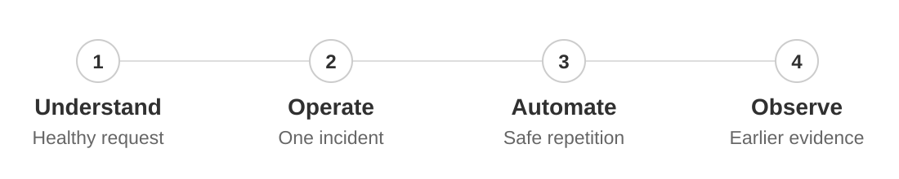


---

<!-- _class: content schedule core -->
<!-- _footer: "AI5049, Hochschule Fulda" -->

# The project workshops

Friday sessions: **13:45–18:45**

| Date | Focus |
|---|---|
| 30 October 2026 | Research questions and sources |
| 13 November 2026 | Experimental design |
| 27 November 2026 | Analysis and scientific argument |
| 11 December 2026 | Forecasts, control loops and agents |
| 22 January 2027 | In-class peer review and revision |
| 5 February 2027 | Presentations and reproducibility |

---

<!-- _class: content core -->
<!-- _footer: "AI5049, Hochschule Fulda" -->

# Fridays: work on your project

Short input together, then project work and individual support.

Bring your code, data, draft and current blocker.

---

<!-- _class: content core -->
<!-- _footer: "<span class=\"footer-context\">AI5049, Hochschule Fulda</span><span class=\"footer-refs\"><a href=\"https://conferences.ieeeauthorcenter.ieee.org/write-your-paper/authoring-tools-and-templates/\">IEEE paper templates</a></span>" -->

# Your project

**One question. Teams of 3–4. A meaningful comparison.**

| Submit | Requirement |
|---|---|
| Paper | English, IEEE two-column, six pages including references |
| Artifact | Reproducible evidence |
| Declaration | Contributions, outside the page limit |

Group choice: **12 Oct, 13:45 → 27 Nov, 23:59**.
Nominate one contact person.

---

<!-- _class: content core -->
<!-- _footer: "AI5049, Hochschule Fulda" -->

# What counts towards your grade?

The **paper and artifact** are assessed together. Normally one group grade.
Substantial, documented contribution differences may lead to individual grades.

| Paper area | Weight |
|---|---:|
| Introduction & related work | 20% |
| Approach & methodology | 25% |
| Evaluation & results | 30% |
| Discussion & conclusion | 15% |
| Abstract, writing & reproducibility | 10% |


---

<!-- _class: content core -->
<!-- _footer: "AI5049, Hochschule Fulda" -->

# Who did what?

Record individual and joint work in [DECLARATION.md](https://github.com/Stinktopf/network-management-and-monitoring/blob/main/slides/resources/templates/DECLARATION.md).

| Record | Make it concrete |
|---|---|
| Paper | Sections, figures and revisions |
| Artifact | Code, configuration and experiments |
| Joint work | Shared task and each person’s contribution |

Point to the work so the contribution can be checked.


---

<!-- _class: content core -->
<!-- _footer: "AI5049, Hochschule Fulda" -->

# What goes with the paper?

The paper makes the argument. The **artifact** lets me check it.

- Code and configurations
- Data and software versions
- Reproduction steps
- Seeds, failed runs and exclusions

Public repository: optional. Access for the examiner: required.

---

<!-- _class: content core -->
<!-- _footer: "AI5049, Hochschule Fulda" -->

# Scientific integrity

Follow the [IEEE publishing ethics requirements](https://journals.ieeeauthorcenter.ieee.org/become-an-ieee-journal-author/publishing-ethics/ethical-requirements/).

- Cite ideas, methods, data and figures
- Check references against the original
- Report what you actually measured
- Keep counter-evidence
- State limitations and uncertainty

A result against your hypothesis is still a result.


---

<!-- _class: content core -->
<!-- _footer: "AI5049, Hochschule Fulda" -->

# AI use and disclosure

Follow the [IEEE policy on AI-generated content](https://conferences.ieeeauthorcenter.ieee.org/author-ethics/guidelines-and-policies/submission-policies/).

- Spelling and grammar fixes only: disclosure optional
- Generated or substantially rewritten text: disclose
- Generated figures or code: disclose
- Name the system, affected parts and extent in the **Acknowledgments**

You are responsible for the references, code and technical claims.


---

<!-- _class: content core -->
<!-- _footer: "AI5049, Hochschule Fulda" -->

# Dates and deadlines

| Date | Deliverable / session |
|---|---|
| 27 November 2026, 23:59 | Group selection → Moodle |
| 11 January 2027, 23:59 | Full draft + supporting material → Moodle |
| 22 January 2027, in class | Read, write and hand in the paper review |
| 5 February 2027 | Presentations in class (ungraded) |
| 12 February 2027, 23:59 | Paper, artifact, declaration → Moodle |

---

<!-- _class: content core -->
<!-- _footer: "AI5049, Hochschule Fulda" -->

# Optional peer-review bonus

**22 January 2027, in class. No make-up date.**

One qualifying review improves the individual grade by **one step**, e.g. 2.3 → 2.0.
Best possible grade: **1.0**. Failing grades remain unchanged.

One page, legibly handwritten, German or English.
Work independently. **No AI or other aids.**

For recognized accommodations, contact the lecturer early.

---

<!-- _class: content core -->
<!-- _footer: "AI5049, Hochschule Fulda" -->

# What makes a qualifying review?

A qualifying review covers four things:

- **Summary:** question and main result
- **Method:** assess a methodological choice
- **Judgment:** strength and limitation with reasons
- **Revision:** propose a feasible improvement

I record the four criteria and my reasons.

---

<!-- _class: day core -->
<!-- _footer: "AI5049, Hochschule Fulda" -->

# 12 October 2026

## Networking 101

One network carries the technical block.

---

<!-- _class: content core -->
<!-- _footer: "AI5049, Hochschule Fulda" -->

# Meet ReefNet at BOB1

ReefNet connects **Ocean Research** through two upstreams.

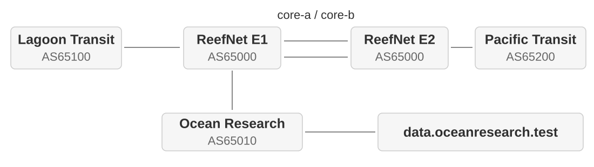

---

<!-- _class: content core -->
<!-- _footer: "AI5049, Hochschule Fulda" -->

# Four views. Four questions.

| View | Question |
|---|---|
| NetBox | What should exist? |
| Router | What exists now? |
| Grafana | What changed over time? |
| External probe | Does the service work? |

---

<!-- _class: chapter core -->
<!-- _footer: "AI5049, Hochschule Fulda" -->

# Follow one service request.

How does this network actually work?

---

<!-- _class: visual core -->
<!-- _footer: "AI5049, Hochschule Fulda" -->

# Follow one service request.

In ReefNet: a Lagoon probe requests `data.oceanresearch.test`.

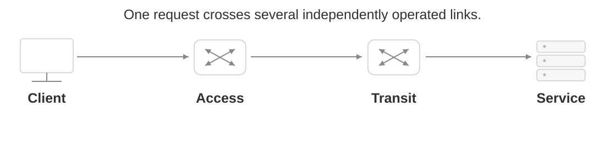

What must work before the application can return a response?

<nav class="progress" aria-label="Module progress"><span class="active">APPLICATION</span><span class="arrow"> → </span><span class="">TRANSPORT</span><span class="arrow"> → </span><span class="">IP</span><span class="arrow"> → </span><span class="">ROUTING</span><span class="arrow"> → </span><span class="">LINK</span><span class="arrow"> → </span><span class="">PATH</span></nav>

---

<!-- _class: visual core -->
<!-- _footer: "AI5049, Hochschule Fulda" -->

# The TCP/IP stack

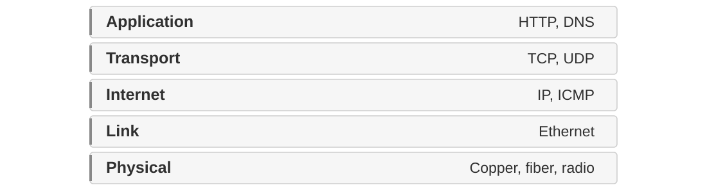

Each layer carries data for the layer above it.

<nav class="progress" aria-label="Module progress"><span class="active">APPLICATION</span><span class="arrow"> → </span><span class="">TRANSPORT</span><span class="arrow"> → </span><span class="">IP</span><span class="arrow"> → </span><span class="">ROUTING</span><span class="arrow"> → </span><span class="">LINK</span><span class="arrow"> → </span><span class="">PATH</span></nav>

---

<!-- _class: visual core -->
<!-- _footer: "<span class=\"footer-context\">AI5049, Hochschule Fulda</span><span class=\"footer-refs\"><a href=\"https://www.rfc-editor.org/rfc/rfc1034.html\">DNS: RFC 1034</a></span>" -->

# A name needs an address.

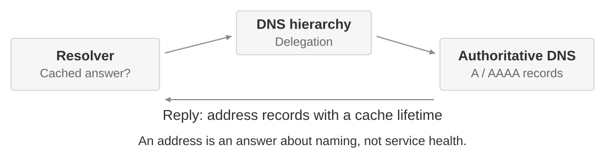

**A** → IPv4
**AAAA** → IPv6.

<nav class="progress" aria-label="Module progress"><span class="active">APPLICATION</span><span class="arrow"> → </span><span class="">TRANSPORT</span><span class="arrow"> → </span><span class="">IP</span><span class="arrow"> → </span><span class="">ROUTING</span><span class="arrow"> → </span><span class="">LINK</span><span class="arrow"> → </span><span class="">PATH</span></nav>

---

<!-- _class: visual core -->
<!-- _footer: "AI5049, Hochschule Fulda" -->

# A DNS query becomes transport data

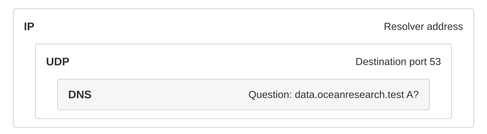

This query uses UDP. DNS also supports TCP.

<nav class="progress" aria-label="Module progress"><span class="">APPLICATION</span><span class="arrow"> → </span><span class="active">TRANSPORT</span><span class="arrow"> → </span><span class="">IP</span><span class="arrow"> → </span><span class="">ROUTING</span><span class="arrow"> → </span><span class="">LINK</span><span class="arrow"> → </span><span class="">PATH</span></nav>

---

<!-- _class: content core -->
<!-- _footer: "<span class=\"footer-context\">AI5049, Hochschule Fulda</span><span class=\"footer-refs\"><a href=\"https://www.rfc-editor.org/rfc/rfc9293.html\">TCP: RFC 9293</a><a href=\"https://www.rfc-editor.org/rfc/rfc768.html\">UDP: RFC 768</a></span>" -->

# TCP and UDP

| | TCP | UDP |
|---|---|---|
| Data | Ordered byte stream | Individual datagrams |
| Connection | Required | None |
| Retransmission | Built in | Application decides |

TCP and UDP add port numbers above IP.
An IP address + port identifies the transport endpoint.

<nav class="progress" aria-label="Module progress"><span class="">APPLICATION</span><span class="arrow"> → </span><span class="active">TRANSPORT</span><span class="arrow"> → </span><span class="">IP</span><span class="arrow"> → </span><span class="">ROUTING</span><span class="arrow"> → </span><span class="">LINK</span><span class="arrow"> → </span><span class="">PATH</span></nav>

---

<!-- _class: content core -->
<!-- _footer: "AI5049, Hochschule Fulda" -->

# TCP gets the conversation started.

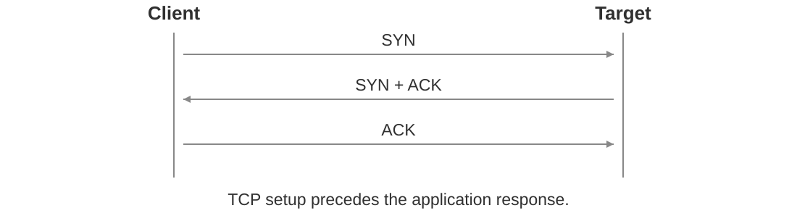

TCP orders bytes, retransmits loss and controls congestion.

<nav class="progress" aria-label="Module progress"><span class="">APPLICATION</span><span class="arrow"> → </span><span class="active">TRANSPORT</span><span class="arrow"> → </span><span class="">IP</span><span class="arrow"> → </span><span class="">ROUTING</span><span class="arrow"> → </span><span class="">LINK</span><span class="arrow"> → </span><span class="">PATH</span></nav>

---

<!-- _class: visual core -->
<!-- _footer: "<span class=\"footer-context\">AI5049, Hochschule Fulda</span><span class=\"footer-refs\"><a href=\"https://www.rfc-editor.org/rfc/rfc791.html\">IPv4: RFC 791</a><a href=\"https://www.rfc-editor.org/rfc/rfc8200.html\">IPv6: RFC 8200</a></span>" -->

# IP gives the packet a destination.

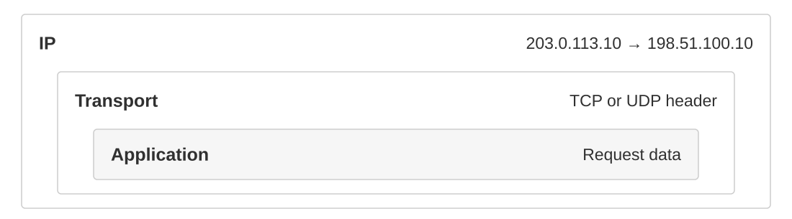

IPv4 uses 32-bit addresses. IPv6 uses 128-bit addresses.
Routers use the **destination address** to look up where to forward the packet.

<nav class="progress" aria-label="Module progress"><span class="">APPLICATION</span><span class="arrow"> → </span><span class="">TRANSPORT</span><span class="arrow"> → </span><span class="active">IP</span><span class="arrow"> → </span><span class="">ROUTING</span><span class="arrow"> → </span><span class="">LINK</span><span class="arrow"> → </span><span class="">PATH</span></nav>

---

<!-- _class: visual core -->
<!-- _footer: "AI5049, Hochschule Fulda" -->

# On-link or through a router?

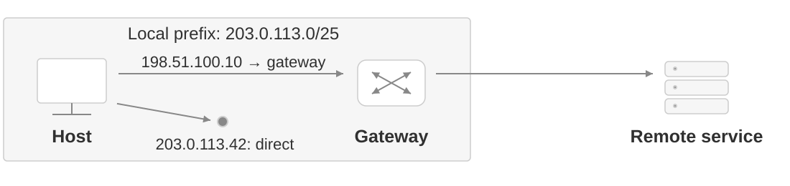

The route selects the **outgoing interface** and **next hop**.

<nav class="progress" aria-label="Module progress"><span class="">APPLICATION</span><span class="arrow"> → </span><span class="">TRANSPORT</span><span class="arrow"> → </span><span class="active">IP</span><span class="arrow"> → </span><span class="">ROUTING</span><span class="arrow"> → </span><span class="">LINK</span><span class="arrow"> → </span><span class="">PATH</span></nav>

---

<!-- _class: content core -->
<!-- _footer: "<span class=\"footer-context\">AI5049, Hochschule Fulda</span><span class=\"footer-refs\"><a href=\"https://www.rfc-editor.org/rfc/rfc1812.html#section-5.2.4.3\">Longest prefix match: RFC 1812</a></span>" -->

# Use the longest matching prefix

Destination: **198.51.100.200**. Example Forwarding Information Base (FIB):

| Prefix | Next hop |
|---|---|
| `0.0.0.0/0` | `192.0.2.1` |
| `198.51.100.0/24` | `192.0.2.2` |
| **`198.51.100.128/25`** | **`192.0.2.3`** |

`/25` matches 25 address bits. The most specific match wins.

<nav class="progress" aria-label="Module progress"><span class="">APPLICATION</span><span class="arrow"> → </span><span class="">TRANSPORT</span><span class="arrow"> → </span><span class="">IP</span><span class="arrow"> → </span><span class="active">ROUTING</span><span class="arrow"> → </span><span class="">LINK</span><span class="arrow"> → </span><span class="">PATH</span></nav>

---

<!-- _class: visual core -->
<!-- _footer: "AI5049, Hochschule Fulda" -->

# Ethernet carries frames across one link

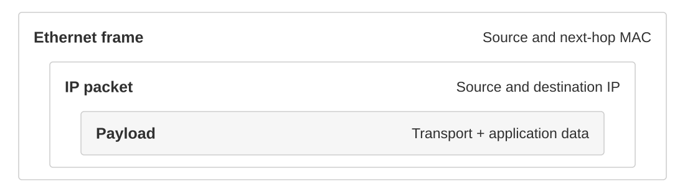

A frame belongs to one link. Its **Frame Check Sequence (FCS)** detects corruption.

<nav class="progress" aria-label="Module progress"><span class="">APPLICATION</span><span class="arrow"> → </span><span class="">TRANSPORT</span><span class="arrow"> → </span><span class="">IP</span><span class="arrow"> → </span><span class="">ROUTING</span><span class="arrow"> → </span><span class="active">LINK</span><span class="arrow"> → </span><span class="">PATH</span></nav>

---

<!-- _class: content deep-dive -->
<!-- _footer: "AI5049, Hochschule Fulda" -->

# Bits need a physical link.

| Medium | Signal | Fault evidence |
|---|---|---|
| Copper | Electrical | Link loss, FCS errors |
| Fiber | Light | Low receive power, FCS errors |

Rising **FCS errors** can reveal a degraded link even while it stays up.

BOB1 has virtual links. Optical diagnostics need physical equipment.

<nav class="progress" aria-label="Module progress"><span class="">APPLICATION</span><span class="arrow"> → </span><span class="">TRANSPORT</span><span class="arrow"> → </span><span class="">IP</span><span class="arrow"> → </span><span class="">ROUTING</span><span class="arrow"> → </span><span class="active">LINK</span><span class="arrow"> → </span><span class="">PATH</span></nav>

---

<!-- _class: visual core -->
<!-- _footer: "AI5049, Hochschule Fulda" -->

# A switch forwards frames by MAC address

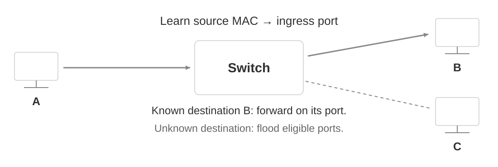

A **MAC address** identifies an Ethernet interface on the local link.

<nav class="progress" aria-label="Module progress"><span class="">APPLICATION</span><span class="arrow"> → </span><span class="">TRANSPORT</span><span class="arrow"> → </span><span class="">IP</span><span class="arrow"> → </span><span class="">ROUTING</span><span class="arrow"> → </span><span class="active">LINK</span><span class="arrow"> → </span><span class="">PATH</span></nav>

---

<!-- _class: visual core -->
<!-- _footer: "<span class=\"footer-context\">AI5049, Hochschule Fulda</span><span class=\"footer-refs\"><a href=\"https://www.rfc-editor.org/rfc/rfc826.html\">ARP: RFC 826</a><a href=\"https://www.rfc-editor.org/rfc/rfc4861.html\">ND: RFC 4861</a></span>" -->

# Resolve the next hop.

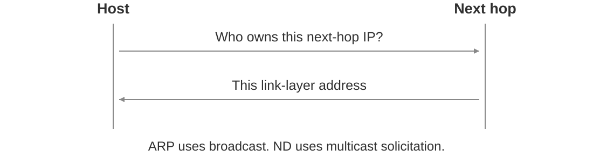

<div class="paired-notes">
<div><h2>IPv4: ARP</h2><p>Resolve the selected next hop’s IPv4 address to its MAC address.</p></div>
<div><h2>IPv6: Neighbor Discovery</h2><p>Resolve the selected next hop’s IPv6 address using ICMPv6.</p></div>
</div>

<nav class="progress" aria-label="Module progress"><span class="">APPLICATION</span><span class="arrow"> → </span><span class="">TRANSPORT</span><span class="arrow"> → </span><span class="">IP</span><span class="arrow"> → </span><span class="">ROUTING</span><span class="arrow"> → </span><span class="active">LINK</span><span class="arrow"> → </span><span class="">PATH</span></nav>

---

<!-- _class: visual lab -->
<!-- _footer: "AI5049, Hochschule Fulda" -->

# Remote IP, local MAC

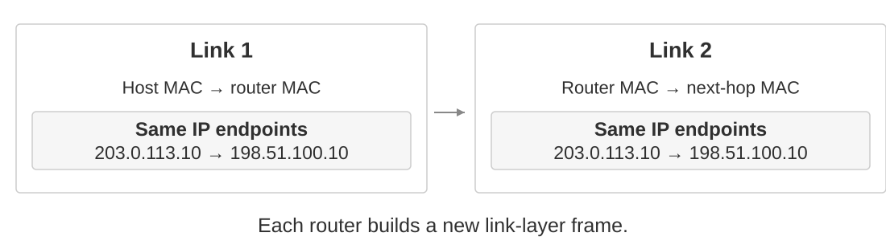

<nav class="progress" aria-label="Module progress"><span class="">APPLICATION</span><span class="arrow"> → </span><span class="">TRANSPORT</span><span class="arrow"> → </span><span class="">IP</span><span class="arrow"> → </span><span class="">ROUTING</span><span class="arrow"> → </span><span class="active">LINK</span><span class="arrow"> → </span><span class="">PATH</span></nav>

---

<!-- _class: visual core -->
<!-- _footer: "AI5049, Hochschule Fulda" -->

# Routers repeat the process hop by hop

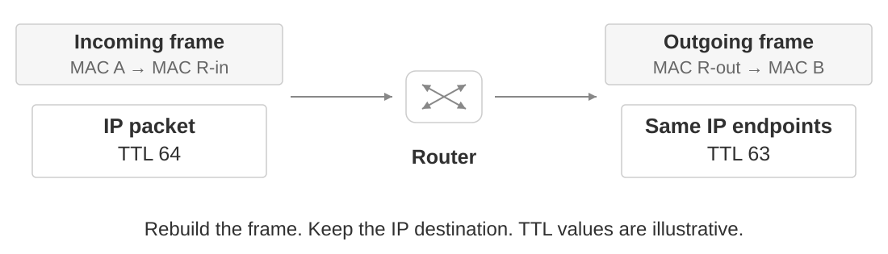

Each router looks up the next hop and decreases TTL / Hop Limit.

<nav class="progress" aria-label="Module progress"><span class="">APPLICATION</span><span class="arrow"> → </span><span class="">TRANSPORT</span><span class="arrow"> → </span><span class="">IP</span><span class="arrow"> → </span><span class="">ROUTING</span><span class="arrow"> → </span><span class="">LINK</span><span class="arrow"> → </span><span class="active">PATH</span></nav>

---

<!-- _class: content core -->
<!-- _footer: "AI5049, Hochschule Fulda" -->

# Where do routes come from?

Use the running Networking lab. Leave a Linux node with `exit`, a router with `quit`.

| Route source | Origin |
|---|---|
| Connected | Addressed interface |
| Static | Operator configuration |
| Dynamic | Routing protocol |

<div class="terminal">
<div class="terminal-entry"><strong>WSL</strong><code>make enter NODE=edge01.bob1.reefnet.test</code></div>
<div class="terminal-label">Router CLI</div>
<pre><code>show network-instance default route-table ipv4-unicast summary</code></pre>
</div>

<nav class="progress" aria-label="Module progress"><span class="">APPLICATION</span><span class="arrow"> → </span><span class="">TRANSPORT</span><span class="arrow"> → </span><span class="">IP</span><span class="arrow"> → </span><span class="active">ROUTING</span><span class="arrow"> → </span><span class="">LINK</span><span class="arrow"> → </span><span class="">PATH</span></nav>

---

<!-- _class: visual core -->
<!-- _footer: "AI5049, Hochschule Fulda" -->

# An AS is an administrative routing domain

An **autonomous system (AS)** presents one routing policy externally.
An **Interior Gateway Protocol (IGP)** finds routes inside it.

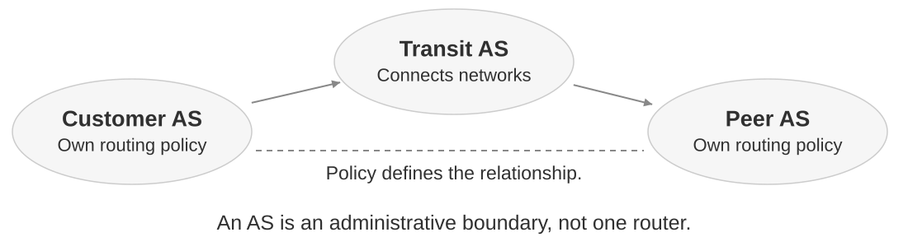

<nav class="progress" aria-label="Module progress"><span class="">APPLICATION</span><span class="arrow"> → </span><span class="">TRANSPORT</span><span class="arrow"> → </span><span class="">IP</span><span class="arrow"> → </span><span class="active">ROUTING</span><span class="arrow"> → </span><span class="">LINK</span><span class="arrow"> → </span><span class="">PATH</span></nav>

---

<!-- _class: visual core -->
<!-- _footer: "<span class=\"footer-context\">AI5049, Hochschule Fulda</span><span class=\"footer-refs\"><a href=\"https://www.rfc-editor.org/rfc/rfc2453.html\">RIP: RFC 2453</a><a href=\"https://www.rfc-editor.org/rfc/rfc2328.html\">OSPF: RFC 2328</a></span>" -->

# Two ways to learn an internal route

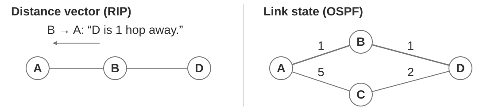

<div class="paired-notes">
<div><p><strong>Share distances to destinations.</strong><br>A adds 1 hop: D via B, 2 hops.<br>A advertises its own distance onward.</p></div>
<div><p><strong>Share your own links and their costs.</strong><br>Relay across the area → shared map.<br>Each router calculates its own paths.</p></div>
</div>

<nav class="progress" aria-label="Module progress"><span class="">APPLICATION</span><span class="arrow"> → </span><span class="">TRANSPORT</span><span class="arrow"> → </span><span class="">IP</span><span class="arrow"> → </span><span class="active">ROUTING</span><span class="arrow"> → </span><span class="">LINK</span><span class="arrow"> → </span><span class="">PATH</span></nav>

---

<!-- _class: content core -->
<!-- _footer: "<span class=\"footer-context\">AI5049, Hochschule Fulda</span><span class=\"footer-refs\"><a href=\"https://www.rfc-editor.org/rfc/rfc2328.html\">OSPF: RFC 2328</a></span>" -->

# OSPF: each router calculates its own paths

<div class="figure-explanation">
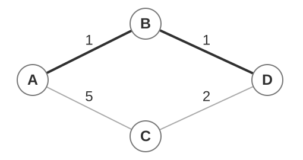
<div>
<p>Example costs:<br>Via B: <strong>1 + 1 = 2</strong>. Via C: 5 + 2 = 7.</p>
<p>In ReefNet, OSPF makes BGP next hops reachable.</p>
</div>
</div>

<div class="terminal">
<div class="terminal-entry"><strong>WSL</strong><code>make enter NODE=edge01.bob1.reefnet.test</code></div>
<div class="terminal-label">Router CLI</div>
<pre><code>show network-instance default protocols ospf neighbor</code></pre>
</div>

<nav class="progress" aria-label="Module progress"><span class="">APPLICATION</span><span class="arrow"> → </span><span class="">TRANSPORT</span><span class="arrow"> → </span><span class="">IP</span><span class="arrow"> → </span><span class="active">ROUTING</span><span class="arrow"> → </span><span class="">LINK</span><span class="arrow"> → </span><span class="">PATH</span></nav>

---

<!-- _class: content core -->
<!-- _footer: "<span class=\"footer-context\">AI5049, Hochschule Fulda</span><span class=\"footer-refs\"><a href=\"https://www.rfc-editor.org/rfc/rfc4271.html\">BGP: RFC 4271</a></span>" -->

# BGP exchanges reachability.

**Path vector:** prefixes, AS paths and other attributes.

<div class="paired-notes">
<div><h2>eBGP</h2><p>Routes between ASes.</p></div>
<div><h2>iBGP</h2><p>Routes within an AS.<br>The IGP is still needed.</p></div>
</div>

<div class="terminal">
<div class="terminal-entry"><strong>WSL</strong><code>make enter NODE=edge01.bob1.reefnet.test</code></div>
<div class="terminal-label">Router CLI</div>
<pre><code>show network-instance default protocols bgp neighbor
show network-instance default protocols bgp routes ipv4 summary</code></pre>
</div>

<nav class="progress" aria-label="Module progress"><span class="">APPLICATION</span><span class="arrow"> → </span><span class="">TRANSPORT</span><span class="arrow"> → </span><span class="">IP</span><span class="arrow"> → </span><span class="active">ROUTING</span><span class="arrow"> → </span><span class="">LINK</span><span class="arrow"> → </span><span class="">PATH</span></nav>

---

<!-- _class: content deep-dive -->
<!-- _footer: "AI5049, Hochschule Fulda" -->

# BGP is policy first.

For comparable routes:

1. Apply local policy.
2. Prefer higher local preference.
3. Compare AS_PATH and further tie-breakers.

<div class="terminal">
<div class="terminal-entry"><strong>WSL</strong><code>make enter NODE=edge01.bob1.reefnet.test</code></div>
<div class="terminal-label">Router CLI</div>
<pre><code>show network-instance default protocols bgp routes ipv4 prefix 198.51.100.0/24</code></pre>
</div>

A longer path can be selected on purpose.

<nav class="progress" aria-label="Module progress"><span class="">APPLICATION</span><span class="arrow"> → </span><span class="">TRANSPORT</span><span class="arrow"> → </span><span class="">IP</span><span class="arrow"> → </span><span class="active">ROUTING</span><span class="arrow"> → </span><span class="">LINK</span><span class="arrow"> → </span><span class="">PATH</span></nav>

---

<!-- _class: content deep-dive -->
<!-- _footer: "AI5049, Hochschule Fulda" -->

# Transit and peering

| | Transit | Peering |
|---|---|---|
| Reachability | Provider supplies broader reachability | Networks exchange selected routes |
| Commercial relation | Customer pays provider | Often settlement-free |

An **IXP** provides shared infrastructure for peering.
Export policy determines the actual routes exchanged.

<nav class="progress" aria-label="Module progress"><span class="">APPLICATION</span><span class="arrow"> → </span><span class="">TRANSPORT</span><span class="arrow"> → </span><span class="">IP</span><span class="arrow"> → </span><span class="active">ROUTING</span><span class="arrow"> → </span><span class="">LINK</span><span class="arrow"> → </span><span class="">PATH</span></nav>

---

<!-- _class: content deep-dive -->
<!-- _footer: "AI5049, Hochschule Fulda" -->

# Who assigns the prefixes we route?

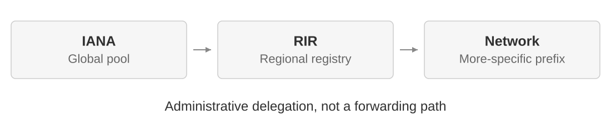

BOB1 uses documentation prefixes. Its service is not on the public Internet.

<nav class="progress" aria-label="Module progress"><span class="">APPLICATION</span><span class="arrow"> → </span><span class="">TRANSPORT</span><span class="arrow"> → </span><span class="">IP</span><span class="arrow"> → </span><span class="">ROUTING</span><span class="arrow"> → </span><span class="">LINK</span><span class="arrow"> → </span><span class="active">PATH</span></nav>

---

<!-- _class: content core -->
<!-- _footer: "AI5049, Hochschule Fulda" -->

# The response needs its own route.

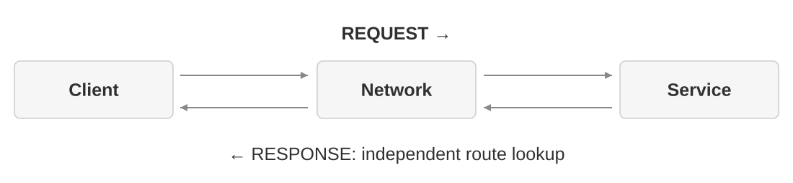

Reachability needs both directions. Paths may be asymmetric.

<nav class="progress" aria-label="Module progress"><span class="">APPLICATION</span><span class="arrow"> → </span><span class="">TRANSPORT</span><span class="arrow"> → </span><span class="">IP</span><span class="arrow"> → </span><span class="">ROUTING</span><span class="arrow"> → </span><span class="">LINK</span><span class="arrow"> → </span><span class="active">PATH</span></nav>

---

<!-- _class: content core -->
<!-- _footer: "<span class=\"footer-context\">AI5049, Hochschule Fulda</span><span class=\"footer-refs\"><a href=\"https://www.rfc-editor.org/rfc/rfc792.html\">ICMP: RFC 792</a><a href=\"https://www.rfc-editor.org/rfc/rfc4443.html\">ICMPv6: RFC 4443</a></span>" -->

# ICMP: errors and diagnostics

| Message | Meaning |
|---|---|
| Echo Request / Reply | Ping |
| Destination Unreachable | Cannot deliver |
| Time Exceeded | TTL / Hop Limit expired |
| Packet Too Big (IPv6) | Exceeds link MTU |

A ping reply proves IP reachability, not application health.

<nav class="progress" aria-label="Module progress"><span class="">APPLICATION</span><span class="arrow"> → </span><span class="">TRANSPORT</span><span class="arrow"> → </span><span class="">IP</span><span class="arrow"> → </span><span class="">ROUTING</span><span class="arrow"> → </span><span class="">LINK</span><span class="arrow"> → </span><span class="active">PATH</span></nav>

---

<!-- _class: visual deep-dive -->
<!-- _footer: "AI5049, Hochschule Fulda" -->

# Traceroute expires TTL / Hop Limit.

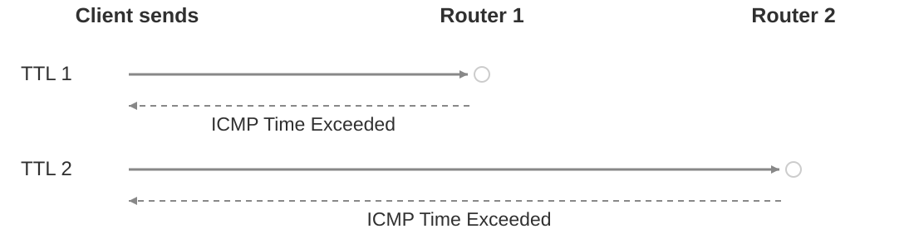

Larger TTL (IPv4) or Hop Limit (IPv6) values reveal responding routers.
A missing reply does not identify the failed forwarding hop.

<nav class="progress" aria-label="Module progress"><span class="">APPLICATION</span><span class="arrow"> → </span><span class="">TRANSPORT</span><span class="arrow"> → </span><span class="">IP</span><span class="arrow"> → </span><span class="">ROUTING</span><span class="arrow"> → </span><span class="">LINK</span><span class="arrow"> → </span><span class="active">PATH</span></nav>

---

<!-- _class: content task -->
<!-- _footer: "AI5049, Hochschule Fulda" -->

# Follow the request

How does a request from Lagoon reach `data.oceanresearch.test`,
and how does the reply get back?

**60 minutes:** 30 to [clone the repo](https://github.com/Stinktopf/network-management-and-monitoring#setup) and run `make setup`, then 30 to explore.

After `READY FOR CLASS`, in WSL:
```bash
make networking
make task
```

Check addresses, DNS and HTTP. Sketch the path.
Then try Pacific and IPv6.

[Exercises](https://github.com/Stinktopf/network-management-and-monitoring/blob/main/EXERCISES.md) / [CheatSheet](https://github.com/Stinktopf/network-management-and-monitoring/blob/main/slides/exports/cheatsheet.pdf)


---

<!-- _class: content core -->
<!-- _footer: "AI5049, Hochschule Fulda" -->

# What did your checks tell you?

- Which address came from DNS?
- Which address was your next hop?
- How did you check the return path?
- What did HTTP tell you that ping could not?

Bring one result you can explain and one question that is still open.


---

<!-- _class: chapter core -->
<!-- _footer: "AI5049, Hochschule Fulda" -->

# Network Operations

The service is broken.

What happened, and how do we restore it safely?

---

<!-- _class: content core -->
<!-- _footer: "AI5049, Hochschule Fulda" -->

# One incident, from report to recovery.

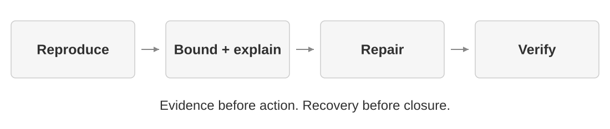

<nav class="progress" aria-label="Module progress"><span class="active">REPRODUCE</span><span class="arrow"> → </span><span class="">BOUND</span><span class="arrow"> → </span><span class="">OBSERVE</span><span class="arrow"> → </span><span class="">HYPOTHESIZE</span><span class="arrow"> → </span><span class="">REPAIR</span><span class="arrow"> → </span><span class="">VERIFY</span></nav>

---

<!-- _class: visual core -->
<!-- _footer: "AI5049, Hochschule Fulda" -->

# A customer reports partial reachability

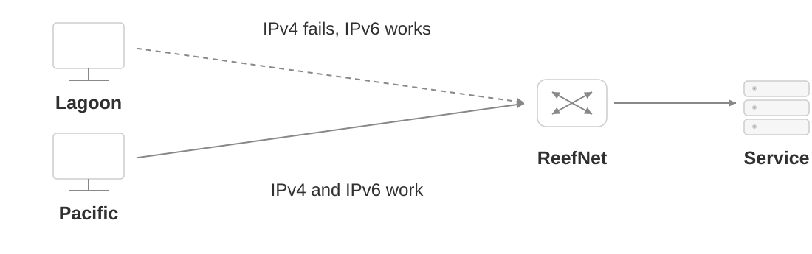

Record the source, address family, protocol and time.

<nav class="progress" aria-label="Module progress"><span class="active">REPRODUCE</span><span class="arrow"> → </span><span class="">BOUND</span><span class="arrow"> → </span><span class="">OBSERVE</span><span class="arrow"> → </span><span class="">HYPOTHESIZE</span><span class="arrow"> → </span><span class="">REPAIR</span><span class="arrow"> → </span><span class="">VERIFY</span></nav>

---

<!-- _class: content core -->
<!-- _footer: "AI5049, Hochschule Fulda" -->

# Who cannot reach the service?

<div class="terminal">
<div class="terminal-entry"><strong>WSL</strong><code>make enter NODE=probe01.bob1.lagoontransit.test</code></div>
<div class="terminal-label">Inside the Lagoon probe</div>
<pre><code>ping -4 -c 2 -W 1 198.51.100.10
ping -6 -c 2 -W 1 2001:db8:100::10</code></pre>
</div>

Use `exit`, then in WSL:

```bash
make enter NODE=probe01.bob1.pacifictransit.test
```

Repeat both tests. Which path and address family fail?


---

<!-- _class: visual core -->
<!-- _footer: "AI5049, Hochschule Fulda" -->

# Bound the incident.

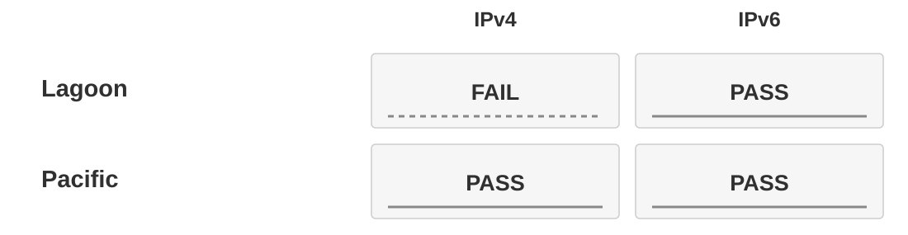

Keep the service and test method fixed. Vary the viewpoint.

<nav class="progress" aria-label="Module progress"><span class="">REPRODUCE</span><span class="arrow"> → </span><span class="active">BOUND</span><span class="arrow"> → </span><span class="">OBSERVE</span><span class="arrow"> → </span><span class="">HYPOTHESIZE</span><span class="arrow"> → </span><span class="">REPAIR</span><span class="arrow"> → </span><span class="">VERIFY</span></nav>

---

<!-- _class: visual core -->
<!-- _footer: "AI5049, Hochschule Fulda" -->

# Separate state from service.

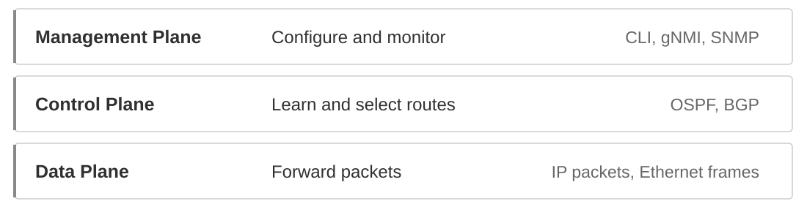

A healthy control-plane session does not prove that the service works.

<nav class="progress" aria-label="Module progress"><span class="">REPRODUCE</span><span class="arrow"> → </span><span class="">BOUND</span><span class="arrow"> → </span><span class="active">OBSERVE</span><span class="arrow"> → </span><span class="">HYPOTHESIZE</span><span class="arrow"> → </span><span class="">REPAIR</span><span class="arrow"> → </span><span class="">VERIFY</span></nav>

---

<!-- _class: content core -->
<!-- _footer: "AI5049, Hochschule Fulda" -->

# Is BGP actually established?

<div class="terminal">
<div class="terminal-entry"><strong>WSL</strong><code>make enter NODE=edge01.bob1.reefnet.test</code></div>
<div class="terminal-label">Router CLI</div>
<pre><code>show network-instance default protocols bgp neighbor</code></pre>
</div>

| IPv4 neighbor | Role |
|---|---|
| `192.0.2.0` | Ocean Research |
| `192.0.2.2` | Lagoon Transit |
| `10.255.0.2` | ReefNet edge02 iBGP |

<nav class="progress" aria-label="Module progress"><span class="">REPRODUCE</span><span class="arrow"> → </span><span class="">BOUND</span><span class="arrow"> → </span><span class="active">OBSERVE</span><span class="arrow"> → </span><span class="">HYPOTHESIZE</span><span class="arrow"> → </span><span class="">REPAIR</span><span class="arrow"> → </span><span class="">VERIFY</span></nav>

---

<!-- _class: content core -->
<!-- _footer: "AI5049, Hochschule Fulda" -->

# Did the customer route arrive?

Compare the customer prefix in both address families.

<div class="terminal">
<div class="terminal-entry"><strong>WSL</strong><code>make enter NODE=edge01.bob1.reefnet.test</code></div>
<div class="terminal-label">Router CLI</div>
<pre><code>show network-instance default protocols bgp routes ipv4 prefix 198.51.100.0/24
show network-instance default protocols bgp routes ipv6 prefix 2001:db8:100::/48</code></pre>
</div>

A route in BGP is not yet proof of forwarding.

<nav class="progress" aria-label="Module progress"><span class="">REPRODUCE</span><span class="arrow"> → </span><span class="">BOUND</span><span class="arrow"> → </span><span class="active">OBSERVE</span><span class="arrow"> → </span><span class="">HYPOTHESIZE</span><span class="arrow"> → </span><span class="">REPAIR</span><span class="arrow"> → </span><span class="">VERIFY</span></nav>

---

<!-- _class: content core -->
<!-- _footer: "AI5049, Hochschule Fulda" -->

# Is IPv4 installed for forwarding?

<div class="terminal">
<div class="terminal-entry"><strong>WSL</strong><code>make enter NODE=edge01.bob1.reefnet.test</code></div>
<div class="terminal-label">Router CLI</div>
<pre><code>show network-instance default route-table ipv4-unicast prefix 198.51.100.0/24</code></pre>
</div>

**Active route → resolved next hop → outgoing interface**

<nav class="progress" aria-label="Module progress"><span class="">REPRODUCE</span><span class="arrow"> → </span><span class="">BOUND</span><span class="arrow"> → </span><span class="active">OBSERVE</span><span class="arrow"> → </span><span class="">HYPOTHESIZE</span><span class="arrow"> → </span><span class="">REPAIR</span><span class="arrow"> → </span><span class="">VERIFY</span></nav>

---

<!-- _class: content core -->
<!-- _footer: "AI5049, Hochschule Fulda" -->

# Compare the advertisements

<div class="terminal">
<div class="terminal-entry"><strong>WSL</strong><code>make enter NODE=edge01.bob1.reefnet.test</code></div>
<div class="terminal-label">Router CLI: toward Lagoon</div>
<pre><code>show network-instance default protocols bgp neighbor 192.0.2.2 advertised-routes ipv4</code></pre>
</div>

Use `quit` before entering the other router.

<div class="terminal">
<div class="terminal-entry"><strong>WSL</strong><code>make enter NODE=edge02.bob1.reefnet.test</code></div>
<div class="terminal-label">Router CLI: toward Pacific</div>
<pre><code>show network-instance default protocols bgp neighbor 192.0.2.5 advertised-routes ipv4</code></pre>
</div>

Find `198.51.100.0/24`.

<nav class="progress" aria-label="Module progress"><span class="">REPRODUCE</span><span class="arrow"> → </span><span class="">BOUND</span><span class="arrow"> → </span><span class="active">OBSERVE</span><span class="arrow"> → </span><span class="">HYPOTHESIZE</span><span class="arrow"> → </span><span class="">REPAIR</span><span class="arrow"> → </span><span class="">VERIFY</span></nav>

---

<!-- _class: content task -->
<!-- _footer: "AI5049, Hochschule Fulda" -->

# You are on call

A user behind Lagoon cannot reach the Ocean Research service.

In WSL:
```bash
make operations
make task
```

**60 minutes:** find the fault, repair it and verify recovery.
Keep your commands and evidence. We compare diagnoses before repairing.

[Exercises](https://github.com/Stinktopf/network-management-and-monitoring/blob/main/EXERCISES.md) / [CheatSheet](https://github.com/Stinktopf/network-management-and-monitoring/blob/main/slides/exports/cheatsheet.pdf)


---

<!-- _class: content core -->
<!-- _footer: "AI5049, Hochschule Fulda" -->

# Which policy does this neighbor use?

<div class="terminal">
<div class="terminal-entry"><strong>WSL</strong><code>make enter NODE=edge01.bob1.reefnet.test</code></div>
<div class="terminal-label">Router CLI</div>
<pre><code>info from running network-instance default protocols bgp group lagoon-v4
info from running network-instance default protocols bgp group lagoon-v6</code></pre>
</div>

What is attached only to IPv4?

<nav class="progress" aria-label="Module progress"><span class="">REPRODUCE</span><span class="arrow"> → </span><span class="">BOUND</span><span class="arrow"> → </span><span class="">OBSERVE</span><span class="arrow"> → </span><span class="active">HYPOTHESIZE</span><span class="arrow"> → </span><span class="">REPAIR</span><span class="arrow"> → </span><span class="">VERIFY</span></nav>

---

<!-- _class: content core -->
<!-- _footer: "<span class=\"footer-context\">AI5049, Hochschule Fulda</span><span class=\"footer-refs\"><a href=\"https://documentation.nokia.com/srlinux/25-7/books/system-mgmt/cli-interface.html\">SR Linux CLI guide</a></span>" -->

# Remove the override, then check the service

<div class="terminal">
<div class="terminal-entry"><strong>WSL</strong><code>make enter NODE=edge01.bob1.reefnet.test</code></div>
<div class="terminal-label">Router CLI</div>
<pre><code>enter candidate
delete / network-instance default protocols bgp group lagoon-v4 export-policy
diff
commit now</code></pre>
</div>

The group inherits `EXPORT-BGP`. Leave the other paths unchanged.

<nav class="progress" aria-label="Module progress"><span class="">REPRODUCE</span><span class="arrow"> → </span><span class="">BOUND</span><span class="arrow"> → </span><span class="">OBSERVE</span><span class="arrow"> → </span><span class="">HYPOTHESIZE</span><span class="arrow"> → </span><span class="active">REPAIR</span><span class="arrow"> → </span><span class="">VERIFY</span></nav>

---

<!-- _class: content core -->
<!-- _footer: "<span class=\"footer-context\">AI5049, Hochschule Fulda</span><span class=\"footer-refs\"><a href=\"https://curl.se/docs/manpage.html#--fail\">curl: HTTP checks</a></span>" -->

# The change is not the recovery proof.

Leave the router with `quit`.

<div class="terminal">
<div class="terminal-entry"><strong>WSL</strong><code>make enter NODE=probe01.bob1.lagoontransit.test</code></div>
<div class="terminal-label">Inside the Lagoon probe</div>
<pre><code>curl --fail --max-time 5 -4 http://198.51.100.10/
curl --fail --max-time 5 -g -6 &#x27;http://[2001:db8:100::10]/&#x27;</code></pre>
</div>

Use `exit`, then in WSL:

```bash
make enter NODE=probe01.bob1.pacifictransit.test
```

Repeat both HTTP checks. Return with `exit`, then run `make test`.

<nav class="progress" aria-label="Module progress"><span class="">REPRODUCE</span><span class="arrow"> → </span><span class="">BOUND</span><span class="arrow"> → </span><span class="">OBSERVE</span><span class="arrow"> → </span><span class="">HYPOTHESIZE</span><span class="arrow"> → </span><span class="">REPAIR</span><span class="arrow"> → </span><span class="active">VERIFY</span></nav>

---

<!-- _class: content core -->
<!-- _footer: "AI5049, Hochschule Fulda" -->

# Record impact, evidence and recovery

A useful update states:

**impact → evidence → action → verification**

For example:

> IPv4 through Lagoon Transit was missing because the customer route was filtered on export. The policy attachment was removed and reachability now succeeds from both external probes. IPv6 was unaffected.

<nav class="progress" aria-label="Module progress"><span class="">REPRODUCE</span><span class="arrow"> → </span><span class="">BOUND</span><span class="arrow"> → </span><span class="">OBSERVE</span><span class="arrow"> → </span><span class="">HYPOTHESIZE</span><span class="arrow"> → </span><span class="">REPAIR</span><span class="arrow"> → </span><span class="active">VERIFY</span></nav>

---

<!-- _class: content core -->
<!-- _footer: "AI5049, Hochschule Fulda" -->

# Write an RFO after the incident

**RFO = Reason for Outage**

| Record | ReefNet incident |
|---|---|
| Impact | Lagoon IPv4 unreachable |
| Cause | Wrong export policy on `lagoon-v4` |
| Recovery | Override removed, HTTP verified |
| Prevention | Test IPv4 and IPv6 exports |

Record unknown times as **unknown**.

<nav class="progress" aria-label="Module progress"><span class="">REPRODUCE</span><span class="arrow"> → </span><span class="">BOUND</span><span class="arrow"> → </span><span class="">OBSERVE</span><span class="arrow"> → </span><span class="">HYPOTHESIZE</span><span class="arrow"> → </span><span class="">REPAIR</span><span class="arrow"> → </span><span class="active">VERIFY</span></nav>

---

<!-- _class: content core -->
<!-- _footer: "AI5049, Hochschule Fulda" -->

# FCAPS: five management areas

- **Fault**: detect, isolate and recover
- **Configuration**: control intended state
- **Accounting**: attribute resource use
- **Performance**: measure service and capacity
- **Security**: control access and change

Our repair touched several areas at once.

<nav class="progress" aria-label="Module progress"><span class="">REPRODUCE</span><span class="arrow"> → </span><span class="">BOUND</span><span class="arrow"> → </span><span class="">OBSERVE</span><span class="arrow"> → </span><span class="">HYPOTHESIZE</span><span class="arrow"> → </span><span class="">REPAIR</span><span class="arrow"> → </span><span class="active">VERIFY</span></nav>

---

<!-- _class: content core -->
<!-- _footer: "AI5049, Hochschule Fulda" -->

# Pick it up at home

Note what you checked, what you found and what to try next.
Then stop the lab with `make down`.

When you return, `make operations` recreates the incident.
Use your notes to pick up the investigation.

Tomorrow’s Automation exercise starts from a fresh scenario.


---

<!-- _class: day core -->
<!-- _footer: "AI5049, Hochschule Fulda" -->

# 13 October 2026

## Automation + Incidents

Yesterday we examined a manual network repair.

Today we need to make the same class of change
**safely and repeatedly**.

At the end of today: **Who Broke the Internet?**

---

<!-- _class: content core -->
<!-- _footer: "AI5049, Hochschule Fulda" -->

# Same incident. This time, use an API.

Yesterday we repaired a router through its CLI.
Today we will use NetBox and gNMI.

How do we choose the right device, make the change and check it worked?

The exercise starts with `make automation`.
You can begin even if you did not finish Operations.


---

<!-- _class: content core -->
<!-- _footer: "AI5049, Hochschule Fulda" -->

# The safe change loop

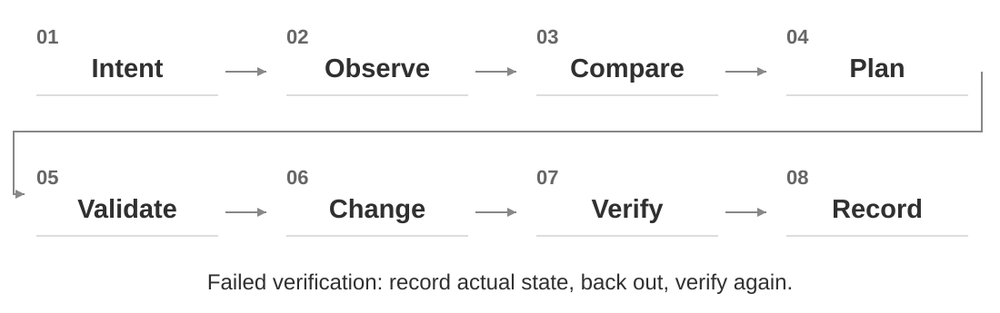

YANG, NETCONF and gNMI support this workflow.

<nav class="progress" aria-label="Module progress"><span class="active">INTENT</span><span class="arrow"> → </span><span class="">OBSERVE</span><span class="arrow"> → </span><span class="">PLAN</span><span class="arrow"> → </span><span class="">CHANGE</span><span class="arrow"> → </span><span class="">VERIFY</span><span class="arrow"> → </span><span class="">RECORD</span></nav>

---

<!-- _class: content core -->
<!-- _footer: "AI5049, Hochschule Fulda" -->

# Agree on a change contract.

| Boundary | Agree before execution |
|---|---|
| Scope | Target and permitted diff |
| Entry | Preconditions and reviewed input |
| Exit | Service checks and deadline |
| Recovery | Backout, owner and access path |

<nav class="progress" aria-label="Module progress"><span class="active">INTENT</span><span class="arrow"> → </span><span class="">OBSERVE</span><span class="arrow"> → </span><span class="">PLAN</span><span class="arrow"> → </span><span class="">CHANGE</span><span class="arrow"> → </span><span class="">VERIFY</span><span class="arrow"> → </span><span class="">RECORD</span></nav>

---

<!-- _class: content core -->
<!-- _footer: "AI5049, Hochschule Fulda" -->

# The change contract

Target: **ReefNet Edge 01**, BGP group `lagoon-v4`.

| | Required state |
|---|---|
| Before | Override: `BLOCK-CUSTOMER-V4` |
| After | Inherit `EXPORT-BGP` without a group override |
| Preserve | Lagoon IPv6 and Pacific Transit |
| Prove | Customer IPv4 export and external reachability |

Which facts need a fresh read from the router?

<nav class="progress" aria-label="Module progress"><span class="active">INTENT</span><span class="arrow"> → </span><span class="">OBSERVE</span><span class="arrow"> → </span><span class="">PLAN</span><span class="arrow"> → </span><span class="">CHANGE</span><span class="arrow"> → </span><span class="">VERIFY</span><span class="arrow"> → </span><span class="">RECORD</span></nav>

---

<!-- _class: content core -->
<!-- _footer: "AI5049, Hochschule Fulda" -->

# Intent, policy, configuration

| Level | ReefNet example |
|---|---|
| Intent | Customer reachable through both upstreams |
| Policy | Lagoon IPv4 inherits `EXPORT-BGP` |
| Configuration | `lagoon-v4` currently has a group override |

A correct policy on the wrong group still fails the intent.

<nav class="progress" aria-label="Module progress"><span class="active">INTENT</span><span class="arrow"> → </span><span class="">OBSERVE</span><span class="arrow"> → </span><span class="">PLAN</span><span class="arrow"> → </span><span class="">CHANGE</span><span class="arrow"> → </span><span class="">VERIFY</span><span class="arrow"> → </span><span class="">RECORD</span></nav>

---

<!-- _class: visual core -->
<!-- _footer: "AI5049, Hochschule Fulda" -->

# Inventory gives the target context.

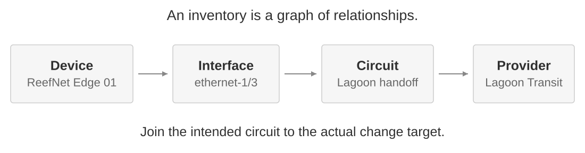

<nav class="progress" aria-label="Module progress"><span class="active">INTENT</span><span class="arrow"> → </span><span class="">OBSERVE</span><span class="arrow"> → </span><span class="">PLAN</span><span class="arrow"> → </span><span class="">CHANGE</span><span class="arrow"> → </span><span class="">VERIFY</span><span class="arrow"> → </span><span class="">RECORD</span></nav>

---

<!-- _class: content core -->
<!-- _footer: "<span class=\"footer-context\">AI5049, Hochschule Fulda</span><span class=\"footer-refs\"><a href=\"https://netbox.readthedocs.io/en/stable/integrations/rest-api/\">NetBox REST API</a></span>" -->

# Read the device inventory.

<div class="terminal">
<div class="terminal-entry"><strong>WSL</strong><code>make enter NODE=operations01.bob1.reefnet.test</code></div>
<div class="terminal-label">Inside operations01</div>
<pre><code>TOKEN=$(cat /state/netbox-token)
NETBOX_API=http://netbox.bob1.reefnet.test:8080/api
curl -fsSG -H &quot;Authorization: Bearer $TOKEN&quot; \
  &quot;$NETBOX_API/dcim/devices/&quot; \
  --data-urlencode name=edge01.bob1.reefnet.test |
  jq &#x27;{count, devices: [.results[] | {name, primary_ip4}]}&#x27;</code></pre>
</div>

Expect one device. Keep the token private.

<nav class="progress" aria-label="Module progress"><span class="">INTENT</span><span class="arrow"> → </span><span class="active">OBSERVE</span><span class="arrow"> → </span><span class="">PLAN</span><span class="arrow"> → </span><span class="">CHANGE</span><span class="arrow"> → </span><span class="">VERIFY</span><span class="arrow"> → </span><span class="">RECORD</span></nav>

---

<!-- _class: content core -->
<!-- _footer: "<span class=\"footer-context\">AI5049, Hochschule Fulda</span><span class=\"footer-refs\"><a href=\"https://netbox.readthedocs.io/en/stable/integrations/rest-api/\">NetBox REST API</a></span>" -->

# Read the circuit intent too

<div class="terminal">
<div class="terminal-entry"><strong>WSL</strong><code>make enter NODE=operations01.bob1.reefnet.test</code></div>
<div class="terminal-label">Inside operations01</div>
<pre><code>TOKEN=$(cat /state/netbox-token)
NETBOX_API=http://netbox.bob1.reefnet.test:8080/api
curl -fsSG -H &quot;Authorization: Bearer $TOKEN&quot; \
  &quot;$NETBOX_API/circuits/circuits/&quot; \
  --data-urlencode cid=BOB1-LAGOON-001 |
  jq &#x27;.results[] | {cid, provider: .provider.name, status: .status.label}&#x27;</code></pre>
</div>

Compare circuit intent with live router state.

<nav class="progress" aria-label="Module progress"><span class="">INTENT</span><span class="arrow"> → </span><span class="active">OBSERVE</span><span class="arrow"> → </span><span class="">PLAN</span><span class="arrow"> → </span><span class="">CHANGE</span><span class="arrow"> → </span><span class="">VERIFY</span><span class="arrow"> → </span><span class="">RECORD</span></nav>

---

<!-- _class: content core -->
<!-- _footer: "AI5049, Hochschule Fulda" -->

# Join inventory into one change input

Example API reads:

```http
GET /api/dcim/devices/?name=edge01.bob1.reefnet.test
GET /api/dcim/interfaces/?device=edge01.bob1.reefnet.test
GET /api/ipam/prefixes/?prefix=198.51.100.0%2F24
GET /api/ipam/asns/?asn=65100
```

Join these objects into one approved change input.

<nav class="progress" aria-label="Module progress"><span class="">INTENT</span><span class="arrow"> → </span><span class="active">OBSERVE</span><span class="arrow"> → </span><span class="">PLAN</span><span class="arrow"> → </span><span class="">CHANGE</span><span class="arrow"> → </span><span class="">VERIFY</span><span class="arrow"> → </span><span class="">RECORD</span></nav>

---

<!-- _class: content core -->
<!-- _footer: "AI5049, Hochschule Fulda" -->

# Intent and observation can drift.

Compare the same **scope**, **time** and **meaning**.

Stale data or different representations can look like drift.
Check those before reconciling.

<nav class="progress" aria-label="Module progress"><span class="">INTENT</span><span class="arrow"> → </span><span class="active">OBSERVE</span><span class="arrow"> → </span><span class="">PLAN</span><span class="arrow"> → </span><span class="">CHANGE</span><span class="arrow"> → </span><span class="">VERIFY</span><span class="arrow"> → </span><span class="">RECORD</span></nav>

---

<!-- _class: content core -->
<!-- _footer: "<span class=\"footer-context\">AI5049, Hochschule Fulda</span><span class=\"footer-refs\"><a href=\"https://www.youtube.com/watch?v=k1TMAgNROh8\">DE-CIX: automation in practice</a></span>" -->

# Unavailable input is not an empty list.

| Input | State |
|---|---|
| Inventory snapshot | Current |
| Monitoring API | Unavailable |
| Previous output | Known working |

Stop publication or use an approved, age-limited fallback.
**Unknown targets must not silently disappear.**

<nav class="progress" aria-label="Module progress"><span class="">INTENT</span><span class="arrow"> → </span><span class="active">OBSERVE</span><span class="arrow"> → </span><span class="">PLAN</span><span class="arrow"> → </span><span class="">CHANGE</span><span class="arrow"> → </span><span class="">VERIFY</span><span class="arrow"> → </span><span class="">RECORD</span></nav>

---

<!-- _class: content core -->
<!-- _footer: "AI5049, Hochschule Fulda" -->

# Freeze the input you reviewed

```json
{
  "change_id": "CHG-017",
  "device": "edge01.bob1.reefnet.test",
  "bgp_group": "lagoon-v4",
  "expected_override": "BLOCK-CUSTOMER-V4",
  "action": "delete group export-policy",
  "expected_inherited_policy": "EXPORT-BGP"
}
```

Reviewer and executor need the **same approved input**.

Also keep the current state needed for backout.

<nav class="progress" aria-label="Module progress"><span class="">INTENT</span><span class="arrow"> → </span><span class="active">OBSERVE</span><span class="arrow"> → </span><span class="">PLAN</span><span class="arrow"> → </span><span class="">CHANGE</span><span class="arrow"> → </span><span class="">VERIFY</span><span class="arrow"> → </span><span class="">RECORD</span></nav>

---

<!-- _class: visual deep-dive -->
<!-- _footer: "AI5049, Hochschule Fulda" -->

# Prevent a lost update

**Optimistic concurrency:** write only if the version you reviewed is still current.

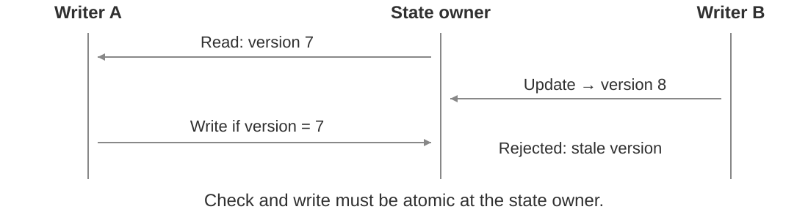

A CLI precheck is useful, but it cannot make the later write atomic.

<nav class="progress" aria-label="Module progress"><span class="">INTENT</span><span class="arrow"> → </span><span class="active">OBSERVE</span><span class="arrow"> → </span><span class="">PLAN</span><span class="arrow"> → </span><span class="">CHANGE</span><span class="arrow"> → </span><span class="">VERIFY</span><span class="arrow"> → </span><span class="">RECORD</span></nav>

---

<!-- _class: content core -->
<!-- _footer: "AI5049, Hochschule Fulda" -->

# Validate before rendering

| Check | Prevents |
|---|---|
| Device + BGP group | Wrong target |
| Current override | Stale assumptions |
| Import or export | Wrong direction |
| Inherited policy | Unsafe fallback |

<nav class="progress" aria-label="Module progress"><span class="">INTENT</span><span class="arrow"> → </span><span class="">OBSERVE</span><span class="arrow"> → </span><span class="active">PLAN</span><span class="arrow"> → </span><span class="">CHANGE</span><span class="arrow"> → </span><span class="">VERIFY</span><span class="arrow"> → </span><span class="">RECORD</span></nav>

---

<!-- _class: content core -->
<!-- _footer: "AI5049, Hochschule Fulda" -->

# Generate and inspect the candidate.

Reviewed change **CHG-017**:

```text
- export-policy [ BLOCK-CUSTOMER-V4 ]
```

The group inherits `EXPORT-BGP`. Reject unrelated changes.

<nav class="progress" aria-label="Module progress"><span class="">INTENT</span><span class="arrow"> → </span><span class="">OBSERVE</span><span class="arrow"> → </span><span class="active">PLAN</span><span class="arrow"> → </span><span class="">CHANGE</span><span class="arrow"> → </span><span class="">VERIFY</span><span class="arrow"> → </span><span class="">RECORD</span></nav>

---

<!-- _class: visual core -->
<!-- _footer: "AI5049, Hochschule Fulda" -->

# Validation has three layers.

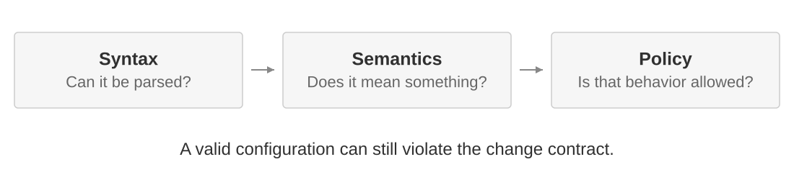

<nav class="progress" aria-label="Module progress"><span class="">INTENT</span><span class="arrow"> → </span><span class="">OBSERVE</span><span class="arrow"> → </span><span class="active">PLAN</span><span class="arrow"> → </span><span class="">CHANGE</span><span class="arrow"> → </span><span class="">VERIFY</span><span class="arrow"> → </span><span class="">RECORD</span></nav>

---

<!-- _class: visual deep-dive -->
<!-- _footer: "AI5049, Hochschule Fulda" -->

# Model it, emulate it, then check the service

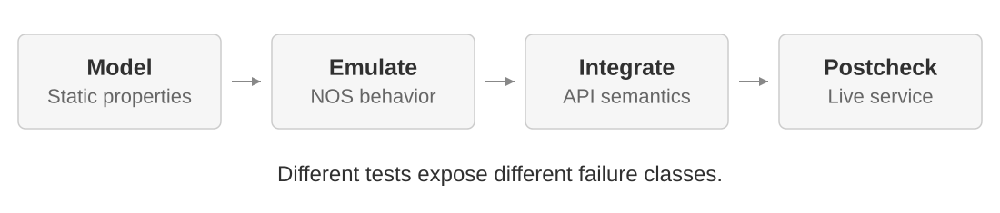

Passing a static model check cannot prove target API behavior.

<nav class="progress" aria-label="Module progress"><span class="">INTENT</span><span class="arrow"> → </span><span class="">OBSERVE</span><span class="arrow"> → </span><span class="active">PLAN</span><span class="arrow"> → </span><span class="">CHANGE</span><span class="arrow"> → </span><span class="">VERIFY</span><span class="arrow"> → </span><span class="">RECORD</span></nav>

---

<!-- _class: visual core -->
<!-- _footer: "AI5049, Hochschule Fulda" -->

# Plan the maintenance window

**Method of Procedure (MOP):** steps, checks and recovery ownership.

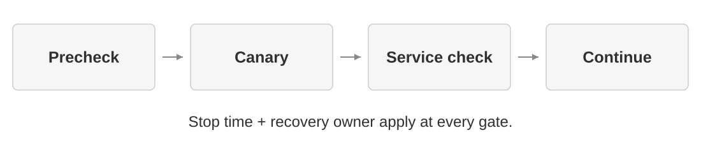

<nav class="progress" aria-label="Module progress"><span class="">INTENT</span><span class="arrow"> → </span><span class="">OBSERVE</span><span class="arrow"> → </span><span class="active">PLAN</span><span class="arrow"> → </span><span class="">CHANGE</span><span class="arrow"> → </span><span class="">VERIFY</span><span class="arrow"> → </span><span class="">RECORD</span></nav>

---

<!-- _class: content core -->
<!-- _footer: "AI5049, Hochschule Fulda" -->

# Define success before the change

| Check | This repair |
|---|---|
| Precondition | `lagoon-v4` still uses `BLOCK-CUSTOMER-V4` |
| Postcondition | Customer IPv4 export and probes recover |
| Invariant | Lagoon IPv6 and Pacific remain healthy |

Read routes locally. Test the service from outside.

<nav class="progress" aria-label="Module progress"><span class="">INTENT</span><span class="arrow"> → </span><span class="">OBSERVE</span><span class="arrow"> → </span><span class="active">PLAN</span><span class="arrow"> → </span><span class="">CHANGE</span><span class="arrow"> → </span><span class="">VERIFY</span><span class="arrow"> → </span><span class="">RECORD</span></nav>

---

<!-- _class: content core -->
<!-- _footer: "AI5049, Hochschule Fulda" -->

# Bound the rollout.

1. Re-read live preconditions.
2. Change one representative canary.
3. Verify the service before expanding.

Set a stop time. Keep the backout path reachable.

<nav class="progress" aria-label="Module progress"><span class="">INTENT</span><span class="arrow"> → </span><span class="">OBSERVE</span><span class="arrow"> → </span><span class="active">PLAN</span><span class="arrow"> → </span><span class="">CHANGE</span><span class="arrow"> → </span><span class="">VERIFY</span><span class="arrow"> → </span><span class="">RECORD</span></nav>

---

<!-- _class: content core -->
<!-- _footer: "AI5049, Hochschule Fulda" -->

# Give automation a bounded identity.

| Identity | Read | Write |
|---|---|---|
| Collector | Required state | No |
| Change service | Prechecks + verification | Approved scope |
| Reviewer | Evidence | No |

Load credentials at runtime. Record the actor, never secrets.

<nav class="progress" aria-label="Module progress"><span class="">INTENT</span><span class="arrow"> → </span><span class="">OBSERVE</span><span class="arrow"> → </span><span class="">PLAN</span><span class="arrow"> → </span><span class="active">CHANGE</span><span class="arrow"> → </span><span class="">VERIFY</span><span class="arrow"> → </span><span class="">RECORD</span></nav>

---

<!-- _class: chapter core -->
<!-- _footer: "AI5049, Hochschule Fulda" -->

# Execute and recover


**What happens when the write only partly succeeds, or we cannot tell?**

---

<!-- _class: visual core -->
<!-- _footer: "AI5049, Hochschule Fulda" -->

# A fleet changes the failure model.

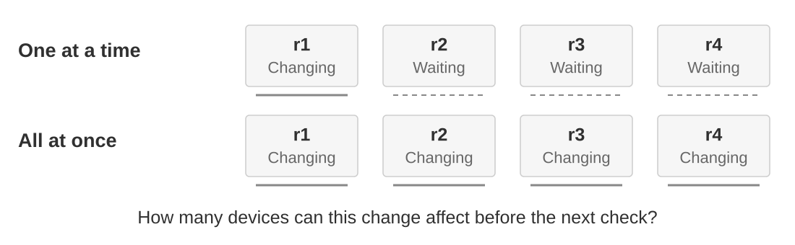

More concurrency increases throughput and blast radius.

<nav class="progress" aria-label="Module progress"><span class="">INTENT</span><span class="arrow"> → </span><span class="">OBSERVE</span><span class="arrow"> → </span><span class="">PLAN</span><span class="arrow"> → </span><span class="active">CHANGE</span><span class="arrow"> → </span><span class="">VERIFY</span><span class="arrow"> → </span><span class="">RECORD</span></nav>

---

<!-- _class: visual core -->
<!-- _footer: "AI5049, Hochschule Fulda" -->

# The write may already have happened

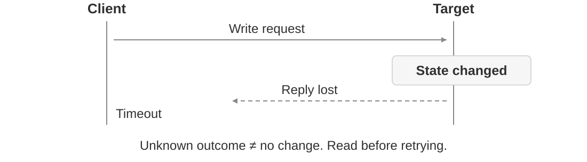

Record an unknown outcome explicitly in the audit trail.

<nav class="progress" aria-label="Module progress"><span class="">INTENT</span><span class="arrow"> → </span><span class="">OBSERVE</span><span class="arrow"> → </span><span class="">PLAN</span><span class="arrow"> → </span><span class="active">CHANGE</span><span class="arrow"> → </span><span class="">VERIFY</span><span class="arrow"> → </span><span class="">RECORD</span></nav>

---

<!-- _class: content core -->
<!-- _footer: "AI5049, Hochschule Fulda" -->

# Run it twice. What changes?

**Idempotence**, for a fixed operation F and state s:

$$F(F(s))=F(s)$$

Repeating the operation leaves the same state.
A retry still needs a fresh read and service verification.

<nav class="progress" aria-label="Module progress"><span class="">INTENT</span><span class="arrow"> → </span><span class="">OBSERVE</span><span class="arrow"> → </span><span class="">PLAN</span><span class="arrow"> → </span><span class="active">CHANGE</span><span class="arrow"> → </span><span class="">VERIFY</span><span class="arrow"> → </span><span class="">RECORD</span></nav>

---

<!-- _class: visual deep-dive -->
<!-- _footer: "AI5049, Hochschule Fulda" -->

# One router timed out after the write

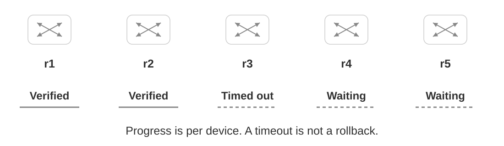

Which device needs a fresh read before any retry?

<nav class="progress" aria-label="Module progress"><span class="">INTENT</span><span class="arrow"> → </span><span class="">OBSERVE</span><span class="arrow"> → </span><span class="">PLAN</span><span class="arrow"> → </span><span class="active">CHANGE</span><span class="arrow"> → </span><span class="">VERIFY</span><span class="arrow"> → </span><span class="">RECORD</span></nav>

---

<!-- _class: visual core -->
<!-- _footer: "AI5049, Hochschule Fulda" -->

# Does the loop converge?

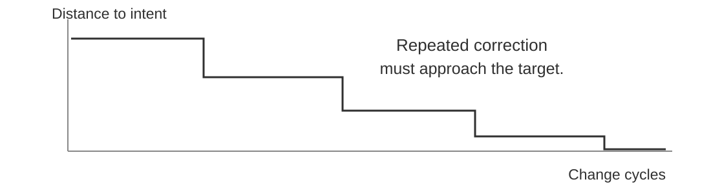

Idempotence alone does not prove convergence.

<nav class="progress" aria-label="Module progress"><span class="">INTENT</span><span class="arrow"> → </span><span class="">OBSERVE</span><span class="arrow"> → </span><span class="">PLAN</span><span class="arrow"> → </span><span class="active">CHANGE</span><span class="arrow"> → </span><span class="">VERIFY</span><span class="arrow"> → </span><span class="">RECORD</span></nav>

---

<!-- _class: joke core -->
<!-- _footer: "AI5049, Hochschule Fulda" -->

# Job success is not service success.

**Exit code:** 0

**Probe:** timeout

Read back state and test the service before declaring recovery.

<nav class="progress" aria-label="Module progress"><span class="">INTENT</span><span class="arrow"> → </span><span class="">OBSERVE</span><span class="arrow"> → </span><span class="">PLAN</span><span class="arrow"> → </span><span class="">CHANGE</span><span class="arrow"> → </span><span class="active">VERIFY</span><span class="arrow"> → </span><span class="">RECORD</span></nav>

---

<!-- _class: chapter core -->
<!-- _footer: "AI5049, Hochschule Fulda" -->

# Test the intended behavior

The device accepted the change.

That only answers:

> "Was the write accepted?"

Now test what should pass, what should fail, and what must remain unchanged.

---

<!-- _class: content core -->
<!-- _footer: "AI5049, Hochschule Fulda" -->

# Plan the repair verification

| Check | Expected |
|---|---|
| Lagoon: `198.51.100.0/24` | Export restored |
| Lagoon: `2001:db8:100::/48` | Still exported |
| Pacific IPv4 path | Still healthy |
| Both probes, both families | Service responds |

Use this matrix to design the independent postchecks.

<nav class="progress" aria-label="Module progress"><span class="">INTENT</span><span class="arrow"> → </span><span class="">OBSERVE</span><span class="arrow"> → </span><span class="">PLAN</span><span class="arrow"> → </span><span class="">CHANGE</span><span class="arrow"> → </span><span class="active">VERIFY</span><span class="arrow"> → </span><span class="">RECORD</span></nav>

---

<!-- _class: content deep-dive -->
<!-- _footer: "<span class=\"footer-context\">AI5049, Hochschule Fulda</span><span class=\"footer-refs\"><a href=\"https://www.rfc-editor.org/rfc/rfc6811.html\">ROV: RFC 6811</a></span>" -->

# Test rejected routes too.

**Route Origin Validation (ROV)** checks RPKI origin authorizations.

| Result | Meaning |
|---|---|
| Valid | Origin and prefix length permitted |
| Invalid | Covered, but not authorized |
| NotFound | No covering authorization |

Policy decides the action. Test both acceptance and rejection.
This example is outside BOB1.

<nav class="progress" aria-label="Module progress"><span class="">INTENT</span><span class="arrow"> → </span><span class="">OBSERVE</span><span class="arrow"> → </span><span class="">PLAN</span><span class="arrow"> → </span><span class="">CHANGE</span><span class="arrow"> → </span><span class="active">VERIFY</span><span class="arrow"> → </span><span class="">RECORD</span></nav>

---

<!-- _class: visual core -->
<!-- _footer: "AI5049, Hochschule Fulda" -->

# Rollback and backout

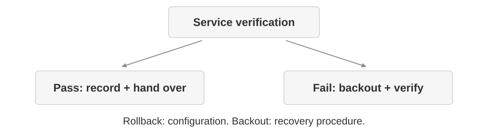

Record the backup's identity, time and version.
Assign an owner to the full recovery procedure.

<nav class="progress" aria-label="Module progress"><span class="">INTENT</span><span class="arrow"> → </span><span class="">OBSERVE</span><span class="arrow"> → </span><span class="">PLAN</span><span class="arrow"> → </span><span class="">CHANGE</span><span class="arrow"> → </span><span class="">VERIFY</span><span class="arrow"> → </span><span class="active">RECORD</span></nav>

---

<!-- _class: content core -->
<!-- _footer: "AI5049, Hochschule Fulda" -->

# Which state are we restoring?

“Restore last Tuesday” is not a precise instruction.

| Golden configuration | Backup |
|---|---|
| Approved baseline | Captured device state |

Keep identity, time, version and checksum outside the device.

<nav class="progress" aria-label="Module progress"><span class="">INTENT</span><span class="arrow"> → </span><span class="">OBSERVE</span><span class="arrow"> → </span><span class="">PLAN</span><span class="arrow"> → </span><span class="">CHANGE</span><span class="arrow"> → </span><span class="">VERIFY</span><span class="arrow"> → </span><span class="active">RECORD</span></nav>

---

<!-- _class: content core -->
<!-- _footer: "AI5049, Hochschule Fulda" -->

# Keep an audit trail.

```json
{
  "actor": "course-automation",
  "target": "edge01.bob1.reefnet.test",
  "change_id": "CHG-017",
  "deleted_override": "BLOCK-CUSTOMER-V4",
  "inherited_policy": "EXPORT-BGP",
  "lagoon_ipv4_probe_passed": true
}
```

Keep timestamps and before/after evidence. Exclude credentials.

<nav class="progress" aria-label="Module progress"><span class="">INTENT</span><span class="arrow"> → </span><span class="">OBSERVE</span><span class="arrow"> → </span><span class="">PLAN</span><span class="arrow"> → </span><span class="">CHANGE</span><span class="arrow"> → </span><span class="">VERIFY</span><span class="arrow"> → </span><span class="active">RECORD</span></nav>

---

<!-- _class: content core -->
<!-- _footer: "AI5049, Hochschule Fulda" -->

# Who operates the automation?

- A named owner and bounded runtime
- One writer per target with explicit retry rules
- Fresh inputs and verified outcomes
- Tested recovery and a retained audit trail

The next shift must be able to run it.

<nav class="progress" aria-label="Module progress"><span class="">INTENT</span><span class="arrow"> → </span><span class="">OBSERVE</span><span class="arrow"> → </span><span class="">PLAN</span><span class="arrow"> → </span><span class="">CHANGE</span><span class="arrow"> → </span><span class="">VERIFY</span><span class="arrow"> → </span><span class="active">RECORD</span></nav>

---

<!-- _class: visual core -->
<!-- _footer: "AI5049, Hochschule Fulda" -->

# Promote the tested artifact

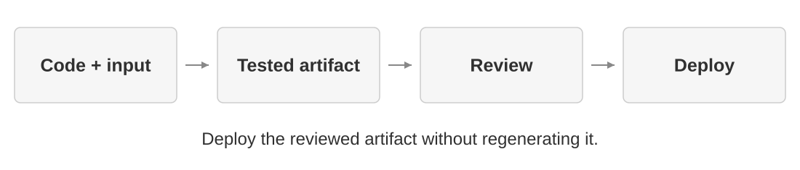

Approval applies to a specific code revision and input snapshot.

<nav class="progress" aria-label="Module progress"><span class="">INTENT</span><span class="arrow"> → </span><span class="">OBSERVE</span><span class="arrow"> → </span><span class="">PLAN</span><span class="arrow"> → </span><span class="">CHANGE</span><span class="arrow"> → </span><span class="">VERIFY</span><span class="arrow"> → </span><span class="active">RECORD</span></nav>

---

<!-- _class: visual core -->
<!-- _footer: "<span class=\"footer-context\">AI5049, Hochschule Fulda</span><span class=\"footer-refs\"><a href=\"https://opengitops.dev/\">OpenGitOps principles</a></span>" -->

# GitOps gives us a reviewed desired state

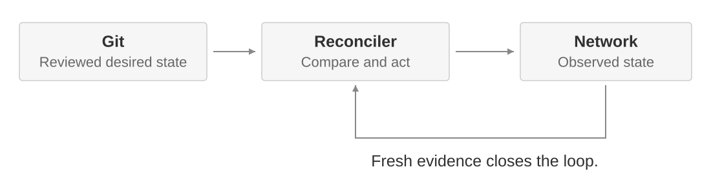

<nav class="progress" aria-label="Module progress"><span class="">INTENT</span><span class="arrow"> → </span><span class="">OBSERVE</span><span class="arrow"> → </span><span class="">PLAN</span><span class="arrow"> → </span><span class="">CHANGE</span><span class="arrow"> → </span><span class="">VERIFY</span><span class="arrow"> → </span><span class="active">RECORD</span></nav>

---

<!-- _class: chapter core -->
<!-- _footer: "AI5049, Hochschule Fulda" -->

# Choose the automation mechanism.

| Layer | Examples |
|---|---|
| CLI automation | Netmiko |
| Data models | YANG, OpenConfig |
| Model-driven protocols | NETCONF, gNMI |

The same preconditions, service checks and recovery contract still apply.

---

<!-- _class: content core -->
<!-- _footer: "<span class=\"footer-context\">AI5049, Hochschule Fulda</span><span class=\"footer-refs\"><a href=\"https://github.com/ktbyers/netmiko\">Netmiko documentation</a></span>" -->

# Netmiko: automate the CLI you already know

Illustrative SSH read on SR Linux:

```python
from netmiko import ConnectHandler

with ConnectHandler(**device) as conn:
    output = conn.send_command("show interface")
```

Netmiko handles the session. You interpret the result.

<nav class="progress" aria-label="Module progress"><span class="">INTENT</span><span class="arrow"> → </span><span class="">OBSERVE</span><span class="arrow"> → </span><span class="">PLAN</span><span class="arrow"> → </span><span class="active">CHANGE</span><span class="arrow"> → </span><span class="">VERIFY</span><span class="arrow"> → </span><span class="">RECORD</span></nav>

---

<!-- _class: content core -->
<!-- _footer: "AI5049, Hochschule Fulda" -->

# A prompt is not a postcheck.

Illustrative CLI error:

```text
router(config)# interface does-not-exist
% Invalid interface
router#
```

The session survived. The command did not.
Read back state and check the service.

<nav class="progress" aria-label="Module progress"><span class="">INTENT</span><span class="arrow"> → </span><span class="">OBSERVE</span><span class="arrow"> → </span><span class="">PLAN</span><span class="arrow"> → </span><span class="active">CHANGE</span><span class="arrow"> → </span><span class="">VERIFY</span><span class="arrow"> → </span><span class="">RECORD</span></nav>

---

<!-- _class: visual core -->
<!-- _footer: "<span class=\"footer-context\">AI5049, Hochschule Fulda</span><span class=\"footer-refs\"><a href=\"https://www.rfc-editor.org/rfc/rfc7950.html\">YANG: RFC 7950</a></span>" -->

# YANG describes management data.

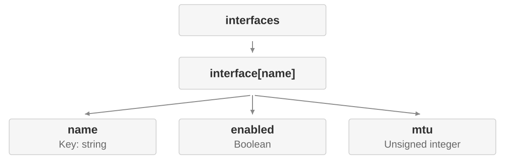

The model constrains data. The change contract constrains behavior.

<nav class="progress" aria-label="Module progress"><span class="">INTENT</span><span class="arrow"> → </span><span class="">OBSERVE</span><span class="arrow"> → </span><span class="">PLAN</span><span class="arrow"> → </span><span class="active">CHANGE</span><span class="arrow"> → </span><span class="">VERIFY</span><span class="arrow"> → </span><span class="">RECORD</span></nav>

---

<!-- _class: content deep-dive -->
<!-- _footer: "AI5049, Hochschule Fulda" -->

# YANG keys and constraints

```yang
list interface {
  key "name";
  leaf name { type string; }
  leaf enabled { type boolean; default true; }
  leaf mtu { type uint16 { range "1280..9216"; } }
}
```

A module contains this fragment. The MTU range is illustrative.

A list key must name an existing child leaf.

<nav class="progress" aria-label="Module progress"><span class="">INTENT</span><span class="arrow"> → </span><span class="">OBSERVE</span><span class="arrow"> → </span><span class="">PLAN</span><span class="arrow"> → </span><span class="active">CHANGE</span><span class="arrow"> → </span><span class="">VERIFY</span><span class="arrow"> → </span><span class="">RECORD</span></nav>

---

<!-- _class: content core -->
<!-- _footer: "<span class=\"footer-context\">AI5049, Hochschule Fulda</span><span class=\"footer-refs\"><a href=\"https://www.rfc-editor.org/rfc/rfc8342.html\">Datastores: RFC 8342</a></span>" -->

# Enabled, but no carrier

| View | Interface fact |
|---|---|
| Configuration | Interface is enabled |
| Observed state | Carrier is down |

Configuration and observed state answer different questions.

Check the physical link and the peer before changing the configuration.

<nav class="progress" aria-label="Module progress"><span class="">INTENT</span><span class="arrow"> → </span><span class="">OBSERVE</span><span class="arrow"> → </span><span class="">PLAN</span><span class="arrow"> → </span><span class="active">CHANGE</span><span class="arrow"> → </span><span class="">VERIFY</span><span class="arrow"> → </span><span class="">RECORD</span></nav>

---

<!-- _class: content core -->
<!-- _footer: "<span class=\"footer-context\">AI5049, Hochschule Fulda</span><span class=\"footer-refs\"><a href=\"https://openconfig.net/projects/models/\">OpenConfig models</a></span>" -->

# OpenConfig

Vendor-neutral YANG models for interfaces, routing and telemetry.

A common model does not guarantee identical device support.
**Check supported paths and operations.**

<nav class="progress" aria-label="Module progress"><span class="">INTENT</span><span class="arrow"> → </span><span class="">OBSERVE</span><span class="arrow"> → </span><span class="">PLAN</span><span class="arrow"> → </span><span class="active">CHANGE</span><span class="arrow"> → </span><span class="">VERIFY</span><span class="arrow"> → </span><span class="">RECORD</span></nav>

---

<!-- _class: content core -->
<!-- _footer: "<span class=\"footer-context\">AI5049, Hochschule Fulda</span><span class=\"footer-refs\"><a href=\"https://www.rfc-editor.org/rfc/rfc6241.html\">NETCONF: RFC 6241</a></span>" -->

# NETCONF edits a datastore.

With a supported candidate datastore:

1. Lock, edit and validate.
2. Commit.
3. Verify the service independently.
4. Unlock and record.

Check the advertised capabilities.

<nav class="progress" aria-label="Module progress"><span class="">INTENT</span><span class="arrow"> → </span><span class="">OBSERVE</span><span class="arrow"> → </span><span class="">PLAN</span><span class="arrow"> → </span><span class="active">CHANGE</span><span class="arrow"> → </span><span class="">VERIFY</span><span class="arrow"> → </span><span class="">RECORD</span></nav>

---

<!-- _class: content deep-dive -->
<!-- _footer: "AI5049, Hochschule Fulda" -->

# Read the NETCONF error.

```xml
<rpc-error>
  <error-type>application</error-type>
  <error-tag>invalid-value</error-tag>
  <error-severity>error</error-severity>
</rpc-error>
```

Inspect the tag, path, message and datastore state after failure.
Then decide whether a retry is safe.

<nav class="progress" aria-label="Module progress"><span class="">INTENT</span><span class="arrow"> → </span><span class="">OBSERVE</span><span class="arrow"> → </span><span class="">PLAN</span><span class="arrow"> → </span><span class="active">CHANGE</span><span class="arrow"> → </span><span class="">VERIFY</span><span class="arrow"> → </span><span class="">RECORD</span></nav>

---

<!-- _class: visual deep-dive -->
<!-- _footer: "<span class=\"footer-context\">AI5049, Hochschule Fulda</span><span class=\"footer-refs\"><a href=\"https://www.rfc-editor.org/rfc/rfc6241.html#section-8.4\">Confirmed commit: RFC 6241</a></span>" -->

# Confirmed commit

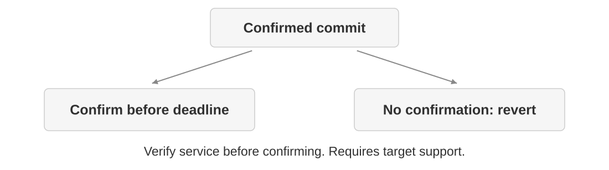

Who confirms if automation loses contact? Test the revert path.

<nav class="progress" aria-label="Module progress"><span class="">INTENT</span><span class="arrow"> → </span><span class="">OBSERVE</span><span class="arrow"> → </span><span class="">PLAN</span><span class="arrow"> → </span><span class="active">CHANGE</span><span class="arrow"> → </span><span class="">VERIFY</span><span class="arrow"> → </span><span class="">RECORD</span></nav>

---

<!-- _class: visual core -->
<!-- _footer: "<span class=\"footer-context\">AI5049, Hochschule Fulda</span><span class=\"footer-refs\"><a href=\"https://github.com/openconfig/reference/blob/master/rpc/gnmi/gnmi-specification.md\">gNMI specification</a></span>" -->

# gNMI defines four RPCs.

**RPC = remote procedure call**

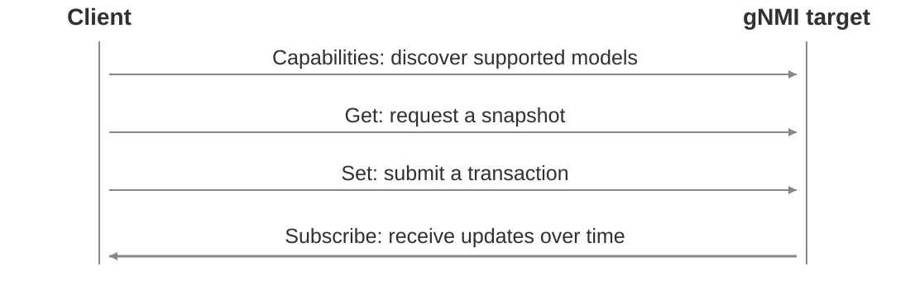

<nav class="progress" aria-label="Module progress"><span class="">INTENT</span><span class="arrow"> → </span><span class="">OBSERVE</span><span class="arrow"> → </span><span class="">PLAN</span><span class="arrow"> → </span><span class="active">CHANGE</span><span class="arrow"> → </span><span class="">VERIFY</span><span class="arrow"> → </span><span class="">RECORD</span></nav>

---

<!-- _class: content core -->
<!-- _footer: "AI5049, Hochschule Fulda" -->

# Read a gNMI path

```text
/interface[name=ethernet-1/1]/statistics
```

- `name=ethernet-1/1` selects one interface.
- `statistics` selects its subtree.
- The **target** identifies the router.

<nav class="progress" aria-label="Module progress"><span class="">INTENT</span><span class="arrow"> → </span><span class="">OBSERVE</span><span class="arrow"> → </span><span class="">PLAN</span><span class="arrow"> → </span><span class="active">CHANGE</span><span class="arrow"> → </span><span class="">VERIFY</span><span class="arrow"> → </span><span class="">RECORD</span></nav>

---

<!-- _class: task core -->
<!-- _footer: "AI5049, Hochschule Fulda" -->

# Review a change plan

Eight minutes in groups of 3–4.

| Aspect | Proposed plan |
|---|---|
| Input | Yesterday’s inventory |
| Validation | Syntax only |
| Rollout | All routers at once |
| Success | Exit code 0 |
| Recovery | Rerun the change |

Agree on **two improvements** and their acceptance checks.

<nav class="progress" aria-label="Module progress"><span class="">INTENT</span><span class="arrow"> → </span><span class="">OBSERVE</span><span class="arrow"> → </span><span class="">PLAN</span><span class="arrow"> → </span><span class="">CHANGE</span><span class="arrow"> → </span><span class="">VERIFY</span><span class="arrow"> → </span><span class="active">RECORD</span></nav>

---

<!-- _class: content core -->
<!-- _footer: "<span class=\"footer-context\">AI5049, Hochschule Fulda</span><span class=\"footer-refs\"><a href=\"https://github.com/openconfig/reference/blob/master/rpc/gnmi/gnmi-specification.md#34-set\">gNMI Set specification</a></span>" -->

# gNMI Set

One request, one target, one transaction.

| Result | Target behavior |
|---|---|
| Success | Apply all requested changes |
| Failure | Restore the pre-request state |
| Timeout | Outcome unknown to the client |

Read back after a timeout. Verify the service after a change.

<nav class="progress" aria-label="Module progress"><span class="">INTENT</span><span class="arrow"> → </span><span class="">OBSERVE</span><span class="arrow"> → </span><span class="">PLAN</span><span class="arrow"> → </span><span class="active">CHANGE</span><span class="arrow"> → </span><span class="">VERIFY</span><span class="arrow"> → </span><span class="">RECORD</span></nav>

---

<!-- _class: content task -->
<!-- _footer: "<span class=\"footer-context\">AI5049, Hochschule Fulda</span><span class=\"footer-refs\"><a href=\"https://gnmic.openconfig.net/\">gNMIc documentation</a></span>" -->

# Repair it through gNMI

Find ReefNet Edge 01 in NetBox. Read its configuration and justify a change.

In WSL:
```bash
make automation
make task
```

**60 minutes:** repair through gNMI and verify the service from both probes.
Use `make hint` for investigation commands.

[Exercises](https://github.com/Stinktopf/network-management-and-monitoring/blob/main/EXERCISES.md) / [CheatSheet](https://github.com/Stinktopf/network-management-and-monitoring/blob/main/slides/exports/cheatsheet.pdf)


---

<!-- _class: content core -->
<!-- _footer: "<span class=\"footer-context\">AI5049, Hochschule Fulda</span><span class=\"footer-refs\"><a href=\"https://gnmic.openconfig.net/cmd/set/\">gNMIc Set documentation</a></span>" -->

# Did the API repair the service?

<div class="terminal">
<div class="terminal-entry"><strong>WSL</strong><code>make enter NODE=operations01.bob1.reefnet.test</code></div>
<div class="terminal-label">Inside operations01, after verifying the policy</div>
<pre><code>BGP_PATH=&#x27;/network-instance[name=default]/protocols/bgp&#x27;
POLICY_PATH=&quot;$BGP_PATH/group[group-name=lagoon-v4]/export-policy&quot;
gnmic -a edge01.bob1.reefnet.test:57400 \
  -u admin -p &#x27;NokiaSrl1!&#x27; --skip-verify --encoding json_ietf \
  set --delete &quot;$POLICY_PATH&quot;</code></pre>
</div>

Read back the group. Check Lagoon’s route and HTTP from both probes.


---

<!-- _class: task core -->
<!-- _footer: "AI5049, Hochschule Fulda" -->

# Automation: close the loop.

A write times out. **What state is the network in?**

Two minutes:
- Name the next read.
- Name the independent service check.
- Name the evidence for the next operator.

Note the original policy, your change and the verification results.
Restart the exercise later with `make automation`.

<nav class="progress" aria-label="Module progress"><span class="">INTENT</span><span class="arrow"> → </span><span class="">OBSERVE</span><span class="arrow"> → </span><span class="">PLAN</span><span class="arrow"> → </span><span class="">CHANGE</span><span class="arrow"> → </span><span class="">VERIFY</span><span class="arrow"> → </span><span class="active">RECORD</span></nav>

---

<!-- _class: chapter deep-dive -->
<!-- _footer: "AI5049, Hochschule Fulda" -->

# Who Broke the Internet?


**Everything is redundant until the shared dependency breaks.**

Which safeguard would have changed the outcome?


---

<!-- _class: content deep-dive -->
<!-- _footer: "AI5049, Hochschule Fulda" -->

# The rules of the show

For each case:

1. who lost what, and for how long
2. the failure boundary
3. evidence that distinguishes the cause
4. the recovery dependency
5. one safeguard worth testing

We are studying mechanisms, not awarding blame.

---

<!-- _class: content deep-dive -->
<!-- _footer: "<span class=\"footer-context\">AI5049, Hochschule Fulda</span><span class=\"footer-refs\"><a href=\"https://engineering.fb.com/2021/10/05/networking-traffic/outage-details/\">Meta outage report (2021)</a> <a href=\"https://blog.cloudflare.com/october-2021-facebook-outage/\">Observed impact</a></span>" -->

# Facebook: the backbone took DNS with it

**4 October 2021**

1. An audit-tool bug allowed a maintenance command to disconnect the backbone.
2. DNS sites lost data-center reachability and withdrew BGP routes.
3. Running DNS servers became unreachable.

**Facebook, Instagram and WhatsApp went offline.**

---

<!-- _class: visual deep-dive -->
<!-- _footer: "<span class=\"footer-context\">AI5049, Hochschule Fulda</span><span class=\"footer-refs\"><a href=\"https://engineering.fb.com/2021/10/05/networking-traffic/outage-details/\">Meta report</a><a href=\"https://www.rfc-editor.org/rfc/rfc1958.html#section-3.11\">RFC 1958 §3.11</a></span>" -->

# Facebook: recovery lost its own tools

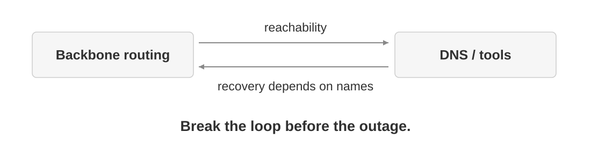

Normal and out-of-band access failed. Engineers had to go onsite.

They restored the backbone, then brought services back under controlled load.


---

<!-- _class: content deep-dive -->
<!-- _footer: "AI5049, Hochschule Fulda" -->

# Can you still reach the router?

| Management path | Uses |
|---|---|
| In-band | Production network |
| Out-of-band | Separate device or console access |

Check shared dependencies: **power, fiber, DNS and authentication**.

---

<!-- _class: content deep-dive -->
<!-- _footer: "<span class=\"footer-context\">AI5049, Hochschule Fulda</span><span class=\"footer-refs\"><a href=\"https://ftp.opengear.com/download/documentation/manual/previous%20versions/om_user_guide_24.11/Content/Configure_Serial_Ports.htm\">Opengear: serial ports</a></span>" -->

# A console port is not a management port

| Port | Needs |
|---|---|
| Ethernet management | IP connectivity and management service |
| Serial console | Cable, serial settings and responsive console |

A **console server** provides remote serial access.
Serial bypasses IP forwarding, but still needs power.

---

<!-- _class: visual deep-dive -->
<!-- _footer: "AI5049, Hochschule Fulda" -->

# Production recovery example: a console path

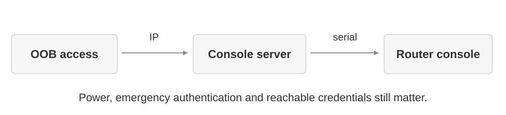

This production recovery path is not emulated by BOB1.

Test login and repair while the production path is unavailable.

---

<!-- _class: visual deep-dive -->
<!-- _footer: "AI5049, Hochschule Fulda" -->

# Task: the console is reachable, login fails

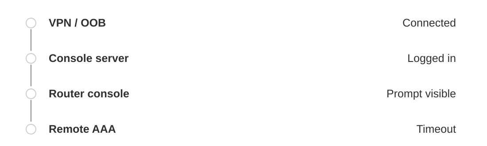

Exercise: AAA uses the failed backbone. Which fallback must exist?

---

<!-- _class: content deep-dive -->
<!-- _footer: "AI5049, Hochschule Fulda" -->

# Recovery only works if it was prepared

| Dependency | Prepare |
|---|---|
| Transit | Circuit and provider contact |
| Console | Server, port and serial settings |
| Login | Tested emergency credentials |
| DNS / secrets | Reachable during the outage |
| Power | Backup along the recovery path |

Test that the emergency account can make the repair.

---

<!-- _class: content deep-dive -->
<!-- _footer: "<span class=\"footer-context\">AI5049, Hochschule Fulda</span><span class=\"footer-refs\"><a href=\"https://docs.equinix.com/smart-hands/\">Equinix Smart Hands</a></span>" -->

# Remote hands need an exact job

If remote recovery is blocked, onsite staff become your eyes and hands.

```text
Location:   Frankfurt, rack R12
Equipment:  edge-a, port 2
Task:       verify label and photograph LEDs
Scope:      inspect only, no disconnect
Return:     timestamp, photos, label mismatch
```

For vendor escalation, add version, symptoms and logs.


---

<!-- _class: content deep-dive -->
<!-- _footer: "<span class=\"footer-context\">AI5049, Hochschule Fulda</span><span class=\"footer-refs\"><a href=\"https://status.cloud.google.com/incidents/J5ia5t9p3g9Q5Wi7r8Ev\">Google Cloud report (Sep 2026)</a></span>" -->

# Google Cloud: incompatible optics

**1 September 2026, us-central1**

New router optics were incompatible with the fabric side.
The work crossed redundant routers before connectivity was checked.

**Affected VMs lost connectivity** in parts of us-central1-b and us-central1-f.

---

<!-- _class: visual deep-dive -->
<!-- _footer: "<span class=\"footer-context\">AI5049, Hochschule Fulda</span><span class=\"footer-refs\"><a href=\"https://status.cloud.google.com/incidents/J5ia5t9p3g9Q5Wi7r8Ev\">Google Cloud report (Sep 2026)</a></span>" -->

# Google Cloud: one worklist defeated redundancy

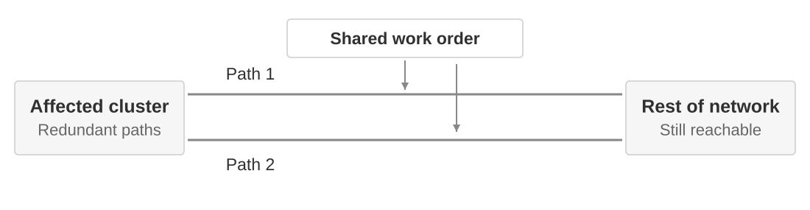

1 September 2026: all affected paths were unplugged within **13 minutes**.
The worklist omitted router-by-router sequencing and verification.

Recovery: divert traffic, reinstall the original optics, verify links.


---

<!-- _class: content deep-dive -->
<!-- _footer: "<span class=\"footer-context\">AI5049, Hochschule Fulda</span><span class=\"footer-refs\"><a href=\"https://corporate.ovhcloud.com/en/newsroom/news/informations-site-strasbourg/\">OVHcloud: Strasbourg (2021)</a></span>" -->

# OVHcloud: undamaged did not mean available

Strasbourg, 10 March 2021. Fire began in SBG2 at 00:47 CET.

- SBG2 was destroyed. SBG1 lost four of its twelve rooms.
- SBG3 and SBG4 were undamaged, but powered down.
- Recovery involved site repairs, replacement servers and available backups.

Replacement capacity does not recreate lost data.


---

<!-- _class: content deep-dive -->
<!-- _footer: "<span class=\"footer-context\">AI5049, Hochschule Fulda</span><span class=\"footer-refs\"><a href=\"https://www.datacenterdynamics.com/en/news/ovh-fire-destroys-rust-game-data-takes-other-sites-offline/\">Rust: reported impact</a> <a href=\"https://lichess.org/forum/lichess-feedback/fire-in-a-lichess-datacenter\">Lichess: recovery report</a></span>" -->

# Same fire. Different recovery.

OVHcloud Strasbourg, 10 March 2021.

| Service | What users lost | Recovery |
|---|---|---|
| **Rust / Facepunch** | Game data on 25 affected EU servers | Data unrecoverable |
| **Lichess** | 24 hours of puzzle history | Backup from another data center |

A replacement server does not bring back player progress.


---

<!-- _class: visual deep-dive -->
<!-- _footer: "AI5049, Hochschule Fulda" -->

# Two copies, one failure domain

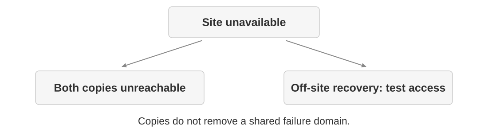

Exercise: assume both copies are inside the unavailable site.
Which recovery plan still works?


---

<!-- _class: visual deep-dive -->
<!-- _footer: "<span class=\"footer-context\">AI5049, Hochschule Fulda</span><span class=\"footer-refs\"><a href=\"https://labs.ripe.net/author/emileaben/a-deep-dive-into-the-baltic-sea-cable-cuts/\">RIPE Labs: Baltic Sea (2024)</a></span>" -->

# Baltic Sea: paths after the cuts

RIPE Atlas, November 2024: Germany–Finland paths.

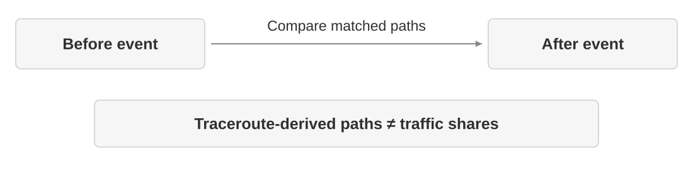

A different physical boundary: the cable route. Compare matched observers.
This diagram shows the method, not traffic shares.


---

<!-- _class: visual deep-dive -->
<!-- _footer: "<span class=\"footer-context\">AI5049, Hochschule Fulda</span><span class=\"footer-refs\"><a href=\"https://labs.ripe.net/author/emileaben/a-deep-dive-into-the-baltic-sea-cable-cuts/\">RIPE Labs: Baltic Sea (2024)</a></span>" -->

# The IP path can look unchanged

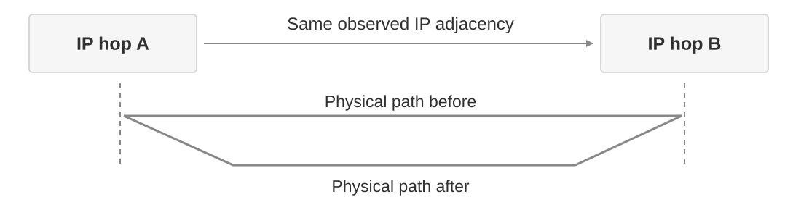

Traceroute alone cannot identify a damaged cable.


---

<!-- _class: content deep-dive -->
<!-- _footer: "<span class=\"footer-context\">AI5049, Hochschule Fulda</span><span class=\"footer-refs\"><a href=\"https://www.kentik.com/blog/what-caused-the-red-sea-submarine-cable-cuts/\">Kentik: Red Sea (2024)</a></span>" -->

# Red Sea: damage is not attribution

24 February 2024: three cable systems were damaged.

Kentik's analysis supports an anchor-dragging explanation involving the *Rubymar*.

Keep the claims separate:

- network reachability and delay: observable
- physical cause: external evidence
- deliberate attack on cables: not established by the network data


---

<!-- _class: visual deep-dive -->
<!-- _footer: "<span class=\"footer-context\">AI5049, Hochschule Fulda</span><span class=\"footer-refs\"><a href=\"https://www.kentik.com/blog/subsea-cables-parted-in-red-sea-again/\">Kentik: Red Sea (2025)</a></span>" -->

# Red Sea: the cloud takes a detour.

September 2025: connectivity can continue while paths get slower.

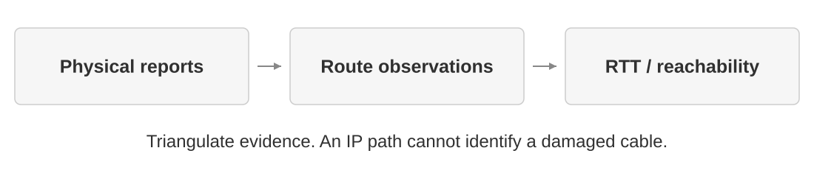

Which measurement separates **slower** from **unreachable**?


---

<!-- _class: visual deep-dive -->
<!-- _footer: "<span class=\"footer-context\">AI5049, Hochschule Fulda</span><span class=\"footer-refs\"><a href=\"https://status.cloud.google.com/incidents/ow5i3PPK96RduMcb1SsW\">Google Cloud report (Jun 2025)</a></span>" -->

# Google Cloud: a dormant bug goes global

12 June 2025. One policy update crosses regional boundaries.

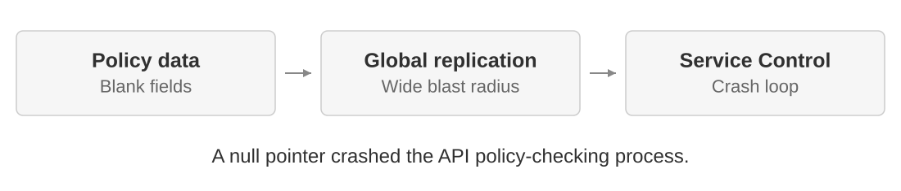

Service Control checks API policy. Blank fields triggered HTTP 503 errors.
**Impact:** API errors affected Cloud Storage, IAM and other products.


---

<!-- _class: content deep-dive -->
<!-- _footer: "<span class=\"footer-context\">AI5049, Hochschule Fulda</span><span class=\"footer-refs\"><a href=\"https://status.cloud.google.com/incidents/ow5i3PPK96RduMcb1SsW\">Google Cloud report (Jun 2025)</a></span>" -->

# Google Cloud: recovery overloaded Spanner

12 June 2025. Disabling the faulty check stopped the crash loop.

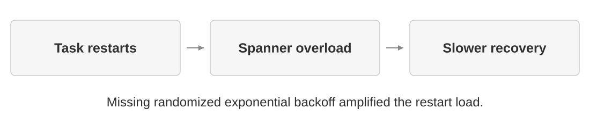

In us-central1, Google throttled restarts and redirected database traffic.
Some customer monitoring failed too. The first status update took about an hour.


---

<!-- _class: visual deep-dive -->
<!-- _footer: "<span class=\"footer-context\">AI5049, Hochschule Fulda</span><span class=\"footer-refs\"><a href=\"https://blog.cloudflare.com/cloudflare-outage-on-june-21-2022/\">Cloudflare postmortem (2022)</a></span>" -->

# Cloudflare: policy order withdrew routes

21 June 2022. Simplified BGP export-policy order:

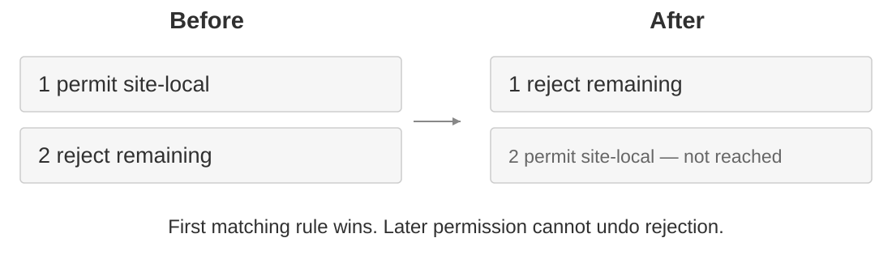

Site-local routes disappeared. Servers lost origin access.
Internal load balancing also failed.


---

<!-- _class: content deep-dive -->
<!-- _footer: "<span class=\"footer-context\">AI5049, Hochschule Fulda</span><span class=\"footer-refs\"><a href=\"https://blog.cloudflare.com/cloudflare-outage-on-june-21-2022/\">Cloudflare postmortem (2022)</a></span>" -->

# The canary never exercised the new architecture

Cloudflare, 21 June 2022. Times in UTC.

- Early rollout stages used the older architecture.
- **06:27:** rollout reached 19 Multi-Colo PoP (MCP) sites.
- These sites handled about half of all requests.
- Backup access enabled rollback. The last revert finished at **07:42**.

Canary the architecture that runs the changed policy.


---

<!-- _class: visual deep-dive -->
<!-- _footer: "<span class=\"footer-context\">AI5049, Hochschule Fulda</span><span class=\"footer-refs\"><a href=\"https://blog.cloudflare.com/18-november-2025-outage/\">Cloudflare postmortem (2025)</a></span>" -->

# Cloudflare: metadata became a bad feature file

18 November 2025. A permissions change exposed more column metadata.

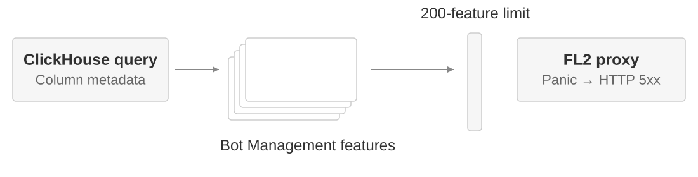

Without a database filter, duplicate metadata pushed the file past **200 features**.
Older proxies returned zero bot scores. Blocking depended on customer rules.


---

<!-- _class: content deep-dive -->
<!-- _footer: "<span class=\"footer-context\">AI5049, Hochschule Fulda</span><span class=\"footer-refs\"><a href=\"https://blog.cloudflare.com/18-november-2025-outage/\">Cloudflare postmortem (2025)</a></span>" -->

# Cloudflare: stop distributing the bad file

**18 November 2025, UTC**

| Time | Recovery |
|---|---|
| 14:24 | Stop file generation and distribution |
| 14:30 | Restore most traffic with a known-good file |
| 17:06 | Recover remaining services |

Websites returned 5xx. Turnstile blocked logins.
Recovery also required restarting the core proxy.

---

<!-- _class: content deep-dive -->
<!-- _footer: "<span class=\"footer-context\">AI5049, Hochschule Fulda</span><span class=\"footer-refs\"><a href=\"https://www.fastly.com/blog/summary-of-june-8-outage\">Fastly postmortem (2021)</a> <a href=\"https://www.kentik.com/analysis/fastly-outage-knocks-major-websites-offline/\">Observed impact</a></span>" -->

# Fastly: valid input, latent bug

8 June 2021.

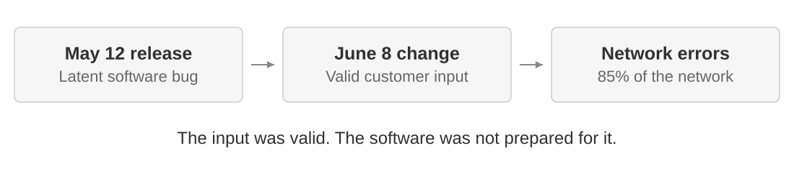

**Impact:** CNN, The New York Times and Reddit became unavailable.
Fastly disabled the triggering configuration. The software fix followed later.


---

<!-- _class: visual deep-dive -->
<!-- _footer: "<span class=\"footer-context\">AI5049, Hochschule Fulda</span><span class=\"footer-refs\"><a href=\"https://www.fastly.com/blog/summary-of-june-8-outage\">Fastly postmortem (2021)</a></span>" -->

# Fastly: detection is not recovery

8 June 2021. Times in UTC.

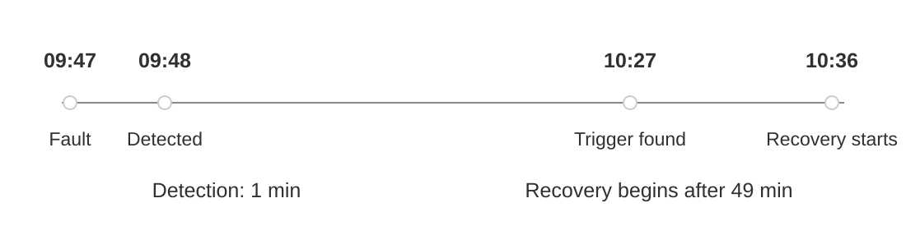

**12:35:** incident mitigated. **17:25:** permanent bug-fix rollout began.
Detection, mitigation and permanent repair are different clocks.


---

<!-- _class: content deep-dive -->
<!-- _footer: "AI5049, Hochschule Fulda" -->

# Name the dependency.

| Symptom | Hypothesis |
|---|---|
| Remote repair fails | Recovery shares the failed path |
| Redundant routers fail together | Shared procedure or site |
| All regions fail after an update | Global distribution |
| Green dashboard during impact | Missing or stale evidence |

---

<!-- _class: content deep-dive -->
<!-- _footer: "AI5049, Hochschule Fulda" -->

# Your turn: redesign one boundary.

Pick one case. Draw its service path and recovery path.

Mark the shared dependency. Remove one dependency from recovery.
Propose a test that proves the revised path survives.

**A second box is not a second failure domain.**

---

<!-- _class: statement deep-dive -->
<!-- _footer: "AI5049, Hochschule Fulda" -->

# From postmortem to early warning

Choose one failure pattern from today.

Which signal would have warned you?
How would you verify recovery?

**14 October: monitoring and observability.**

---

<!-- _class: day core -->
<!-- _footer: "AI5049, Hochschule Fulda" -->

# 14 October 2026

## Monitoring / Observability

In Operations, the customer had to tell us something was wrong.

**How could the network have told us first?**

---

<!-- _class: content core -->
<!-- _footer: "AI5049, Hochschule Fulda" -->

# What do we want to know?

| Service | Network | Device |
|---|---|---|
| Availability | Reachability | Health |
| Latency | Loss | Capacity |
| Correct response | Routing state | Resource pressure |

Choose the question before the tool.

<nav class="progress" aria-label="Module progress"><span class="active">QUESTION</span><span class="arrow"> → </span><span class="">SIGNAL</span><span class="arrow"> → </span><span class="">COLLECT</span><span class="arrow"> → </span><span class="">INTERPRET</span><span class="arrow"> → </span><span class="">ALERT</span><span class="arrow"> → </span><span class="">RESPOND</span></nav>

---

<!-- _class: content core -->
<!-- _footer: "AI5049, Hochschule Fulda" -->

# An observation needs an expectation.

**Monitoring:** does behavior match the expectation?

**Observability:** can we explain the state from our observations?

Question → evidence → interpretation → action

<nav class="progress" aria-label="Module progress"><span class="active">QUESTION</span><span class="arrow"> → </span><span class="">SIGNAL</span><span class="arrow"> → </span><span class="">COLLECT</span><span class="arrow"> → </span><span class="">INTERPRET</span><span class="arrow"> → </span><span class="">ALERT</span><span class="arrow"> → </span><span class="">RESPOND</span></nav>

---

<!-- _class: content core -->
<!-- _footer: "AI5049, Hochschule Fulda" -->

# Different signals answer different questions

| Signal | Question |
|---|---|
| Metric | How much or how fast? |
| Event / log | What changed? |
| Flow record | Which traffic? |
| Packet capture | What was on the wire? |
| Active probe | Does this exchange work? |

SNMP and gNMI deliver data. They are not signal types.

<nav class="progress" aria-label="Module progress"><span class="active">QUESTION</span><span class="arrow"> → </span><span class="">SIGNAL</span><span class="arrow"> → </span><span class="">COLLECT</span><span class="arrow"> → </span><span class="">INTERPRET</span><span class="arrow"> → </span><span class="">ALERT</span><span class="arrow"> → </span><span class="">RESPOND</span></nav>

---

<!-- _class: visual core -->
<!-- _footer: "AI5049, Hochschule Fulda" -->

# Delay and loss need endpoints

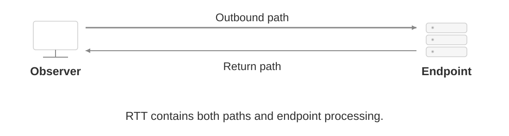

One-way delay additionally needs synchronized clocks or bounded clock error.

<nav class="progress" aria-label="Module progress"><span class="active">QUESTION</span><span class="arrow"> → </span><span class="">SIGNAL</span><span class="arrow"> → </span><span class="">COLLECT</span><span class="arrow"> → </span><span class="">INTERPRET</span><span class="arrow"> → </span><span class="">ALERT</span><span class="arrow"> → </span><span class="">RESPOND</span></nav>

---

<!-- _class: content core -->
<!-- _footer: "AI5049, Hochschule Fulda" -->

# Choose the probe from the question

| Probe | Tells us |
|---|---|
| ICMP echo | IP reachability to a responding endpoint |
| TCP connect | transport handshake |
| HTTP request | application transaction |
| traceroute | responding hops along a path |

A successful ping does not prove the web service works.

<nav class="progress" aria-label="Module progress"><span class="active">QUESTION</span><span class="arrow"> → </span><span class="">SIGNAL</span><span class="arrow"> → </span><span class="">COLLECT</span><span class="arrow"> → </span><span class="">INTERPRET</span><span class="arrow"> → </span><span class="">ALERT</span><span class="arrow"> → </span><span class="">RESPOND</span></nav>

---

<!-- _class: content core -->
<!-- _footer: "AI5049, Hochschule Fulda" -->

# Define the probe before you run it

One BOB1 probe is:

```text
source:          probe01.bob1.lagoontransit.test
target:          198.51.100.10
address family:  IPv4
protocol:        ICMP echo
reply wait:      1 s
success:         ping exits successfully
```

The lab exporter also runs DNS probes and repeats the checks continuously.

Two checks called "reachability" can still measure different things.

<nav class="progress" aria-label="Module progress"><span class="active">QUESTION</span><span class="arrow"> → </span><span class="">SIGNAL</span><span class="arrow"> → </span><span class="">COLLECT</span><span class="arrow"> → </span><span class="">INTERPRET</span><span class="arrow"> → </span><span class="">ALERT</span><span class="arrow"> → </span><span class="">RESPOND</span></nav>

---

<!-- _class: content deep-dive -->
<!-- _footer: "AI5049, Hochschule Fulda" -->

# The monitoring brief

**40 service-family targets:** 20 services × IPv4/IPv6.
Two observation sources per target.

- Detect interruptions of **5 seconds or longer**.
- Stay within **20 HTTP requests/s**.
- Mark stale data **unknown within 15 seconds**.

Sizing exercise: this exceeds the small BOB1 probe set.

<nav class="progress" aria-label="Module progress"><span class="active">QUESTION</span><span class="arrow"> → </span><span class="">SIGNAL</span><span class="arrow"> → </span><span class="">COLLECT</span><span class="arrow"> → </span><span class="">INTERPRET</span><span class="arrow"> → </span><span class="">ALERT</span><span class="arrow"> → </span><span class="">RESPOND</span></nav>

---

<!-- _class: visual core -->
<!-- _footer: "AI5049, Hochschule Fulda" -->

# One ReefNet interface, one series

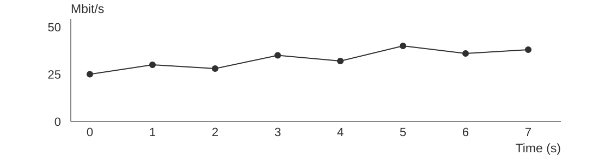

`edge01`, `ethernet-1/3`: traffic arriving from Lagoon Transit.

Each sample keeps that identity. The plotted values are illustrative.

<nav class="progress" aria-label="Module progress"><span class="">QUESTION</span><span class="arrow"> → </span><span class="active">SIGNAL</span><span class="arrow"> → </span><span class="">COLLECT</span><span class="arrow"> → </span><span class="">INTERPRET</span><span class="arrow"> → </span><span class="">ALERT</span><span class="arrow"> → </span><span class="">RESPOND</span></nav>

---

<!-- _class: visual core -->
<!-- _footer: "AI5049, Hochschule Fulda" -->

# Counter or gauge?

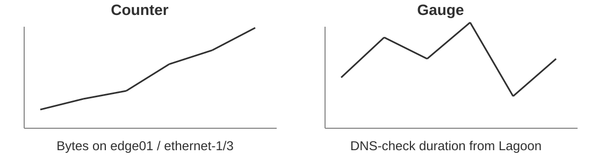

The byte counter accumulates. The probe duration can rise or fall.

<nav class="progress" aria-label="Module progress"><span class="">QUESTION</span><span class="arrow"> → </span><span class="active">SIGNAL</span><span class="arrow"> → </span><span class="">COLLECT</span><span class="arrow"> → </span><span class="">INTERPRET</span><span class="arrow"> → </span><span class="">ALERT</span><span class="arrow"> → </span><span class="">RESPOND</span></nav>

---

<!-- _class: visual core -->
<!-- _footer: "AI5049, Hochschule Fulda" -->

# Timestamps in the pipeline

One event, several clocks.

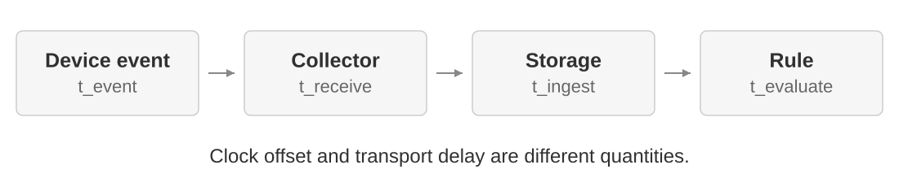

Subtract timestamps only after checking clock source and offset.

<nav class="progress" aria-label="Module progress"><span class="">QUESTION</span><span class="arrow"> → </span><span class="active">SIGNAL</span><span class="arrow"> → </span><span class="">COLLECT</span><span class="arrow"> → </span><span class="">INTERPRET</span><span class="arrow"> → </span><span class="">ALERT</span><span class="arrow"> → </span><span class="">RESPOND</span></nav>

---

<!-- _class: visual core -->
<!-- _footer: "AI5049, Hochschule Fulda" -->

# Clock error changes the story

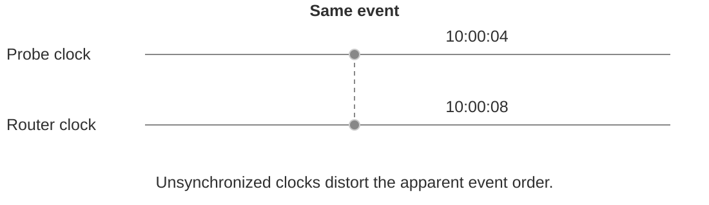

Bound clock error before inferring event order.

<nav class="progress" aria-label="Module progress"><span class="">QUESTION</span><span class="arrow"> → </span><span class="active">SIGNAL</span><span class="arrow"> → </span><span class="">COLLECT</span><span class="arrow"> → </span><span class="">INTERPRET</span><span class="arrow"> → </span><span class="">ALERT</span><span class="arrow"> → </span><span class="">RESPOND</span></nav>

---

<!-- _class: visual core -->
<!-- _footer: "AI5049, Hochschule Fulda" -->

# Four seconds can disappear

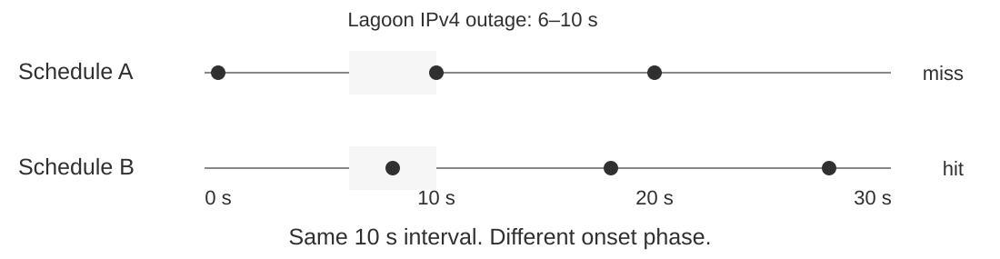

Imagine a short Lagoon IPv4 outage. A healthy sample can miss it.

<nav class="progress" aria-label="Module progress"><span class="">QUESTION</span><span class="arrow"> → </span><span class="active">SIGNAL</span><span class="arrow"> → </span><span class="">COLLECT</span><span class="arrow"> → </span><span class="">INTERPRET</span><span class="arrow"> → </span><span class="">ALERT</span><span class="arrow"> → </span><span class="">RESPOND</span></nav>

---

<!-- _class: content core -->
<!-- _footer: "AI5049, Hochschule Fulda" -->

# Sampling leaves gaps

A fault can begin and end between samples.

**Interval and onset phase** determine whether we see it.
Streaming sampled values still leaves gaps.

<nav class="progress" aria-label="Module progress"><span class="">QUESTION</span><span class="arrow"> → </span><span class="active">SIGNAL</span><span class="arrow"> → </span><span class="">COLLECT</span><span class="arrow"> → </span><span class="">INTERPRET</span><span class="arrow"> → </span><span class="">ALERT</span><span class="arrow"> → </span><span class="">RESPOND</span></nav>

---

<!-- _class: content deep-dive -->
<!-- _footer: "AI5049, Hochschule Fulda" -->

# Budget the ReefNet probe round

**2 sources × 2 families × 2 probe types = 8 checks**

A round every 5 seconds would need **1.6 checks/s**.

ReefNet waits for the round to finish, then pauses for 1 second.
What happens when a check times out?

<nav class="progress" aria-label="Module progress"><span class="">QUESTION</span><span class="arrow"> → </span><span class="active">SIGNAL</span><span class="arrow"> → </span><span class="">COLLECT</span><span class="arrow"> → </span><span class="">INTERPRET</span><span class="arrow"> → </span><span class="">ALERT</span><span class="arrow"> → </span><span class="">RESPOND</span></nav>

---

<!-- _class: content core -->
<!-- _footer: "AI5049, Hochschule Fulda" -->

# Before subtracting counters

Check identity, timestamps and discontinuities.

A negative delta may mean **reset, wrap or bad data**.
Two values cannot reveal multiple wraps.

Invalid evidence becomes **unknown**, never a fabricated rate.

<nav class="progress" aria-label="Module progress"><span class="">QUESTION</span><span class="arrow"> → </span><span class="active">SIGNAL</span><span class="arrow"> → </span><span class="">COLLECT</span><span class="arrow"> → </span><span class="">INTERPRET</span><span class="arrow"> → </span><span class="">ALERT</span><span class="arrow"> → </span><span class="">RESPOND</span></nav>

---

<!-- _class: content core -->
<!-- _footer: "AI5049, Hochschule Fulda" -->

# Turn ReefNet byte counters into bit/s

Use `in-octets` on `edge01`, interface `ethernet-1/3`.

$$rate = \frac{8(C_2-C_1)}{t_2-t_1}$$

Counter in **bytes**, time in **seconds**. Use a reset-free interval.

Compare the result with the **50 Mbit/s Lagoon handoff**.

<nav class="progress" aria-label="Module progress"><span class="">QUESTION</span><span class="arrow"> → </span><span class="active">SIGNAL</span><span class="arrow"> → </span><span class="">COLLECT</span><span class="arrow"> → </span><span class="">INTERPRET</span><span class="arrow"> → </span><span class="">ALERT</span><span class="arrow"> → </span><span class="">RESPOND</span></nav>

---

<!-- _class: content core -->
<!-- _footer: "AI5049, Hochschule Fulda" -->

# Calculate the Lagoon ingress rate

Illustrative `in-octets` on `edge01`, interface `ethernet-1/3`.

| Time | Byte counter | Reset? |
|---|---:|---|
| 10:00:00 | 1,000,000 | Initial sample |
| 10:00:10 | 32,250,000 | No |
| 10:00:20 | 20,000 | Yes |
| 10:00:32 | 37,520,000 | No |

Four minutes: calculate valid rates. Compare them with the 50 Mbit/s handoff.

<nav class="progress" aria-label="Module progress"><span class="">QUESTION</span><span class="arrow"> → </span><span class="active">SIGNAL</span><span class="arrow"> → </span><span class="">COLLECT</span><span class="arrow"> → </span><span class="">INTERPRET</span><span class="arrow"> → </span><span class="">ALERT</span><span class="arrow"> → </span><span class="">RESPOND</span></nav>

---

<!-- _class: content core -->
<!-- _footer: "AI5049, Hochschule Fulda" -->

# 25 Mbit/s on a 50 Mbit/s handoff

| Interval | Rate |
|---|---|
| 00–10 s | 8 × 31,250,000 / 10 = **25 Mbit/s** |
| 10–20 s | Reset: **exclude** |
| 20–32 s | 8 × 37,500,000 / 12 = **25 Mbit/s** |

Both valid intervals use **50%** of handoff capacity.

<nav class="progress" aria-label="Module progress"><span class="">QUESTION</span><span class="arrow"> → </span><span class="active">SIGNAL</span><span class="arrow"> → </span><span class="">COLLECT</span><span class="arrow"> → </span><span class="">INTERPRET</span><span class="arrow"> → </span><span class="">ALERT</span><span class="arrow"> → </span><span class="">RESPOND</span></nav>

---

<!-- _class: visual core -->
<!-- _footer: "AI5049, Hochschule Fulda" -->

# What Lagoon sees when it probes DNS

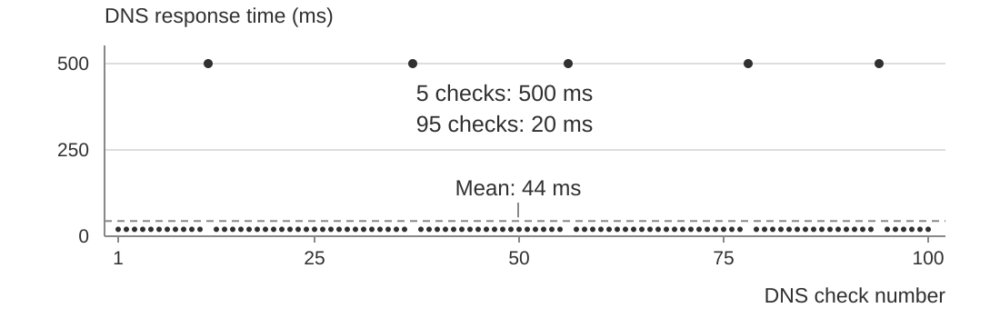

100 illustrative DNS checks to Ocean Research. Start with the individual waits.
Would the **44 ms mean** explain the five long waits?

<nav class="progress" aria-label="Module progress"><span class="">QUESTION</span><span class="arrow"> → </span><span class="active">SIGNAL</span><span class="arrow"> → </span><span class="">COLLECT</span><span class="arrow"> → </span><span class="">INTERPRET</span><span class="arrow"> → </span><span class="">ALERT</span><span class="arrow"> → </span><span class="">RESPOND</span></nav>

---

<!-- _class: content core -->
<!-- _footer: "<span class=\"footer-context\">AI5049, Hochschule Fulda</span><span class=\"footer-refs\"><a href=\"https://prometheus.io/docs/practices/histograms/\">Prometheus: histograms</a></span>" -->

# Read the distribution

| View | What it tells us |
|---|---|
| Median | Middle observation |
| p95 | Threshold covering at least 95% |
| Histogram | Counts within ranges |
| Cumulative distribution | Fraction at or below each value |

A percentile is not an “average slow request”.

<nav class="progress" aria-label="Module progress"><span class="">QUESTION</span><span class="arrow"> → </span><span class="active">SIGNAL</span><span class="arrow"> → </span><span class="">COLLECT</span><span class="arrow"> → </span><span class="">INTERPRET</span><span class="arrow"> → </span><span class="">ALERT</span><span class="arrow"> → </span><span class="">RESPOND</span></nav>

---

<!-- _class: content core -->
<!-- _footer: "AI5049, Hochschule Fulda" -->

# Percentiles do not average

A separate DNS example for `data.oceanresearch.test`. Nearest-rank p95:

| Source | Checks | Duration of each check |
|---|---:|---:|
| Lagoon | 100 | 20 ms |
| Pacific | 1 | 1,000 ms |

Average of the two p95s: **510 ms**.
Combined observations: **p95 = 20 ms**.

Combine observations first, then calculate the percentile.

<nav class="progress" aria-label="Module progress"><span class="">QUESTION</span><span class="arrow"> → </span><span class="active">SIGNAL</span><span class="arrow"> → </span><span class="">COLLECT</span><span class="arrow"> → </span><span class="">INTERPRET</span><span class="arrow"> → </span><span class="">ALERT</span><span class="arrow"> → </span><span class="">RESPOND</span></nav>

---

<!-- _class: content core -->
<!-- _footer: "AI5049, Hochschule Fulda" -->

# What is Grafana telling us?

At **25 Mbit/s**, open `http://localhost:3000`.
Choose **ReefNet / BOB1 → Network Overview**.

- What is measured, and where?
- Which units and time window?
- How fresh is it?

Predict what changes when we send more traffic.

---

<!-- _class: content core -->
<!-- _footer: "<span class=\"footer-context\">AI5049, Hochschule Fulda</span><span class=\"footer-refs\"><a href=\"https://www.rfc-editor.org/rfc/rfc3411.html\">SNMP: RFC 3411</a></span>" -->

# SNMP: what does the device report?

A manager queries an agent.

**OID:** object identifier.
**MIB:** Management Information Base, defining object meaning.

Keep the device, OID, row, value and poll time.
Short events can fall between polls.

Not provisioned in BOB1. Compare with gNMI.

<nav class="progress" aria-label="Module progress"><span class="">QUESTION</span><span class="arrow"> → </span><span class="">SIGNAL</span><span class="arrow"> → </span><span class="active">COLLECT</span><span class="arrow"> → </span><span class="">INTERPRET</span><span class="arrow"> → </span><span class="">ALERT</span><span class="arrow"> → </span><span class="">RESPOND</span></nav>

---

<!-- _class: content deep-dive -->
<!-- _footer: "AI5049, Hochschule Fulda" -->

# Keep the object identity.

```text
GET       request-id 41   ifOperStatus.17
RESPONSE  request-id 41   noError   INTEGER up(1)
```

The OID selects an object. `17` selects an interface row.
Check response status, device identity and the row's name/alias.

After restart or replacement, verify the mapping before joining counters.

<nav class="progress" aria-label="Module progress"><span class="">QUESTION</span><span class="arrow"> → </span><span class="">SIGNAL</span><span class="arrow"> → </span><span class="active">COLLECT</span><span class="arrow"> → </span><span class="">INTERPRET</span><span class="arrow"> → </span><span class="">ALERT</span><span class="arrow"> → </span><span class="">RESPOND</span></nav>

---

<!-- _class: content core -->
<!-- _footer: "<span class=\"footer-context\">AI5049, Hochschule Fulda</span><span class=\"footer-refs\"><a href=\"https://www.rfc-editor.org/rfc/rfc5424.html\">Syslog: RFC 5424</a></span>" -->

# Syslog: what changed?

| | |
|---|---|
| Observation | Time, host, severity, app and message |
| Limit | Missing logs do not prove health |
| ReefNet | SR Linux → Alloy → Loki → Grafana |

Keep source and receive times. Severity is the device’s judgment.

<nav class="progress" aria-label="Module progress"><span class="">QUESTION</span><span class="arrow"> → </span><span class="">SIGNAL</span><span class="arrow"> → </span><span class="active">COLLECT</span><span class="arrow"> → </span><span class="">INTERPRET</span><span class="arrow"> → </span><span class="">ALERT</span><span class="arrow"> → </span><span class="">RESPOND</span></nav>

---

<!-- _class: content core -->
<!-- _footer: "<span class=\"footer-context\">AI5049, Hochschule Fulda</span><span class=\"footer-refs\"><a href=\"https://www.rfc-editor.org/rfc/rfc7011.html\">IPFIX: RFC 7011</a></span>" -->

# IPFIX: which traffic crossed here?

| | |
|---|---|
| Observation | Flow keys, counts and time interval |
| Limit | Typical records omit payload. Sampling affects counts |
| ReefNet | Record exercise without a live exporter |

A **template** defines the fields. Keep its exporter and observation domain.
Port 443 alone does not identify an application.

<nav class="progress" aria-label="Module progress"><span class="">QUESTION</span><span class="arrow"> → </span><span class="">SIGNAL</span><span class="arrow"> → </span><span class="active">COLLECT</span><span class="arrow"> → </span><span class="">INTERPRET</span><span class="arrow"> → </span><span class="">ALERT</span><span class="arrow"> → </span><span class="">RESPOND</span></nav>

---

<!-- _class: content deep-dive -->
<!-- _footer: "AI5049, Hochschule Fulda" -->

# A template ID is not globally unique.

Illustrative ReefNet exporters, not provisioned in BOB1:

| Exporter | Template 256 means |
|---|---|
| edge01 | source, destination, bytes |
| edge02 | source, destination, packets |

Record from edge02: `203.0.113.10, 198.51.100.10, 8000`

That is **8,000 packets**, not bytes.
What context must the collector retain to decode it?

<nav class="progress" aria-label="Module progress"><span class="">QUESTION</span><span class="arrow"> → </span><span class="">SIGNAL</span><span class="arrow"> → </span><span class="active">COLLECT</span><span class="arrow"> → </span><span class="">INTERPRET</span><span class="arrow"> → </span><span class="">ALERT</span><span class="arrow"> → </span><span class="">RESPOND</span></nav>

---

<!-- _class: content core -->
<!-- _footer: "AI5049, Hochschule Fulda" -->

# Active probes: does this exchange work?

| | |
|---|---|
| Observation | Source, target, family, protocol, time, result |
| Limit | Failure does not locate the fault |
| ReefNet | ICMP/DNS exporters and manual HTTP checks |

The DNS exporter checks command success, not the returned answer.

<nav class="progress" aria-label="Module progress"><span class="">QUESTION</span><span class="arrow"> → </span><span class="">SIGNAL</span><span class="arrow"> → </span><span class="active">COLLECT</span><span class="arrow"> → </span><span class="">INTERPRET</span><span class="arrow"> → </span><span class="">ALERT</span><span class="arrow"> → </span><span class="">RESPOND</span></nav>

---

<!-- _class: visual deep-dive -->
<!-- _footer: "<span class=\"footer-context\">AI5049, Hochschule Fulda</span><span class=\"footer-refs\"><a href=\"https://paris-traceroute.net/\">Paris Traceroute paper</a></span>" -->

# Traceroute: read replies carefully

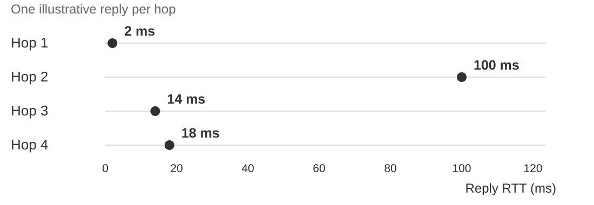

Hop 2 replies slowly. It does not delay all forwarded packets by 100 ms.

<nav class="progress" aria-label="Module progress"><span class="">QUESTION</span><span class="arrow"> → </span><span class="">SIGNAL</span><span class="arrow"> → </span><span class="active">COLLECT</span><span class="arrow"> → </span><span class="">INTERPRET</span><span class="arrow"> → </span><span class="">ALERT</span><span class="arrow"> → </span><span class="">RESPOND</span></nav>

---

<!-- _class: content deep-dive -->
<!-- _footer: "<span class=\"footer-context\">AI5049, Hochschule Fulda</span><span class=\"footer-refs\"><a href=\"https://www.rfc-editor.org/rfc/rfc8201.html\">IPv6 path MTU: RFC 8201</a></span>" -->

# Small ping, stalled download.

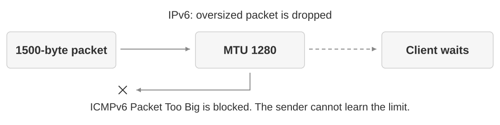

IPv6 routers do not fragment transit packets. **ICMPv6 Packet Too Big** drives PMTUD.

<nav class="progress" aria-label="Module progress"><span class="">QUESTION</span><span class="arrow"> → </span><span class="">SIGNAL</span><span class="arrow"> → </span><span class="active">COLLECT</span><span class="arrow"> → </span><span class="">INTERPRET</span><span class="arrow"> → </span><span class="">ALERT</span><span class="arrow"> → </span><span class="">RESPOND</span></nav>

---

<!-- _class: content core -->
<!-- _footer: "AI5049, Hochschule Fulda" -->

# Streaming state: what changed?

| | |
|---|---|
| Observation | Target, keyed path, timestamp, update/deletion |
| Limit | Reconnect cannot restore every missed event |
| ReefNet | gNMIc samples SR Linux state and counters |

The delivery mechanism does not define freshness.

<nav class="progress" aria-label="Module progress"><span class="">QUESTION</span><span class="arrow"> → </span><span class="">SIGNAL</span><span class="arrow"> → </span><span class="active">COLLECT</span><span class="arrow"> → </span><span class="">INTERPRET</span><span class="arrow"> → </span><span class="">ALERT</span><span class="arrow"> → </span><span class="">RESPOND</span></nav>

---

<!-- _class: visual core -->
<!-- _footer: "<span class=\"footer-context\">AI5049, Hochschule Fulda</span><span class=\"footer-refs\"><a href=\"https://github.com/openconfig/reference/blob/master/rpc/gnmi/gnmi-specification.md#35-subscribing-to-telemetry-updates\">gNMI Subscribe specification</a></span>" -->

# Choose the subscription semantics.

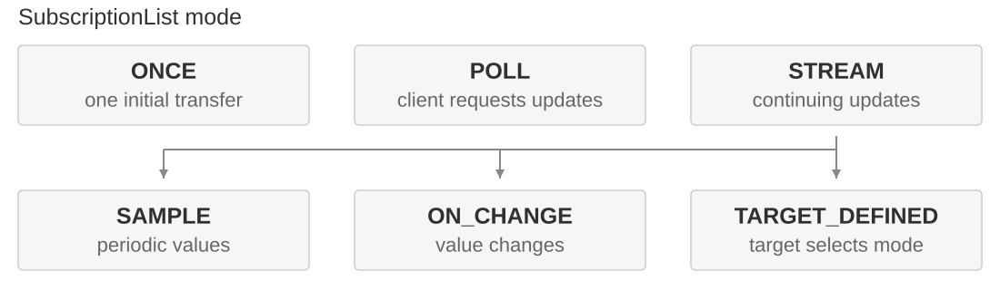

SAMPLE is periodic. ON_CHANGE depends on target support.

<nav class="progress" aria-label="Module progress"><span class="">QUESTION</span><span class="arrow"> → </span><span class="">SIGNAL</span><span class="arrow"> → </span><span class="active">COLLECT</span><span class="arrow"> → </span><span class="">INTERPRET</span><span class="arrow"> → </span><span class="">ALERT</span><span class="arrow"> → </span><span class="">RESPOND</span></nav>

---

<!-- _class: content core -->
<!-- _footer: "<span class=\"footer-context\">AI5049, Hochschule Fulda</span><span class=\"footer-refs\"><a href=\"https://gnmic.openconfig.net/user_guide/subscriptions/\">gNMIc subscriptions</a></span>" -->

# Watch counters arrive through gNMI

<div class="terminal">
<div class="terminal-entry"><strong>WSL</strong><code>make enter NODE=operations01.bob1.reefnet.test</code></div>
<div class="terminal-label">Inside operations01</div>
<pre><code>gnmic -a edge01.bob1.reefnet.test:57400 \
  -u admin -p &#x27;NokiaSrl1!&#x27; --skip-verify --encoding json_ietf \
  subscribe --path &#x27;/interface[name=ethernet-1/3]/statistics&#x27; \
  --stream-mode sample --sample-interval 5s</code></pre>
</div>

Compare with Grafana’s rate. **Ctrl+C** stops the subscription.

<nav class="progress" aria-label="Module progress"><span class="">QUESTION</span><span class="arrow"> → </span><span class="">SIGNAL</span><span class="arrow"> → </span><span class="active">COLLECT</span><span class="arrow"> → </span><span class="">INTERPRET</span><span class="arrow"> → </span><span class="">ALERT</span><span class="arrow"> → </span><span class="">RESPOND</span></nav>

---

<!-- _class: content core -->
<!-- _footer: "AI5049, Hochschule Fulda" -->

# Turn up the traffic

In WSL, choose one load:
```bash
make traffic-40mbit
make traffic-10mbit
make traffic-25mbit
```

Allow 30 seconds at each level.
Watch the interface counter and its Grafana rate.

Which changes first? Where does the delay come from?


---

<!-- _class: visual core -->
<!-- _footer: "AI5049, Hochschule Fulda" -->

# Build local state from a gNMI stream

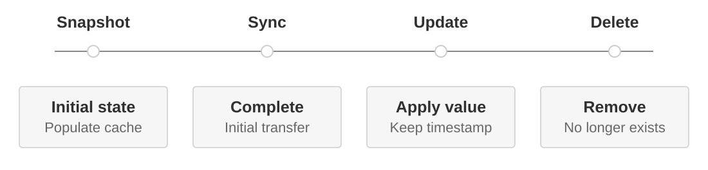

Sync completes the initial transfer. It does not guarantee future freshness.

<nav class="progress" aria-label="Module progress"><span class="">QUESTION</span><span class="arrow"> → </span><span class="">SIGNAL</span><span class="arrow"> → </span><span class="active">COLLECT</span><span class="arrow"> → </span><span class="">INTERPRET</span><span class="arrow"> → </span><span class="">ALERT</span><span class="arrow"> → </span><span class="">RESPOND</span></nav>

---

<!-- _class: visual core -->
<!-- _footer: "AI5049, Hochschule Fulda" -->

# Deletion is not zero

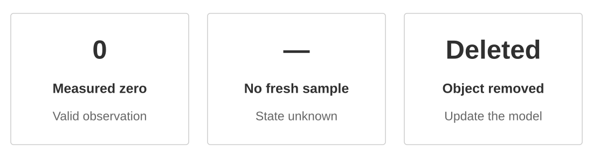

These states need different storage, query and alert behavior.

<nav class="progress" aria-label="Module progress"><span class="">QUESTION</span><span class="arrow"> → </span><span class="">SIGNAL</span><span class="arrow"> → </span><span class="active">COLLECT</span><span class="arrow"> → </span><span class="">INTERPRET</span><span class="arrow"> → </span><span class="">ALERT</span><span class="arrow"> → </span><span class="">RESPOND</span></nav>

---

<!-- _class: visual core -->
<!-- _footer: "AI5049, Hochschule Fulda" -->

# Reconnect cannot restore lost history.

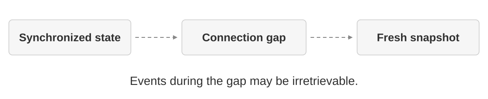

Rebuild current state after reconnect. Keep the observation gap visible.

<nav class="progress" aria-label="Module progress"><span class="">QUESTION</span><span class="arrow"> → </span><span class="">SIGNAL</span><span class="arrow"> → </span><span class="active">COLLECT</span><span class="arrow"> → </span><span class="">INTERPRET</span><span class="arrow"> → </span><span class="">ALERT</span><span class="arrow"> → </span><span class="">RESPOND</span></nav>

---

<!-- _class: content core -->
<!-- _footer: "AI5049, Hochschule Fulda" -->

# Turn observations into a response.

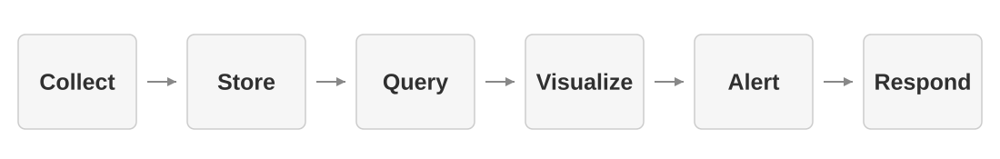

Every boundary can lose meaning, freshness or context.
Keep enough metadata to detect that loss.

<nav class="progress" aria-label="Module progress"><span class="">QUESTION</span><span class="arrow"> → </span><span class="">SIGNAL</span><span class="arrow"> → </span><span class="active">COLLECT</span><span class="arrow"> → </span><span class="">INTERPRET</span><span class="arrow"> → </span><span class="">ALERT</span><span class="arrow"> → </span><span class="">RESPOND</span></nav>

---

<!-- _class: content core -->
<!-- _footer: "AI5049, Hochschule Fulda" -->

# Where should the collector live?

| Placement | Main dependency |
|---|---|
| Central | WAN reachability |
| At the site | Site power and local collector |
| Several collectors | Coordination and duplicate handling |

Test isolation. A second collector may share the first one’s failure domain.

<nav class="progress" aria-label="Module progress"><span class="">QUESTION</span><span class="arrow"> → </span><span class="">SIGNAL</span><span class="arrow"> → </span><span class="active">COLLECT</span><span class="arrow"> → </span><span class="">INTERPRET</span><span class="arrow"> → </span><span class="">ALERT</span><span class="arrow"> → </span><span class="">RESPOND</span></nav>

---

<!-- _class: visual core -->
<!-- _footer: "AI5049, Hochschule Fulda" -->

# Metrics and logs in ReefNet

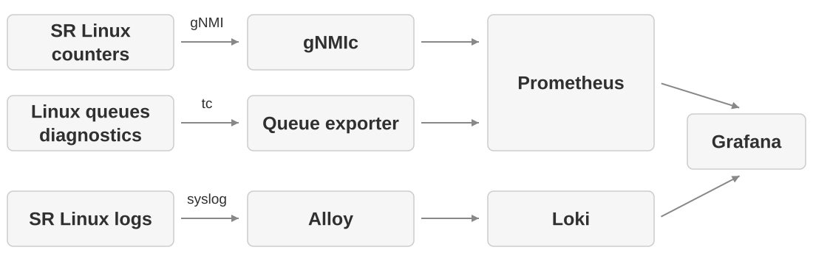

Grafana queries metrics and logs. Each collection path can fail separately.

<nav class="progress" aria-label="Module progress"><span class="">QUESTION</span><span class="arrow"> → </span><span class="">SIGNAL</span><span class="arrow"> → </span><span class="active">COLLECT</span><span class="arrow"> → </span><span class="">INTERPRET</span><span class="arrow"> → </span><span class="">ALERT</span><span class="arrow"> → </span><span class="">RESPOND</span></nav>

---

<!-- _class: content core -->
<!-- _footer: "<span class=\"footer-context\">AI5049, Hochschule Fulda</span><span class=\"footer-refs\"><a href=\"https://prometheus.io/docs/introduction/overview/\">Prometheus overview</a></span>" -->

# Prometheus stores time series.

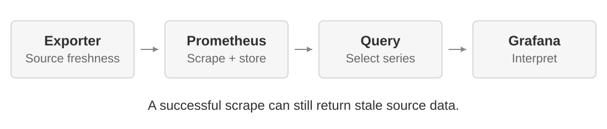

Try PromQL queries at `http://localhost:9090`.
Trace a suspicious panel back to its source timestamp.

<nav class="progress" aria-label="Module progress"><span class="">QUESTION</span><span class="arrow"> → </span><span class="">SIGNAL</span><span class="arrow"> → </span><span class="active">COLLECT</span><span class="arrow"> → </span><span class="">INTERPRET</span><span class="arrow"> → </span><span class="">ALERT</span><span class="arrow"> → </span><span class="">RESPOND</span></nav>

---

<!-- _class: visual core -->
<!-- _footer: "AI5049, Hochschule Fulda" -->

# Cardinality: count ReefNet’s series

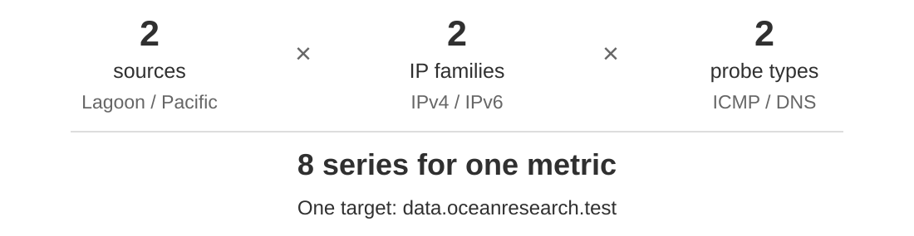

Prometheus: `count(reefnet_probe_success)` → **8**
Success, duration and timestamp together → **24 series**.

<nav class="progress" aria-label="Module progress"><span class="">QUESTION</span><span class="arrow"> → </span><span class="">SIGNAL</span><span class="arrow"> → </span><span class="active">COLLECT</span><span class="arrow"> → </span><span class="">INTERPRET</span><span class="arrow"> → </span><span class="">ALERT</span><span class="arrow"> → </span><span class="">RESPOND</span></nav>

---

<!-- _class: task core -->
<!-- _footer: "<span class=\"footer-context\">AI5049, Hochschule Fulda</span><span class=\"footer-refs\"><a href=\"https://prometheus.io/docs/practices/naming/#labels\">Prometheus: metric labels</a></span>" -->

# Would you add a request ID?

A proposed change to ReefNet's probe metric:

```text
source="probe01.bob1.lagoontransit.test"
probe="icmp"
af="ipv4"
target="data.oceanresearch.test"
request_id="a-new-value-for-every-run"
```

What does `request_id` do to cardinality? Where should it go?

<nav class="progress" aria-label="Module progress"><span class="">QUESTION</span><span class="arrow"> → </span><span class="">SIGNAL</span><span class="arrow"> → </span><span class="active">COLLECT</span><span class="arrow"> → </span><span class="">INTERPRET</span><span class="arrow"> → </span><span class="">ALERT</span><span class="arrow"> → </span><span class="">RESPOND</span></nav>

---

<!-- _class: content deep-dive -->
<!-- _footer: "AI5049, Hochschule Fulda" -->

# When would we need a queue?

Do independent consumers need to **replay the same observations**?

A retained event log may help. It also needs retention, lag monitoring and recovery.
For one dashboard, direct storage may suffice.

<nav class="progress" aria-label="Module progress"><span class="">QUESTION</span><span class="arrow"> → </span><span class="">SIGNAL</span><span class="arrow"> → </span><span class="active">COLLECT</span><span class="arrow"> → </span><span class="">INTERPRET</span><span class="arrow"> → </span><span class="">ALERT</span><span class="arrow"> → </span><span class="">RESPOND</span></nav>

---

<!-- _class: visual deep-dive -->
<!-- _footer: "AI5049, Hochschule Fulda" -->

# What if ReefNet adds a slow archive?

Design exercise: forward the probe samples to a remote archive.

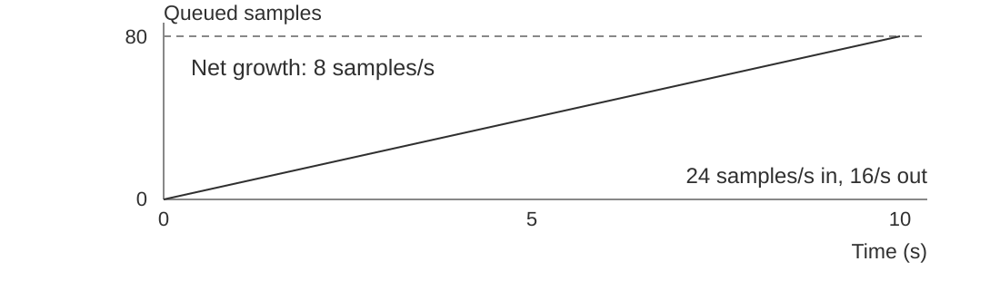

The buffer buys ten seconds. It cannot fix the slow writer.

<nav class="progress" aria-label="Module progress"><span class="">QUESTION</span><span class="arrow"> → </span><span class="">SIGNAL</span><span class="arrow"> → </span><span class="active">COLLECT</span><span class="arrow"> → </span><span class="">INTERPRET</span><span class="arrow"> → </span><span class="">ALERT</span><span class="arrow"> → </span><span class="">RESPOND</span></nav>

---

<!-- _class: visual core -->
<!-- _footer: "AI5049, Hochschule Fulda" -->

# Retention changes what you can ask.

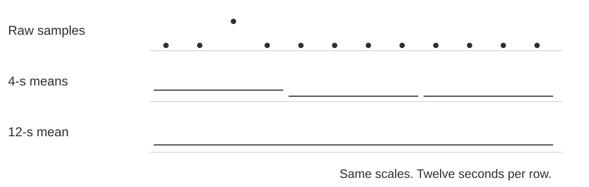

Aggregation saves space but can erase short failures.

<nav class="progress" aria-label="Module progress"><span class="">QUESTION</span><span class="arrow"> → </span><span class="">SIGNAL</span><span class="arrow"> → </span><span class="active">COLLECT</span><span class="arrow"> → </span><span class="">INTERPRET</span><span class="arrow"> → </span><span class="">ALERT</span><span class="arrow"> → </span><span class="">RESPOND</span></nav>

---

<!-- _class: visual core -->
<!-- _footer: "AI5049, Hochschule Fulda" -->

# Up can still mean stale.

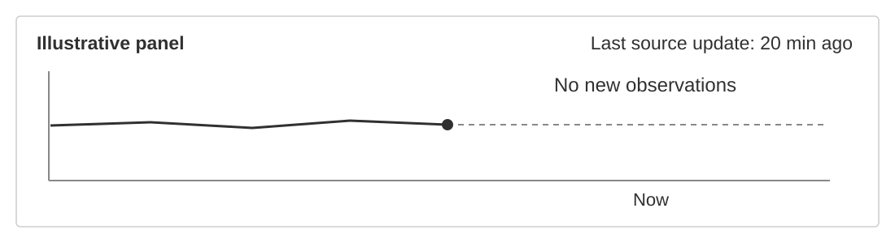

Watch source age, even when the scrape succeeds.

<nav class="progress" aria-label="Module progress"><span class="">QUESTION</span><span class="arrow"> → </span><span class="">SIGNAL</span><span class="arrow"> → </span><span class="active">COLLECT</span><span class="arrow"> → </span><span class="">INTERPRET</span><span class="arrow"> → </span><span class="">ALERT</span><span class="arrow"> → </span><span class="">RESPOND</span></nav>

---

<!-- _class: statement core -->
<!-- _footer: "AI5049, Hochschule Fulda" -->

# Healthy yesterday.

Today's status is still unknown.

<nav class="progress" aria-label="Module progress"><span class="">QUESTION</span><span class="arrow"> → </span><span class="">SIGNAL</span><span class="arrow"> → </span><span class="active">COLLECT</span><span class="arrow"> → </span><span class="">INTERPRET</span><span class="arrow"> → </span><span class="">ALERT</span><span class="arrow"> → </span><span class="">RESPOND</span></nav>

---

<!-- _class: visual core -->
<!-- _footer: "AI5049, Hochschule Fulda" -->

# Missing data on a dashboard

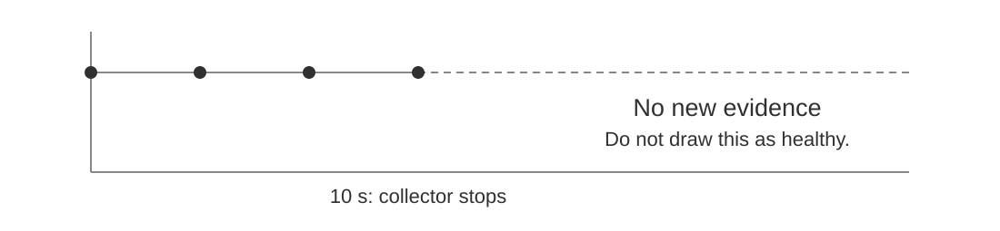

**When should the panel stop looking healthy?**

<nav class="progress" aria-label="Module progress"><span class="">QUESTION</span><span class="arrow"> → </span><span class="">SIGNAL</span><span class="arrow"> → </span><span class="active">COLLECT</span><span class="arrow"> → </span><span class="">INTERPRET</span><span class="arrow"> → </span><span class="">ALERT</span><span class="arrow"> → </span><span class="">RESPOND</span></nav>

---

<!-- _class: content core -->
<!-- _footer: "AI5049, Hochschule Fulda" -->

# Monitor the monitoring

| Component | Watch |
|---|---|
| Collector | Last valid observation |
| Broker / consumer | Buffer use, progress and event age |
| Rule engine | Errors and evaluation time |
| Notification path | Delivery result |

Check the central monitoring service from outside.

<nav class="progress" aria-label="Module progress"><span class="">QUESTION</span><span class="arrow"> → </span><span class="">SIGNAL</span><span class="arrow"> → </span><span class="active">COLLECT</span><span class="arrow"> → </span><span class="">INTERPRET</span><span class="arrow"> → </span><span class="">ALERT</span><span class="arrow"> → </span><span class="">RESPOND</span></nav>

---

<!-- _class: content core -->
<!-- _footer: "AI5049, Hochschule Fulda" -->

# Choose a dashboard

| Question | BOB1 dashboard |
|---|---|
| Scope? | Network Overview |
| Path? | Topology & Paths |
| Cause? | Fault Analysis |
| Service? | Service Health |
| Freshness? | Telemetry Health |
| Device? | Device Detail |

<nav class="progress" aria-label="Module progress"><span class="">QUESTION</span><span class="arrow"> → </span><span class="">SIGNAL</span><span class="arrow"> → </span><span class="">COLLECT</span><span class="arrow"> → </span><span class="active">INTERPRET</span><span class="arrow"> → </span><span class="">ALERT</span><span class="arrow"> → </span><span class="">RESPOND</span></nav>

---

<!-- _class: content core -->
<!-- _footer: "AI5049, Hochschule Fulda" -->

# Same symptom, different causes

Lagoon IPv4 fails in both cases.

| Evidence | Export rejected | Session down |
|---|---|---|
| BGP session | Established | Not established |
| Customer prefix exported | No | No |

Session state distinguishes these hypotheses.

<nav class="progress" aria-label="Module progress"><span class="">QUESTION</span><span class="arrow"> → </span><span class="">SIGNAL</span><span class="arrow"> → </span><span class="">COLLECT</span><span class="arrow"> → </span><span class="active">INTERPRET</span><span class="arrow"> → </span><span class="">ALERT</span><span class="arrow"> → </span><span class="">RESPOND</span></nav>

---

<!-- _class: content core -->
<!-- _footer: "AI5049, Hochschule Fulda" -->

# One link goes down. What follows?

In WSL: `make fault-link`

<div class="terminal">
<div class="terminal-entry"><strong>WSL</strong><code>make enter NODE=edge01.bob1.reefnet.test</code></div>
<div class="terminal-label">Router CLI</div>
<pre><code>show interface ethernet-1/4 detail
show network-instance default protocols ospf neighbor</code></pre>
</div>

Check the service and Grafana **Topology & Paths**.

Did the customer notice? Explain the path that remains.


---

<!-- _class: content core -->
<!-- _footer: "AI5049, Hochschule Fulda" -->

# Admin state and oper state

The fault just injected disables `ethernet-1/4` on ReefNet Edge 01:

```text
/interface[name=ethernet-1/4]/admin-state   "disable"
/interface[name=ethernet-1/4]/oper-state    "down"
```

**Admin:** configured intent. **Oper:** observed behavior.

Prometheus exposes `reefnet_interface_admin_state` and
`reefnet_interface_oper_state`. Read them with their timestamps.

<nav class="progress" aria-label="Module progress"><span class="">QUESTION</span><span class="arrow"> → </span><span class="">SIGNAL</span><span class="arrow"> → </span><span class="">COLLECT</span><span class="arrow"> → </span><span class="active">INTERPRET</span><span class="arrow"> → </span><span class="">ALERT</span><span class="arrow"> → </span><span class="">RESPOND</span></nav>

---

<!-- _class: content core -->
<!-- _footer: "AI5049, Hochschule Fulda" -->

# Restore the link and watch convergence

In the WSL repository:

```bash
make clear-link
```

Verify admin enable, oper up and the OSPF adjacency.
Correlate event time with external reachability.

The Lagoon-to-customer flow does not need `core-b`.
Its service check can remain green while the topology changes.

<nav class="progress" aria-label="Module progress"><span class="">QUESTION</span><span class="arrow"> → </span><span class="">SIGNAL</span><span class="arrow"> → </span><span class="">COLLECT</span><span class="arrow"> → </span><span class="active">INTERPRET</span><span class="arrow"> → </span><span class="">ALERT</span><span class="arrow"> → </span><span class="">RESPOND</span></nav>

---

<!-- _class: visual core -->
<!-- _footer: "AI5049, Hochschule Fulda" -->

# Capacity is not throughput

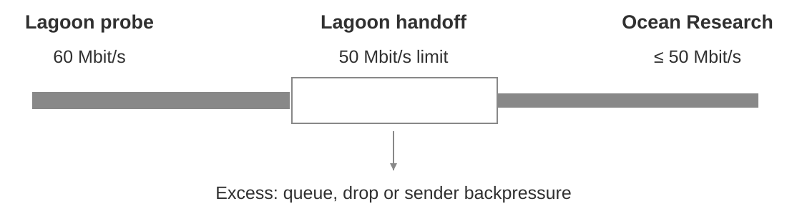

A faster customer handoff does not remove the Lagoon bottleneck.

<nav class="progress" aria-label="Module progress"><span class="">QUESTION</span><span class="arrow"> → </span><span class="">SIGNAL</span><span class="arrow"> → </span><span class="">COLLECT</span><span class="arrow"> → </span><span class="active">INTERPRET</span><span class="arrow"> → </span><span class="">ALERT</span><span class="arrow"> → </span><span class="">RESPOND</span></nav>

---

<!-- _class: visual deep-dive -->
<!-- _footer: "<span class=\"footer-context\">AI5049, Hochschule Fulda</span><span class=\"footer-refs\"><a href=\"https://research.google/pubs/b4-experience-with-a-globally-deployed-software-defined-wan/\">Google B4: design and results</a></span>" -->

# Google B4: busy by design

Google’s private WAN ran many links **near 100% utilization**.

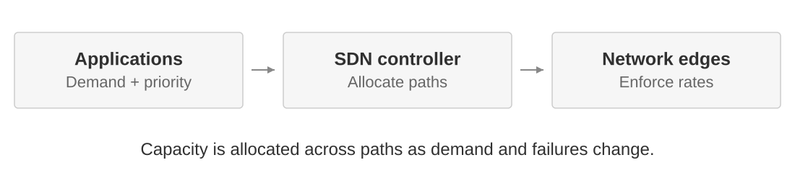

Google controls the senders. Bulk transfers yield to higher priorities.

<nav class="progress" aria-label="Module progress"><span class="">QUESTION</span><span class="arrow"> → </span><span class="">SIGNAL</span><span class="arrow"> → </span><span class="">COLLECT</span><span class="arrow"> → </span><span class="active">INTERPRET</span><span class="arrow"> → </span><span class="">ALERT</span><span class="arrow"> → </span><span class="">RESPOND</span></nav>

---

<!-- _class: visual deep-dive -->
<!-- _footer: "<span class=\"footer-context\">AI5049, Hochschule Fulda</span><span class=\"footer-refs\"><a href=\"https://www.cisco.com/c/en/us/support/docs/switches/catalyst-9600-series-switches/220491-understand-output-drops-on-high-speed-in.html\">Cisco: bursts and output drops</a></span>" -->

# 90% average. Still dropping packets.

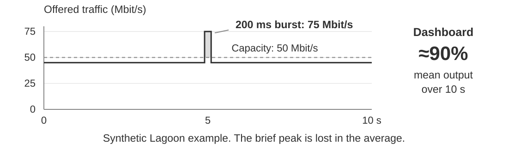

A full queue drops packets. Check **drops and peaks**, not only averages.

<nav class="progress" aria-label="Module progress"><span class="">QUESTION</span><span class="arrow"> → </span><span class="">SIGNAL</span><span class="arrow"> → </span><span class="">COLLECT</span><span class="arrow"> → </span><span class="active">INTERPRET</span><span class="arrow"> → </span><span class="">ALERT</span><span class="arrow"> → </span><span class="">RESPOND</span></nav>

---

<!-- _class: content task -->
<!-- _footer: "AI5049, Hochschule Fulda" -->

# Where do the packets go?

What happens when offered traffic exceeds the **50 Mbit/s** handoff?

In WSL:
```bash
make monitoring
make task
```

**75 minutes:** compare load, received traffic and new discards.
Then try link and routing faults and a short burst.

[Exercises](https://github.com/Stinktopf/network-management-and-monitoring/blob/main/EXERCISES.md) / [CheatSheet](https://github.com/Stinktopf/network-management-and-monitoring/blob/main/slides/exports/cheatsheet.pdf)


---

<!-- _class: content core -->
<!-- _footer: "AI5049, Hochschule Fulda" -->

# How much traffic reached the customer?

<div class="terminal">
<div class="terminal-entry"><strong>WSL</strong><code>make enter NODE=edge01.bob1.lagoontransit.test</code></div>
<div class="terminal-label">Router CLI: physical interface counters</div>
<pre><code>info from state interface ethernet-1/1 statistics</code></pre>
</div>

<div class="terminal">
<div class="terminal-entry"><strong>WSL after quit</strong><code>make enter NODE=service01.bob1.oceanresearch.test</code></div>
<div class="terminal-label">Inside the receiver: Mbit/s and loss</div>
<pre><code>tail -n 15 /tmp/iperf-server.log</code></pre>
</div>

Compare new egress discards with receiver loss.
Use `exit`, then in WSL: `make traffic-10mbit`.


---

<!-- _class: content deep-dive -->
<!-- _footer: "AI5049, Hochschule Fulda" -->

# Keep the simulator out of the result

75 Mbit/s, 1,200-byte UDP datagrams:

**≈ 7,800 packets/s < 10,000 packets/s container limit**

The **50 Mbit/s handoff** should limit first.
Linux queue drops may mirror SR Linux discards. Do not add them.

<nav class="progress" aria-label="Module progress"><span class="">QUESTION</span><span class="arrow"> → </span><span class="">SIGNAL</span><span class="arrow"> → </span><span class="">COLLECT</span><span class="arrow"> → </span><span class="active">INTERPRET</span><span class="arrow"> → </span><span class="">ALERT</span><span class="arrow"> → </span><span class="">RESPOND</span></nav>

---

<!-- _class: content core -->
<!-- _footer: "<span class=\"footer-context\">AI5049, Hochschule Fulda</span><span class=\"footer-refs\"><a href=\"https://prometheus.io/docs/prometheus/latest/querying/functions/#rate\">Prometheus: counter rates</a></span>" -->

# Blink and you miss it?

In WSL, stop background traffic and send a five-second burst:
```bash
make traffic-stop
make traffic-burst-40mbit
```

The burst stays below the 50 Mbit/s cap.
What does it look like in a graph with a long rate window?

Can you recover its height and duration?
When finished: `make traffic-25mbit`


---

<!-- _class: visual core -->
<!-- _footer: "AI5049, Hochschule Fulda" -->

# Several signals, one incident.

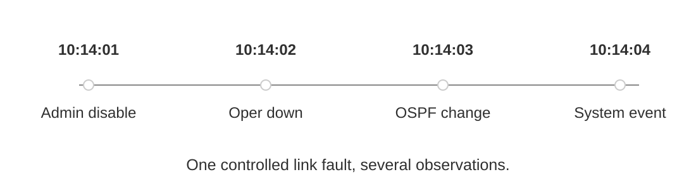

Illustrative timestamps. Check clock offsets before inferring order.

<nav class="progress" aria-label="Module progress"><span class="">QUESTION</span><span class="arrow"> → </span><span class="">SIGNAL</span><span class="arrow"> → </span><span class="">COLLECT</span><span class="arrow"> → </span><span class="active">INTERPRET</span><span class="arrow"> → </span><span class="">ALERT</span><span class="arrow"> → </span><span class="">RESPOND</span></nav>

---

<!-- _class: visual core -->
<!-- _footer: "AI5049, Hochschule Fulda" -->

# The trigger is not the notification.

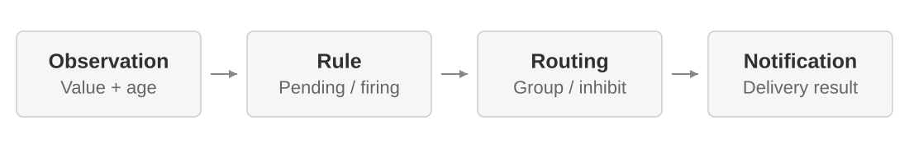

The rule fires, but nobody is paged. Which boundary failed?

<nav class="progress" aria-label="Module progress"><span class="">QUESTION</span><span class="arrow"> → </span><span class="">SIGNAL</span><span class="arrow"> → </span><span class="">COLLECT</span><span class="arrow"> → </span><span class="">INTERPRET</span><span class="arrow"> → </span><span class="active">ALERT</span><span class="arrow"> → </span><span class="">RESPOND</span></nav>

---

<!-- _class: content core -->
<!-- _footer: "<span class=\"footer-context\">AI5049, Hochschule Fulda</span><span class=\"footer-refs\"><a href=\"https://prometheus.io/docs/prometheus/latest/configuration/alerting_rules/\">Prometheus: alerting rules</a></span>" -->

# An alert rule from the lab metric

Illustrative Prometheus rule, using the actual BOB1 metric:

```yaml
- alert: LagoonIPv4ProbeFailed
  expr: |
    reefnet_probe_success{
      source="probe01.bob1.lagoontransit.test",
      probe="icmp", af="ipv4"
    } == 0
  for: 30s
```

The condition must stay active across evaluations for 30 seconds.
This sustained-failure rule does **not** meet our 5-second detection brief.

<nav class="progress" aria-label="Module progress"><span class="">QUESTION</span><span class="arrow"> → </span><span class="">SIGNAL</span><span class="arrow"> → </span><span class="">COLLECT</span><span class="arrow"> → </span><span class="">INTERPRET</span><span class="arrow"> → </span><span class="active">ALERT</span><span class="arrow"> → </span><span class="">RESPOND</span></nav>

---

<!-- _class: content core -->
<!-- _footer: "<span class=\"footer-context\">AI5049, Hochschule Fulda</span><span class=\"footer-refs\"><a href=\"https://prometheus.io/docs/prometheus/latest/querying/basics/#staleness\">Prometheus: staleness</a></span>" -->

# Alert on stale observations

```promql
time() - reefnet_probe_last_run_timestamp_seconds > 15
```

This detects old exported results.
Also check missing series and scrape health.

Use the expected target set to detect disappearing sources.

<nav class="progress" aria-label="Module progress"><span class="">QUESTION</span><span class="arrow"> → </span><span class="">SIGNAL</span><span class="arrow"> → </span><span class="">COLLECT</span><span class="arrow"> → </span><span class="">INTERPRET</span><span class="arrow"> → </span><span class="active">ALERT</span><span class="arrow"> → </span><span class="">RESPOND</span></nav>

---

<!-- _class: content core -->
<!-- _footer: "<span class=\"footer-context\">AI5049, Hochschule Fulda</span><span class=\"footer-refs\"><a href=\"https://prometheus.io/docs/alerting/latest/alertmanager/\">Alertmanager documentation</a></span>" -->

# Flapping and notification noise

**Flapping:** repeated state changes.

| Mechanism | Purpose |
|---|---|
| Deduplication | Skip duplicate notifications |
| Inhibition | Mute notifications while a related alert fires |
| Grouping | Combine related notifications |

A firing delay can prevent short-lived conditions from becoming alerts.

<nav class="progress" aria-label="Module progress"><span class="">QUESTION</span><span class="arrow"> → </span><span class="">SIGNAL</span><span class="arrow"> → </span><span class="">COLLECT</span><span class="arrow"> → </span><span class="">INTERPRET</span><span class="arrow"> → </span><span class="active">ALERT</span><span class="arrow"> → </span><span class="">RESPOND</span></nav>

---

<!-- _class: visual core -->
<!-- _footer: "AI5049, Hochschule Fulda" -->

# Precision and recall

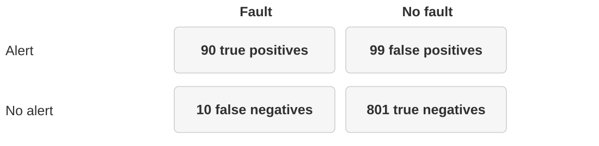

**Recall = 90%. Precision = 47.6%.**
More than half the alerts in this synthetic example are false.

<nav class="progress" aria-label="Module progress"><span class="">QUESTION</span><span class="arrow"> → </span><span class="">SIGNAL</span><span class="arrow"> → </span><span class="">COLLECT</span><span class="arrow"> → </span><span class="">INTERPRET</span><span class="arrow"> → </span><span class="active">ALERT</span><span class="arrow"> → </span><span class="">RESPOND</span></nav>

---

<!-- _class: content core -->
<!-- _footer: "<span class=\"footer-context\">AI5049, Hochschule Fulda</span><span class=\"footer-refs\"><a href=\"https://sre.google/sre-book/service-level-objectives/\">Google SRE: service objectives</a></span>" -->

# SLI and SLO

**Service Level Indicator (SLI):** measured service behavior

**Service Level Objective (SLO):** target over a defined window

$$SLI=\frac{successful\ requests}{eligible\ requests}$$

Define how missing records are handled before calculating the SLI.

<nav class="progress" aria-label="Module progress"><span class="">QUESTION</span><span class="arrow"> → </span><span class="">SIGNAL</span><span class="arrow"> → </span><span class="">COLLECT</span><span class="arrow"> → </span><span class="">INTERPRET</span><span class="arrow"> → </span><span class="active">ALERT</span><span class="arrow"> → </span><span class="">RESPOND</span></nav>

---

<!-- _class: content core -->
<!-- _footer: "AI5049, Hochschule Fulda" -->

# An error budget for the Lagoon probe

IPv4 ICMP from Lagoon to Ocean Research:
**99.9% SLO across 10,000 completed checks**.

$$10000\times(1-0.999)=10\text{ allowed failures}$$

Six failures leave **four**. Report missing checks separately.

<nav class="progress" aria-label="Module progress"><span class="">QUESTION</span><span class="arrow"> → </span><span class="">SIGNAL</span><span class="arrow"> → </span><span class="">COLLECT</span><span class="arrow"> → </span><span class="">INTERPRET</span><span class="arrow"> → </span><span class="active">ALERT</span><span class="arrow"> → </span><span class="">RESPOND</span></nav>

---

<!-- _class: visual core -->
<!-- _footer: "AI5049, Hochschule Fulda" -->

# Detection and recovery are different clocks.

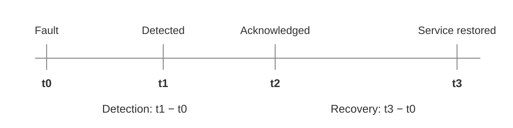

Name the endpoints before reporting a recovery duration.

<nav class="progress" aria-label="Module progress"><span class="">QUESTION</span><span class="arrow"> → </span><span class="">SIGNAL</span><span class="arrow"> → </span><span class="">COLLECT</span><span class="arrow"> → </span><span class="">INTERPRET</span><span class="arrow"> → </span><span class="active">ALERT</span><span class="arrow"> → </span><span class="">RESPOND</span></nav>

---

<!-- _class: task core -->
<!-- _footer: "AI5049, Hochschule Fulda" -->

# Rehearse a response.

Five-minute tabletop during a change:

| Vantage point | Service result |
|---|---|
| Lagoon, IPv4 | Fails |
| Pacific, IPv4 | Works |

Name the first observation, incident owner and backout trigger.
Explain why that observation distinguishes the leading hypotheses.

<nav class="progress" aria-label="Module progress"><span class="">QUESTION</span><span class="arrow"> → </span><span class="">SIGNAL</span><span class="arrow"> → </span><span class="">COLLECT</span><span class="arrow"> → </span><span class="">INTERPRET</span><span class="arrow"> → </span><span class="">ALERT</span><span class="arrow"> → </span><span class="active">RESPOND</span></nav>

---

<!-- _class: task core -->
<!-- _footer: "AI5049, Hochschule Fulda" -->

# Test the monitoring brief

| Requirement | Test |
|---|---|
| Detect 5 s interruptions | Vary onset phase |
| ≤ 20 requests/s | Count requests and retries |
| Unknown within 15 s | Stop collection |
| Useful diagnosis | Compare route loss and drops |

Sketch a design for the **40-target brief**.

<nav class="progress" aria-label="Module progress"><span class="">QUESTION</span><span class="arrow"> → </span><span class="">SIGNAL</span><span class="arrow"> → </span><span class="">COLLECT</span><span class="arrow"> → </span><span class="">INTERPRET</span><span class="arrow"> → </span><span class="">ALERT</span><span class="arrow"> → </span><span class="active">RESPOND</span></nav>

---

<!-- _class: content core -->
<!-- _footer: "AI5049, Hochschule Fulda" -->

# What would you tell the customer?

Was it congestion, a missing route or missing data?
Choose the measurements that explain your answer.

Note your observations, then stop the lab:
```bash
make traffic-stop
make down
```

Use `make monitoring` to repeat the experiment at home.


---

<!-- _class: day research -->
<!-- _footer: "AI5049, Hochschule Fulda" -->

# 30 October 2026

## Research questions and sources

Monitoring gave us a limitation: short events can disappear between samples.

Now we turn that into a question we can actually test.

---

<!-- _class: content research -->
<!-- _footer: "AI5049, Hochschule Fulda" -->

# Leave with a testable research brief


1. State a question that a comparison can answer.
2. Find prior work and evidence that fit the question.
3. Choose a baseline and expose the biggest feasibility risk.

Our running example: **short outages missed between probes**.

---

<!-- _class: content core -->
<!-- _footer: "AI5049, Hochschule Fulda" -->

# Some project ideas

| Area | Possible comparison |
|---|---|
| Monitoring | Polling vs streaming for short failures |
| Digital twins | Emulation vs modeling before deployment |
| Automation | Automated vs manual emergency repair |
| AI for networking | LLM troubleshooting vs a runbook |

Bring your own question if you can evaluate it.


---

<!-- _class: content research -->
<!-- _footer: "AI5049, Hochschule Fulda" -->

# From a problem to a research question

**At equal cost, which schedule catches short outages better?**

| Compare | Periodic vs randomized |
|---|---|
| Keep equal | Probe budget, workload, endpoint |
| Measure | Detection fraction and delay |
| Bound the claim | Tested fault durations and conditions |

---

<!-- _class: content research -->
<!-- _footer: "AI5049, Hochschule Fulda" -->

# Write a measurable question.

Name the **factor**, **outcome** and **conditions**.

> At equal probe cost, which schedule detects more 1–10 s outages?

Define the schedules, fault distribution and detection criterion.
The comparison must allow your preferred method to lose.

---

<!-- _class: visual research -->
<!-- _footer: "AI5049, Hochschule Fulda" -->

# What makes a scientific argument?

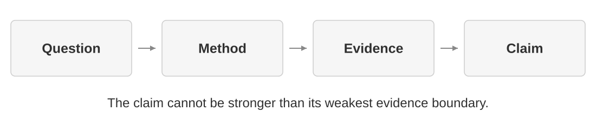

Your contribution is the finding this evidence supports.

---

<!-- _class: content research -->
<!-- _footer: "AI5049, Hochschule Fulda" -->

# What kind of paper will you write?

| Approach | Contribution |
|---|---|
| Measurement | Describe behavior |
| Comparison | Evaluate methods fairly |
| Reproduction + extension | Check and extend a result |
| System study | Build or investigate a system |

Every approach needs evidence for a limited claim.

---

<!-- _class: task research -->
<!-- _footer: "AI5049, Hochschule Fulda" -->

# Task: challenge the claim

> "Randomized polling detects outages faster."

Two minutes:

1. Name a result that would contradict this.
2. Specify outage durations, baseline and measured outcome.
3. Choose a success criterion that allows the method to lose.

---

<!-- _class: content research -->
<!-- _footer: "AI5049, Hochschule Fulda" -->

# Plan the measurement from the claim

| Claim | Metric | Evidence |
|---|---|---|
| faster detection | detection delay | repeated known faults |
| lower load | bytes/s or requests/s | collector + target |
| fewer misses | detection rate | known injected events |

If the measurement cannot test the claim, change the claim or the experiment.

---

<!-- _class: content research -->
<!-- _footer: "AI5049, Hochschule Fulda" -->

# Observation or intervention?

| Observational study | Controlled experiment |
|---|---|
| polling gaps coincide with missed events | deliberately vary the polling schedule |
| shows association | tests an intervention |

A **confounder** changes both condition and outcome.

Injecting a fault is not enough. The comparison still has to be controlled.

---

<!-- _class: content research -->
<!-- _footer: "AI5049, Hochschule Fulda" -->

# Find the closest comparison.

Search by **problem, mechanism and method**. Follow citations.

Compare assumptions, baselines and evidence.
Record your queries and selection criteria.

“Nobody has done this before” is not a literature review.

---

<!-- _class: content core -->
<!-- _footer: "AI5049, Hochschule Fulda" -->

# Research venues close to this course

| Venue | Typical contribution |
|---|---|
| [IEEE/IFIP NOMS](https://www.comsoc.org/conferences-events/ieeeifip-network-operations-and-management-symposium-2026) | operating, managing and automating networks |
| [CNSM](https://www.cnsm-conf.org/2026/about.html) | management systems, telemetry and orchestration |
| [ACM IMC](https://conferences.sigcomm.org/imc/2026/cfp/) | measuring and understanding Internet behavior |

Start here for literature on **management, monitoring and measurement**.


---

<!-- _class: content core -->
<!-- _footer: "AI5049, Hochschule Fulda" -->

# Broader networking research

| Venue | Focus |
|---|---|
| [ACM SIGCOMM](https://www.sigcomm.org/events/sigcomm-conference) | Architectures and systems |
| [USENIX NSDI](https://www.usenix.org/conference/nsdi26) | Implemented networked systems |
| [IEEE INFOCOM](https://www.comsoc.org/conferences-events/ieee-international-conference-computer-communications-2026) | Protocols and performance |
| [ACM CoNEXT](https://conferences2.sigcomm.org/co-next/2026/) | Experimental networking |
| [IFIP Networking](https://networking.ifip.org/) | Protocols and systems |
| [IEEE GLOBECOM](https://www.comsoc.org/conferences-events/ieee-global-communications-conference-2026) / [ICC](https://icc2026.ieee-icc.org/) | Communications and networking |

---

<!-- _class: content core -->
<!-- _footer: "AI5049, Hochschule Fulda" -->

# Who develops Internet technology?

**[IETF](https://www.ietf.org/about/introduction/)**\
Working Groups engineer interoperable Internet protocols and standards.

**[IRTF](https://www.irtf.org/)**\
Research Groups study long-term questions about Internet technology.


---

<!-- _class: content core -->
<!-- _footer: "AI5049, Hochschule Fulda" -->

# Where do operators compare notes?

**[RIPE Meetings](https://www.ripe.net/community/)**\
Routing, addressing, measurement and Internet coordination

**[DENOG](https://www.denog.de/) and [NANOG](https://nanog.org/)**\
Backbone operations, routing, peering and incidents

**[NAF and AutoCon](https://networkautomation.forum/)**\
Network automation, orchestration and operational tooling


---

<!-- _class: content research -->
<!-- _footer: "<span class=\"footer-context\">AI5049, Hochschule Fulda</span><span class=\"footer-refs\"><a href=\"https://svr-sk818-web.cl.cam.ac.uk/keshav/papers/07/paper-reading.pdf\">Keshav: How to Read a Paper</a></span>" -->

# Read in three passes.

| Pass | Look for |
|---|---|
| Relevance | Question and main result |
| Method | Signal, baseline and experimental unit |
| Challenge | Missing evidence and transfer limits |

Record **one supported claim, one limitation and one next question**.

---

<!-- _class: content research -->
<!-- _footer: "AI5049, Hochschule Fulda" -->

# Read the claim before the graph.

[Trinocular](https://ant.isi.edu/~johnh/PAPERS/Quan13c.pdf) probes **IPv4 /24 blocks**, not applications.

| Check | Ask |
|---|---|
| Scope | Which blocks and vantage points? |
| Method | Which outage definition and budget? |
| Validation | Which independent evidence? |

A reachable block does not prove application health.

---

<!-- _class: content research -->
<!-- _footer: "AI5049, Hochschule Fulda" -->

# Match the source to the claim.

| Claim | Evidence source |
|---|---|
| Required protocol behavior | Specification and exact section |
| Implemented feature | Versioned code or official documentation |
| Measured improvement | Paper and evaluation data |
| Production failure | Attributed operator report |

For RFCs: check status, updates, errata and normative language.

---

<!-- _class: visual research -->
<!-- _footer: "AI5049, Hochschule Fulda" -->

# Does the citation support the sentence?

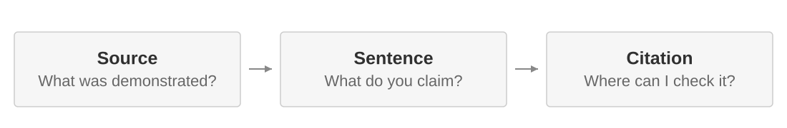

Match the sentence to the evidence in the source, not merely to its topic.

---

<!-- _class: content research -->
<!-- _footer: "AI5049, Hochschule Fulda" -->

# Paraphrase the idea, not the word order

| Approach | Assessment |
|---|---|
| Replace a few words | Still follows the original |
| Explain from your notes | Paraphrase, with attribution |
| Copy exact wording | Quote, with location |

A citation alone does not mark a quotation.

---

<!-- _class: statement research -->
<!-- _footer: "AI5049, Hochschule Fulda" -->

# A DOI is not evidence.

Read the result. Then check the claim.

---

<!-- _class: content research -->
<!-- _footer: "AI5049, Hochschule Fulda" -->

# Make evidence traceable.

| Artifact | Record |
|---|---|
| Software | Version or commit and repository |
| Dataset | Release, identifier, access conditions |
| Documentation | Exact page, version and section |
| Figure | Data and units, or source and adaptation |

Verify imported reference metadata. Mark synthetic examples.
Citation does not replace reuse permission.

---

<!-- _class: visual research -->
<!-- _footer: "AI5049, Hochschule Fulda" -->

# Can public data answer your question?

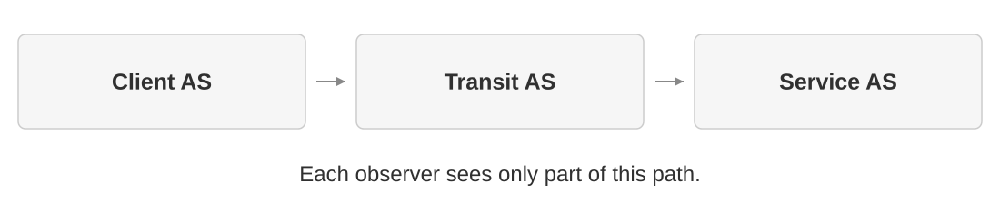

If your question extends beyond ReefNet, consider public observations.
Their coverage and resolution must fit the claim.

---

<!-- _class: visual research -->
<!-- _footer: "<span class=\"footer-context\">AI5049, Hochschule Fulda</span><span class=\"footer-refs\"><a href=\"https://atlas.ripe.net/\">RIPE Atlas</a><a href=\"https://stat.ripe.net/\">RIPEstat</a></span>" -->

# Public data gives us another vantage point

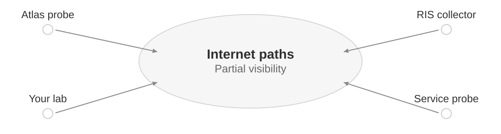

**RIPE Atlas:** active probes. **RIS:** public BGP observations.
Neither covers every Internet path.


---

<!-- _class: visual research -->
<!-- _footer: "<span class=\"footer-context\">AI5049, Hochschule Fulda</span><span class=\"footer-refs\"><a href=\"https://www.rfc-editor.org/rfc/rfc7854.html\">BMP: RFC 7854</a></span>" -->

# BMP observes BGP state.

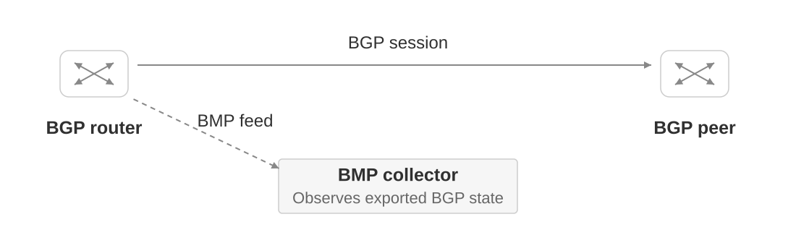

With router access, the **BGP Monitoring Protocol (BMP)** exports BGP state.
It is a collection protocol, not the public RIS dataset.


---

<!-- _class: content research -->
<!-- _footer: "<span class=\"footer-context\">AI5049, Hochschule Fulda</span><span class=\"footer-refs\"><a href=\"https://stat.ripe.net/docs/data-api/api-endpoints/routing-history\">RIPEstat: routing history</a></span>" -->

# Read one public routing record.

**NETHINKS (AS8319), Fulda.** In a shell with curl and jq, such as operations01:

```bash
curl -fsS -G https://stat.ripe.net/data/routing-history/data.json \
  --data-urlencode resource=AS8319 \
  --data-urlencode starttime=2025-09-05T00:00:00 \
  --data-urlencode endtime=2025-09-07T00:00:00 \
  --data-urlencode include_first_hop=true \
  --data-urlencode min_peers=10 -o as8319.json

jq '.data.by_origin[0] | {origin, prefix: .prefixes[0].prefix,
  interval: .prefixes[0].timelines[0]}' as8319.json
```

Keep the full file. Inspect one record.


---

<!-- _class: task research -->
<!-- _footer: "<span class=\"footer-context\">AI5049, Hochschule Fulda</span><span class=\"footer-refs\"><a href=\"https://stat.ripe.net/docs/data-api/api-endpoints/routing-history\">RIPEstat: routing history</a></span>" -->

# What did the collector actually see?

AS8319 example, checked 4 October 2026:

```text
origin + first hop: 6939 8319
prefix:            149.218.0.0/17
interval, UTC:     5 Sep 00:00 to 7 Sep 07:59:59, 2025
full_peers_seeing: 11
```

One origin and a first hop. At least ten full-feed peers required.
**Route visibility is not service availability.**

---


<!-- _class: content research -->
<!-- _footer: "AI5049, Hochschule Fulda" -->

# Make the public measurement reproducible

Keep the details another person needs to repeat it:

- UTC time window
- unaffected comparison
- query or measurement IDs
- filters and thresholds

Save them with the conclusion.

---

<!-- _class: content research -->
<!-- _footer: "<span class=\"footer-context\">AI5049, Hochschule Fulda</span><span class=\"footer-refs\"><a href=\"https://atlas.ripe.net/assets/legal/RIPEAtlasServiceTermsandConditionsV3.4.pdf\">RIPE Atlas: measurement terms</a></span>" -->

# Plan responsible measurement.

Prefer public data or your own lab.

For active probes, agree on **target, authorization, rate and stop condition**.

For collected data, define **access, retention and deletion**.
Collect only what the question needs.

---

<!-- _class: content research -->
<!-- _footer: "AI5049, Hochschule Fulda" -->

# Build an argument, then audit it.

Organize related work by the question the studies answer.

For each factual sentence, identify its role:

- our result → method and evidence
- prior result → original source
- protocol behavior → specification
- interpretation → inference and limitation

If you cannot classify it, check whether it belongs.

---

<!-- _class: content core -->
<!-- _footer: "AI5049, Hochschule Fulda" -->

# What does your project need next?

A sharper question? A useful comparison? Access to data?
An experiment that finally runs?

Use the project time to work on it. Bring questions as they come up.

**Choose your group by 27 November, 23:59.**


---

<!-- _class: content research -->
<!-- _footer: "AI5049, Hochschule Fulda" -->

# Your question, your next step

Write your **Research Brief**: question, closest prior work, baseline,
available evidence and biggest feasibility risk.

Use today’s project time to check that you can access the evidence.

**13 November:** turn the question into a controlled experiment.


---

<!-- _class: day research -->
<!-- _footer: "AI5049, Hochschule Fulda" -->

# 13 November 2026

## Experimental design

Now the sampling question becomes a controlled comparison.

---

<!-- _class: content research -->
<!-- _footer: "AI5049, Hochschule Fulda" -->

# Assign treatments to runs.

**Treatment:** the sampling policy.
**Outcome:** detection and delay.
**Experimental unit:** one reset run assigned a treatment.

Keep fault workload, probe budget and reset conditions equal.

Ten samples from one run are not ten independent experiments.

---

<!-- _class: content research -->
<!-- _footer: "AI5049, Hochschule Fulda" -->

# Fix the comparison before running it

600-second runs with **60 probes per method**.

| Method | One probe in each 10 s slot |
|---|---|
| Periodic | At the start |
| Randomized | Uniform random times with a recorded seed |

Use the same fault schedule for each pair.
Compare detection fraction and delay among detections.

---

<!-- _class: content research -->
<!-- _footer: "AI5049, Hochschule Fulda" -->

# Specify the experiment boundary.

Use the smallest setting that can test the claim.

Record nodes and versions, link capacity and delay,
addresses and policy, probe locations and control path.

Keep control reachable when the workload fails.
Document any dependencies shared by control and experiment.

Two identical diagrams can conceal different experiments.

---

<!-- _class: content research -->
<!-- _footer: "AI5049, Hochschule Fulda" -->

# Virtual experiments have limits.

Virtual networks let us control conditions.

They do not reproduce hardware timing, optics or carrier scale by default.

**Which part of your conclusion depends on the simulator?**

---

<!-- _class: content research -->
<!-- _footer: "AI5049, Hochschule Fulda" -->

# Measure an independent reference.

| Evidence | Tells us |
|---|---|
| Controller | Fault requested |
| Reference probe | Traffic affected |
| Evaluated detector | Fault reported |

A **100 ms reference interval** limits onset-time resolution.
The evaluated detector cannot define its own ground truth.

---

<!-- _class: task research -->
<!-- _footer: "AI5049, Hochschule Fulda" -->

# Predict the observations.

Customer IPv4 export to Lagoon is rejected. BGP stays up.

| Compare | Look at |
|---|---|
| Lagoon vs Pacific | Customer advertisement |
| IPv4 vs IPv6 | External reachability |
| Routing fault vs congestion | Rate and discards |

What would contradict your diagnosis?

---

<!-- _class: visual research -->
<!-- _footer: "AI5049, Hochschule Fulda" -->

# Control experiment: the endpoint fails

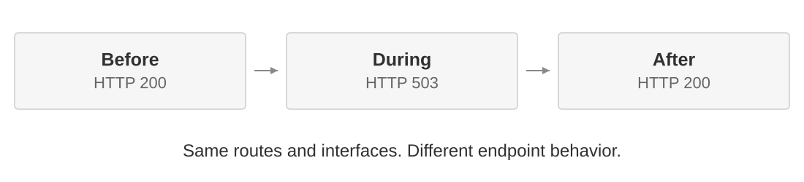

An HTTP 503 response is not evidence of a routing failure.

---

<!-- _class: content research -->
<!-- _footer: "AI5049, Hochschule Fulda" -->

# Pair conditions, randomize order.

Replay each fault schedule for both methods at equal probe cost.
Reset between runs. Randomize which method runs first.

For jointly detected events: **difference = delay A − delay B**.
Report misses separately.

Block by host or workload and record contention.
Pairing does not remove clock error or unequal host load.

---

<!-- _class: content research -->
<!-- _footer: "AI5049, Hochschule Fulda" -->

# Startup or steady state?

| Research question | Treatment of startup |
|---|---|
| How long until service recovers? | Startup is part of the outcome |
| What is steady-state overhead? | Apply a stated warm-up rule |
| Does cache warming help? | Compare defined cache conditions |

Cold caches and convergence are real. Excluding them changes the experiment.

---

<!-- _class: content research -->
<!-- _footer: "AI5049, Hochschule Fulda" -->

# Decide how a run can fail

| Outcome | Store |
|---|---|
| Detected | Flag + delay |
| Missed | False flag, no invented delay |
| Probe failed | Instrumentation failure |
| Reset failed | Invalid run + reason |

Choose categories **before** comparing methods.

---

<!-- _class: visual research -->
<!-- _footer: "AI5049, Hochschule Fulda" -->

# Turn the lab into an experiment

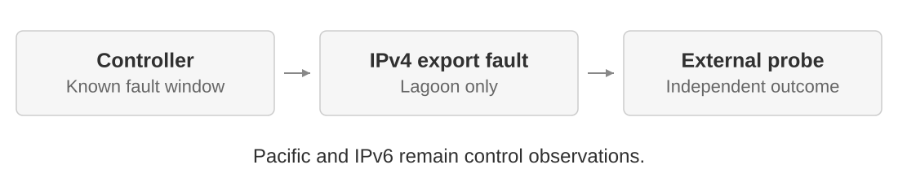

Record the requested fault time and the first failed service check.
Keep measuring until the service is restored.

Config-change time is not traffic-failure time.

---

<!-- _class: visual research -->
<!-- _footer: "AI5049, Hochschule Fulda" -->

# Define one experimental run

For the sampling comparison, repeat the same controlled sequence.

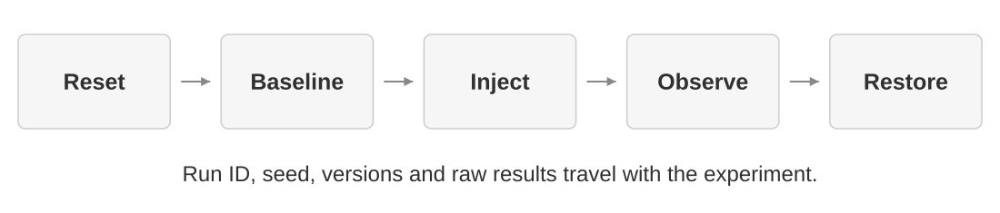

A failed reset invalidates the comparison. Record it as a failed run.

---

<!-- _class: visual research -->
<!-- _footer: "AI5049, Hochschule Fulda" -->

# Same budget. Different gaps.

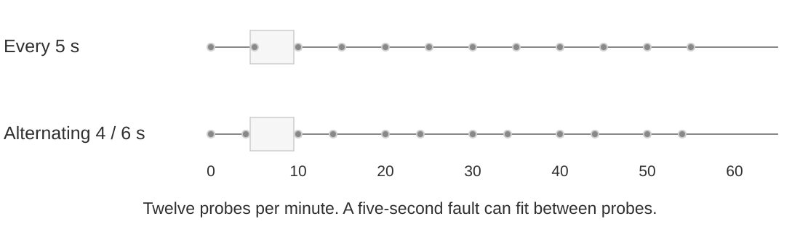

Timing model, not the 10 s study: **5 s mean spacing**, 120 fault phases.

---

<!-- _class: content research -->
<!-- _footer: "AI5049, Hochschule Fulda" -->

# Compare detection and delay

Synthetic timing model: **120 phases, 5 s faults**.

| Spacing | Detected | Missed | Median delay* |
|---|---:|---:|---:|
| 5 s | 120 | 0 | 2.50 s |
| 4 s / 6 s | 108 | 12 | 2.25 s |

*Among detections. The lower median ignores 12 misses.*

---

<!-- _class: task research -->
<!-- _footer: "AI5049, Hochschule Fulda" -->

# Task: compare detection delays

Five synthetic pairs. Delays in **milliseconds**.

| Pair | 1 | 2 | 3 | 4 | 5 |
|---|---:|---:|---:|---:|---:|
| A | 11 | 12 | 10 | 13 | 54 |
| B | 17 | 18 | 16 | 17 | 18 |

**Four minutes:** which is usually faster, which more predictable?
Choose a summary and state its limit.

---

<!-- _class: content research -->
<!-- _footer: "AI5049, Hochschule Fulda" -->

# One outlier changes the mean

| Statistic | A | B |
|---|---:|---:|
| Mean | 20.0 ms | 17.2 ms |
| Median | 12 ms | 17 ms |
| Range | 10-54 ms | 16-18 ms |

A is earlier in 4/5 pairs. Its fifth run reverses the mean.

Small sample. This only illustrates the calculation.

---

<!-- _class: content research -->
<!-- _footer: "AI5049, Hochschule Fulda" -->

# More samples do not fix bias.

| Source | Examine |
|---|---|
| Sampling uncertainty | Variation between runs |
| Measurement uncertainty | Clock and resolution |
| Bias | Unequal conditions |
| Instrumentation | Measurement overhead |

More runs cannot repair a bad clock or unfair comparison.

---

<!-- _class: content research -->
<!-- _footer: "AI5049, Hochschule Fulda" -->

# Four types of validity

| Type | Example failure |
|---|---|
| Construct | DNS used as HTTP health |
| Internal | Only one method runs under host load |
| External | One topology stands for all networks |
| Statistical | Correlated samples counted as independent |

---

<!-- _class: task research -->
<!-- _footer: "AI5049, Hochschule Fulda" -->

# Task: review the experiment

| Method | Host | Time |
|---|---|---|
| A | Idle | Morning |
| B | Shared and busy | Afternoon |

**Four minutes:** identify the mixed effects.
Decide what to hold constant, randomize and record.

---

<!-- _class: day research -->
<!-- _footer: "AI5049, Hochschule Fulda" -->

# 27 November 2026

## Analysis and scientific argument

From paired runs to a defensible comparison.

The graph is not the result. Check the evidence behind it.

---

<!-- _class: content research -->
<!-- _footer: "AI5049, Hochschule Fulda" -->

# Keep the mechanism visible.

**Runs → detection counts → delays → uncertainty → claim**

Inspect individual traces before aggregation.
Keep missed events in the detection denominator.

---

<!-- _class: visual research -->
<!-- _footer: "AI5049, Hochschule Fulda" -->

# Follow one result back to its inputs

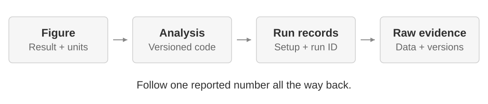

Choose a number from your draft. Can another team reproduce it?

---

<!-- _class: content research -->
<!-- _footer: "AI5049, Hochschule Fulda" -->

# Keep one row per run

Illustrative paired runs. Delays in **milliseconds**.

| Pair | Method | Detected | Delay |
|---|---|---|---:|
| 17 | Periodic | Yes | 820 |
| 17 | Randomized | No | — |
| 18 | Periodic | Yes | 240 |
| 18 | Randomized | Yes | 510 |

A miss stays in the detection denominator.

---

<!-- _class: content research -->
<!-- _footer: "AI5049, Hochschule Fulda" -->

# Missing, missed and timed out are different

| Outcome | Meaning |
|---|---|
| timeout after 2 s | no completion observed by deadline |
| probe never ran | service outcome unknown |
| event not detected | miss for this detector |
| run excluded | rule + reason recorded |

Dropping timeouts can make a broken service look fast.

---

<!-- _class: visual research -->
<!-- _footer: "AI5049, Hochschule Fulda" -->

# A fast median can hide missed faults

First compare coverage. This separate example has **20 faults**.

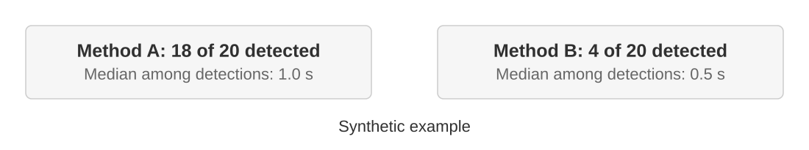

Compare the same detected events before claiming that B is faster.

---

<!-- _class: content research -->
<!-- _footer: "AI5049, Hochschule Fulda" -->

# Compare within each pair.

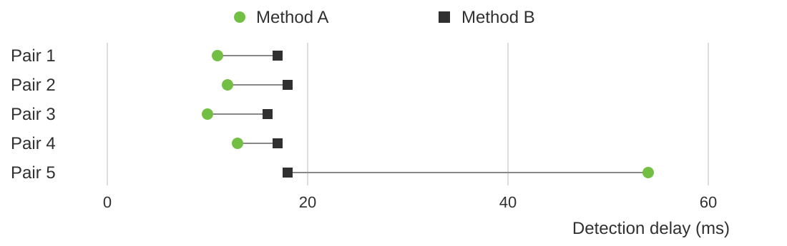

Return to the five synthetic pairs from **13 November**, methods A and B.

---

<!-- _class: content research -->
<!-- _footer: "AI5049, Hochschule Fulda" -->

# Work with paired differences.

| Pair | A − B, ms |
|---|---:|
| 1 | −6 |
| 2 | −6 |
| 3 | −6 |
| 4 | −4 |
| 5 | +36 |

**Mean +2.8 ms. Median −6 ms.** A is earlier in four pairs.
Five synthetic pairs illustrate the calculation only.

---

<!-- _class: content research -->
<!-- _footer: "<span class=\"footer-context\">AI5049, Hochschule Fulda</span><span class=\"footer-refs\"><a href=\"https://www.itl.nist.gov/div898/handbook/eda/section3/eda352.htm\">NIST: confidence limits</a></span>" -->

# What are we estimating?

| Term | Meaning in our study |
|---|---|
| Population | Runs under the stated conditions |
| Sample | Runs actually performed |
| Parameter | Population mean delay difference |
| Estimator | Observed mean paired difference |

Compare delays only where **both methods detected the event**.

---

<!-- _class: visual research -->
<!-- _footer: "AI5049, Hochschule Fulda" -->

# Independent observations

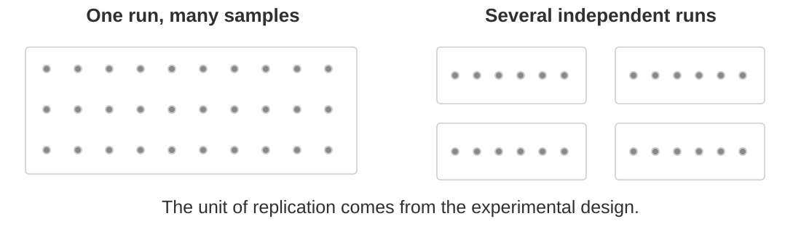

Use independent runs or matched pairs as the uncertainty unit.

---

<!-- _class: content research -->
<!-- _footer: "AI5049, Hochschule Fulda" -->

# What does 95% coverage mean?

A 95% confidence-interval procedure covers the parameter in 95%
of repeated datasets **when its assumptions hold**.

**Bootstrap:** repeatedly resample whole runs or matched pairs.
State the estimator, interval method and independence assumptions.

This is a property of the procedure, not a score for one interval.

---

<!-- _class: visual research -->
<!-- _footer: "AI5049, Hochschule Fulda" -->

# Task: assess a causal claim

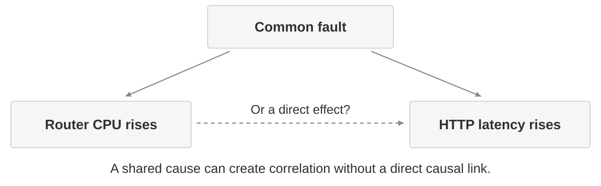

Which observation or intervention could distinguish these explanations?

---

<!-- _class: content research -->
<!-- _footer: "AI5049, Hochschule Fulda" -->

# Is the effect useful?

**1,000 ms → 990 ms: 10 ms saved, a 1% reduction.**

Does it change a 30-second paging decision?
Could it matter to a sub-second control loop?

Report units, direction, uncertainty and failure rate.
A delay reduction is not a measured throughput gain.

---

<!-- _class: content research -->
<!-- _footer: "AI5049, Hochschule Fulda" -->

# Unexpected results

If the expected method does not win:

- check the implementation
- check the measurement
- repeat where needed
- explain the conditions
- report the result honestly

Keep the result, including when your preferred method loses.

---

<!-- _class: content research -->
<!-- _footer: "AI5049, Hochschule Fulda" -->

# Write from an evidence table.

| Question | Evidence | Observation | Limit |
|---|---|---|---|
| RQ1 | Figure 2 | Lower median delay | Virtual lab |
| RQ2 | Table I | More target load | One NOS |

A results paragraph states **what changed, by how much and under which conditions**.

---

<!-- _class: content research -->
<!-- _footer: "AI5049, Hochschule Fulda" -->

# Practice reviewing before January

25 minutes, fictional study.

1. Your own review: 8 min
2. Compare in pairs: 7 min
3. Review together: 10 min

Use the same four criteria as the bonus review:

summary, method, strength/limitation, feasible revision.

---

<!-- _class: content research -->
<!-- _footer: "AI5049, Hochschule Fulda" -->

# A study for review

Fictional claim: **“Randomization halves delay.”**

| | Periodic | Randomized |
|---|---|---|
| Host | Idle, morning | Loaded, afternoon |
| Budget | Equal | Equal |
| Detected | 18 / 20 | 4 / 20 |
| Median delay* | 1.0 s | 0.5 s |

*Among detections. What is confounded or omitted?*

---

<!-- _class: content research -->
<!-- _footer: "AI5049, Hochschule Fulda" -->

# Review example

| Review | Finding |
|---|---|
| Strength | Equal probe budget and reported misses |
| Problem | Host load changes with the method |
| Problem | Delays compare different detected subsets |
| Revision | Match conditions and report coverage beside delay |

Explain how each revision makes the conclusion more defensible.

---

<!-- _class: task research -->
<!-- _footer: "AI5049, Hochschule Fulda" -->

# How is the course working for you?

Three minutes. Anonymous notes.

- What has helped your project?
- Where are you stuck?
- Pace: too slow / about right / too fast?
- One change that would help next time?

We discuss what I can still adjust.

---

<!-- _class: day research -->
<!-- _footer: "AI5049, Hochschule Fulda" -->

# 11 December 2026

## Forecasts, control loops and agents

We have compared detectors. Now test a forecast before it drives a controller.

What evidence would justify acting on the prediction?

---

<!-- _class: content research -->
<!-- _footer: "AI5049, Hochschule Fulda" -->

# Can we warn before saturation?

Forecast synthetic traffic **one second ahead**.

| Baseline | Challenger |
|---|---|
| Latest load value (persistence) | Ridge regression on past samples and periodic features |

Same test data, horizon and missing-data rules.
Which model warns usefully?

---

<!-- _class: visual research -->
<!-- _footer: "AI5049, Hochschule Fulda" -->

# Keep the future out of training.

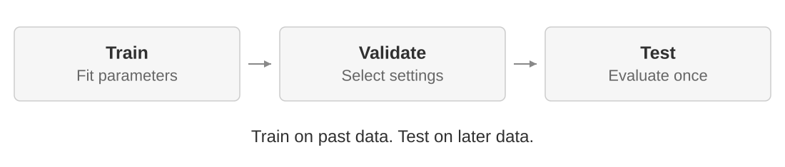

Use only information available at prediction time.

---

<!-- _class: content research -->
<!-- _footer: "AI5049, Hochschule Fulda" -->

# Traffic patterns change

**Drift** means the data or the predictive relationship changes.

Network examples:

- route change moves traffic onto the link
- capacity upgrade changes utilization behavior

Watch prediction error.

Decide when to retrain, fall back, or stop automated action.

---

<!-- _class: figure research -->
<!-- _footer: "AI5049, Hochschule Fulda" -->

# Forecasts miss the workload shift

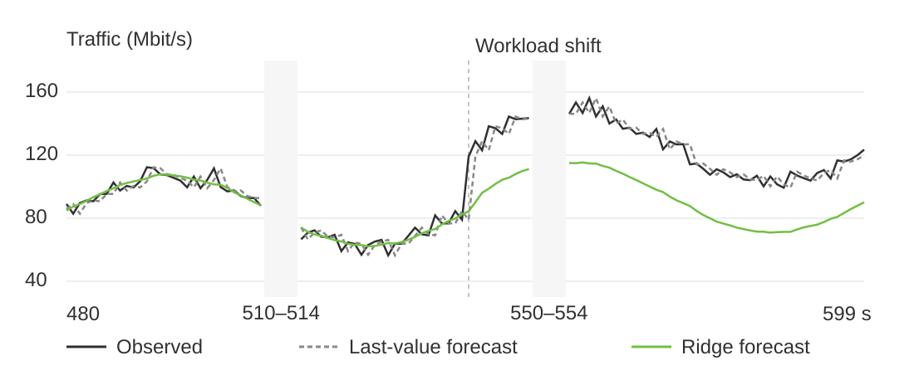

Synthetic, 1 s ahead. **110 of 120 slots evaluated.** Shaded gaps excluded.

---

<!-- _class: content research -->
<!-- _footer: "AI5049, Hochschule Fulda" -->

# Score prediction and warning separately.

**110 test slots. Warning threshold: 125 Mbit/s.**

| Predictor | MAE, Mbit/s | False alarms | Missed high-load slots |
|---|---:|---:|---:|
| Persistence | 4.74 | 3 | 3 |
| Ridge | 17.71 | 0 | 25 |

**MAE = mean absolute error.** No false alarms, but 25 misses.

---

<!-- _class: content research -->
<!-- _footer: "AI5049, Hochschule Fulda" -->

# A controller cannot create capacity

Illustrative ReefNet load:

| Transit | Capacity | Offered |
|---|---:|---:|
| Lagoon | 50 Mbit/s | 60 Mbit/s |
| Pacific | 50 Mbit/s | 30 Mbit/s |

Move 10 Mbit/s: **50 / 40 Mbit/s**. Lagoon still has no headroom.
Would routing policy and traffic behavior permit the move?

---

<!-- _class: visual research -->
<!-- _footer: "AI5049, Hochschule Fulda" -->

# Delayed feedback

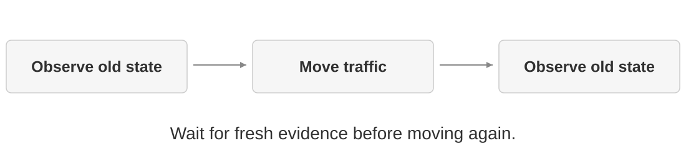

Acting twice on the same stale sample can overshoot the target.

---

<!-- _class: content research -->
<!-- _footer: "AI5049, Hochschule Fulda" -->

# Put limits around the controller

Illustrative guardrails for the ReefNet controller:

```text
allowed targets:  Lagoon, Pacific
maximum move:     10 Mbit/s per step
wait time:        30 s of fresh observations
stop if:          service degrades or data is stale
recovery:         previous allocation or manual handover
```

The same limits apply to rules, optimizers and LLMs.

---

<!-- _class: content research -->
<!-- _footer: "AI5049, Hochschule Fulda" -->

# Can an agent troubleshoot the network?

Give it a known fault, observations and bounded tools.

Compare with a deterministic runbook on the **same faults**.
Score the network state, not the explanation.

Enforce permissions and verification outside the planner.

---

<!-- _class: visual research -->
<!-- _footer: "AI5049, Hochschule Fulda" -->

# The write boundary

The tool enforces authorization and execution.

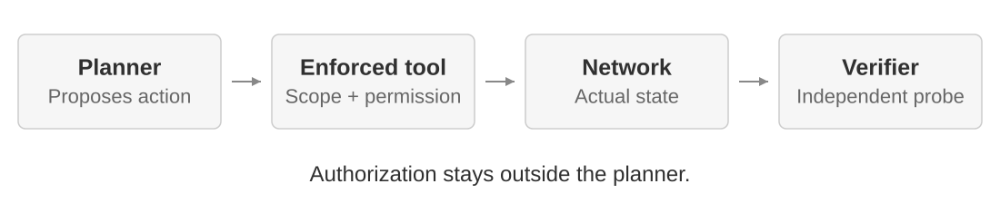

The verifier checks independently. Where do we enforce the one-device limit?

---

<!-- _class: content research -->
<!-- _footer: "AI5049, Hochschule Fulda" -->

# Limit what the agent can do

Example request for the BOB1 export-policy repair:

```json
{
  "device": "edge01.bob1.reefnet.test",
  "bgp_group": "lagoon-v4",
  "expected_override": "BLOCK-CUSTOMER-V4",
  "action": "delete group export-policy",
  "dry_run": true
}
```

The tool enforces target scope, input checks, timeout and write permissions.

What should happen if the agent supplies another device or group?

---

<!-- _class: task research -->
<!-- _footer: "AI5049, Hochschule Fulda" -->

# Task: check the claimed repair

Fictional trace after write approval:

| Step | Result |
|---|---|
| Read | `BLOCK-CUSTOMER-V4` attached |
| Delete | Command completed |
| External probe | Timeout |
| Agent reply | “The service is restored.” |

**One minute:** how should the evaluator score this?

---

<!-- _class: statement research -->
<!-- _footer: "AI5049, Hochschule Fulda" -->

# The explanation has recovered.

Recovery is still unproven.


---

<!-- _class: content research -->
<!-- _footer: "AI5049, Hochschule Fulda" -->

# Define safe success before scoring.

A repair succeeds only when:

1. the permitted target has the intended state
2. an independent service check passes
3. unrelated state is unchanged

Record refusal, failure, attempts, duration and cost.
Test stale state, uncertain writes and incorrect ticket assumptions.

---

<!-- _class: content research -->
<!-- _footer: "AI5049, Hochschule Fulda" -->

# A benchmark needs known ground truth.

[NIKA](https://arxiv.org/abs/2512.16381) supplies reproducible troubleshooting scenarios and a tool interface.

Separate **detection**, **localization** and **root-cause identification**.
These are different tasks and need separate scores.

Read the paper's fault set and evaluation conditions before comparing agents.
A benchmark result is bounded by those conditions.


---

<!-- _class: visual research -->
<!-- _footer: "AI5049, Hochschule Fulda" -->

# Task: assess the benchmark

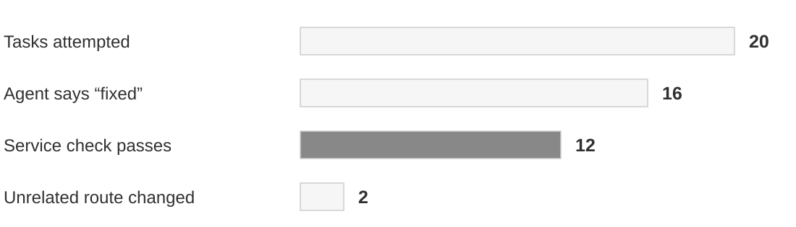

Separate fictional repair benchmark: 20 attempts. Is 80% success justified?
What must we know about overlap and unintended changes?

---

<!-- _class: day research -->
<!-- _footer: "AI5049, Hochschule Fulda" -->

# 22 January 2027

## In-class peer review

Read in class. Write **legibly by hand**.
German or English accepted.

Optional bonus review: **today only, no make-up date**.
Work independently, without AI or other aids.
Hand in today. The reviewed team receives a copy during this session.

---

<!-- _class: visual research -->
<!-- _footer: "AI5049, Hochschule Fulda" -->

# Receive, read, write, return.

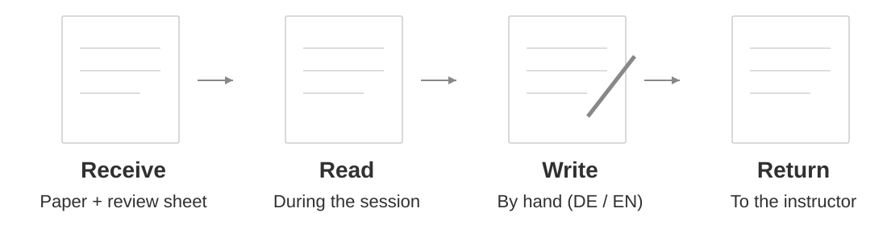

Write your name and identify the reviewed paper.

The instructor keeps the original and makes a copy.
The reviewed team receives its copy **during this session**.

---

<!-- _class: content research -->
<!-- _footer: "AI5049, Hochschule Fulda" -->

# Review criteria: calibrate your judgment

| Criterion | Enough | Not enough |
|---|---|---|
| Summary | Question and result | Topic only |
| Method | Choice assessed with evidence | "Unclear" |
| Judgment | Reasoned strength and limitation | Praise only |
| Revision | Feasible fix | "More experiments" |

Apply the same criteria we announced in October.

---

<!-- _class: task research -->
<!-- _footer: "AI5049, Hochschule Fulda" -->

# Task: bound the conclusion

Two minutes. Reviewer discussion

> Our system makes backbone services reliable.

Five route changes, one emulated topology. Four restore the health check.

What can the authors claim? Which result would you ask them to add?

---

<!-- _class: content research -->
<!-- _footer: "AI5049, Hochschule Fulda" -->

# Detection delay and missed faults

Return to the fictional study from November.

| Method | Detected faults | Median delay among detections |
|---|---:|---:|
| A | 18 / 20 | 1.0 s |
| B | 4 / 20 | 0.5 s |

The draft calls B "the faster detector".

Write one review sentence. Name the hidden condition and ask for context.

---

<!-- _class: task research -->
<!-- _footer: "AI5049, Hochschule Fulda" -->

# Task: write a review comment

Two minutes. Fictional methods section

> We repeated each experiment several times and removed outliers.

Name the missing information and ask for a concrete correction.

A useful review explains how the issue affects the conclusion.

---

<!-- _class: task research -->
<!-- _footer: "AI5049, Hochschule Fulda" -->

# Task: rewrite the claim

> "Our method improves network reliability by 40%."

Evidence: mean detection delay for **one fault family**
in **one emulated topology**.

Draft a bounded claim. Mark the missing comparator and numbers.
Do not carry over **40%** without supporting results.

Name one experiment needed for a broader claim.


---

<!-- _class: content research -->
<!-- _footer: "AI5049, Hochschule Fulda" -->

# Now review the assigned paper

Work **independently**, without AI or other aids.
One page, legibly handwritten, in German or English.

- Summarize the question and result.
- Assess one methodological choice.
- Justify a strength and a limitation.
- Propose a feasible revision.

---

<!-- _class: content research -->
<!-- _footer: "AI5049, Hochschule Fulda" -->

# Use the review to revise your paper

For each comment: **clarify, add evidence, fix analysis or narrow the claim**.

> We reran both methods at equal budget, added Figure 3
> and narrowed the conclusion.

If you disagree, explain why and point to the result.

---

<!-- _class: day core -->
<!-- _footer: "AI5049, Hochschule Fulda" -->

# 5 February 2027

## Presentation and reproducibility

Show the result. Defend the choices. Let someone else reproduce the evidence.

---

<!-- _class: content core -->
<!-- _footer: "AI5049, Hochschule Fulda" -->

# Presentation and reproduction

**8 minutes presentation + 7 minutes questions**

Present the problem, comparison, main result and limitation.

Then trace one result back to its data and regenerate it.

The presentation itself has no grade weight. Use it as the last technical check.

---

<!-- _class: content core -->
<!-- _footer: "AI5049, Hochschule Fulda" -->

# Test the artifact handover.

Another team opens the repository.

Can they find:

- exact version used in the paper
- required inputs and access
- command for the main figure
- expected output
- known limits

"Works on my laptop" means the laptop is still an undocumented dependency.

---

<!-- _class: task core -->
<!-- _footer: "AI5049, Hochschule Fulda" -->

# Task: complete the instructions

Two minutes. Incomplete README

> Install the dependencies. Start the network.
> Run the experiment. Plot the results.

Choose three missing details that would stop another team.

Give concrete replacements, including how they would recognize success.

---

<!-- _class: content core -->
<!-- _footer: "AI5049, Hochschule Fulda" -->

# Publication-quality figures

Check the figure at its **final paper size**.

- Readable labels, explicit units
- Traceable data, consistent terms
- Distinguishable in grayscale
- No decoration without meaning

Export the plot itself, not a dashboard screenshot.

---

<!-- _class: content core -->
<!-- _footer: "AI5049, Hochschule Fulda" -->

# Before submitting

- Claims match evidence and references.
- Figures trace back to data.
- Failures and limitations remain visible.
- Required AI use is disclosed.
- Every author has read the paper.

**Paper and artifact describe the same study.**

---

<!-- _class: content core -->
<!-- _footer: "AI5049, Hochschule Fulda" -->

# Submission package

- **PDF:** opens correctly, six pages including references, declaration excluded, correct authors
- **Artifact:** accessible to the examiner, tagged version matches the paper
- **Declaration:** individual contributions are complete
- **AI use:** required disclosure is in the Acknowledgments

---

<!-- _class: content core -->
<!-- _footer: "AI5049, Hochschule Fulda" -->

# AI disclosure

**OpenAI Codex assisted with this slide deck.**

Assistance covered structure, wording, diagrams, teaching examples
and checks of formatting and rendered output.

---

<!-- _class: content core -->
<!-- _footer: "AI5049, Hochschule Fulda" -->

# Thanks

## Network Management and Monitoring

Questions, results or a packet capture worth discussing?
